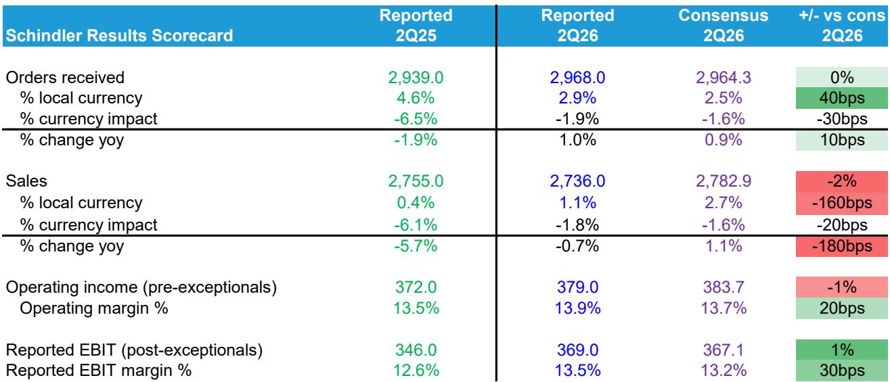
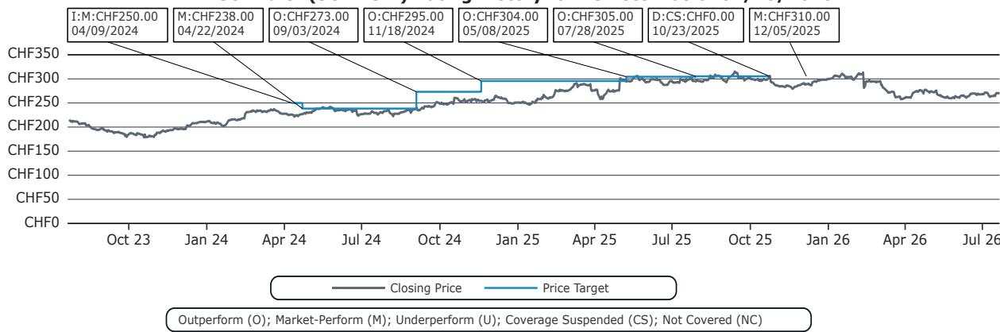
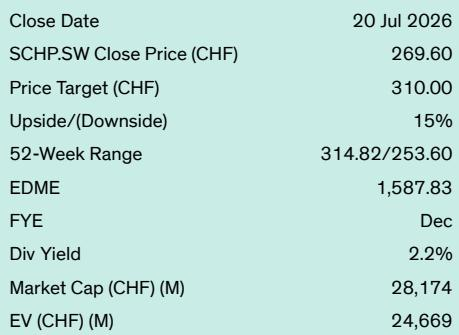

# Schindler的利润率纪律无法掩盖需要结构性答案的增长问题

Schindler 2026年第二季度业绩显示，公司正处于两条相互矛盾的轨迹之间。一方面，运营利润率持续改善，按报告EBIT计算达到13.5%，比市场预期高30个基点，同比提高90个基点。另一方面，有机销售额增长仅为1.1%，比市场预期低160个基点，标志着又一个令人失望的营收表现季度。这种盈利能力与收入增长之间的分化并非暂时性异常，它反映了一种日益难以维持的战略张力。

市场对此反应谨慎。Schindler维持了全年低个位数至中个位数本地货币增长的指引，但即使要达到该范围的下限，所需的算术也要求下半年大幅加速。市场目前预期全年增长3.1%，这意味着下半年有机增长约5%。这一数字大约是上半年运行率的三倍。Schindler承诺的目标与数字合理可达之间的差距已经足够大，需要重新评估公司的近期轨迹。

核心问题并非Schindler在成本控制上执行不力，而是公司的收入引擎在其最大且最具结构性重要性的市场中正在失去动力，而可用于弥补的杠杆要么有限，要么需要较长的前置时间。观察者现在必须判断，仅靠利润率扩张是否足以支撑当前估值，或者增长缺口是否预示着更深层次的结构性挑战，最终也将对盈利能力构成压力。

## 订单增长提供了关于基本面的虚假信号

乍看之下，订单簿似乎讲述了一个更令人鼓舞的故事。集团层面的同类订单增长在第二季度达到2.9%，较第一季度环比加速，并比市场预期高出40个基点。这一加速主要由现代化改造订单推动，该订单同比增长约11%。在欧洲、中东和非洲地区，新安装单元订单上半年增长12.8%，Schindler将此归因于市场份额的获取。

这些数据是真实的，但需要仔细解读。现代化改造订单虽然强劲，但其收入确认时间线与新安装或服务合同不同。这些订单的收入将在几个季度内逐步实现，而非数周。更重要的是，EMEA新安装的强劲订单表现是一个在增长不快的市场中获取份额的故事。Schindler正在从竞争对手那里赢得业务，但这种动态有其局限性。一旦可获取的份额机会耗尽，增长将回归到基础市场趋势。

美洲地区的情况则更为谨慎。现代化改造和新安装订单量环比第一季度有所放缓。在服务领域，Schindler的选择性策略继续产生小幅负面的同类订单增长。选择性意味着放弃低利润率的服务合同以保护盈利能力。这是一个理性的短期决策，但带有长期成本。服务合同是电梯业务中最具经常性和可预测性的收入流。即使放弃低利润率的服务合同，也会减少未来提价和交叉销售机会所依赖的基础。

因此，订单数据并不表明广泛的需求复苏。它表明一家公司在特定细分市场和地区获取份额，同时在其他领域接受数量缩减。对未来收入的净影响尚不明确，增长的结构比总体数字更重要。

## 利润率改善是真实的，但日益依赖可能不可重复的组合转变

Schindler第二季度的利润率表现是业绩中最可辩护的积极因素。报告EBIT利润率为13.5%，比市场预期高30个基点，相对报告EBIT超出预期1%。管理层将效率、定价和组合列为这一进展的驱动因素。

组合部分值得特别关注。在第一季度的展望中，Schindler明确指出了向现代化改造转移、远离新安装所带来的负面组合影响。在第二季度的展望中，这一表述被省略了。这意味着现代化改造的利润率已改善到足以抵消负面组合效应的程度。这是一个真正的运营成就。现代化改造历来是比新安装利润率更低的业务，如果Schindler通过更好的执行缩小了这一差距，那么它增强了公司在较弱的新安装环境中航行的能力。

中国市场的动态强化了这一组合故事。Schindler一直在有意识地减少对中国新安装市场的敞口，该市场以通缩定价和激烈竞争为特征。通过允许该业务缩减，公司将其收入组合转向利润率更高的地区和产品线。这是对困难市场的明智战略回应，但也是一个有限的杠杆。一旦中国在投资组合中的占比被降低到更可控的水平，进一步缩减带来的组合收益将减少。

问题在于，在没有营收增长的情况下，利润率改善能否持续。定价和效率提升并非无限。如果收入增长保持在2%以下，固定成本基础将更难覆盖，利润率扩张最终将趋于平稳。Schindler目前受益于有利的组合顺风，这主要是投资组合精简的结果。利润率改善的下一阶段将需要真正的收入增长，而不仅仅是收入重新分配。

## 指引差距是最可信的近期风险

Schindler维持了全年低个位数至中个位数本地货币增长的指引，但实现这一目标所需的数据正变得越来越紧张。要达到该范围的下限（约3%的有机增长），公司需要下半年有机增长约4.6%。这比当前市场对下半年的预期高出60个基点，几乎是上半年1.6%增长率的三倍。

要达到中个位数范围的上限，所需的下半年增长需要至少比市场预期高出260个基点。鉴于当前中国市场的疲软轨迹和美洲地区的环比放缓，这一结果似乎极不可能。指引与可实现结果之间的差距现在足够大，以至于下调指引似乎更多是时间问题而非概率问题。

市场对全年增长3.1%的预期几乎肯定会因本季度的不及预期而被下调。风险在于下调的幅度可能超过股价已消化的程度。Schindler过去十二个月相对于欧洲发达市场指数的表现下跌了26.2%，表明市场已经在反映一个更疲软的前景。但如果指引修正的幅度大于预期，差距仍然存在。

指引的后端加载性质是最令人担忧的因素。需要强劲下半年才能实现全年目标的公司，容易受到需求进一步恶化的影响。如果中国市场进一步走弱，或者美洲订单疲软延续到下半年，差距将变得不可逾越。容错空间实在太薄。

## 评估Schindler当前水平的决策框架

对于试图判断当前估值是否充分反映风险的观察者而言，一个结构化的框架比简单的多空辩论更有用。以下三个问题抓住了将决定该标的未来十二个月轨迹的关键不确定性。

首先，现代化改造的利润率改善能否持续并扩大？第二季度业绩表明现代化改造利润率正在改善，但一个季度并不构成趋势。观察者应关注Schindler是否继续从其展望中省略组合影响表述。如果现代化改造利润率在未来两个季度保持或高于当前水平，利润率故事将变得更加可信。如果组合影响再次出现，利润率改善将被证明是暂时的。

第二，排除中国后，Schindler核心市场的真实增长率是多少？中国是一个已知的逆风，市场已经消化了其大部分影响。更重要的问题是，EMEA和美洲能否在不依赖份额获取的情况下维持2%以上的有机增长。份额获取是有价值的，但它不是结构性增长驱动力。如果欧洲和美洲的基础市场增长低于2%，Schindler最终将在超越市场增长的能力上遇到天花板。

第三，选择性策略在服务领域造成了多少收入流失？服务领域的小幅负向同类订单增长是一个警示信号。服务是电梯业务中最有价值的部分，因为它产生经常性收入，具有高利润率和低资本密集度。如果Schindler为了保护利润率而失去服务合同，那么它是在用短期盈利能力换取长期收入可见性。未来重新获得这些合同的成本将高于现在保留它们的成本。

这三个问题不会产生单一答案，但它们定义了可能结果的范围。在最有利的情景下，现代化改造利润率继续改善，EMEA和美洲增长稳定在2%以上，服务流失被证明是暂时的。在这种情况下，当前估值可能是合理的。在不太有利的情景下，利润率改善停滞，增长保持在2%以下，服务流失加速。在这种情况下，即使经历了显著的低迷表现，该标的仍有进一步下行空间。

## 战略问题是Schindler能否承受保持纯电梯公司的代价

这些业绩提出的最重要问题并非关于下一季度或下一年。而是关于Schindler的商业模式在结构上是否适应当前环境。电梯行业是成熟的、周期性的，且竞争日益激烈。曾经是主要增长引擎的中国市场，现在对收入和利润率都构成拖累。本应提供稳定性的服务业务，正在为利润率而非市场份额进行管理。

Schindler的管理层选择了利润率纪律和选择性增长的道路。这是一个可辩护的策略，但也是一个限制公司可触及市场的选择。在一个收入增长稀缺的世界里，优先考虑利润率而非数量的公司，有可能被愿意接受较低利润率以换取更高市场份额的竞争对手超越。随着时间的推移，这种动态可能侵蚀定价能力并降低安装基础的价值。

29.4倍远期收益的估值意味着市场预期这一策略将成功。但指引与可实现结果之间的差距表明该策略正在受到考验。如果下半年未能实现所需的加速，市场将不仅重新评估数据，还会重新评估产生这些数据的战略框架。

*仅供参考。部分内容可能基于源材料通过AI辅助生成、翻译、总结或编辑，可能存在遗漏或错误。请独立核实。这不构成任何专业建议。*

仅供参考。部分内容可能基于源材料通过AI辅助生成、翻译、总结或编辑，可能存在遗漏或错误。请独立核实。这不构成任何专业建议。

