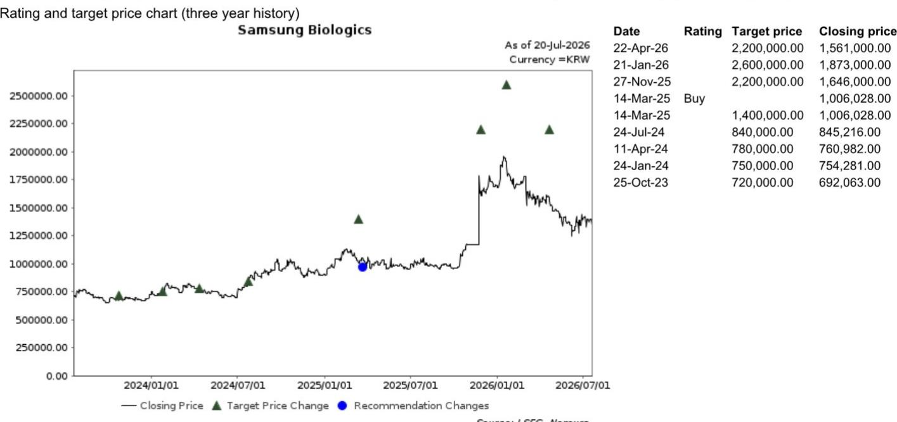

20 July 2026

EQUITY: HEALTH CARE & PHARMACEUTICALS

# 关于收购多肽CDMO公司（PolyPeptide）的快速研究笔记

三星生物制剂（SB）于7月20日宣布收购多肽CDMO公司PolyPeptide Group AG（PPGN）（PPGN SW，未评级；市值17亿美元）。SB计划通过要约收购获得100%股权，总交易金额为2.7万亿韩元。此次收购标志着SB的战略扩展，从抗体合同开发与生产组织（CDMO）能力延伸至多肽CDMO领域。我们认为，SB的关键战略逻辑在于能够抓住GLP-1多肽生产领域快速增长的外包需求。

PPGN在2026年上半年实现收入23.66亿欧元（同比增长41.6%），EBITDA利润率为20.7%。公司预计2026年全年收入同比增长25-30%，EBITDA利润率保持在十几百分比水平。基于PPGN的记录（PPGN参与了全球三分之一的多肽三期临床试验）以及溶剂还原技术，据我们所知，该公司已与全球前20大药企中的多家签订了合同。

总交易金额为2.7万亿韩元，假设收购100%股权

- 7月20日，SB宣布计划以每股44.31瑞士法郎收购PPGN 100%股权，对应股权价值14.6亿瑞士法郎（2.7万亿韩元）。收购将通过现有现金（截至2026年一季度，现金及现金等价物为1.6万亿韩元）、未来运营现金流以及债务相结合的方式融资，同时管理层表示股权融资也是一个潜在选项。

- 在要约收购启动前，PolyPeptide的控股股东Draupnir Holding B.V.（未上市）持有55.6%的股份，已不可撤销地承诺将其全部股份纳入要约。因此，SB已获得多数股份的控制权。交易的完成取决于SB通过要约收购获得至少三分之二（66.7%）的投票权。要约收购将于2026年8月底启动，持续约两个月。

## 我们的看法——以2026年预期EV/EBITDA 19.1倍的价格，分享不断增长的GLP-1市场

我们认为此次收购在战略上具有吸引力，能够提升每股收益，且在财务上合理。以隐含的19.1倍2026年预期EV/EBITDA计算（来源：彭博；同行如Lonza [LONN SW，未评级]和Bachem [BANB SW，未评级]的EV/EBITDA均为18.6倍——两者均无并购溢价），PolyPeptide提供了覆盖欧洲（包括瑞典、比利时、法国）和美国（加利福尼亚）的生产平台，并与SB在以下方面产生运营协同效应：1）收入协同效应包括向非重叠客户群进行交叉销售，以及抓住不断扩大的GLP-1多肽市场增长机会，PolyPeptide在该领域拥有CDMO中最大的三期临床管线；2）成本协同效应来自增强的采购能力以及将SB的自动化与PolyPeptide的多肽专长相结合；3）战略协同效应使SB从单一抗体CDMO转型为多元化平台。

## 全球GLP-1受体激动剂——盛宴将持续（链接；2026年7月9日）

胰高血糖素样肽-1受体激动剂（GLP-1 RAs）近年来一直是全球医疗健康领域的焦点。根据BioSpace数据，替尔泊肽和司美格鲁肽这两种重磅GLP-1 RA药物在2025年超越帕博利珠单抗（一种用于治疗多种癌症的PD-1抑制剂），分别成为全球销量第一和第二的药物。替尔泊肽的研发公司礼来（LLY US，未评级）是首家市值达到1万亿美元的药企。当前市场规模为720亿美元，第三方数据提供商（F&S）预测，GLP-1 RA药物总市场规模在未来十年将达到1800亿美元——相当于约11%的年复合增长率。我们认为，地域扩张——从利润丰厚的美国市场（目前占全球销售额一半以上）扩展到价格较低但患者群体庞大的世界其他地区市场——将是主要的市场驱动力。

## PolyPeptide集团历史

PolyPeptide集团是一家领先的多肽活性药物成分（API）CDMO，专注于治疗性多肽的开发和商业化生产。公司服务于全球制药和生物技术公司，涵盖代谢疾病（包括GLP-1疗法）、肿瘤学、内分泌学等领域。PolyPeptide起源于1952年Ferring Pharmaceuticals（未上市）的多肽生产部门。1996年，Ferring将该生产业务分离为独立的CDMO。PolyPeptide于2021年在瑞士证券交易所上市。

图1：PolyPeptide关键财务数据（2023-2026年上半年）

<table><tr><td>(百万欧元)</td><td>2023</td><td>2024</td><td>2025</td><td>2026年上半年</td></tr><tr><td>收入</td><td>320.4</td><td>336.8</td><td>389.3</td><td>236.6</td></tr><tr><td>营业利润</td><td>(36.5)</td><td>(7.4)</td><td>8.7</td><td rowspan="12"></td></tr><tr><td>营业利润率 (%)</td><td>-11.4%</td><td>-2.2%</td><td>2.2%</td></tr><tr><td>净利润</td><td>(51.4)</td><td>(19.6)</td><td>(21.2)</td></tr><tr><td>净利润率 (%)</td><td>-16%</td><td>-6%</td><td>-5%</td></tr><tr><td>总资产</td><td>689.1</td><td>756.6</td><td>826.0</td></tr><tr><td>现金及现金等价物</td><td>95.7</td><td>68.3</td><td>74.6</td></tr><tr><td>总负债</td><td>308.0</td><td>399.3</td><td>485.4</td></tr><tr><td>有息负债</td><td>114.9</td><td>104.9</td><td>141.3</td></tr><tr><td>总权益</td><td>381.1</td><td>357.2</td><td>340.6</td></tr><tr><td>净资产回报表现 (%)</td><td>-12.8%</td><td>-5.3%</td><td>-6.1%</td></tr><tr><td>净债务</td><td>19.2</td><td>36.6</td><td>66.8</td></tr><tr><td>净债务/权益 (%)</td><td>5.0%</td><td>10.2%</td><td>19.6%</td></tr></table>

来源：公司数据，NOM

## 附录A-1

本报告由NOM Financial Investment (Korea) Co., Ltd. (NFIK) 编制。关于NOM集团实体的详细信息，请参阅免责声明。

## 分析师认证

我们，Cindy Park和Dongmin Lee，特此证明：(1) 本研究报告中所表达的观点准确反映了我们个人对相关证券或发行人的看法；(2) 我们的薪酬中没有任何部分直接或间接与本研究报告中的具体建议或观点相关；(3) 我们的薪酬中没有任何部分与NOM Securities International, Inc.、NOM International plc或任何其他NOM集团公司进行的特定投行业务挂钩。

## 发行人特定监管披露

本文中使用的“NOM”和“NOM集团”指NOM Holdings, Inc.及其关联公司和子公司，包括NOM Securities International, Inc. ('NSI') 和Instinet, LLC ('ILLC')，均为美国注册经纪交易商及SIPC成员。

## 实质性提及的发行人

<table><tr><td>发行人</td><td>代码</td><td>价格</td><td>价格日期</td><td>股票评级</td><td>行业评级</td><td>披露</td></tr><tr><td>三星生物制剂</td><td>207940 KS</td><td>1,396,000韩元</td><td>2026年7月16日</td><td>买入</td><td>不适用</td><td></td></tr></table>

1,396,000韩元 (2026年7月16日) 买入 (行业评级: 不适用)  
  
评级说明请参阅图表后的股票评级说明

估值方法 我们的目标价2,200,000韩元基于DCF估值，其中：1) CMO业务收入在2026-2035年期间以每年10%的速度增长，2) 2026-2035年期间平均营业利润率为47%，3) 加权平均资本成本为6.8%，终值增长率为3.0%。该股票的基准指数为KOSPI200。

可能阻碍目标价实现的风险。下行风险包括工厂建设延迟。

可能阻碍目标价实现的风险 下行风险包括工厂建设延迟。

## 重要披露

## 研究报告在线获取及利益冲突披露

NOM集团研究报告可在www.NOMnow.com/research、彭博、Capital IQ、Factset、LSEG上获取。

重要披露信息可访问 http://go.NOMnow.com/research/m/Disclosures 或向NOM Securities International, Inc.索取。如网站访问遇到问题，请发送邮件至grpsupport@NOM.com寻求帮助。

负责编制本报告的分析师的薪酬基于多种因素，包括公司总收入，其中一部分来自投行业务。除非另有说明，本报告首页列出的非美国分析师未在FINRA规则下注册/具备研究分析师资格，可能不是NSI的关联人员，且可能不受FINRA Rule 2241关于与所覆盖公司沟通、公开露面以及研究分析师账户持有证券交易等限制的约束。

NOM Global Financial Products Inc. (NGFP)、NOM Derivative Products Inc. (NDP) 和 NOM International plc. (NIplc) 已在美国商品期货交易委员会和美国期货业协会注册为掉期交易商。NGFP、NDPI和NIplc主要从事掉期及其他衍生品交易，这些产品可能构成本报告的主题。

## 评级分布 (NOM集团)

NOM集团全球股票研究发布的所有评级分布如下：

58%被授予报告评级，出于强制披露目的，该评级归类为买入；其中33%的公司是NOM集团的投行客户\*。0%的公司（在EEA受监管市场上市）被NOM集团提供了实质性服务\*\*。

39%被授予中性评级，出于强制披露目的，该评级归类为持有；其中57%的公司是NOM集团的投行客户\*。0%的公司（在EEA受监管市场上市）被NOM集团提供了实质性服务。

3%被授予减持评级，出于强制披露目的，该评级归类为卖出；其中15%的公司是NOM集团的投行客户\*。0%的公司（在EEA受监管市场上市）被NOM集团提供了实质性服务。

\*NOM集团定义见本报告末尾的免责声明部分。

\*\* 根据欧盟市场滥用监管法规的定义。

## NOM集团股票研究评级体系及行业定义

评级体系为相对体系，表示相对于为每只股票确定的特定基准的预期表现，并受有限的管理裁量权约束。分析师的目标价是基于分析师确定的适当估值方法对股票当前内在公允价值的评估。估值方法包括但不限于现金流折现分析、预期净资产回报表现和倍数分析。分析师也可能指出相对于所述目标价的预期相对上涨/下跌空间，定义为（目标价 - 当前价格）/当前价格。

## 股票

“买入”评级表示分析师预期该股票在未来12个月内将跑赢基准。“中性”评级表示分析师预期该股票在未来12个月内将与基准表现一致。“减持”评级表示分析师预期该股票在未来12个月内将跑输基准。“暂停”评级表示评级、目标价和预估已暂时暂停，以遵守适用法规和/或公司政策。标记为“未评级”或显示为“无评级”的证券和/或公司不在常规研究覆盖范围内。读者不应期望NOM就此类证券和/或公司提供持续或额外的信息。基准如下：美国/欧洲/亚洲（除日本）：请参阅估值方法中关于股票相关基准的说明，可访问：http://go.NOMnow.com/research/m/Disclosures；全球新兴市场（除亚洲）：MSCI新兴市场除亚洲指数，除非估值方法中另有说明；日本：Russell/NOM大盘指数。

## 行业

“看多”立场表示分析师预期该行业在未来12个月内将跑赢基准。“中性”立场表示分析师预期该行业在未来12个月内将与基准表现一致。“看空”立场表示分析师预期该行业在未来12个月内将跑输基准。标记为“未评级”或显示为“不适用”的行业不分配评级。基准如下：美国：标普500指数；欧洲：道琼斯STOXX 600指数；全球新兴市场（除亚洲）：MSCI新兴市场除亚洲指数。日本/亚洲（除日本）：不分配行业评级。

## 目标价

如果讨论到目标价，它表示分析师对未来12个月股价的预测，部分反映了分析师对公司盈利的预估。任何目标价的实现可能受到总体市场和宏观经济趋势、与公司或市场相关的其他风险的阻碍，并且如果公司盈利与预估不符，则可能无法实现。

## 免责声明

本出版物包含由第1页确定的NOM集团实体编制的内容，并且（如适用）包含一个或多个NOM集团实体（其员工及其各自隶属关系在第1页或本出版物其他地方指定）的贡献。本文中使用的“NOM集团”指NOM Holdings, Inc.及其关联公司和子公司，包括：(a) NOM Securities Co., Ltd. ('NSC') 东京，日本，(b) NOM Financial Products Europe GmbH ('NFPE')，德国，(c) NOM International plc ('NIplc')，英国，(d) NOM Securities International, Inc. ('NSI')，纽约，美国，(e) NOM International (Hong Kong) Ltd. ('NIHK')，香港，(f) NOM Financial Investment (Korea) Co., Ltd. ('NFIK')，韩国（关于在韩国金融投资协会注册的NOM分析师信息，可在KOFIA内联网http://dis.kofia.or.kr上找到），(g) NOM Singapore Ltd. ('NSL')，新加坡（注册号197201440E，受新加坡金融管理局监管），(h) NOM Australia Ltd. ('NAL')，澳大利亚（ABN 48 003 032 513），受澳大利亚证券和投资委员会监管，持有澳大利亚金融服务牌照号246412，(i) NOM Securities Malaysia Sdn. Bhd. ('NSM')，马来西亚，(j) NIHK，台北分公司 ('NITB')，台湾，(k) NOM Financial Advisory and Securities (India) Private Limited ('NFASL')，孟买，印度（注册地址：Ceejay House, Level 11, Plot F, Shivsagar Estate, Dr. Annie Besant Road, Worli, Mumbai- 400 018, India；电话：91 22 4037 4037，传真：91 22 4037 4111；CIN No: U74140MH2007PTC169116，证券经纪业务SEBI注册号：INZ000255633；商人银行业务SEBI注册号：INM000011419；研究业务SEBI注册号：INH000001014 - 合规官：Ms. Pratiksha Tondwalkar，91 22 40374904，投诉邮箱：investorgrievancesra@NOM.com 网页：链接

对于涉及印度上市公司或由印度NFASL研究分析师撰写的报告：(i) 证券市场投资存在市场风险。投资前请仔细阅读所有相关文件。(ii) SEBI授予的注册以及NISM的认证绝不保证中介机构的业绩或向读者提供任何回报保证。(iii) NFASL提供研究服务的条款和条件在NFASL网页上披露。

(I) NOM Fiduciary Research & Consulting Co., Ltd. ('NFRC') 东京，日本。(m) NOM Orient International Securities Co., Ltd ("NOI") 是NOM集团、东方国际（集团）有限公司和上海黄浦投资控股（集团）有限公司共同控股的合资企业。根据中华人民共和国法律（为本文件目的，不包括香港、澳门和台湾），NOI在中国境内获准提供证券研究和研究交流，并独立于NOM集团其他成员运营；特别是，NOI在中国证券中的权益不向任何其他NOM集团实体披露或与其持仓合并，其他NOM集团实体在中国证券中的权益也不向NOI披露或与其持仓合并。研究报告首页上NOI旁边的个人姓名表示该个人受雇于NOI，根据研究合作协议为NIHK提供研究协助。研究报告首页上员工姓名旁的'NSFSPL'表示该个人受雇于NOM Structured Finance Services Private Limited，根据公司间协议为某些NOM实体提供协助。研究报告首页上个人姓名旁的'Verdhana'表示该个人受雇于PT Verdhana Sekuritas Indonesia ('Verdhana')，根据研究合作协议为NIHK提供研究协助，Verdhana及其个人均未在印度尼西亚境外获得许可。

本材料：(I) 仅供您个人参考，我们不寻求基于此采取任何行动；(II) 不应被解释为在任何司法管辖区出售或招揽购买任何证券的要约，在该等司法管辖区此类要约或招揽将属非法；(III) 除与NOM集团相关的披露外，基于我们认为可靠的来源信息，但未经NOM集团独立核实。

除与NOM集团相关的披露外，NOM集团不保证、陈述或承诺（明示或暗示）本文件是公平、准确、完整、正确、可靠或适合任何特定目的或适销的，并且在法律/法规允许的最大范围内，不承担因使用本文件及相关数据而产生的任何行为（或决定不作为）的责任（无论是过失或其他，以及全部或部分）。在法律/法规允许的最大范围内，NOM集团的所有保证和其他承诺特此排除，NOM集团不承担因使用、误用或分发本材料或其中包含的信息或以其他方式与之相关的任何损失的责任（无论是过失或其他，以及全部或部分）。

所表达的意见或估计是截至原始出版日期当前的意见，并且本材料中的信息（包括其中包含的意见和估计）如有变更，恕不另行通知。然而，NOM集团明确声明不承担任何更新或修订本文件的义务，因此没有责任。本文中的任何评论或陈述均为作者本人的观点，可能与NOM集团内部其他方的观点不同。客户应考虑本报告中的任何建议或推荐是否适合其特定情况，并在适当时寻求专业建议，包括税务建议。NOM集团不提供税务建议。

在适用法律/法规允许的范围内，NOM集团及其高级职员、董事、员工和关联方可能作为委托人、代理人或其他身份进行交易，或持有发行人本文提及的证券、商品或工具，或基于其的期权或其他衍生工具的多头或空头头寸，或买入或卖出。NOM集团公司也可能担任发行人金融工具的市场做市商或流动性提供者（根据英国适用法规的定义）。如果市场做市商活动是根据美国或其他司法管辖区的特定法律法规的定义进行的，则将在具体的发行人披露中单独披露。

本文件可能包含从第三方获得的信息，包括但不限于信用评级机构的评级，如标准普尔。NOM集团特此明确否认对从第三方获得的任何信息（包含在本材料中或以其他方式与之相关）的原创性、公平性、准确性、完整性、正确性、适销性或特定目的适用性作出任何陈述、保证或承诺，并且不承担因使用或误用任何从第三方获得的信息（包含在本材料中或以其他方式与之相关）而产生的任何直接、间接、附带、示范性、补偿性、惩罚性、特殊或后果性损害、成本、费用、法律费用或损失（包括收入或利润损失和机会成本）的责任（无论是过失或其他，以及全部或部分）。禁止以任何形式复制和分发第三方内容，除非事先获得相关第三方的书面许可。第三方内容提供者不（明示或暗示）保证任何信息（包括评级）的公平性、准确性、完整性、正确性、及时性或可用性，并且不以任何方式对因使用或误用此类内容而产生的任何错误或遗漏（无论过失或其他）负责，无论其原因如何。第三方内容提供者不提供明示或暗示的保证，包括但不限于任何适销性或特定目的或用途适用性的保证。第三方内容提供者不承担因使用或误用其内容（包括评级）而产生的任何直接、间接、附带、示范性、补偿性、惩罚性、特殊或后果性损害、成本、费用、法律费用或损失（包括收入或利润损失和机会成本）的责任（无论是过失或其他，以及全部或部分）。信用评级是意见陈述，而非事实陈述或购买、持有或出售证券的建议。它们不涉及证券的适用性或证券用于投资目的的适用性，不应作为研究交流依赖。

本文件中的任何MSCI来源信息均为MSCI Inc. ('MSCI')的专有财产。未经MSCI事先书面许可，不得为任何目的（包括创建任何金融产品和任何指数）以任何形式复制、转载、再传播、再分发或使用（全部或部分）此信息及任何其他MSCI知识产权。此信息按“原样”提供。用户承担使用此信息的全部风险。MSCI、其关联方以及任何参与计算或编制此信息的第三方特此明确否认对本材料或其中包含的信息或以其他方式与之相关的任何原创性、公平性、准确性、完整性、正确性、适销性或特定目的适用性作出任何陈述、保证或承诺。在不限制前述规定的前提下，MSCI、其任何关联方或任何参与计算或编制此信息的第三方在任何情况下均不承担任何形式的任何损害责任（无论是过失或其他，以及全部或部分）。MSCI和MSCI指数是MSCI及其关联方的服务标志。

Russell/NOM日本股票指数的知识产权和其他权利属于NOM Fiduciary Research & Consulting Co., Ltd. ("NFRC") 和FTSE Russell ("Russell")。NFRC和Russell不保证该指数的公平性、准确性、完整性、正确性、可靠性、有用性、适销性、适销性或特定目的适用性，并且不对任何指数用户和/或其关联方使用该指数进行的业务活动或服务负责。

读者应将本文件视为其做出投资决策的单一因素，因此，本报告不应被视为识别或暗示与任何投资决策相关的所有直接或间接风险。NOM集团制作多种不同类型的研究产品，包括但不限于基础分析和定量分析；一种研究产品中包含的建议可能与另一种研究产品中的建议不同，无论是由于不同的时间范围、方法论或其他原因。NOM集团以多种不同方式发布研究产品，包括在NOM集团门户网站上发布产品和/或直接分发给客户。不同的客户群体可能根据其个人需求从研究部门获得不同的产品和服务。

本文中呈现的数字可能指代过去的表现或基于过去表现的模拟，这些并非未来或可能表现的可靠指标。如果信息包含对未来表现和业务前景的预期、预测或指示，此类预测可能不是未来或可能表现的可靠指标。此外，模拟基于模型和简化假设，可能过度简化且不能反映未来的回报分布。本文件内为说明目的创建和发布的任何数字、策略或指数，不旨在作为欧盟基准法规定义的“基准”使用。某些证券受汇率波动影响，可能对投资的价值、价格或收入产生不利影响。

关于固定收益研究：建议分为两类：战术性，通常持续最多三个月；或战略性，通常持续6-12个月。然而，交易建议可能随时根据情况变化进行审查。交易还提供了“止损”水平；如果触及，将自动关闭交易建议。建议中显示的价格和回报表现是在提交发布时获取的，基于当时彭博、LSEG或NOM的指示性价格和回报表现。显示的价格和回报表现不一定是交易建议可以执行的价格。

本文描述的证券可能未根据美国1933年证券法（“1933年法案”）注册，在这种情况下，除非已根据1933年法案注册，或符合1933年法案注册要求的豁免条件，否则不得在美国或向美国人发行或出售。除非适用法律允许，否则任何交易均应通过您所在司法管辖区的NOM实体执行。

本文件已获批准在英国由NIplc作为投资研究分发。NIplc由审慎监管局授权，并受金融行为监管局和审慎监管局监管。NIplc是伦敦证券交易所的成员。本文件不构成英国适用法规意义上的个人推荐，也未考虑个人读者的特定投资目标、财务状况或需求。本文件仅面向英国适用法规意义上的“合格交易对手”或“专业客户”，因此，不得向此类目的的“零售客户”再分发。

本文件已获批准在欧洲经济区由NOM Financial Products Europe GmbH ("NFPE") 作为投资研究分发。NFPE是一家根据德国法律注册成立的有限责任公司，在法兰克福/美因河畔法院商业登记处注册，编号HRB 110223。NFPE由德国联邦金融监管局授权和监管。

本文件已获NIHK批准，NIHK受香港证券及期货事务监察委员会监管，可在香港分发。本文件仅面向香港适用法规意义上的“专业读者”，因此，不得向非“专业读者”的人士再分发。

本文件已获批准在澳大利亚由NAL分发，NAL在澳大利亚由ASIC授权和监管。

本文件也已获批准在马来西亚由NSM分发。

在新加坡，本文件由NSL分发，NSL是《财务顾问法》（第110章）定义的豁免财务顾问，并受新加坡金融管理局监管。NSL可根据《财务顾问条例》第32C条的规定，安排分发其外国关联公司制作的此文件。本文件面向《证券与期货法》（第289章）定义的认可、专家或机构读者。如果本文件的接收者不是认可、专家或机构读者，NSL仅在法律要求的范围内对此类接收者承担本文件内容的法律责任。新加坡的接收者应就本文件引起或与之相关的事项联系NSL。本文件旨在广泛分发。它未考虑任何特定个人的具体投资目标、财务状况或特殊需求。接收者在做出购买任何证券的承诺前，应考虑其具体的投资目标、财务状况或特殊需求，包括根据其认为合适的方式，在单独委托下，向独立财务顾问寻求关于投资适宜性的建议。除非1933年法案S条例的规定禁止，本材料在美国由NSI（一家美国注册经纪交易商）分发，NSI根据1934年美国证券交易法Rule 15a-6的规定对其内容负责。

编制本文件的实体允许NOM集团内独立运营的关联公司向其客户提供此类文件的副本。

本文件未获批准在沙特阿拉伯王国向“授权人士”、“豁免人士”或“机构”（由资本市场管理局定义）或阿拉伯联合酋长国的“市场交易对手”或“专业客户”（由迪拜金融服务局定义）或卡塔尔国的“市场交易对手”或“商业客户”（由卡塔尔金融中心监管局定义）以外的人士分发，具体由NOM沙特阿拉伯、NIplc或任何其他NOM集团成员（视情况而定）决定。本文件及其任何副本不得由未经授权的人士带入、传输或分发（直接或间接）至沙特阿拉伯、阿联酋或卡塔尔，或向沙特阿拉伯境内的“授权人士”、“豁免人士”或“机构”或阿联酋的“市场交易对手”或“专业客户”或卡塔尔的“市场交易对手”或“商业客户”以外的人士分发。未能遵守这些限制可能构成违反阿联酋、沙特阿拉伯或卡塔尔的法律。

对于涉及台湾上市公司或由台湾研究分析师撰写的报告：

本文件仅供参考。您应独立评估投资风险，并对您的投资决策全权负责。未经NOM集团书面授权，任何媒体或个人不得复制或引用本报告的任何部分。根据台湾《证券商受托买卖有价证券管理规则》和/或其他适用法律法规，您不得向他人（包括但不限于关联方、关联公司和任何其他第三方）提供本报告，或从事与本报告相关的可能涉及利益冲突的任何活动。关于NOM International (Hong Kong) Ltd.台北分公司不可执行的证券/工具的信息仅供参考，不应被解释为对此类证券/工具的交易建议或招揽。

本材料不得在印度尼西亚境内分发，或传递给印度尼西亚共和国境内的个人，或传递给印度尼西亚公民（无论其居住地或所在地）或印度尼西亚的实体或居民，其方式构成印度尼西亚共和国法律下的公开发行。本文件中提及的证券不得在印度尼西亚境内或向印度尼西亚公民（无论其居住地或所在地）或印度尼西亚的实体或居民发行或出售，其方式构成印度尼西亚共和国法律下的公开发行。

研究报告首页上NOI旁边的个人姓名表示本文件是NOI在中国发布的研究报告的翻译。在所有其他情况下，本文件由未在中国获得提供证券研究许可的NOM集团或其子公司或关联公司（统称“离岸发行人”）编制。本研究报告未获批准或旨在在中国境内分发。A股相关分析（如有）并非为位于或注册于中国的任何人士制作。接收者不应依赖本研究报告中包含的任何信息做出投资决策，离岸发行人不对此承担任何责任。未经NOM集团成员事先书面同意，不得以任何形式（I）复制、影印、复制或复制本材料的任何部分；或（II）再传播、再发布或再分发。如果本文件通过电子传输（例如电子邮件）分发，则无法保证此类传输是安全或无错误的，因为信息可能被拦截、损坏、丢失、销毁、延迟到达或不完整，或包含病毒。因此，发送方不承担因电子传输可能产生的本文件内容中的任何错误或遗漏的责任（无论是过失或其他，以及全部或部分）。如需验证，请索取硬拷贝版本。

NOM集团通过其合规政策和程序（包括但不限于利益冲突、中国墙和保密政策）以及通过维护中国墙和员工培训来管理与研究制作相关的冲突。

如需获取本文件中包含的任何研究交流所使用的方法或模型的更多信息，请联系NOM首页列出的研究分析师。可根据要求提供披露信息，披露信息可在NOM披露网页上获取：

http://go.NOMnow.com/research/m/Disclosures

版权 © 2026 NOM Financial Investment (Korea) Co., Ltd., Korea。保留所有权利。
