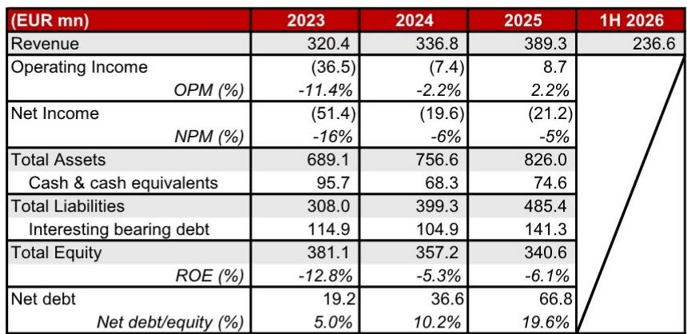

# Samsung Biologics’ Acquisition of PolyPeptide Signals a Strategic Pivot from Antibody Specialist to Diversified CDMO Platform, Capitalizing on the GLP-1 Manufacturing Boom

On July 20, 2026, Samsung Biologics announced its intention to acquire PolyPeptide Group AG for KRW 2.7 trillion, a move that transforms the company from a focused antibody contract development and manufacturing organization into a diversified platform capable of capturing the growth in GLP-1 peptide manufacturing. The deal, priced at an implied 19.1x 2026E EV/EBITDA, is strategically positioned, EPS accretive, and financially reasonable, enabling Samsung Biologics to participate in what is arguably a significant therapeutic opportunity in global pharmaceuticals today.

The timing of this acquisition is notable. GLP-1 receptor agonists have already overtaken oncology blockbusters to become the world's best-selling medications, with tirzepatide and semaglutide surpassing pembrolizumab in 2025 to claim the top two spots globally. The current market size of USD 72 billion is projected to reach USD 180 billion over the next decade, representing an 11% compound annual growth rate. This growth is being fueled by geographic expansion from the US market, which currently accounts for more than half of global sales, into rest-of-world markets that feature lower prices but massive patient pools.

Samsung Biologics is not simply buying a manufacturing facility; it is acquiring a strategic position in a market where supply constraints remain a primary consideration. PolyPeptide's participation in one-third of global peptide Phase III trials and its solvent reduction technology provide a competitive advantage that extends beyond the acquisition price. The deal creates a company that can offer both antibody and peptide CDMO services, cross-sell to non-overlapping customer bases, and integrate automation with peptide manufacturing expertise.

## The Acquisition Price Reflects a Strategic Premium That Is Justified by PolyPeptide’s Unique Market Position and Growth Trajectory

At 19.1x 2026E EV/EBITDA, the acquisition multiple sits in line with peers such as Lonza and Bachem, both of which trade at 18.6x without any M&A premium. However, this comparison understates the strategic value embedded in the deal. PolyPeptide recorded revenue of EUR 236.6 million in the first half of 2026, representing 41.6% year-over-year growth, with an EBITDA margin of 20.7%. The company has guided for 2026E revenue growth of 25-30% and high-teens EBITDA margins, indicating that the growth trajectory is accelerating.

The implied multiple is reasonable when considered against the backdrop of PolyPeptide's pipeline presence. The company is participating in one-third of global peptide Phase III trials, a statistic that signals deep integration with promising drug candidates in the GLP-1 space. This is not a generic manufacturing capability; it is a specialized platform that has already been validated by the world's top 20 pharmaceutical companies. The solvent reduction technology that PolyPeptide has developed provides a competitive advantage in manufacturing efficiency, which translates into cost advantages and margin expansion as scale increases.

Samsung Biologics is financing the deal through a combination of existing cash, future operating cash flow, and debt, with equity financing as a potential option. The company held KRW 1.6 trillion in cash and equivalents as of the first quarter of 2026, providing significant financial flexibility. The fact that Draupnir Holding B.V., PolyPeptide's controlling shareholder with 55.6% interest, has irrevocably committed to tendering its entire stake removes execution risk from the transaction. Samsung Biologics has effectively secured control before the tender offer has even launched.

## The GLP-1 Market Is Entering a New Phase Where Manufacturing Capacity, Not Drug Discovery, Will Determine Outcomes

The conventional narrative around GLP-1 receptor agonists has focused on the race to develop next-generation therapies with improved efficacy, tolerability, and oral formulations. While drug discovery remains important, the critical factor has already shifted to manufacturing capacity. The two blockbuster drugs, tirzepatide and semaglutide, are peptide-based therapies that require complex manufacturing processes. The demand for these drugs has outstripped supply, creating a structural situation that peptide CDMOs are uniquely positioned to address.

PolyPeptide's manufacturing platform spans Europe and the United States, with facilities in Sweden, Belgium, France, and California. This geographic diversification provides regulatory redundancy and access to multiple talent pools. More importantly, it positions Samsung Biologics to serve a global customer base that requires both antibody and peptide manufacturing capabilities under one roof. The operational synergy is grounded in the ability to cross-sell to non-overlapping customer bases. Samsung Biologics' existing antibody customers may now access peptide manufacturing, while PolyPeptide's peptide customers gain access to antibody capabilities.

The revenue synergy extends beyond cross-selling. As GLP-1 therapies expand into new indications and geographies, the total addressable market for peptide manufacturing will grow faster than the drug market itself. CDMOs typically capture a larger share of the value chain as drug manufacturers outsource production to focus on commercialization. PolyPeptide's existing relationships with global top 20 big pharmas provide a direct channel to the companies that will drive the next phase of GLP-1 expansion.

## Cost and Strategic Synergies Transform Samsung Biologics from a Single-Product CDMO into a Diversified Platform with Multiple Growth Vectors

The cost synergies from this acquisition are substantial and quantifiable. Enhanced purchasing power from combining two procurement organizations will reduce raw material costs, which represent a significant portion of peptide manufacturing expenses. More importantly, integrating Samsung Biologics' automation expertise with PolyPeptide's peptide manufacturing knowledge will drive operational efficiency. Automation reduces labor costs, improves consistency, and enables higher throughput without proportional increases in fixed costs.

The strategic synergy is the most transformative aspect of the deal. Samsung Biologics has historically been viewed as an antibody CDMO, a label that limits its addressable market and exposes it to the cyclicality of antibody drug development. By adding peptide capabilities, the company becomes a diversified platform that can serve multiple therapeutic modalities. This diversification reduces earnings variability and provides a natural hedge against shifts in drug development trends.

The timing of this strategic pivot is notable. The GLP-1 market is still in its early stages, with geographic expansion into rest-of-world markets representing the next major growth driver. These markets feature lower drug prices but significantly larger patient populations. Manufacturing capacity will need to scale substantially to meet this demand, and the companies that have invested in capacity ahead of demand will capture disproportionate market share. PolyPeptide's existing infrastructure, combined with Samsung Biologics' financial resources and operational expertise, creates a platform that is well-positioned to participate in this expansion.

## A Decision Framework for Evaluating CDMO Acquisitions in the GLP-1 Era

For observers and strategists evaluating similar opportunities, the Samsung Biologics-PolyPeptide deal provides a useful framework with four critical dimensions. First, pipeline penetration matters more than current revenue. PolyPeptide's participation in one-third of global peptide Phase III trials is a leading indicator of future revenue growth, as these trials convert into commercial manufacturing contracts. Second, technology differentiation creates defensible margins. PolyPeptide's solvent reduction technology is not easily replicated and provides a cost advantage that will persist even as competition increases.

Third, customer concentration must be evaluated in the context of market structure. PolyPeptide's contracts with global top 20 big pharmas indicate a diversified customer base that reduces single-client risk. The fact that these relationships exist across multiple therapeutic areas, including metabolic diseases, oncology, and endocrinology, further diversifies the revenue stream. Fourth, the acquisition must be evaluated on total enterprise value relative to the addressable market, not just current earnings. At USD 1.7 billion market cap, PolyPeptide represents a fraction of the USD 180 billion GLP-1 market opportunity. The acquisition premium is justified if the combined entity can capture even a small incremental share of this market.

The financing structure also provides insights. Samsung Biologics' use of existing cash and debt, rather than equity, signals confidence in the deal's cash flow generation potential. The company's willingness to consider equity financing as a contingency, rather than a primary funding source, indicates that management expects the acquisition to be self-funding within a reasonable timeframe. This discipline is important because it preserves the balance sheet for future investments and dividend capacity.

## The Acquisition Reshapes the Competitive Landscape of the CDMO Industry, Prompting Rivals to Respond

The immediate competitive implication is that Samsung Biologics has advanced its position in the peptide CDMO space. Companies that were previously considered pure-play peptide specialists now face a competitor with the financial resources, operational scale, and customer relationships of a global CDMO leader. The combined entity will have manufacturing capabilities across antibodies and peptides, a geographic footprint spanning Europe, the United States, and Asia, and a customer base that includes the world's largest pharmaceutical companies.

Rivals face a strategic choice: acquire peptide capabilities at potentially elevated valuations, invest organically with longer time horizons, or specialize in niches that the combined entity may not prioritize. The window for acquiring high-quality peptide CDMOs at reasonable valuations is narrowing, as the GLP-1 market opportunity becomes more widely recognized. Companies that delay strategic decisions risk being left with subscale operations that cannot compete on cost or service.

For pharmaceutical companies developing GLP-1 therapies, the acquisition provides an additional source of manufacturing capacity at a time when supply constraints are a primary factor in market expansion. Samsung Biologics' track record of on-time delivery and regulatory compliance, combined with PolyPeptide's technical expertise, creates a compelling value proposition for drug sponsors. The ability to source both antibody and peptide manufacturing from a single provider reduces complexity and qualification timelines, which are critical in a market where speed to market translates directly into revenue.

The deal also signals that the CDMO industry is consolidating around therapeutic modalities that offer the highest growth potential. Antibody manufacturing, while still a large market, has become commoditized in certain segments. Peptide manufacturing, by contrast, offers higher margins and faster growth due to the complexity of the manufacturing process and the scarcity of qualified capacity. Samsung Biologics' strategic pivot serves as a case study for how CDMOs might position themselves for the next decade of pharmaceutical innovation.

*For informational purposes only. Portions may be generated, translated, summarized, or edited with AI assistance based on source materials and may contain omissions or errors. Please verify independently. This is not professional advice.*

For informational purposes only. Portions may be generated, translated, summarized, or edited with AI assistance based on source materials and may contain omissions or errors. Please verify independently. This is not professional advice.

