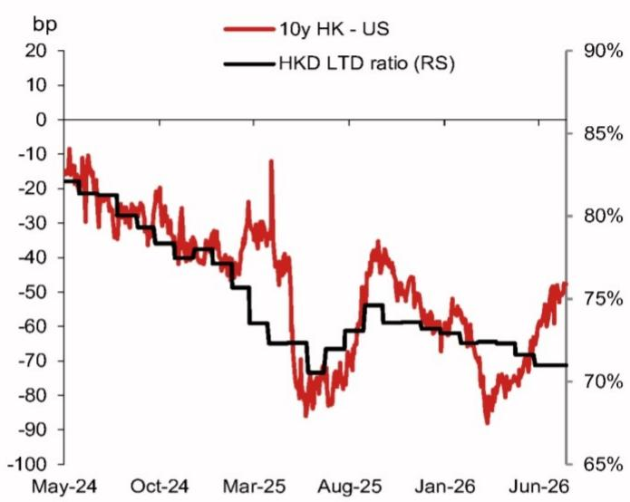
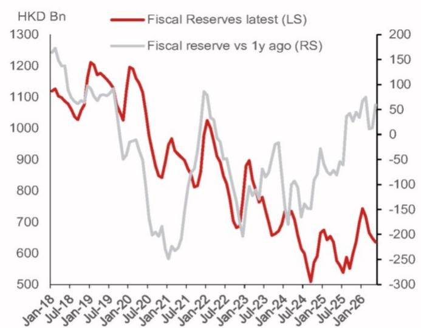
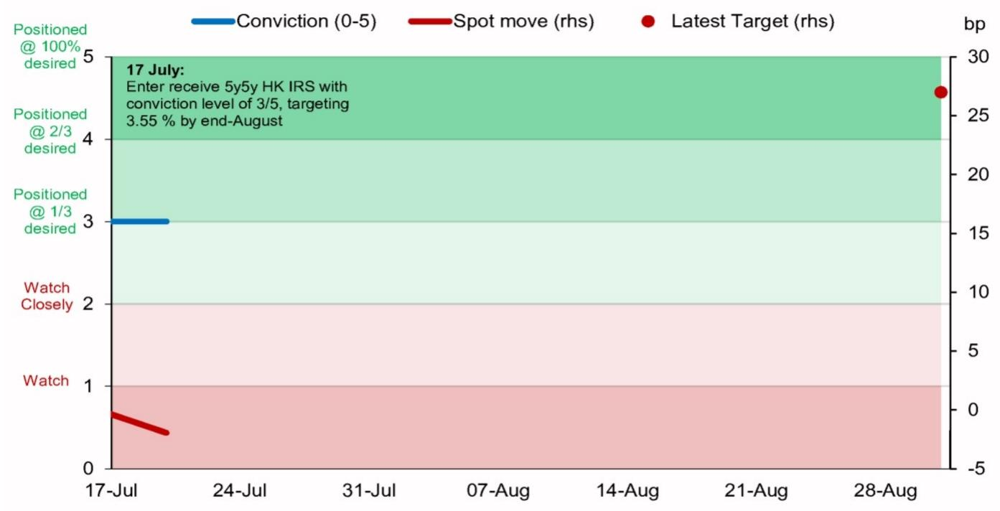

# 宏观环境观察 - 亚洲（除日本外）

## 香港利率市场观察：关注远期利率互换

近期美国利率曲线形态变化、本地贷款增长情况以及财政储备状况，是影响香港利率市场的重要因素。

## 核心观察

## 研究分析师

亚洲利率策略

Albert Leung - NIHK
albert.leung1@NOM.com
+852 2252 1401

Clair Gao, CFA - NIHK
clair.gao@NOM.com
+852 2252 1081

1. **美国利率曲线变化与港美利差收窄**。过去一周，市场关注点集中在能源价格波动及部分科技公司报价调整。若市场对报价调整的担忧持续，即便外部政策表态偏紧，远端美国利率（如5y5y点位）仍可能继续下行。这一趋势可能传导至香港市场，目前远端（10年期）港美利差已从此前低点-85bp回升至-50bp以上（图1）。

2. **港元贷款增长保持平稳**。尽管物业报价有所回升，但港元贷款增长尚未出现明显反弹。港元贷存比从六个月前的73.2%进一步降至5月的71.0%，同期按揭贷款增速从1.0%升至3.3%。

3. **财政储备趋于稳定，非金融类港元债券发行放缓**。从中期来看，北部都会区等项目可能需要在五年以上周期内投入大量资金，但物业报价回稳及宏观前景改善，为财政平衡提供了支撑——这是自2022年以来首次出现同比正增长（图2）。同时，主要香港企业及准政府机构（如港铁、机场管理局、新鸿基地产）的非金融类债券发行在4月回升后有所放缓。相比之下，金融类公司发行的长期港元债券仍保持活跃。

图1：10年期港美利率互换利差与贷存比

来源：Bloomberg, NOM

图2：财政储备水平及同比变化

来源：CEIC, NOM
制作完成：2026-07-20 11:23 UTC

图3：关注5y5y港元利率互换

来源：NOM

图4：当前策略观察列表

| 观察方向 | 参考目标 | 时间框架 | 信心程度(0-5) | 起始日期 |
|---|---|---|---|---|
| 关注5y5y港元利率互换 | 3.55% | 8月底 | 3 | 17-Jul-26 |
| 关注欧元/韩元 | 1,760 | 10月底 | 3 | 17-Jul-26 |
| 关注美元/离岸人民币 | 6.55 | 10月底 | 3 | 16-Jul-26 |
| 关注泰铢利率曲线 | 30bp | 8月底 | 3 | 14-Jul-26 |
| 关注韩元利率曲线 | 25bp | 8月底 | 3 | 9-Jul-26 |
| 关注欧元/印度卢比 | 113.0 | 9月底 | 3 | 3-Jul-26 |
| 关注美元/泰铢 | 32.0 | 9月底 | 3 | 3-Jul-26 |
| 关注澳元与美元利率 | 35bp | 9月底 | 3 | 3-Jul-26 |
| 关注英镑/新西兰元 | 2.25 | 9月底 | 4 | 26-Jun-26 |
| 关注韩国与台湾利率 | 150bp | 8月底 | 3 | 26-Jun-26 |
| 关注加元/日元 | - | - | 2 | 24-Jun-26 |
| 关注离岸人民币汇率 | - | - | 2 | 24-Jun-26 |
| 关注澳元/新西兰元 | - | - | 2 | 27-May-26 |
| 关注美元/新台币 | - | - | 2 | 25-May-26 |
| 关注欧元/菲律宾比索 | - | - | 2 | 25-May-26 |
| 关注美元/港元 | 7.8 | 12-May-27 | 3 | 8-May-26 |
| 关注欧元/瑞典克朗 | - | - | 2 | 17-Apr-26 |
| 关注中国利率 | 1.60% | 8月底 | 3 | 14-Apr-26 |
| 关注美元/港元 | 7.8 | 27-Oct-26 | 3 | 23-Jan-26 |
| 关注新加坡元/印尼盾 | - | - | 2 | 9-Jan-26 |
| 关注欧元/英镑 | - | - | 2 | 9-Jan-26 |

来源：NOM

完整策略组合请参见2026年7月9日策略组合更新报告。

## 附录A-1

本报告由NOM International (Hong Kong) Ltd. (NIHK) 编制。NOM集团实体详情请参见免责声明。

## 分析师声明

我们，Albert Leung和Clair Gao，特此声明：(1) 本研究报告中所表达的观点准确反映了我们对相关主题的个人看法；(2) 我们的薪酬中没有任何部分直接或间接与本研究报告中的具体观点相关；(3) 我们的薪酬与NOM集团任何投资银行业务交易无关。

## 重要披露

## 研究报告在线获取及利益冲突披露

NOM集团研究报告可通过www.NOMnow.com/research、Bloomberg、Capital IQ、Factset、LSEG获取。

重要披露信息可访问 http://go.NOMnow.com/research/m/Disclosures 或向NOM Securities International, Inc.索取。

编制本报告的分析师薪酬基于公司总收入等多种因素，其中部分来自投资银行业务。除非另有说明，本报告列出的非美国分析师未在FINRA规则下注册/取得研究分析师资格，可能不是NSI的关联人士，且可能不受FINRA规则2241关于与所覆盖公司沟通、公开露面及交易持仓等限制的约束。

NOM Global Financial Products Inc. (NGFP)、NOM Derivative Products Inc. (NDP) 及NOM International plc. (NIplc) 已在美国商品期货交易委员会及美国期货业协会注册为掉期交易商。

## 美国市场额外披露

主要交易：NOM Securities International, Inc.及其关联公司通常作为本研究报告所涉及固定收益证券（或相关衍生品）的主要交易方。分析师与其他NOM Securities International, Inc.人员的互动：NOM Securities International, Inc.及其关联公司的固定收益研究分析师定期与销售和交易部门人员互动，以获取其覆盖领域的流动性和定价信息。

## 估值方法 - 固定收益

NOM的固定收益策略师通过提供交易观察来表达对证券价格和金融市场的看法。这些可以是相对价值观察、方向性观察、资产配置观察或三者的结合。嵌入交易观察的分析包括但不限于：

- 基本面分析：判断证券价格是否偏离其基础宏观或微观经济基本面。
- 价格变动的量化分析。
- 技术因素：如监管变化、市场风险偏好变化、意外评级行动、一级市场活动及供需考量。

交易观察的时间框架可变。战术性观察时间较短，通常不超过三个月。战略性观察时间较长，通常超过三个月。

根据欧盟市场滥用监管法规，NOM全球固定收益研究发布的评级分布如下：

52%被赋予买入（或同等）评级；其中50%的发行人曾接受NOM集团提供的实质性服务*。
0%被赋予中性（或同等）评级。
48%被赋予卖出（或同等）评级；其中50%的发行人曾接受NOM集团提供的实质性服务。
数据截至2026年6月30日。

*根据欧盟市场滥用监管法规定义
**NOM集团定义见本报告末尾免责声明部分

## 免责声明

本出版物包含由第1页所列NOM集团实体编制的材料，并可能包含一个或多个NOM集团实体员工的贡献。本报告中使用的"NOM集团"指NOM Holdings, Inc.及其关联公司和子公司。本材料仅供您个人参考，不构成任何司法管辖区内的证券买卖要约或要约邀请。NOM集团不保证本文件的公平性、准确性、完整性、正确性、可靠性或适用于任何特定目的。本报告中的观点或估计为原始发布日期时的当前观点，如有变更恕不另行通知。过往表现或基于过往表现的模拟并非未来或可能表现的可靠指标。读者应将本报告视为做出投资决策的单一因素，不应将其视为识别所有直接或间接风险。

版权 © 2026 NOM International (Hong Kong) Ltd.，香港。保留所有权利。
