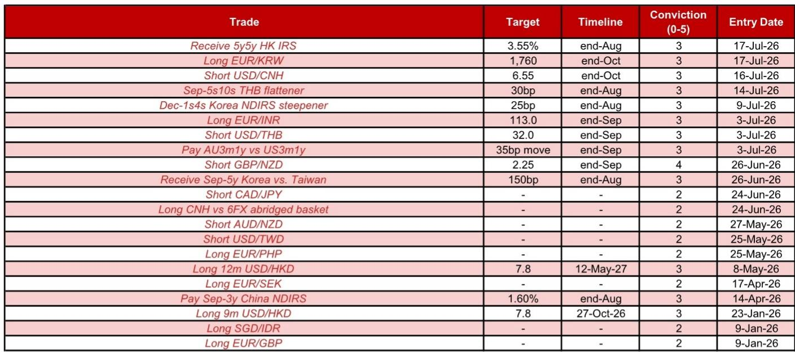

# 香港长期利率面临三项结构性因素趋同

香港5年期远期5年期港元利率互换（5y5y HK IRS）当前交易于3.83%。三项相互强化的因素——美国回报表现曲线趋平、香港贷款需求持续温和以及财政状况趋于稳定——表明这一水平可能难以持续。接受香港长期利率、目标看向3.55%的观点，基于结构性变化而非短期波动。

这不是针对某个数据点或单次政策会议的判断。这是关于未来数周香港利率结构中方向性倾向的讨论。5y5y点反映的是对下一个十年后半段利率水平的预期，对美港长期利差变化、本地信贷需求趋势以及港元计价债券的供给动态尤为敏感。目前这三项因素正朝同一方向汇聚。

时机值得关注。该观察于2026年7月17日提出，目标为8月底前达到3.55%。时间窗口虽短，但各项因素的汇聚使这一变化具有合理性。确信程度为3分（满分5分），反映了对方向性判断的信心，同时也承认油价推动美联储鹰派立场的风险。以下章节将逐一阐述每项论点的依据及其相互作用。

## 即使美联储收紧政策，美国曲线趋平也将拉低香港长期利率

最直接的驱动因素是美国国债曲线形态的变化。过去一周，股市调整与油价上涨形成了一种张力。如果股市疲软持续，美国长期利率——包括5y5y远期点——可能下降，即使美联储因油价驱动的通胀而采取更鹰派的立场。这并非矛盾，而是反映了两种不同渠道：油价通过通胀预期和美联储政策押注影响前端，而股市调整则通过风险偏好和增长预期影响长端。

香港利率与美国长端紧密相关，但利差异常宽泛。10年期港美IRS利差近期从-85个基点的低点回升至-50个基点以上。这一收窄意味着香港利率已部分重新定价了相对便宜的程度。然而，从历史标准看利差仍属宽泛，下一步走向取决于美国长端是否进一步下降。如果美国5y5y下降，香港的对应利率很可能随之走低，而已经发生的利差压缩可能加速而非限制这一变化。

关键在于，这种关系并非机械的。港美利差并非固定锚点，它反映了两个市场对久期的相对供需。当美国长期利率下降时，套利渠道会拉低香港利率，但幅度取决于本地因素。如下文所述，这些本地因素也支持利率走低。美国渠道提供了催化剂，本地渠道则提供了放大效应。

## 贷款增长温和削弱了长期利率上升的基础

第二项结构性因素是港元贷款增长未见反弹，尽管房地产价格显著回升。港元贷存比从六个月前的73.2%降至5月的71.0%。这一下降发生在按揭贷款增速从同期的1.0%加快至3.3%的背景下。表面上的矛盾——按揭需求上升但整体贷款增长下降——揭示了一个关键细节。

按揭只是贷款组合的一部分。商业贷款、贸易融资及其他企业信贷额度尚未恢复。房地产价格反弹并未引发广泛的信贷扩张。这对长期利率很重要，因为贷款增长是银行融资需求的代理指标。当银行放贷增加时，它们需要为这些贷款融资，通常通过存款或批发市场。这种需求会推高利率。当贷款增长疲弱时，融资压力缺失，利率上升的理由不足。

这对5y5y点的影响是直接的。长期互换利率反映的是对未来五年短期利率平均水平的预期。如果贷款需求持续温和，银行体系将无需激烈竞争资金，从而使整个利率结构低于原本水平。房地产市场复苏虽对抵押品价值和银行资产质量有利，但不会自动转化为更高的利率。事实上，房地产价格与贷款增长之间的背离对长期利率而言是一个偏弱的信号，因为它表明复苏并非通过信贷渠道自我维持。

## 财政储备企稳与债券发行放缓减轻了IRS曲线的供给压力

第三项因素是财政与供给侧的动态。香港财政储备自2022年以来首次恢复同比正增长。这是一个有意义的转折点。过去几年，财政轨迹一直是不确定性的来源，北部都会区等大型基建项目带来了多年投资负担。这一风险并未消失，但短期压力有所缓解。房地产价格企稳提振了印花税收入，宏观前景也提供了缓冲。

港元债券市场的供给端强化了这一改善。主要香港企业和准政府实体——包括港铁、香港机场管理局和新鸿基地产——的非金融债券发行在4月回升后有所放缓。这减少了这些实体通过交叉货币互换对冲发行的需求，进而减轻了港元交叉货币基差互换（CCS）曲线的下行压力。

这一机制是间接但重要的。当一家企业发行长期港元债券时，它通常会将所得资金互换为其他货币。该互换交易会推宽CCS。更宽的CCS随后为银行及其他市场参与者创造了在IRS市场收取固定利率的套利机会，从而压低IRS利率。非金融发行放缓消除了这一CCS下行压力的来源，但反作用力来自金融部门发行的持续强劲。银行一直是长期港元债券的活跃发行方，如果这些资金被互换，可能对CCS施加下行压力，并间接影响IRS曲线。净效果是对接受长期利率形成温和的供给侧支撑。

财政改善并非万能药。由于计划中的基建支出规模，中期前景仍不确定。但就5y5y交易而言，相关时间窗口是未来六周。在这一窗口内，财政数据是支持的，发行模式也是良性的。

## 香港长期利率定位的决策框架

对于评估这一观察的参与者，其逻辑可构建为三部分决策框架。每部分对应上述一项因素，且每项都有清晰的可观察条件，用以确认或否定论点。

首先，关注美国5y5y远期利率和港美利差。如果美国5y5y继续下降而利差保持在-50个基点以上，香港5y5y的下降空间可能超过美国对应利率。如果利差进一步收窄，这一变化将加速。如果美国长端上升，该观察面临阻力，但本地因素仍可能提供支撑。

其次，追踪港元贷款增长和贷存比。该观察的主要风险是商业贷款突然反弹。如果贷存比企稳或上升，论点将减弱。然而，当前趋势明显向下。按揭驱动的复苏尚未扩散至更广泛的信贷需求，且短期内没有证据表明会发生。

第三，关注港元债券发行节奏，尤其是金融机构的发行。如果金融部门发行加速且资金被互换，由此产生的CCS压力可能推动IRS利率走低，即使其他两项因素保持中性。这是一个加速因素而非主要驱动因素，但值得关注，因为它通过不同于宏观因素的渠道运作。

该框架并非检查清单，而是一种组织证据并识别论点在任一时刻最脆弱部分的方法。截至7月中旬，三项信号均指向同一方向。这一观察并非高确信度的押注，但具有充分依据。

*仅供参考。部分内容可能基于源材料通过AI辅助生成、翻译、摘要或编辑，可能存在遗漏或错误。请独立核实。本文不构成专业建议。*

仅供参考。部分内容可能基于源材料通过AI辅助生成、翻译、摘要或编辑，可能存在遗漏或错误。请独立核实。本文不构成专业建议。

