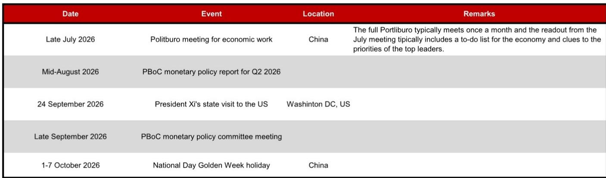
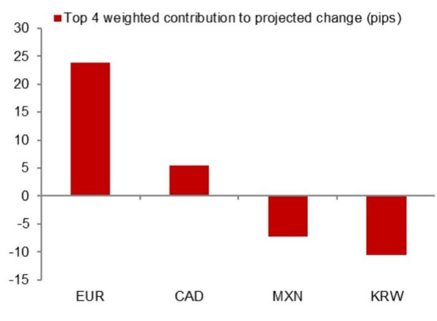

# The PBOC's Fix Model Signals a Measured Easing Bias, Not a Policy Capitulation

On 21 July 2026, the PBOC set the USD/CNY central parity rate at 6.7708, a full 240 pips lower than the previous day's fix. This is not a random adjustment. A NOM model that decomposes the fix into its constituent parts projects that without the counter-cyclical factor, the fix would have been 6.7708, while with the counter-cyclical factor, the model projects 6.7808—still 140 pips lower than the prior fix. The gap between the model's unadjusted projection and the actual fix is the key tension. It reveals that the PBOC is actively managing the pace of renminbi movement, not resisting it outright. The central bank is sending a calibrated signal: it will allow the currency to adjust to support the broader environment, but it will not permit disorderly moves that could trigger capital flight or import inflation. For observers, the question is no longer whether the PBOC will defend a level, but how fast and how far it will let the renminbi move within a controlled framework.

The timing of this signal is critical. The Politburo meeting for economic work is scheduled for late July 2026, followed by the PBOC's Q2 monetary policy report in mid-August. These events will provide the policy context for the fix trajectory. The 240-pip drop is not an isolated technical adjustment; it is a preview of the policy stance that will be articulated in the coming weeks. The PBOC is front-running its own communication, using the fix mechanism to telegraph a more accommodative bias before the formal policy documents are released. Those who treat this as a one-off currency move misread the signal. This is the opening move in a broader policy easing cycle that will be confirmed by the upcoming meetings.

The model's projection methodology reveals exactly how the PBOC is thinking. The fix is not a discretionary decision; it is a function of overnight spot movements, a basket-based smoothing rule, and a discretionary counter-cyclical factor. The model's unadjusted projection of 6.7708 implies that the mechanical basket rule alone would have justified a much larger adjustment. The fact that the actual fix landed at 6.7808—only 10 pips above the unadjusted projection—means the counter-cyclical factor is being applied with a light touch. This is a deliberate choice. A heavy-handed counter-cyclical factor would have pushed the fix closer to the previous day's level, signaling resistance to the adjustment. The light touch signals acceptance. The PBOC is using the fix as a policy instrument to guide expectations, not to fight market forces.

## The Model Error Pattern Reveals That the PBOC Is Increasingly Tolerant of Depreciation Pressure

The model's track record of errors provides a window into the PBOC's shifting tolerance. Recent model errors, as shown in Figure 2 of the report, indicate that the actual fix has been systematically deviating from the model's unadjusted projection in a direction that allows more adjustment. When the model overpredicts the fix—meaning the actual fix is lower than the model's projection—the PBOC is effectively endorsing a weaker currency. The pattern over the past several weeks suggests that these errors have become more frequent and larger in magnitude. This is not noise; it is a trend. The PBOC is no longer leaning against the wind as aggressively as it did in previous episodes of renminbi weakness. The central bank is recalibrating its tolerance threshold, accepting a lower equilibrium for the currency as part of a broader strategy to support export competitiveness and domestic demand.

This shift in tolerance has a clear economic rationale. The Chinese economy is facing headwinds from weak domestic demand, a property sector that remains under pressure, and external uncertainties tied to trade relations. A weaker renminbi acts as an automatic stabilizer: it boosts export competitiveness, raises the renminbi value of foreign exchange reserves, and provides monetary easing without cutting interest rates. The PBOC is choosing to let the currency absorb some of the adjustment burden rather than relying solely on fiscal or monetary stimulus. This is a rational policy choice, but it carries risks. If the adjustment accelerates, it could reignite capital outflows and undermine confidence in the currency. The PBOC's light touch on the counter-cyclical factor suggests it believes the current pace of adjustment is manageable and does not yet threaten financial stability.

## The Calendar of Upcoming Events Creates a Window for Further Controlled Adjustment Before Political Constraints Tighten

The sequence of events in the second half of 2026 creates a strategic window for the PBOC to engineer a controlled adjustment. The Politburo meeting in late July will set the economic agenda for the remainder of the year. The Q2 monetary policy report in mid-August will provide the technical justification for any policy shifts. Then, on 24 September, President Xi is scheduled for a state visit to the United States. The visit introduces a political constraint: a sharp adjustment of the renminbi immediately before a high-stakes diplomatic meeting would be perceived as a hostile act and could complicate trade negotiations. The PBOC is likely to front-load any desired adjustment before September, using the July and August window to adjust the fix downward while the political calendar is still clear.

This timing logic explains the magnitude of the 21 July fix. The PBOC is moving early to establish a new baseline for the currency before the political calendar becomes constraining. If the central bank waited until September, it would risk being boxed in by diplomatic considerations. By acting now, it retains flexibility. The model's projection of 6.7708, combined with the light counter-cyclical adjustment, suggests the PBOC is aiming for a gradual drift toward the 6.80-6.85 range over the next two months, with the pace calibrated to avoid triggering market panic. The 140-pip reduction from the previous fix, even after the counter-cyclical factor, is a strong signal that the PBOC is comfortable with the renminbi trading in a lower range.

## A Decision Framework for Observers: How to Interpret the Fix as a Leading Indicator of Policy Stance

The fix model can be operationalized as a real-time policy indicator. Observers should track three variables: the model's unadjusted projection, the actual fix, and the implied counter-cyclical factor. The gap between the model projection and the actual fix is the discretionary component. A widening gap—where the actual fix is significantly higher than the model projection—indicates the PBOC is resisting adjustment. A narrowing gap—where the actual fix converges toward or falls below the model projection—indicates the PBOC is accommodating adjustment. The current data shows a narrowing gap, which is a signal for the renminbi.

The second variable to monitor is the trend in model errors. If the actual fix consistently undershoots the model's projection, as has been the case recently, it confirms that the PBOC is systematically allowing more adjustment than the mechanical basket rule would imply. This is not a one-off adjustment; it is a policy shift. Observers should adjust their renminbi exposure accordingly, reducing long positions and hedging against further weakness.

The third variable is the relationship between the fix and the official spot close. The report notes that the model projection is 38 pips higher than the previous official spot close. This means the fix is being set above the closing spot rate, which is a technical signal that the PBOC is willing to let the onshore market trade weaker than the fix. In previous tightening cycles, the PBOC would set the fix below the spot close to guide the currency stronger. The reversal of this pattern is another confirmation of the easing bias.

For portfolio construction, this framework implies that the renminbi is entering a period of managed adjustment, not a free fall. The PBOC retains control through the fix mechanism, but the direction of control has shifted. Observers should expect the USD/CNY to trade in a higher range over the next two to three months, with the PBOC using the fix to smooth the adjustment rather than prevent it. The key risk to this view is a sharp deterioration in external conditions—such as a sudden escalation in trade tensions—that could force the PBOC to abandon its gradual approach and either defend the currency aggressively or let it adjust faster. The September state visit is the most likely catalyst for such a shift. Until then, the path of least resistance for the renminbi is lower, and the fix model is the most reliable tool for tracking the PBOC's evolving tolerance.

*For informational purposes only. Portions may be generated, translated, summarized, or edited with AI assistance based on source materials and may contain omissions or errors. Please verify independently. This is not professional advice.*

For informational purposes only. Portions may be generated, translated, summarized, or edited with AI assistance based on source materials and may contain omissions or errors. Please verify independently. This is not professional advice.

