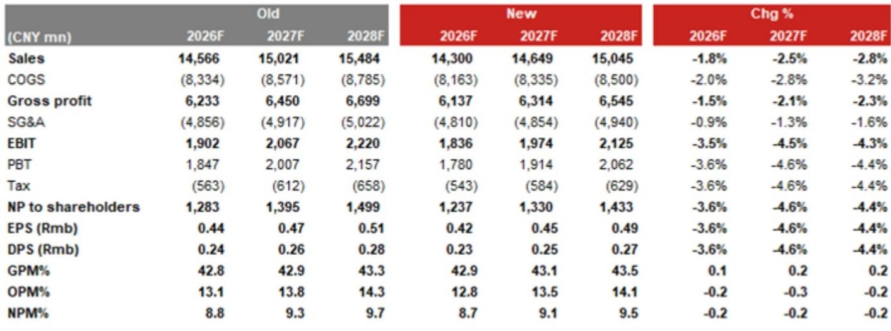
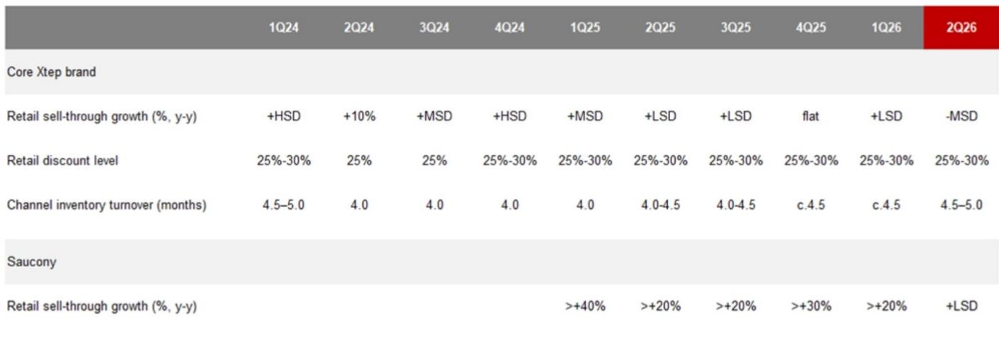
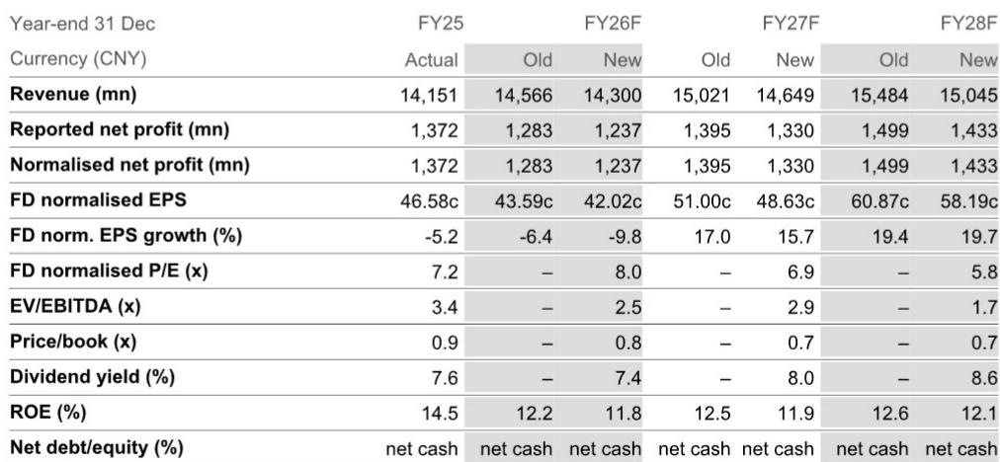

# NOM：月度与季度数据变化观察

特步国际在7月17日披露的2Q26运营数据，呈现出一个清晰信号：核心品牌增长动能有所变化。NOM在随后发布的研报中，将特步的评级从观点偏积极调整至中性。

这份研报的核心判断是，特步核心品牌在2Q26录得同比中个位数变化，导致1H26整体销售额同比仅增长低个位数。需求变化、购物中心渠道布局不足、大众市场竞争加剧以及天气因素，共同构成了销售节奏变化的原因。报告同时指出，此前增长较快的索康尼品牌，2Q26销售额同比增速也从1Q26的20%以上节奏变化至低个位数。

## 1. 核心品牌库存水平升至4.5-5.0个月

特步核心品牌在2Q26的库存周转天数从1Q26的4.5个月进一步上升至4.5-5.0个月。NOM认为，库存变化是销售增长节奏变化和为下半年预铺货共同作用的结果。从收入结构看，核心品牌的增长主要来自电商渠道、特步童装和跑步品类，线下大众市场的变化更为明显。

> **KC评论：** 库存上升本身不是孤立信号，关键要看它是否伴随折扣加深或应收账款天数拉长。报告没有展开这两个维度，但它们是判断库存质量的重要观察点。

## 2. 索康尼线上策略偏保守影响整体增速

索康尼品牌在2Q26的线上销售额出现明显回落，NOM将其归因于品牌方主动控制折扣力度、未采取激进促销策略。线下渠道方面，索康尼仍保持了20%以上的同比增长，主要得益于在购物中心核心位置开设新店以及通过社区活动维护高端消费群体。报告认为，索康尼的品牌溢价认知仍然稳固，严格的折扣管控和渠道升级是其中长期增长的基础。

## 3. 收入与盈利预测同步调整

NOM将特步FY26F收入预测调整2-3%，盈利预测调整4-5%。具体数字上，FY26F收入从145.66亿元调整至143.00亿元，正常化净利润从12.83亿元调整至12.37亿元。估值方面，接近该公司过去五年平均前瞻市盈率水平。报告同时将FY27F和FY28F的收入与盈利预测也做了相应调整。

## 4. 大众市场竞争格局变化值得持续跟踪

特步核心品牌面临的变化，部分来自大众市场整体竞争格局的变化。NOM在报告中提到，特步在购物中心渠道的曝光度相对不足，而这一渠道正聚集更多消费者流量。对于定位大众市场的运动品牌而言，渠道结构能否跟上消费场景迁移，可能比短期促销力度更影响市场份额。索康尼虽然体量较小，但其在高端渠道和品牌建设上的做法，为特步提供了一个可参照的升级路径。

这份研报没有完全展开的一个维度是，特步核心品牌在下半年的新品节奏和渠道调整计划。这些信息对判断库存消化速度和收入变化时间点至关重要。

For informational purposes only. Portions may be generated,translated,summarized,or edited with AI assistance based on source materials and may contain omissions or errors. Please verify independently. This is not investment,legal,tax,accounting,or other professional advice.

For informational purposes only. Portions may be generated,translated,summarized,or edited with AI assistance based on source materials and may contain omissions or errors. Please verify independently. This is not investment,legal,tax,accounting,or other professional advice.

