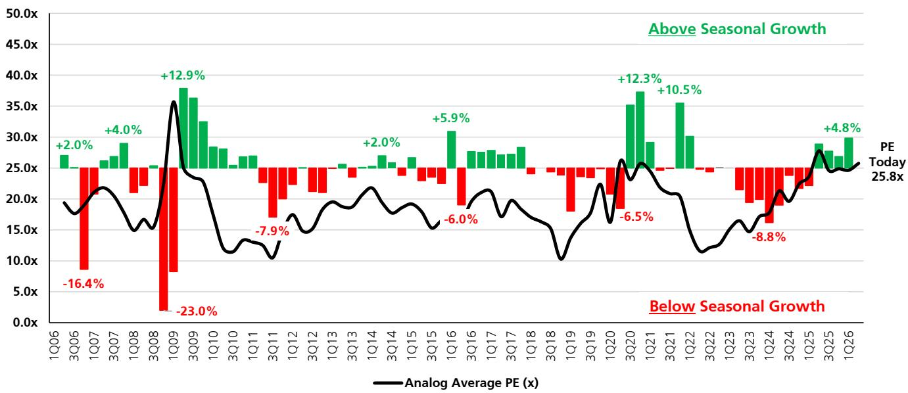
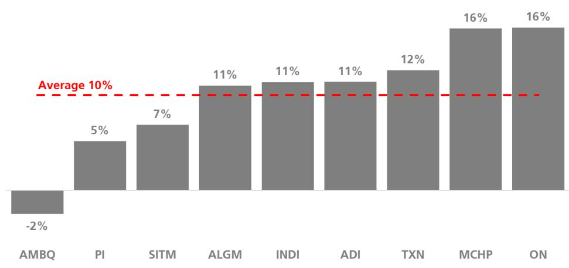
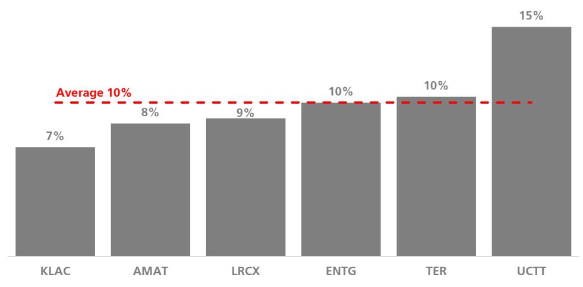

# Open-Source AI Models Are Not a Threat to Semiconductor Demand — They Are a Structural Accelerant for Memory and Compute

The release of Kimi K3 by Moonshot AI — a 2.8-trillion-parameter open-source model with a 1-million-token context window and always-on reasoning — has triggered a familiar reflex in semiconductor markets: observe first, ask questions later. Some observers recall the DeepSeek R1 adjustment and assume that cheaper, more accessible AI models will reduce the need for expensive hardware. That instinct is worth re-examining. The economic logic of open-source AI follows Jevons Paradox: as the cost of a technology falls, usage expands, and total resource consumption rises. Kimi K3 does not threaten demand for NVIDIA GPUs, HBM memory, or storage infrastructure. It amplifies it. The model's architecture is inherently more memory-intensive than frontier models because longer context windows and larger key-value cache requirements demand more HBM capacity per inference, even after quantization. The immediate read-through for semiconductor observers is not defensive — it is a call to reassess which sub-sectors benefit most from the open-source scaling curve.

The parallel to DeepSeek R1 is instructive but incomplete. R1 triggered a market adjustment because it demonstrated that frontier-level performance could be achieved with fewer parameters and more efficient training. Kimi K3 inverts that narrative: it proves that the frontier is moving upward in scale, not downward in cost-per-parameter. At 2.8 trillion parameters, K3 is the largest open-source model ever released, and it outperforms several US frontier models on specific workloads. The open-source ecosystem is not converging on a single efficient architecture; it is diverging into a spectrum of models optimized for different cost-performance trade-offs. For semiconductor companies, this means the total addressable market for inference hardware expands, because each deployment scenario — from edge to cloud to hyperscaler — will require different configurations of compute, memory, and storage. The winners will be those whose products are essential across the entire stack, not just at the frontier.

## Open-Source Models Are More Memory-Intensive Than Frontier Models, Making HBM and Storage the Structural Bottlenecks

The conventional wisdom holds that frontier labs like OpenAI and Google require the most advanced hardware because they train the largest models. That is true for training, but it misses a critical distinction for inference. Open-source models, by design, are deployed across a wider range of use cases, many of which require longer context windows and persistent reasoning states. Kimi K3's 1-million-token context window is not a niche feature — it is a signal of where the entire open-source ecosystem is heading. Longer contexts mean larger KV caches, which must be stored in HBM during inference. Even with aggressive quantization, the absolute memory footprint grows. This makes HBM not just a training bottleneck but an inference bottleneck, and it makes storage a critical enabler for checkpointing, model sharding, and retrieval-augmented generation pipelines.

The implication for Micron is straightforward: the company is positioned to generate significant cumulative free cash flow through calendar 2028, driven by the current memory tightness. That cash generation is not a cyclical anomaly — it reflects a structural shift in demand composition. Open-source deployment is more HBM-intensive than frontier deployment, and Micron has demonstrated competitive advantages in power efficiency and cost-per-bit without immediate EUV adoption in DRAM. The company has also led the 2XX-layer product transition and proven market leadership in LPDDR. The valuation comparison to SK Hynix — now only about 0.3x on a next-twelve-months EV/sales basis — is historically inconsistent with Micron's premium positioning and free cash flow profile. The company remains restricted from share repurchases until December 2026, but after that, the arithmetic is compelling: at the current stock price, Micron could potentially repurchase over 40% of its outstanding shares through year-end 2028 using all free cash flow. The open-source model trend reinforces that thesis rather than undermining it.

## The Analog Recovery Is Already Priced In at the Aggregate Level, But Dispersion Creates Opportunity for Stock Selection

The analog semiconductor cycle has now delivered four consecutive quarters of above-seasonal growth, following eight quarters of below-seasonal performance that began in the first quarter of 2023. Historical analogs from the 2009–2010 and 2020–2021 recoveries suggest that above-seasonal growth typically persists for five to eight quarters once the inflection takes place. By that measure, the current cycle still has runway. The market, however, has already priced a strong recovery into aggregate multiples. In prior cycles, the price-to-earnings multiple peaked at or before the growth inflection and compressed as above-seasonal quarters accumulated. This cycle is different: multiples have continued to expand even four quarters after the turn, reaching new highs. That behavior is rational only if observers believe the upcycle will be more sustained than history suggests — which is the correct view, given the structural demand drivers from AI, electrification, and industrial automation.

The more actionable insight lies in the dispersion within analog. The market is already identifying potential beneficiaries based on AI exposure. Allegro MicroSystems, with an estimated 20% data-center mix by calendar 2026, trades at 42x next-twelve-months earnings — a significant premium to the group. Companies with heavier exposure to automotive and industrial end markets trade closer to historical averages. This dispersion is not mispricing; it is a rational reflection of divergent growth trajectories. For observers, the question is not whether the analog recovery is real — it is whether the premium paid for AI-exposed names is justified by the duration and magnitude of that exposure, and whether the discounts on auto-industrial names offer sufficient margin of safety for a recovery that may take longer to materialize.

## Free Cash Flow Generation Across Semiconductors Is Highly Skewed, Creating a Clear Hierarchy of Capital Return Potential

Across the semiconductor coverage universe, free cash flow through calendar 2028 averages approximately 10% of current market capitalization. That average masks extreme dispersion. Memory and storage screens highest at roughly 30%, led by Micron at 47%, reflecting the view that current memory tightness will drive a step-change in cash generation. Smartphone follows at 21%, with Skyworks at 26% and Qorvo at 22%. Compute averages just 4%, with NVIDIA at 18% offset by very low figures for Intel and AMD. Analog and semicap equipment each average about 10%. Broadcom leads networking and infrastructure at 16%, with $278 billion in cumulative free cash flow — the largest absolute cash generator in the coverage outside of Micron and NVIDIA.

This hierarchy matters because it determines which companies have the balance sheet capacity to return capital to shareholders, invest in capacity expansion, or withstand a downturn. Companies with high free cash flow as a percentage of market cap are not necessarily better businesses — but they are better positioned to compound shareholder value through buybacks and dividends. The restriction on Micron's share repurchase program through December 2026 creates a temporary overhang, but the post-restriction math is powerful. For those constructing a long-term semiconductor portfolio, free cash flow yield should be a primary screening criterion, not an afterthought. The companies that generate the most cash relative to their market value are the ones that can most aggressively return capital when the cycle turns favorable.

## Crowding Data Reveals That Semiconductor Sentiment Has Pulled Back From Record Highs, But Concentration in Long Positions Remains Extreme

The UBS Quant Answers crowding factor, which ranges from -30 (short-crowded) to +30 (long-crowded), shows that overall semiconductor sentiment has tapered from record levels reached in late June. The sector average has declined from approximately +8.8 to +8.2, still well above the nine-year average of +4.5. Within the coverage, 12 of 63 stocks remain at or above +24 despite the broader drawdown. The most long-crowded names include Lam Research at +27.4, Broadcom at +26.5, Seagate at +25.8, Micron at +25.7, and AMD at +25.5. On the short-crowded side, Skyworks leads at -13.9, followed by Impinj at -11.0 and Entegris at -7.9.

The dispersion within sub-sectors tells a nuanced story. In compute, both Intel and AMD remain significantly long-crowded, while ARM and Cerebras are short-crowded. Networking sentiment has faded as Marvell has trended lower, and Astera Labs is now short-crowded. Memory and storage remain well-regarded, with Seagate and Micron the most crowded, followed closely by Western Digital. Analog sentiment has diverged: Analog Devices and ON Semiconductor have faded over the past month, while Allegro MicroSystems has improved but remains slightly short-crowded at -3.2. Semicap equipment sentiment is little changed, though Applied Materials has declined slightly, offset by an increase in KLA long-crowding. Smartphone continues to fall out of favor: Skyworks is the most short-crowded stock in the entire coverage, and Qualcomm is short-crowded for only the second time in nine years.

For observers, the crowding data serves as a contrarian signal — but only when interpreted in context. Extreme long-crowding in stocks like Micron and Broadcom reflects genuine fundamental conviction, not speculative excess. The more interesting signals are the pockets of short-crowding in names like Skyworks and Qualcomm, where the market has already priced significant downside. If the smartphone cycle stabilizes or improves, those stocks could see rapid re-rating as short positions are covered. Conversely, the persistence of extreme long-crowding in compute names like Intel and AMD — despite weak free cash flow profiles — suggests that sentiment may be disconnected from fundamentals in that sub-sector.

## A Decision Framework for Semiconductor Observers: Three Axes to Differentiate Potential Beneficiaries from Hype

The analysis above points to three structural axes that observers should use to differentiate semiconductor opportunities in the current environment. First, memory intensity: companies that benefit from the shift toward open-source models with longer context windows and larger KV caches — Micron, Samsung, SK Hynix — are positioned for sustained demand growth that is not fully reflected in current valuations. The free cash flow generation in memory and storage is the highest in the sector, and the open-source model trend reinforces that advantage. Second, free cash flow yield: companies with high free cash flow as a percentage of market cap — Micron, Skyworks, Qorvo, Broadcom — have the balance sheet capacity to compound shareholder value through buybacks and dividends, regardless of near-term cyclical volatility. Third, sentiment dispersion: stocks that are short-crowded in sub-sectors where fundamentals are stabilizing — Skyworks and Qualcomm in smartphone, Allegro in analog — offer asymmetric upside if the recovery broadens. Stocks that are long-crowded with weak free cash flow — Intel and AMD in compute — carry downside risk if sentiment normalizes.

This framework does not replace bottom-up fundamental analysis. It provides a systematic way to rank opportunities across the semiconductor universe based on three measurable, forward-looking criteria. Observers who apply it will find that the most compelling risk-reward profiles are not in the most crowded names, but in the ones where structural demand shifts, cash generation, and sentiment are misaligned. The open-source model revolution is not a threat to semiconductor demand — it is a catalyst that amplifies the importance of memory, storage, and efficient inference. The companies that serve those markets, and that generate the cash to return to shareholders, are the ones that will compound value through the next cycle.

---

*For informational purposes only. Portions may be generated, translated, summarized, or edited with AI assistance based on source materials and may contain omissions or errors. Please verify independently. This is not professional advice.*

For informational purposes only. Portions may be generated, translated, summarized, or edited with AI assistance based on source materials and may contain omissions or errors. Please verify independently. This is not professional advice.

