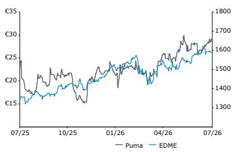
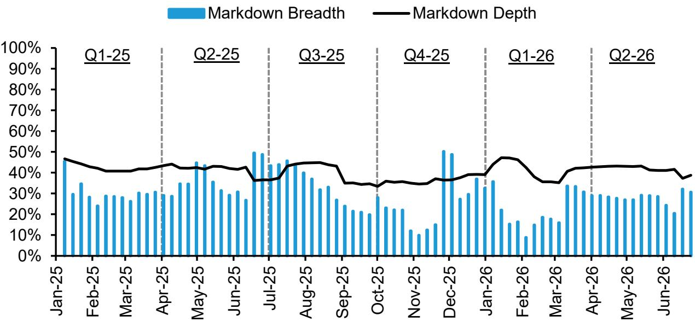
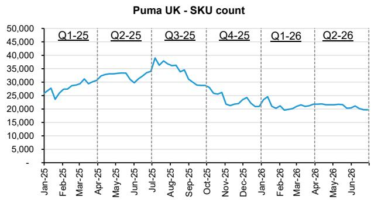
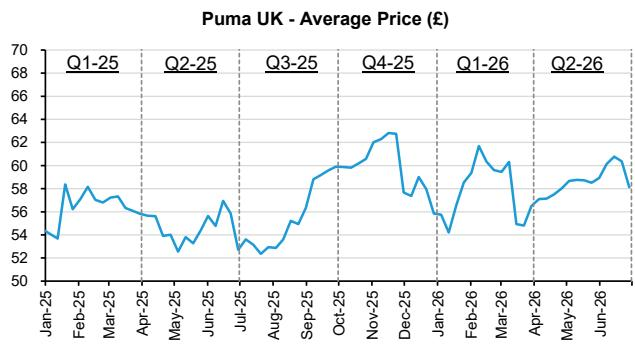

European General Retail

Puma

Rating
Outperform

Price Target

PUM.GR

## 35.00 EUR

William Woods
+44 20 7676 6806
william.woods@bernsteinsg.com

Richard Trainor
+44 20 7762 1050
richard.trainor@bernsteinsg.com

Alice Buckley
+44 20 7676 6739
alice.buckley@bernsteinsg.com

Rhea Gudiwala
+44 20 7676 7293
rhea.gudiwala@bernsteinsg.com

## Puma: Inventory analysis - good progress on inventory purr-ge

Puma has been clearing its inventory since its H1-26 results as a key part of its turnaround strategy. We refresh our analysis from Feb -26 (see note here) to track Puma's progress 1 year later. Into the Puma's H1-26 print on $31^{\text{st}}$ July (preview here), we expect continued positive commentary on Puma's inventory clearance, but think it will be more important to now start hearing about the path to brand revival and product innovation pipeline once inventory is in a good place.

1) SKU count continues to decline across DTC and wholesale channels, reflecting solid inventory clearance progress, particularly in the UK. Puma's UK DTC SKU count is down almost 50% from the Jul-25 peak. Meanwhile, wholesale partners have seen SKU rationalization, particularly at retailers such as JD Sports and Size?, as Puma tries to regain control of its brand perception with a more targeted assortment.

2) The US remains behind the UK in the clearance cycle, but progress through wholesale channels is encouraging. SKU count on Puma's US DTC platform has continued to rise versus Feb-26, suggesting Puma is still buying back excess inventory. Plus, SKU counts across key US partners have fallen, implying Puma is successfully consolidating inventory and the next stage will be to clear this stock through its own channels, mirroring the UK trajectory.

3) Puma is increasingly focusing on assortment quality, with weaker franchises being cut and key growth franchises emphasised. Across both DTC and wholesale channels, Puma has narrowed assortments and removed/marked-down less popular franchises, e.g. Mostro continues to be heavily discounted, while the core Speedcat assortment is narrower, but there are newer variations (e.g., ballets, mules and wedges) instead.

<table><tr><td>Performance</td><td>YTD</td><td>1M</td><td>6M</td><td>12M</td></tr><tr><td>Absolute (%)</td><td>31.0</td><td>4.0</td><td>36.8</td><td>33.3</td></tr><tr><td>EDME (%)</td><td>8.0</td><td>0.6</td><td>6.2</td><td>17.5</td></tr><tr><td>Relative (%)</td><td>23.1</td><td>3.4</td><td>30.6</td><td>15.8</td></tr></table>

Source: Bloomberg, Bernstein estimates and analysis.

<table><tr><td>Close Date</td><td>17 Jul 2026</td></tr><tr><td>PUM.GR Close Price (EUR)</td><td>28.48</td></tr><tr><td>Price Target (EUR)</td><td>35.00</td></tr><tr><td>Upside/(Downside)</td><td>23%</td></tr><tr><td>52-Week Range</td><td>30.31/15.30</td></tr><tr><td>EDME</td><td>1,587.83</td></tr><tr><td>FYE</td><td>Dec</td></tr><tr><td>Div Yield</td><td>NA</td></tr><tr><td>Market Cap (EUR) (M)</td><td>4,325</td></tr><tr><td>EV (EUR) (M)</td><td>6,347</td></tr></table>

Price Performance, 1YR

## Research Implications

We rate Puma Outperform with a target price of €35, based on current market multiples and an average of a PE (14x) and EV/EBIT (13x) applied to our NTM+2 estimates.

Source: Bloomberg, Bernstein estimates and analysis.

<table><tr><td>Adjusted EPS</td><td>F25A</td><td>F26E</td><td>F27E</td><td>Financials</td><td>F25A</td><td>F26E</td><td>F27E</td><td>CAGR</td></tr><tr><td>PUM.GR (EUR)</td><td>(4.36)</td><td>(1.42)</td><td>1.23</td><td>Revenues (M)</td><td>7,296</td><td>6,958</td><td>7,793</td><td>--</td></tr><tr><td></td><td></td><td></td><td></td><td>EBIT (M)</td><td>(369.50)</td><td>(6.62)</td><td>374.07</td><td>--</td></tr><tr><td></td><td></td><td></td><td></td><td>FCF (M)</td><td>(892.30)</td><td>82.99</td><td>60.84</td><td>--</td></tr><tr><td></td><td></td><td></td><td></td><td>Revenues growth (%)</td><td>(17.3)</td><td>(4.6)</td><td>12.0</td><td>--</td></tr><tr><td></td><td></td><td></td><td></td><td>EBIT Margin (%)</td><td>(5.1)</td><td>(0.1)</td><td>4.8</td><td>--</td></tr></table>

<table><tr><td>Valuation Metrics</td><td>F25A</td><td>F26E</td><td>F27E</td></tr><tr><td>Adjusted P/E (x)</td><td>(6.5)</td><td>(20.1)</td><td>23.1</td></tr><tr><td>Reported P/E (x)</td><td>(6.5)</td><td>(20.1)</td><td>23.1</td></tr></table>

## DETAILS

## PROGRESS TO DATE

\- DTC shows good progress in reducing SKU count in the UK, with numbers down almost -50% since peaks in Jul-25, when management initially announced the strategic turnaround, and progress continues to look strong. Management at Q1-26 results highlighted they saw better-than-expected sell-through during Q1 on inventory they had previously written off. We see SKU count come down more slowly through Q2 (Exhibit 2) as the remainder of the inventory is of lower quality and likely reflects the unpopular SKUs that are much more difficult to clear. The US lags the UK in the inventory clearance cycle, as SKU count on Puma's US DTC platform continues to rise (+7% vs. Jul-25), indicating Puma is likely still in the phase of buying bank inventory from its wholesale partners, and has yet to clear this excess via its own channels.

\- SKU count has come down considerably across most retail partners since Jul-25, reflecting a good cadence of inventory buyback by Puma. By retailer, Footlocker US appears to be the furthest ahead in the inventory clearance cycle, with SKU count coming down c. -80% from Jul-25 to Jan-26 (Exhibit 27), before ticking back up, suggesting the bulk of the low quality SKU's have been sold, and the uptick in SKUs could reflect a broadening of the assortment with more desirable SKUs. Similarly, the SKU count at Finish Line has come down all the way down (Exhibit 30), and we would expect this to start inflecting again over the next 3-6 months as Puma improves its decision-making on SKU allocation to retailers. On the other hands, Dick's Sporting Goods seems further behind on this curve with SKU count reduction of c. -20% (Exhibit 24), although this is on the highest base given Dick's is one of the biggest wholesale partners for Puma in the US. This all points to promising inventory clearance either via the wholesale channel, or the buyback in order for Puma to clear via its own distribution channels.

\- In the UK, we see similar trends, with Footlocker's SKU count down c. -50% since the start of 2025 (Exhibit 15), suggesting good progress. The next step would be to better consolidate the SKU count and work on refining the assortment. For Sports Direct, which we view as a less attractive wholesale partner, clearance appears to be a little slower, with SKU count starting to tick back up and going slightly above the c. 9,000 SKUs in Jul-25 (Exhibit 18). We would highlight this remains of the most stuffed retailers Puma works with and therefore continue to expect slow progress.

\- When we break down pricing, specifically depth and breadth of discounting to look at Puma's DTC approach to selling excess inventory (Exhibit 1 and Exhibit 8), there is a key difference between the UK and the US, whereby markdown depth in the UK is greater than markdown breadth, whereas we see the opposite in the US (i.e., markdown breadth is greater than markdown depth). This suggests that in the UK, Puma's assortment has fewer, less desirable SKUs and therefore less of a need to discount broadly, with a focus instead on a higher markdown % to encourage purchases.

\- In the UK, markdown breadth has taken a step-up on Puma DTC since our last update in Feb-25, although the level of this remains reasonably constant, with the assortment seeing markdowns of c. -40%. Similarly, in the US, markdowns have increased as a proportion of the assortment, climbing to and average of 60% in the last 12 weeks vs. an average of 53% since 2025 (until Q2-26).

\- Across the wholesalers, the discounting picture has change slightly, where markdown breadth is decreasing, particularly with US retail partners such as Footlocker, Finish Line and Academy Sports now discounting across a much smaller proportion of their assortment (c. 15-20% vs. 50-60% previously) as the inventory buyback progresses. In the UK, this is slightly more varied as Footlocker now discounts across <20% of the assortment, but retains the same level of discount (c. -40%), whilst Sports Direct sees limited change with c. 90% of SKUs being marked-down.

## FRANCHISE BREAKDOWN

Illustratively, we compare Puma's DTC assortment and discounting on its website compared to its distribution partners to gauge a perspective of what SKU count and discounting looked like in Oct-25/Feb-26 vs. Jul-26 across key Puma franchises in lifestyle, football and running.

Looking at Puma's DTC assortment ([REFERENCE NOT FOUND] ; excluding outlets), the proportion of shoes being discounted has come up from $8\%$ in Feb-26 to $26\%$ in Jul-26. We think broadly reflects the next leg of the inventory clearance to get rid of all the more difficult to move, less desirable stock. As a result of which, greater discounting is needed.

\- At an individual franchise level, within lifestyle, Mostros have seen the highest proportion of SKUs being discounted ( $>80\%$ , with a markdown of c. $50 - 60\%$ ), likely due to the greater need to clear this franchise, which is arguably the least accessible to a broad-based audience in terms of fashionability (Exhibit 11). Across the rest of the lifestyle franchise, markdown have broadly come down (as % of SKUs), with only one Palermo and one Speedcat with a discount on it. However, we note that the number of Speedcat SKUs has come down considerably (c. $-60\%$ ) as there has been a narrowing of the original range, and then supplemented by other models of the Speedcat such as the ballets, mules and wedges, which we have excluded as they weren't part of our original comparison base. We think this is a good way for Puma to develop its brand heat by building on a franchise which continues to gain traction, but adding new versions to ensure newness. Overall, the lifestyle segment of Puma's assortment looks more appealing, with another less popular franchise (VS1) no longer available on the platform.

\- Looking at football, discounting has gone up. A greater proportion of football shoes are being discounted (almost 40% of all boots), which suggests this could be the next key segment to focus the inventory clearance on as good progress appears to have been made in lifestyle. Plus, the number of football boots SKUs has come up 12%, likely reflecting additional SKUs which have been bought back from retail partners. By franchise, Ultra sees the greatest breadth of discounting, followed by Future and King, reflecting the same trend as we saw in Feb-26 and therefore suggests the clearance momentum continues.

\- The picture for running shoes is similar - the total number of SKUs has gone up (c. +25%), with markdowns on c. 17% of the assortment (up vs. no promotions on running shoes in our last update). Running is a key segment for Puma to grow in and drive brand heat, as there has been considerable innovation in this space. We note that the markdowns are on older versions of various shoes rather than newer arrivals, which is positive as it suggests the newly developed shoes have good momentum and the discounting is likely on shoes that have been purchased from retail partners.

Across other retailers, the picture looks more mixed, and we think Puma is at different stages of its inventory management/buyback from its partners.

\- For example, if we look at Footlocker, who only sell lifestyle shoes, 25% of Speedcat SKUs are on sale, but none of the Suedes have markdowns. This is a continuation of the trend seen in Feb-26, although breadth of Speedcat markdowns has come up. We think this reflects a ramp up in the inventory clearance, as Puma works to ensure there is a very select assortment with its retail partners.

\- At JD Sports, there has been a significant reduction in the lifestyle segment of the assortment, with two further franchises being pulled from the site (Rider and Mostro) as these are less popular and do not drive sufficient Puma brand heat, alongside not being as aligned with JD's fashionability proposition. For Speedcats, the number of SKUs has come down from 8 to 2, and both of these are being marked down. However, this is because they have been replaced by the Speedcat ballets (16 SKUs), which have been growing in popularity and are arguably more fashionable. We consider JD to be a higher quality retailer and strong partner to help build Puma's brand heat and longer term brand equity in the lifestyle segment

\- In football, markdown breadth has taken a step-up as the SKU count has been rationalized (c. -55% since Feb-26) as this is less of a JD focus, and we think a good indication of Puma's brand strength will be reflected by its Lifestyle collection with JD rather than football, as it is not a specialist retailer.

\- Looking at Size?, we see a similar trend to JD Sports, where markdowns have climbed as a proportion of the assortment, but broadly reflecting the rationalization of the SKU count (c. -80%). This suggests Puma's clearance is working well and indicates a good cadence in inventory buyback, to get rid of undesirable SKUs and better control the Puma brand narrative with its partners.

EXHIBIT 1: Puma UK - Markdown Breadth and Markdon Depth %  
Puma UK - Markdown Breadth and Markdown Depth (%)  
  
Source: Exabel, Bernstein analysis

EXHIBIT 2: Puma UK - SKU count  
  
Source: Exabel, Bernstein analysis

EXHIBIT 3: Puma UK - Average Price (£)  
  
Source: Exabel, Bernstein analysis

DTC (UK)  
EXHIBIT 4: Puma DTC SKU count by franchise

<table><tr><td colspan="6">DTC</td></tr><tr><td>Date</td><td>Category</td><td>Franchise</td><td>Total SKUs</td><td>Discounted SKU count</td><td>% discounted</td></tr><tr><td rowspan="14">16/10/25</td><td rowspan="8">Lifestyle</td><td>Speedcat</td><td>82</td><td>10</td><td>12%</td></tr><tr><td>Palermo</td><td>46</td><td>18</td><td>39%</td></tr><tr><td>Mostro</td><td>53</td><td>1</td><td>2%</td></tr><tr><td>H-street</td><td>7</td><td>0</td><td>0%</td></tr><tr><td>Inhale</td><td>17</td><td>16</td><td>94%</td></tr><tr><td>Rider</td><td>19</td><td>9</td><td>47%</td></tr><tr><td>Suede</td><td>24</td><td>3</td><td>13%</td></tr><tr><td>VS1</td><td>4</td><td>0</td><td>0%</td></tr><tr><td rowspan="3">Football</td><td>Future</td><td>94</td><td>17</td><td>18%</td></tr><tr><td>Ultra</td><td>95</td><td>17</td><td>18%</td></tr><tr><td>King</td><td>34</td><td>12</td><td>35%</td></tr><tr><td rowspan="3">Running</td><td>Deviate</td><td>38</td><td>0</td><td>0%</td></tr><tr><td>Velocity</td><td>18</td><td>0</td><td>0%</td></tr><tr><td>Magmax</td><td>16</td><td>0</td><td>0%</td></tr></table>

## FOOTLOCKER (UK)

EXHIBIT 5: Puma franchise SKU count on Footlocker site

<table><tr><td colspan="6">Footlocker</td></tr><tr><td>Date</td><td>Category</td><td>Franchise</td><td>Total SKUs</td><td>Discounted SKU count</td><td>% discounted</td></tr><tr><td rowspan="14">16/10/25</td><td rowspan="8">Lifestyle</td><td>Speedcat</td><td>18</td><td>6</td><td>33%</td></tr><tr><td>Palermo</td><td>5</td><td>5</td><td>100%</td></tr><tr><td>Mostro</td><td></td><td></td><td></td></tr><tr><td>H-street</td><td></td><td></td><td></td></tr><tr><td>Inhale</td><td></td><td></td><td></td></tr><tr><td>Rider</td><td>10</td><td>10</td><td>100%</td></tr><tr><td>Suede</td><td>15</td><td>15</td><td>100%</td></tr><tr><td>VS1</td><td></td><td></td><td></td></tr><tr><td rowspan="3">Football</td><td>Future</td><td></td><td></td><td></td></tr><tr><td>Ultra</td><td></td><td></td><td></td></tr><tr><td>King</td><td></td><td></td><td></td></tr><tr><td rowspan="3">Running</td><td>Deviate</td><td></td><td></td><td></td></tr><tr><td>Velocity</td><td></td><td></td><td></td></tr><tr><td>Magmax</td><td></td><td></td><td></td></tr></table>

<table><tr><td colspan="6">DTC</td></tr><tr><td>Date</td><td>Category</td><td>Franchise</td><td>Total SKUs</td><td>Discounted SKU count</td><td>% discounted</td></tr><tr><td rowspan="14">02/02/26</td><td rowspan="8">Lifestyle</td><td>Speedcat</td><td>83</td><td>4</td><td>5%</td></tr><tr><td>Palermo</td><td>18</td><td>1</td><td>6%</td></tr><tr><td>Mostro</td><td>38</td><td>4</td><td>11%</td></tr><tr><td>H-street</td><td>11</td><td>0</td><td>0%</td></tr><tr><td>Inhale</td><td></td><td></td><td></td></tr><tr><td>Rider</td><td></td><td></td><td></td></tr><tr><td>Suede</td><td>22</td><td>2</td><td>9%</td></tr><tr><td>VS1</td><td>4</td><td>0</td><td>0%</td></tr><tr><td rowspan="3">Football</td><td>Future</td><td>59</td><td>9</td><td>15%</td></tr><tr><td>Ultra</td><td>61</td><td>17</td><td>28%</td></tr><tr><td>King</td><td>29</td><td>1</td><td>3%</td></tr><tr><td rowspan="3">Running</td><td>Deviate</td><td>50</td><td>0</td><td>0%</td></tr><tr><td>Velocity</td><td>31</td><td>0</td><td>0%</td></tr><tr><td>Magmax</td><td>42</td><td>0</td><td>0%</td></tr></table>

<table><tr><td colspan="6">Footlocker</td></tr><tr><td>Date</td><td>Category</td><td>Franchise</td><td>Total SKUs</td><td>Discounted SKU count</td><td>% discounted</td></tr><tr><td rowspan="14">02/02/26</td><td rowspan="8">Lifestyle</td><td>Speedcat</td><td>27</td><td>3</td><td>11%</td></tr><tr><td>Palermo</td><td></td><td></td><td></td></tr><tr><td>Mostro</td><td></td><td></td><td></td></tr><tr><td>H-street</td><td></td><td></td><td></td></tr><tr><td>Inhale</td><td>1</td><td>0</td><td>0%</td></tr><tr><td>Rider</td><td></td><td></td><td></td></tr><tr><td>Suede</td><td>2</td><td>0</td><td>0%</td></tr><tr><td>VS1</td><td></td><td></td><td></td></tr><tr><td rowspan="3">Football</td><td>Future</td><td></td><td></td><td></td></tr><tr><td>Ultra</td><td></td><td></td><td></td></tr><tr><td>King</td><td></td><td></td><td></td></tr><tr><td rowspan="3">Running</td><td>Deviate</td><td></td><td></td><td></td></tr><tr><td>Velocity</td><td></td><td></td><td></td></tr><tr><td>Magmax</td><td></td><td></td><td></td></tr></table>

<table><tr><td colspan="6">DTC</td></tr><tr><td>Date</td><td>Category</td><td>Franchise</td><td>Total SKUs</td><td>Discounted SKU count</td><td>% discounted</td></tr><tr><td rowspan="14">10/07/26</td><td rowspan="8">Lifestyle</td><td>Speedcat</td><td>35</td><td>1</td><td>3%</td></tr><tr><td>Palermo</td><td>25</td><td>1</td><td>4%</td></tr><tr><td>Mostro</td><td>38</td><td>31</td><td>82%</td></tr><tr><td>H-street</td><td>21</td><td>3</td><td>14%</td></tr><tr><td>Inhale</td><td></td><td></td><td></td></tr><tr><td>Rider</td><td></td><td></td><td></td></tr><tr><td>Suede</td><td>54</td><td>1</td><td>2%</td></tr><tr><td>VS1</td><td></td><td></td><td></td></tr><tr><td rowspan="3">Football</td><td>Future</td><td>67</td><td>26</td><td>39%</td></tr><tr><td>Ultra</td><td>69</td><td>34</td><td>49%</td></tr><tr><td>King</td><td>31</td><td>8</td><td>26%</td></tr><tr><td rowspan="3">Running</td><td>Deviate</td><td>83</td><td>9</td><td>11%</td></tr><tr><td>Velocity</td><td>33</td><td>8</td><td>24%</td></tr><tr><td>Magmax</td><td>39</td><td>9</td><td>23%</td></tr></table>

Source: Company website, Bernstein analysis

<table><tr><td colspan="6">Footlocker</td></tr><tr><td>Date</td><td>Category</td><td>Franchise</td><td>Total SKUs</td><td>Discounted SKU count</td><td>% discounted</td></tr><tr><td rowspan="14">10/07/26</td><td rowspan="8">Lifestyle</td><td>Speedcat</td><td>20</td><td>5</td><td>25%</td></tr><tr><td>Palermo</td><td></td><td></td><td></td></tr><tr><td>Mostro</td><td>1</td><td>0</td><td>0%</td></tr><tr><td>H-street</td><td></td><td></td><td></td></tr><tr><td>Inhale</td><td></td><td></td><td></td></tr><tr><td>Rider</td><td></td><td></td><td></td></tr><tr><td>Suede</td><td>14</td><td>0</td><td>0%</td></tr><tr><td>VS1</td><td></td><td></td><td></td></tr><tr><td rowspan="3">Football</td><td>Future</td><td></td><td></td><td></td></tr><tr><td>Ultra</td><td></td><td></td><td></td></tr><tr><td>King</td><td></td><td></td><td></td></tr><tr><td rowspan="3">Running</td><td>Deviate</td><td></td><td></td><td></td></tr><tr><td>Velocity</td><td></td><td></td><td></td></tr><tr><td>Magmax</td><td></td><td></td><td></td></tr></table>

Source: Company website, Bernstein analysis

## JD SPORTS (UK)

EXHIBIT 6: Puma franchise SKU count JD Sports site

<table><tr><td colspan="6">JD Sports</td></tr><tr><td>Date</td><td>Category</td><td>Franchise</td><td>Total SKUs</td><td>Discounted SKU count</td><td>% discounted</td></tr><tr><td rowspan="14">16/10/25</td><td rowspan="8">Lifestyle</td><td>Speedcat</td><td>29</td><td>14</td><td>48%</td></tr><tr><td>Palermo</td><td>5</td><td>2</td><td>40%</td></tr><tr><td>Mostro</td><td>17</td><td>6</td><td>35%</td></tr><tr><td>H-street</td><td></td><td></td><td></td></tr><tr><td>Inhale</td><td></td><td></td><td></td></tr><tr><td>Rider</td><td></td><td></td><td></td></tr><tr><td>Suede</td><td>3</td><td>1</td><td>33%</td></tr><tr><td>VS1</td><td></td><td></td><td></td></tr><tr><td rowspan="3">Football</td><td>Future</td><td>33</td><td>8</td><td>24%</td></tr><tr><td>Ultra</td><td>31</td><td>13</td><td>42%</td></tr><tr><td>King</td><td>5</td><td>5</td><td>100%</td></tr><tr><td rowspan="3">Running</td><td>Deviate</td><td></td><td></td><td></td></tr><tr><td>Velocity</td><td>3</td><td>0</td><td>0%</td></tr><tr><td>Magmax</td><td></td><td></td><td></td></tr></table>

SIZE? (UK)  
EXHIBIT 7: Puma franchise SKU count by on Size? site

<table><tr><td colspan="6">Size?</td></tr><tr><td>Date</td><td>Category</td><td>Franchise</td><td>Total SKUs</td><td>Discounted SKU count</td><td>% discounted</td></tr><tr><td rowspan="14">16/10/25</td><td rowspan="8">Lifestyle</td><td>Speedcat</td><td>39</td><td>21</td><td>54%</td></tr><tr><td>Palermo</td><td>3</td><td>2</td><td>67%</td></tr><tr><td>Mostro</td><td>46</td><td>25</td><td>54%</td></tr><tr><td>H-street</td><td>6</td><td>0</td><td>0%</td></tr><tr><td>Inhale</td><td>6</td><td>4</td><td>67%</td></tr><tr><td>Rider</td><td></td><td></td><td></td></tr><tr><td>Suede</td><td>3</td><td>3</td><td>100%</td></tr><tr><td>VS1</td><td></td><td></td><td></td></tr><tr><td rowspan="3">Football</td><td>Future</td><td></td><td></td><td></td></tr><tr><td>Ultra</td><td></td><td></td><td></td></tr><tr><td>King</td><td>6</td><td>2</td><td>33%</td></tr><tr><td rowspan="3">Running</td><td>Deviate</td><td></td><td></td><td></td></tr><tr><td>Velocity</td><td></td><td></td><td></td></tr><tr><td>Magmax</td><td></td><td></td><td></td></tr></table>

<table><tr><td colspan="6">JD Sports</td></tr><tr><td>Date</td><td>Category</td><td>Franchise</td><td>Total SKUs</td><td>Discounted SKU count</td><td>% discounted</td></tr><tr><td rowspan="14">02/02/26</td><td rowspan="8">Lifestyle</td><td>Speedcat</td><td>8</td><td>6</td><td>75%</td></tr><tr><td>Palermo</td><td></td><td></td><td></td></tr><tr><td>Mostro</td><td>4</td><td>4</td><td>100%</td></tr><tr><td>H-street</td><td></td><td></td><td></td></tr><tr><td>Inhale</td><td></td><td></td><td></td></tr><tr><td>
