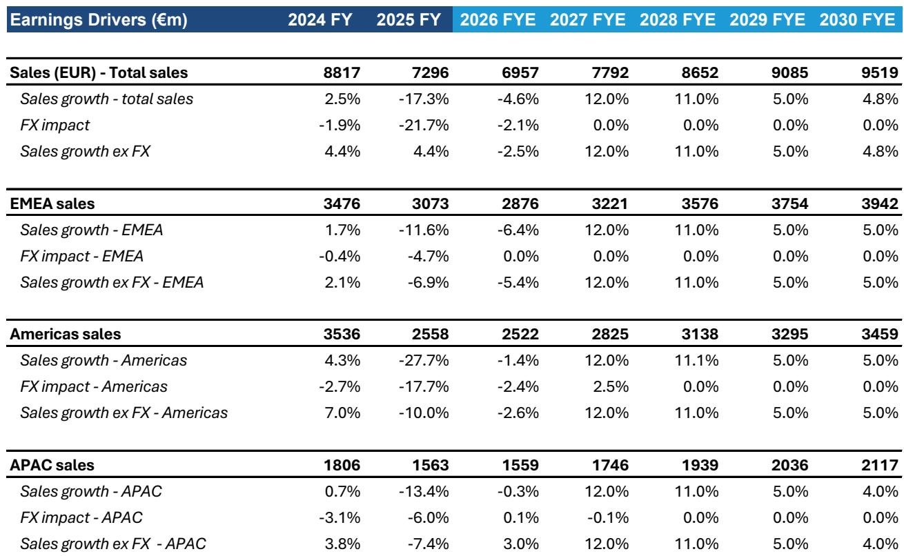
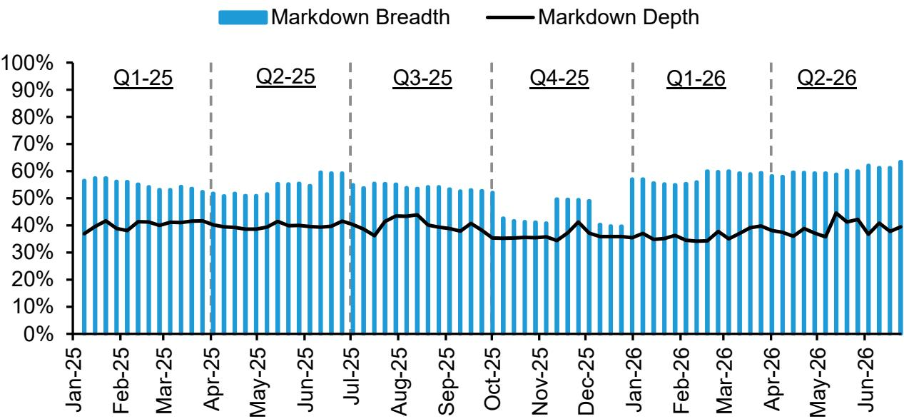
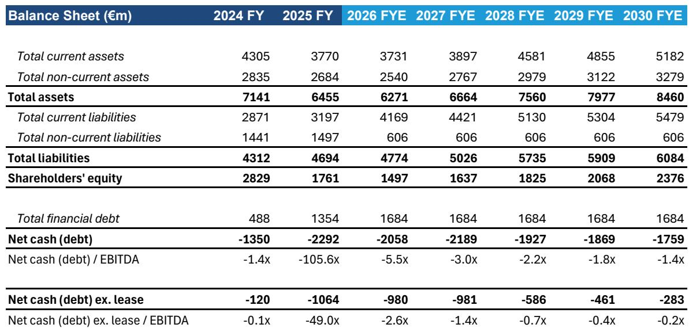

# Puma’s Inventory Clearance Is Working, But the Hardest Part of the Turnaround Has Yet to Begin

Puma has cut its UK direct-to-consumer SKU count by nearly 50% from its July 2025 peak, a dramatic reduction that signals real progress in the inventory clearance phase of its turnaround. But this achievement obscures a more difficult truth: the company is still buying back excess inventory from US wholesale partners, its DTC discounting breadth in the US has climbed to 60% of assortment, and the most challenging work — rebuilding brand heat through product innovation — remains ahead. The next six months will determine whether Puma can convert a cleaner balance sheet into a sustainable growth trajectory, or whether it becomes trapped in a cycle of clearance-driven revenue.

The company’s H1-26 results, expected on July 31, will likely feature continued positive commentary on inventory reduction. Observers should pay closer attention to what management says about the path to brand revival. Clearance is necessary, but it is not a strategy. The real question is whether Puma can deploy the operational and financial breathing room from inventory normalization toward a product pipeline that reignites consumer demand across its core lifestyle, football, and running franchises.

## The UK Clearance Cycle Is Nearing Completion, Revealing a Template for the US

Puma’s UK DTC operation has made the most visible progress. SKU counts have declined steadily since the July 2025 peak, with the pace slowing through Q2 2026 as the remaining inventory consists of less desirable items that are inherently harder to clear. This deceleration is not a sign of failure; it is the natural shape of a clearance curve where the low-hanging fruit — popular sizes and styles — sells first, leaving a tail of slower-moving stock that requires deeper discounts to move.

The UK discounting pattern confirms this interpretation. Markdown depth in the UK exceeds markdown breadth, meaning Puma is applying steeper discounts to a narrower set of products rather than spreading shallow discounts across the entire assortment. This is the correct approach for a mature clearance cycle: focus promotional intensity on the residual unpopular SKUs while protecting the pricing integrity of the core franchise lineup.

The US tells a different story. SKU counts on Puma’s US DTC platform have continued to rise, up 7% from July 2025 levels. This increase reflects the ongoing buyback of excess inventory from wholesale partners — a necessary step before Puma can begin clearing that stock through its own channels. The US is roughly where the UK was six to nine months ago. Markdown breadth in the US has climbed to an average of 60% over the last 12 weeks, compared to 53% since the start of 2025, indicating that Puma is still in the broad-discounting phase of clearance rather than the targeted-discounting phase.

The implication is clear: the US cycle will follow the UK trajectory, but it will take time. Observers should expect continued attention on US gross margins through at least the next two quarters as Puma works through the buyback inventory. The positive signal will come when US DTC SKU counts begin to decline and markdown breadth starts to narrow, mirroring the UK pattern.

## Wholesale Partner Data Reveals a Tiered Recovery That Favors Selective Retailers

Not all wholesale partners are progressing at the same pace, and the divergence contains meaningful signals about Puma’s future distribution strategy. Footlocker US has moved furthest through the clearance cycle, with SKU counts down approximately 80% from July 2025 to January 2026 before ticking back up. This uptick likely reflects a strategic broadening of the assortment with more desirable SKUs, not a reversal of clearance progress. Finish Line shows a similar pattern, with SKU counts declining through the floor and expected to inflect upward over the next three to six months as Puma improves its allocation decisions.

Dick’s Sporting Goods, one of Puma’s largest US wholesale partners, is further behind, with SKU count reduction of only about 20%. This slower progress is partly a function of the higher base — Dick’s carries more Puma SKUs than any other US partner — but it also suggests that Puma’s inventory buyback and assortment rationalization efforts are less advanced with this retailer. The gap between Footlocker and Dick’s creates a potential execution risk: if Puma cannot bring Dick’s along at a similar pace, it may face uneven patterns across its US wholesale network.

In the UK, the picture is equally stratified. Footlocker UK has reduced SKU counts by approximately 50% since the start of 2025, representing good progress. Sports Direct, which the analysis characterizes as a less attractive wholesale partner, has seen SKU counts tick back up, slightly exceeding the July 2025 level of around 9,000 SKUs. Sports Direct remains one of the most inventory-dense retailers in Puma’s network, and the slow clearance there suggests that Puma may need to reevaluate the strategic value of this partnership. A retailer that cannot or will not rationalize its assortment is unlikely to support the brand positioning Puma needs to achieve.

JD Sports and Size? present a more encouraging picture. Both have seen significant SKU rationalization — approximately 55% and 80% reductions, respectively — and have pulled weaker franchises from their sites. JD Sports has removed Rider and Mostro from its lifestyle assortment entirely, replacing the original Speedcat range with 16 SKUs of the Speedcat ballet variation. This is precisely the kind of curation that builds brand heat: fewer, more desirable products sold through a higher-quality retail partner. The markdown breadth has increased as a proportion of the rationalized assortment, but that is a mathematical consequence of having fewer total SKUs, not a sign of deteriorating pricing discipline.

## Assortment Quality Is Improving, But the Franchise Mix Reveals a Two-Speed Portfolio

Puma’s DTC franchise analysis shows a portfolio that is being reshaped around winners and losers. The Mostro franchise continues to be heavily discounted, with over 80% of SKUs marked down by 50-60%. This franchise is arguably the least accessible to a broad audience in terms of fashionability, and the deep discounting suggests Puma is trying to clear it entirely. The VS1 franchise has been removed from the platform altogether. These are rational decisions: cut the franchises that do not generate brand heat or consumer pull.

The Speedcat franchise tells a more complex story. The number of original Speedcat SKUs has declined by approximately 60%, but this narrowing has been supplemented by new variations — ballets, mules, and wedges — that were not part of the original comparison base. This is a smart strategic move: build on a franchise that continues to gain traction while introducing newness to sustain consumer interest. The Speedcat ballet, in particular, appears to be gaining popularity and is now carried by JD Sports, which is a positive signal for brand heat.

Football and running present different challenges. Football boot SKU counts have increased 12%, likely reflecting inventory bought back from retail partners, and almost 40% of all football boots are now discounted. The Ultra franchise shows the greatest breadth of discounting, followed by Future and King, continuing the pattern seen in February 2026. Running SKU counts have increased approximately 25%, with markdowns on about 17% of the assortment, up from zero promotions in the previous analysis. The critical nuance is that the markdowns are on older versions of running shoes, not new arrivals. This suggests that Puma’s newer running innovations have good momentum and that the discounting is a function of inventory buyback, not weak product.

The franchise-level data points to a two-speed portfolio. Lifestyle, led by Speedcat and its new variations, is gaining traction and benefiting from selective assortment management. Football and running are still in clearance mode, with elevated SKU counts and broader discounting. The next phase of the turnaround will require Puma to demonstrate that it can launch compelling new products in football and running that do not immediately end up on the discount rack.

## A Decision Framework for Observers: Tracking the Transition from Clearance to Brand Revival

For those trying to assess Puma’s trajectory, the key metric is not the absolute level of inventory but the composition of the clearance and the signals of brand revival. The following framework translates the operational data into strategic inflection points.

First, monitor the US DTC SKU count trajectory. When US DTC SKU counts begin to decline, it will signal that Puma has completed the buyback phase and is now clearing inventory through its own channels. This should be accompanied by a shift from broad discounting to deep discounting — the US pattern should start to resemble the current UK pattern. A decline in US markdown breadth from the current 60% level toward 40% or below would be a leading indicator that the clearance cycle is maturing.

Second, track the discounting pattern on the Speedcat franchise across wholesale partners. If Footlocker and JD Sports continue to reduce Speedcat markdown breadth while introducing the new variations at full price, it will confirm that the franchise has genuine consumer pull. If Speedcat discounting broadens, it would suggest that the initial heat is fading and that the new variations are not compensating for the reduced original assortment.

Third, watch the football and running SKU counts for signs of inflection. A decline in football and running SKU counts, combined with a reduction in discounting breadth, would indicate that Puma has cleared the buyback inventory and is now operating with a leaner, more desirable assortment in these categories. Flat or rising SKU counts with persistent discounting would suggest that the inventory problem in these segments is structural, not cyclical.

Fourth, evaluate the pace of new product introductions. Puma’s ability to launch compelling new products in football and running — and to keep them off the discount rack — will be the ultimate test of whether the inventory clearance has created genuine strategic value. A clean balance sheet is worthless if it is filled with products that cannot sell at full price.

The risk is that Puma clears its inventory only to find that it has cleared consumer interest along with it. The reward is that a leaner, more curated assortment, combined with genuine product innovation, can restore the brand’s pricing power and growth trajectory. The next two quarters will separate these two outcomes.

*For informational purposes only. Portions may be generated, translated, summarized, or edited with AI assistance based on source materials and may contain omissions or errors. Please verify independently. This is not professional advice.*

For informational purposes only. Portions may be generated, translated, summarized, or edited with AI assistance based on source materials and may contain omissions or errors. Please verify independently. This is not professional advice.

