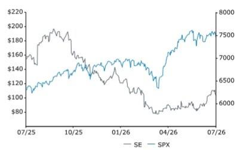
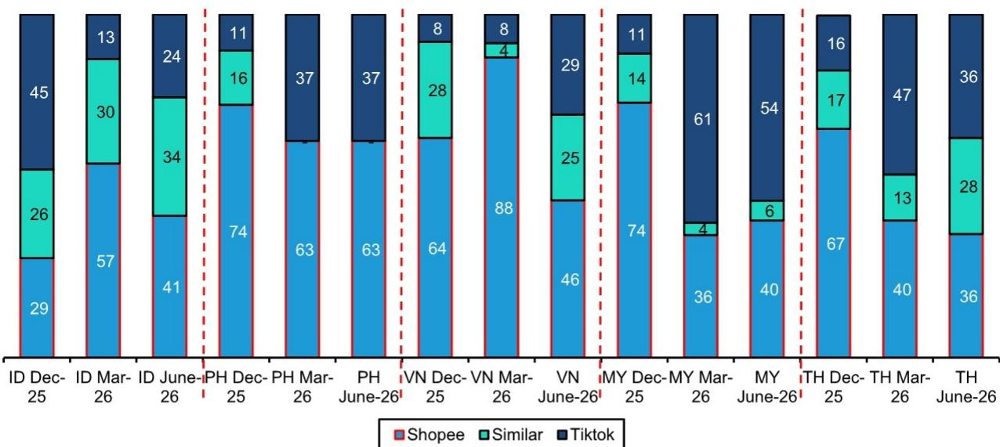
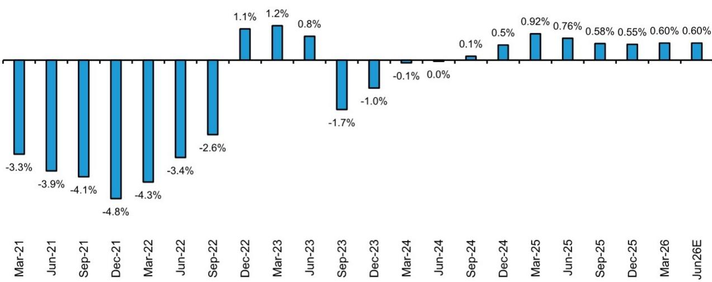
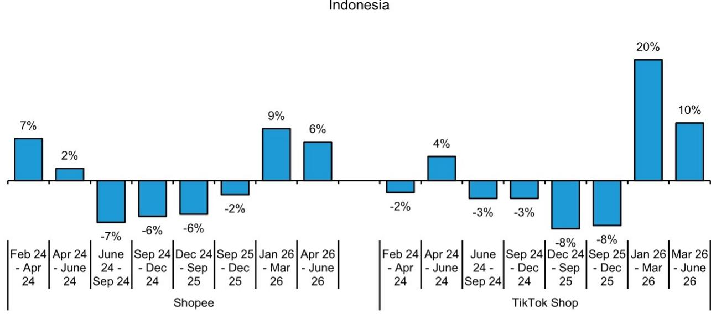
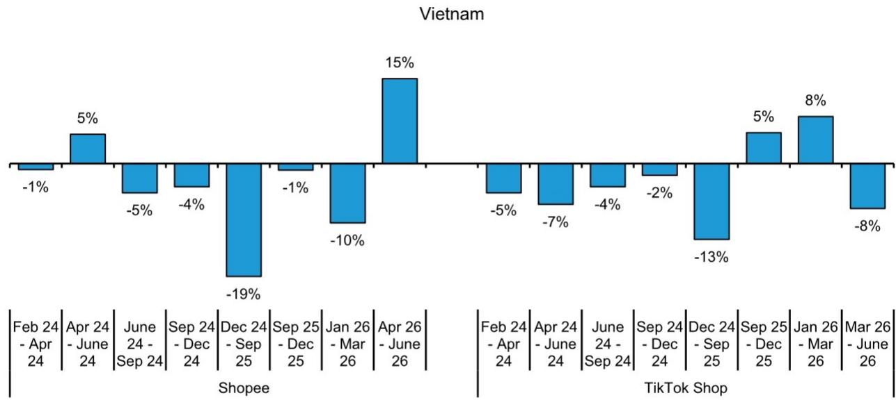
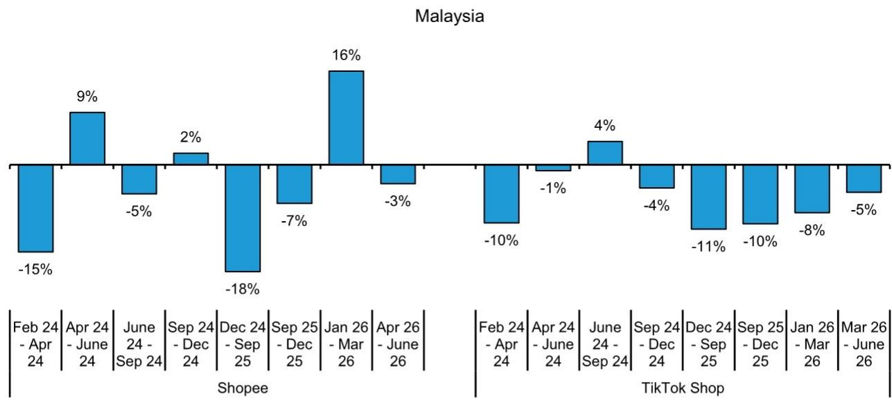
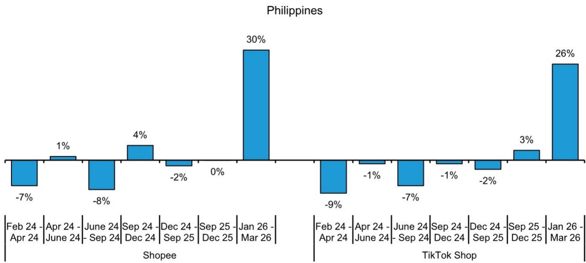
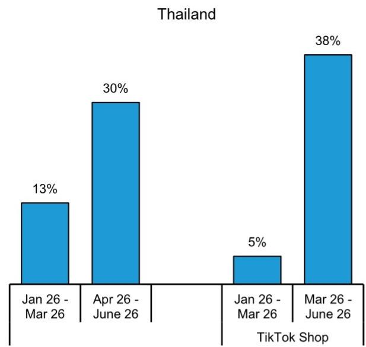
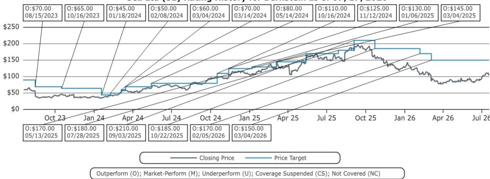

# Sea Ltd: E-commerce landscape update, signals remain constructive

## Key observations

How intense is the e-commerce environment in Southeast Asia? We share findings based on recent field checks.

Our proprietary pricing tracker, which monitors a consistent set of products across platforms, continues to indicate an industry leaning toward discipline rather than disruption. In the March quarter, prices rose broadly as merchants adjusted to higher logistics costs. Notably, both Shopee and TikTok Shop moved in the same direction. Rather than competing for every order, they appeared increasingly focused on protecting their economics. Sea's subsequent margin improvement only reinforced that narrative.

The latest three months tell a similar story. Prices are still rising across most markets, though the source of the change has shifted. Previously, higher prices came from increases in post-discount listing prices. Today, the lift is coming less from what sellers ask and more from what platforms give away. Vouchers are becoming less prominent, and consumers are paying a little closer to sticker price.

Yet the two are following different approaches. Shopee has kept headline prices largely unchanged while quietly reducing coupon subsidies, allowing realized selling prices to climb. TikTok Shop has also eased promotional intensity, but softer delivery charges have absorbed much of the impact, leaving consumer prices comparatively contained. This has resulted in Shopee appearing less often as the cheapest platform relative to TikTok Shop. But the gap is not wide and hence does not represent any major change in competitive intensity. While growth focus remains, we are seeing attempts to keep margins intact.

<table><tr><td>Close Date</td><td></td><td></td><td colspan="2">17 Jul 2026</td></tr><tr><td>SE Close Price (USD)</td><td></td><td></td><td colspan="2">104.05</td></tr><tr><td>Price Target (USD)</td><td></td><td></td><td colspan="2">150.00</td></tr><tr><td>Upside/(Downside)</td><td></td><td></td><td colspan="2">44%</td></tr><tr><td>52-Week Range</td><td></td><td></td><td colspan="2">199.30/77.05</td></tr><tr><td>SPX</td><td></td><td></td><td colspan="2">7,457.69</td></tr><tr><td>FYE</td><td></td><td></td><td colspan="2">Dec</td></tr><tr><td>Div Yield</td><td></td><td></td><td colspan="2">NA</td></tr><tr><td>Market Cap (USD) (M)</td><td></td><td></td><td colspan="2">63,729</td></tr><tr><td>EV (USD) (M)</td><td></td><td></td><td colspan="2">56,901</td></tr><tr><td>Performance</td><td>YTD</td><td>1M</td><td>6M</td><td>12M</td></tr><tr><td>Absolute (%)</td><td>(18.4)</td><td>14.5</td><td>(14.3)</td><td>(37.7)</td></tr><tr><td>SPX (%)</td><td>8.9</td><td>0.5</td><td>7.5</td><td>18.4</td></tr><tr><td>Relative (%)</td><td>(27.4)</td><td>14.0</td><td>(21.8)</td><td>(56.1)</td></tr><tr><td colspan="5">Source: Bloomberg, Bernstein estimates and analysis.</td></tr></table>

Price Performance, 1YR

## Research Implications

Overall, with most pricing changes modest and still directionally upward, we continue to view the market backdrop as supportive of margin stability.

<table><tr><td>Adjusted EPS</td><td>F24A</td><td>F25E</td><td>F26E</td></tr><tr><td>SE (USD)</td><td>0.77</td><td>2.71</td><td>3.39</td></tr></table>

<table><tr><td>Financials</td><td>F24A</td><td>F25E</td><td>F26E</td><td>CAGR</td></tr><tr><td>Revenues (M)</td><td>16,820</td><td>22,938</td><td>27,489</td><td>--</td></tr><tr><td>Operating Earnings (M)</td><td>662.21</td><td>1,985</td><td>2,363</td><td>--</td></tr><tr><td>Net Earnings (M)</td><td>447.88</td><td>1,611</td><td>2,053</td><td>--</td></tr></table>

<table><tr><td>Valuation Metrics</td><td>F24A</td><td>F25E</td><td>F26E</td></tr><tr><td>Adjusted P/E (x)</td><td>134.8</td><td>38.4</td><td>30.7</td></tr><tr><td>EV/EBITDA (x)</td><td>29.0</td><td>16.6</td><td>15.7</td></tr><tr><td>P/Sales (x)</td><td>3.7</td><td>2.7</td><td>2.3</td></tr><tr><td>EV/Sales (x)</td><td>3.4</td><td>2.5</td><td>2.1</td></tr></table>

## DETAILS

Price increases continued across ASEAN this quarter, although the drivers differed from those observed previously. Shopee kept listing prices broadly stable across markets, generally within a range of -5% to +5%, but sharply reduced coupon discounts, resulting in higher final consumer prices. This approach should be margin accretive, even if it comes at the expense of some headline growth. TikTok Shop took a different route. While it also reduced coupon discounts, the impact was largely offset by lower delivery charges paid by consumers, helping limit increases in final prices across several markets. Listing discounts meanwhile recovered after declining last quarter, potentially reflecting improving merchant confidence as concerns around elevated fuel costs eased.

These differing approaches translated into changes in relative competitiveness. The proportion of products priced cheaper on Shopee declined across all markets in our sample, reflecting the sharper increase in final prices on the platform. However, this does not appear to signal a meaningful shift in competitive intensity. Last quarter, we highlighted the platforms' ability to pass through higher costs, particularly fuel-related increases linked to the MENA situation. The latest data suggests a continuation of that trend, albeit through different mechanisms. After nearly two years of persistent price declines, Sea appears increasingly focused on balancing growth with margin improvement, while TikTok Shop remains more focused on protecting consumer value by offsetting lower vouchering with reduced delivery charges.

Despite the narrowing of its pricing advantage, Sea remains more competitively priced than TikTok Shop across most ASEAN markets in our sample. Vietnam was the only exception, where a sharper cut in TikTok Shop prices allowed it to regain some ground, although Sea remains more competitive overall. Across the rest of the region, higher price increases on Shopee shifted relative pricing modestly in TikTok Shop's favor, but Sea remains either the cheaper platform or broadly at parity in most markets. Overall, the data points to rational pricing behavior rather than any meaningful escalation in competition.

EXHIBIT 1: Mix of products cheaper in a platform  
  
ID: Indonesia; PH: Phillipines; VN: Vietnam; MY: Malaysia; TH: Thailand  
Source: Bernstein Proprietary survey, Bernstein Analysis and Estimates

EXHIBIT 2: April- June 2026: Change in final product prices was in the -5% to 30% range for Sea compared to -10% to 40% for Tiktok shop

<table><tr><td colspan="7">Shopee vs TikTok shop - Change in final product prices</td></tr><tr><td>Shopee</td><td>Product price before discount</td><td>Listing discount</td><td>Listing Price</td><td>Coupon discount</td><td>Delivery charges</td><td>Final product price</td></tr><tr><td>Indonesia</td><td>13%</td><td>24%</td><td>6%</td><td>-11%</td><td>-6%</td><td>6%</td></tr><tr><td>Malaysia</td><td>-4%</td><td>-2%</td><td>-4%</td><td>-6%</td><td>-2%</td><td>-3%</td></tr><tr><td>Vietnam</td><td>1%</td><td>12%</td><td>-2%</td><td>-30%</td><td>-2%</td><td>15%</td></tr><tr><td>Thailand</td><td>16%</td><td>29%</td><td>5%</td><td>-17%</td><td>0%</td><td>30%</td></tr><tr><td colspan="7"></td></tr><tr><td>Tik Tok Shop</td><td>Product price before discount</td><td>Listing discount</td><td>Listing Price</td><td>Coupon discount</td><td>Delivery charges</td><td>Final product price</td></tr><tr><td>Indonesia</td><td>15%</td><td>26%</td><td>10%</td><td>-33%</td><td>-34%</td><td>10%</td></tr><tr><td>Malaysia</td><td>-5%</td><td>14%</td><td>-16%</td><td>-49%</td><td>-32%</td><td>-5%</td></tr><tr><td>Vietnam</td><td>-1%</td><td>18%</td><td>-8%</td><td>-1%</td><td>-1%</td><td>-8%</td></tr><tr><td>Thailand</td><td>10%</td><td>-11%</td><td>17%</td><td>-100%</td><td>-10%</td><td>38%</td></tr></table>

Source: Bernstein Proprietary survey, Bernstein Analysis and Estimates

## ECOMMERCE MARGINS

E-commerce margins at Sea Ltd have improved materially over the years, but have largely remained within a similar range over the past few quarters (September to March). This plateau reflects a deliberate choice to prioritize growth, with investments accelerating in logistics and customer acquisition. The key question has been whether margins could change further, particularly if TikTok Shop adopts a more aggressive stance. However, both our view and market consensus are that margins should remain resilient despite ongoing investments. Recent price increases also suggest there may be scope for modest margin expansion ahead.

EXHIBIT 3: Sea ltd : Ecommerce margins (EBITDA to GMV ratio)

Sea Ecommerce - EBITDA to GMV

  
Source: Company Data, Bernstein Analysis and Estimates

## APPENDIX - FINANCIAL FORECASTS

EXHIBIT 4: April - June 2026: Coupon discount and delivery charges form a very small part of the original prices, while listing discounts majorly dominate the price trends

<table><tr><td colspan="7">Weight of individual components in the original product price</td></tr><tr><td>Shopee</td><td>Product price before discount</td><td>Listing discount</td><td>Listing Price</td><td>Coupon discount</td><td>Delivery charges</td><td>Final product price</td></tr><tr><td>Indonesia</td><td>100%</td><td>-41%</td><td>59%</td><td>-1%</td><td>2%</td><td>59%</td></tr><tr><td>Malaysia</td><td>100%</td><td>-43%</td><td>57%</td><td>-14%</td><td>13%</td><td>55%</td></tr><tr><td>Philippines</td><td>100%</td><td>-44%</td><td>56%</td><td>-6%</td><td>6%</td><td>56%</td></tr><tr><td>Veitnam</td><td>100%</td><td>-22%</td><td>78%</td><td>-24%</td><td>11%</td><td>65%</td></tr><tr><td colspan="7"></td></tr><tr><td>TikTok Shop</td><td>Product price before discount</td><td>Listing discount</td><td>Listing Price</td><td>Coupon discount</td><td>Delivery charges</td><td>Final product price</td></tr><tr><td>Indonesia</td><td>100%</td><td>-35%</td><td>65%</td><td>-3%</td><td>3%</td><td>65%</td></tr><tr><td>Malaysia</td><td>100%</td><td>-42%</td><td>58%</td><td>-12%</td><td>7%</td><td>53%</td></tr><tr><td>Philippines</td><td>100%</td><td>-39%</td><td>61%</td><td>-7%</td><td>7%</td><td>61%</td></tr><tr><td>Veitnam</td><td>100%</td><td>-30%</td><td>70%</td><td>-10%</td><td>10%</td><td>70%</td></tr></table>

Source: Bernstein Proprietary survey, Bernstein Analysis and Estimates

EXHIBIT 5: Indonesia - Average change in final prices for Shopee and TikTok shop  
  
Source: Bernstein Proprietary survey, Bernstein Analysis and Estimates

EXHIBIT 6: Vietnam - Average change in final prices for Shopee and TikTok shop  
  
Source: Bernstein Proprietary survey, Bernstein Analysis and Estimates

EXHIBIT 7: Malaysia - Average change in final prices for Shopee and TikTok shop  
  
Source: Bernstein Proprietary survey, Bernstein Analysis and Estimates

EXHIBIT 8: Philippines - Average change in final prices for Shopee and TikTok shop  
  
Source: Bernstein Proprietary survey, Bernstein Analysis and Estimates

EXHIBIT 9: Thailand - Average change in final prices for Shopee and TikTok shop  
  
Source: Bernstein Proprietary survey, Bernstein Analysis and Estimates

EXHIBIT 10: Sea Limited - Financial Summary

<table><tr><td>P&amp;L (US$ mn)</td><td>CY23</td><td>CY24</td><td>CY25E</td><td>CY26E</td></tr><tr><td>Ecommerce GMV</td><td>78,620</td><td>100,702</td><td>127,374</td><td>156,577</td></tr><tr><td>Take rate (%)</td><td>10.2</td><td>11.0</td><td>11.6</td><td>12.0</td></tr><tr><td>Digital Entertainment gross booking</td><td>1,794</td><td>2,149</td><td>2,949</td><td>2,911</td></tr><tr><td>Financial services TPV</td><td>29,204</td><td>37,094</td><td>55,200</td><td>74,073</td></tr><tr><td>Income Statement</td><td colspan="4"></td></tr><tr><td>Revenue</td><td colspan="4"></td></tr><tr><td>Digital Entertainment services</td><td>2,172</td><td>1,911</td><td>2,409</td><td>2,682</td></tr><tr><td>Ecommerce</td><td>9,001</td><td>12,415</td><td>16,571</td><td>20,750</td></tr><tr><td>Digital Financial services</td><td>1,759</td><td>2,368</td><td>3,792</td><td>3,857</td></tr><tr><td>Others</td><td>131</td><td>126</td><td>167</td><td>200</td></tr><tr><td>Consolidated revenues</td><td>13,064</td><td>16,820</td><td>22,938</td><td>27,489</td></tr><tr><td>Revenue growth (%)</td><td>4.9</td><td>28.8</td><td>36.4</td><td>19.8</td></tr><tr><td>Gross profit</td><td>5,834</td><td>7,205</td><td>10,244</td><td>12,069</td></tr><tr><td>Operating Income</td><td>225</td><td>662</td><td>1,985</td><td>2,363</td></tr><tr><td>Operating income margin (%)</td><td>1.72</td><td>3.94</td><td>8.65</td><td>8.60</td></tr><tr><td>Digital Entertainment</td><td>1,178</td><td>979</td><td>1,184</td><td>1,363</td></tr><tr><td>Ecommerce</td><td>(550)</td><td>(139)</td><td>581</td><td>606</td></tr><tr><td>Financial services</td><td>490</td><td>657</td><td>973</td><td>1,135</td></tr><tr><td>Others/unallocable</td><td>(893)</td><td>(835)</td><td>(713)</td><td>(741)</td></tr><tr><td>Adjusted EBITDA</td><td>1,185</td><td>1,962</td><td>3,437</td><td>3,633</td></tr><tr><td>Pre-tax income</td><td>432</td><td>779</td><td>2,281</td><td>2,763</td></tr><tr><td>Tax</td><td>263</td><td>321</td><td>651</td><td>691</td></tr><tr><td>Net income</td><td>151</td><td>448</td><td>1,611</td><td>2,053</td></tr><tr><td>PAT margin (%)</td><td>1.2</td><td>2.7</td><td>7.0</td><td>7.5</td></tr><tr><td>EPS (basic) - US$/share</td><td>0.3</td><td>0.8</td><td>2.7</td><td>3.4</td></tr><tr><td>Outstanding shares (mn)</td><td>599</td><td>599</td><td>599</td><td>599</td></tr><tr><td>ROE</td><td>2.3</td><td>5.3</td><td>15.2</td><td>15.4</td></tr><tr><td>Balance Sheet</td><td colspan="4"></td></tr><tr><td>Shareholders Funds</td><td>6,594</td><td>8,372</td><td>10,608</td><td>13,349</td></tr><tr><td>Debt+convertible</td><td>3,368</td><td>3,007</td><td>1,819</td><td>380</td></tr><tr><td>Cash flows</td><td colspan="4"></td></tr><tr><td>Operating cash flow</td><td>2,080</td><td>3,277</td><td>1,989</td><td>1,468</td></tr><tr><td>Capex</td><td>(258)</td><td>(322)</td><td>(400)</td><td>(400)</td></tr></table>

Source: Company Data, Bernstein Analysis and Estimates

## BERNSTEIN TICKER TABLE

<table><tr><td colspan="3"></td><td rowspan="2">17 Jul 2026 Closing Price Target</td><td rowspan="2">Price</td><td rowspan="2">TTM Rel. Perf.</td><td colspan="4">Adjusted EPS</td><td colspan="3">Adjusted P/E (x)</td></tr><tr><td>Ticker</td><td>Rating</td><td>Cur</td><td>Cur</td><td>2024A</td><td>2025E</td><td>2026E</td><td>2024A</td><td>2025E</td><td>2026E</td></tr><tr><td>SE (Sea Ltd)</td><td>O</td><td>USD</td><td>104.05</td><td>150.00</td><td>(56.1)%</td><td>USD</td><td>0.77</td><td>2.71</td><td>3.39</td><td>134.8</td><td>38.4</td><td>30.7</td></tr><tr><td>SPX</td><td></td><td></td><td>7,457.69</td><td></td><td></td><td></td><td></td><td></td><td></td><td></td><td></td><td></td></tr></table>

O - Outperform, M - Market-Perform, U - Underperform, NR - Not Rated, CS - Coverage Suspended  
Source: Bloomberg, Bernstein estimates and analysis.

## I. REQUIRED DISCLOSURES

References to "Bernstein" or the "Firm" in these disclosures relate to the following entities: Bernstein Institutional Services LLC (April 1, 2024 onwards), Bernstein & Co., LLC (pre April 1, 2024), Bernstein Autonomous LLP, BSG France S.A. (April 1, 2024 onwards), Bernstein (Hong Kong) Limited 盛博香港有限公司, Bernstein (Canada) Limited, Bernstein (India) Private Limited (SEBI registration no. INH000006378), Bernstein (Singapore) Private Limited, Bernstein Japan KK (サンフォード・C・バーンスタイン株式会社) and analysts employed by SG Africa Technologies & Services to produce Bernstein under a Global Services Agreement in place between Bernstein and SG.

Bernstein is part of a joint venture between SG (SG) and AllianceBernstein, L.P. (AB). Unless specifically noted otherwise, for purposes of these disclosures, references to Bernstein's "affiliates" relate to both SG and AB and their respective affiliates.

## VALUATION METHODOLOGY

## Sea Ltd

We value Sea Ltd at a target price of \$150 using DCF valuations (11.5% discount rate, 2% terminal growth and explicit forecasts until CY35). Revenue and EBITDA growth built in our DCF model from CY24-CY35E are 10%/10% CAGR.

## RISKS

## Sea Ltd

Sea Ltd has significant dependence on one game - FreeFire, hence a moderation in active user base as they move to other games is a key risk. In the ecommerce business inability to increase take rates and elevated S&M expenses as competition fights back to retain share are key risks. In the DFS segment, while it will scale up its payment wallet, we see risk from an inability to scale up its lending book and other services which is where we believe that profitability is higher.

## RATINGS DEFINITIONS, BENCHMARKS AND DISTRIBUTION

## EQUITY RATINGS DEFINITIONS

## Bernstein brand

The Bernstein brand rates stocks based on forecasts of relative performance for the next 12 months versus the S&P 500 for stocks listed on the U.S. and Canadian exchanges, versus the Bloomberg Europe Developed Markets Large and Mid Cap Price Return Index EUR (EDME) for stocks listed on the European exchanges and emerging markets exchanges outside of the Asia Pacific region, versus the Bloomberg Japan Large and Mid Cap Price Return Index USD (JPL) for stocks listed on the Japanese exchanges, and versus the Bloomberg Asia ex-Japan Large and Mid Cap Price Return Index (ASIAX) for stocks listed on the Asian (ex-Japan) exchanges -unless otherwise specified.

The Bernstein brand has three categories of ratings:

\- Outperform: Stock will outpace the market index by more than 15 pp

• Market-Perform: Stock will perform in line with the market index to within +/-15 pp

\- Underperform: Stock will trail the performance of the market index by more than 15 pp

Coverage Suspended: Coverage of a company under the Bernstein brand has been suspended. Ratings and price targets are suspended temporarily, are no longer current, and should therefore not be relied upon.

Not Rated: A rating assigned when the stock cannot be accurately valued, or the performance of the company accurately predicted, at the present time. The covering analyst may continue to publish research reports on the company to update investors on events and developments.

Not Covered (NC) denotes companies that are not under coverage.

Bernstein brand stock ratings are based on a 12-month time horizon.

## Autonomous brand – common stocks

The Autonomous brand rates common stocks as indicated below. As our benchmarks we use the Bloomberg Europe 600 Financials Price Return Index (E600BK) and Bloomberg Europe Dev Mkt Financials Large and Mid Cap Price Ret Index EUR (EDMFI) index for developed European banks and Payments, the Bloomberg Europe 600 Insurance Price Return Index (E600IN) for European insurers, the S&P 500 and S&P Financials for US banks and Payments coverage, S5LIFE for US Insurance, the S&P Insurance Select Industry (SPSIINS) for US Non-Life Insurers coverage, and the Bloomberg Emerging Markets Financials Large, Mid and Small Cap Price Return Index (EMLSF) for emerging market banks and insurers and Payments. Ratings are stated relative to the sector (not the market).

The Autonomous brand has three categories of common stock ratings:

\- Outperform (OP): Stock will outpace the relevant index by more than 10 pp

\- Neutral (N): Stock will perform in line with the market index to within +/-10 pp

• Underperform (UP): Stock will trail the performance of the relevant index by more than 10 pp

Coverage Suspended: Coverage of a company under the Autonomous research brand has been suspended. Ratings and price targets are suspended temporarily, are no longer current, and should therefore not be relied upon.

Not Rated: A rating assigned when the stock cannot be accurately valued, or the performance of the company accurately predicted, at the present time. The covering analyst may continue to publish research reports on the company to update investors on events and developments.

Those denoted as 'Feature' (e.g., Feature Outperform FOP, Feature Under Outperform FUP) are our core ideas.

Not Covered (NC) denotes companies that are not under coverage.

Autonomous brand common stock ratings are based on a 12-month time horizon.

## Autonomous brand – preferred stocks

The Autonomous brand has three categories of preferred stock ratings:

\- Outperform (OP): The total return of the preferred instrument is expected to outperform preferred securities of other issuers operating in similar sectors or rating categories over the next six months.

\- Neutral (N): The total return of the preferred instrument is expected to perform in line with preferred securities of other issuers operating in similar sectors or rating categories over the next six months.

\- Underperform (UP): The total return of the preferred instrument is expected to underperform preferred securities of other issuers operating in similar sectors or rating categories over the next six months.

Autonomous preferred stock ratings are based on a 6-month time horizon.

## AUTONOMOUS CREDIT RESEARCH

Where this report contains investment recommendations for credit instruments, as defined in article 3(1)(35) of the Market Abuse Regulation, the information below is presented to comply with its disclosure requirements.

The report may also include reference(s) to published opinions by other Autonomous or Bernstein analysts covering the equity securities of the issuer(s) referenced herein. Please note an investment recommendation for credit instruments published by the author(s) of this report may differ from the published view of the analyst covering equity securities for the issuer(s) contained in this report and vice versa.

## CREDIT RATINGS DEFINITIONS

The Autonomous brand has three categories of credit ratings:

\- Credit Outperform (C-OP): The total return of the Reference Credit Instrument is expected to outperform the credit spread of bonds of other issuers operating in similar sectors or rating categories over the next six months.

\- Credit Neutral (C-N): The total return of the Reference Credit Instrument is expected to perform in line with the credit spread of bonds of other issuers operating in similar sectors or rating categories over the next six months.

\- Credit Underperform (C-UP): The total return of the Reference Credit Instrument is expected to underperform the credit spread of bonds of other issuers operating in similar sectors or rating categories over the next six months.

Autonomous credit ratings are based on a 6-month time horizon.

A list of all investment recommendations produced by the author(s) of this report alongside credit ratings history are available upon request.

It is at the sole discretion of the Firm as to when to initiate, update and cease research coverage. The Firm has established, maintains and relies on information barriers to control the flow of information contained in one or more areas (i.e. the private side) within the Firm, and into other areas, units, groups or affiliates (i.e. public side) of the Firm

## DISTRIBUTION OF EQUITY RATINGS/INVESTMENT BANKING SERVICES

<table><tr><td>Equity Rating</td><td>Market Abuse Regulation (MAR) and FINRA Rating Category</td><td>Global Rating Distribution</td><td>Investment Banking Relationships*</td></tr><tr><td>Outperform</td><td>BUY</td><td>51.2%</td><td>15.3%</td></tr><tr><td>Market-Perform (Bernstein Brand) Neutral (Autonomous Brand)</td><td>HOLD</td><td>35.8%</td><td>16.2%</td></tr><tr><td>Underperform</td><td>SELL</td><td>13.1%</td><td>13.6%</td></tr></table>

\* These figures represent the percentage of companies within each equity rating category for which affiliates of Bernstein have provided investment banking services within the previous 12 months.  
As of June 30, 2026. All figures are updated quarterly.

## PRICE CHARTS / RATINGS AND PRICE TARGET HISTORY

Sea Ltd (SE) Rating History for Bernstein as of 07/17/2026  

Sea Ltd is covered by both the Autonomous and Bernstein brands. For the research ratings and price target history please go to https://bernstein-autonomous.bluematrix.com/sellside/Disclosures.action.

All price target and closing price data in the chart(s) above are denominated in the currency noted in the Ticker Table of this report.

## OTHER MATTERS

The legal entity(ies) employing the analyst(s) listed in this report, and their location, can be determined by the country code of their phone number, as follows:

+1 Bernstein Institutional Services LLC; New York, New York, USA

+44 Bernstein Autonomous LLP; London UK

+212 SG Africa Technologies & Services; Casablanca, Morocco

+33 BSG France S.A.; Paris, France

+34 BSG France S.A.; Madrid, Spain

+41 Bernstein Autonomous LLP; Geneva, Switzerland

+49 BSG France S.A.; Frankfurt, Germany

+91 Bernstein (India) Private Limited; Mumbai, India

+852 Bernstein (Hong Kong) Limited 盛博香港有限公司; Hong Kong, China

+65 Bernstein (Singapore) Private Limited; Singapore

+81 Bernstein Japan KK; Tokyo, Japan

Where this report has been prepared by research analyst(s) employed by a non-US affiliate, such analyst(s), is/are (unless otherwise expressly noted below) not registered as associated persons of Bernstein Institutional Services LLC or any other SEC-registered broker-dealer and are not licensed or qualified as research analysts with FINRA. Accordingly, such analyst(s) may not be subject to FINRA's restrictions regarding (among other things) communications by research analysts with a subject company, interactions between research analysts and investment banking personnel, participation by research analysts in solicitation and marketing activities relating to investment banking transactions, public appearances by research analysts, and trading securities held by a research analyst account.

Where this report has been prepared by research analyst(s) employed by SG Africa Technologies & Services (part of the SG group of companies), it has been prepared on behalf of a Bernstein company under a Global Services Agreement in place between Bernstein and SG.

## CERTIFICATION

Each research analyst listed in this report, who is primarily responsible for the preparation of the content of this report, certifies that all of the views expressed in this publication accurately reflect that analyst's personal views about any and all of the subject securities or issuers and that no part of that analyst's compensation was, is, or will be, directly or indirectly, related to the specific recommendations or views in this publication.

## II. ADDITIONAL GLOBAL CONFLICT DISCLOSURES

It is at the sole discretion of the Firm as to when to initiate, update and cease research coverage. The Firm has established, maintains and relies on information barriers to control the flow of information contained in one or more areas (i.e., the private side) within the Firm, and into other areas, units, groups or affiliates (i.e., public side) of the Firm.

## III. OTHER IMPORTANT INFORMATION AND DISCLOSURES

Separate branding is maintained for "Bernstein" and "Autonomous" research products.

\- Bernstein produces a number of different types of research products including, among others, fundamental analysis and quantitative analysis under both the “Autonomous” and “Bernstein” brands. Recommendations contained within one type of research product may differ from recommendations contained within other types of research products, whether as a result of differing time horizons, methodologies or otherwise. Furthermore, views or recommendations within a research product issued under one brand may differ from views or recommendations under the same type of research product issued under the other brand. The Research Ratings System for the two brands and other information related to those Rating Systems are included

in the previous section.

\- Autonomous operates as a separate business unit within the following entities: Bernstein Institutional Services LLC, Bernstein Autonomous LLP, Bernstein (Hong Kong) Limited 盛博香港有限公司 and Bernstein (India) Private Limited. For information relating to “Autonomous” branded products (including certain Sales materials) please visit
