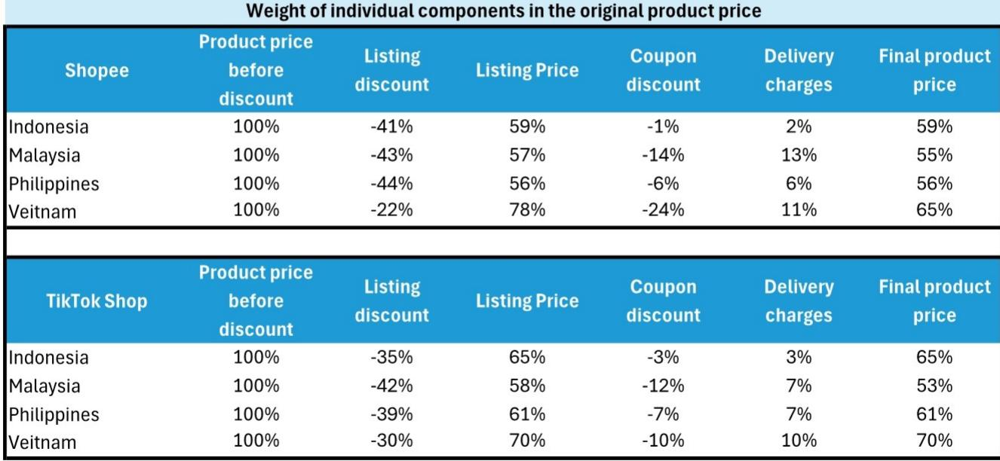
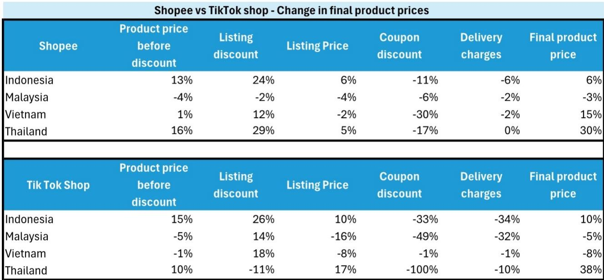

# Bernstein：SeaLtd电商竞争噪音减弱-2026年Q2价格数据

东南亚电商市场的价格竞争正在经历一次结构性变化。Bernstein最新发布的实地价格追踪数据显示，2026年第二季度，Shopee和TikTok Shop两大平台的最终商品价格继续上行，但推动价格上涨的因素已从商家主动提价转变为平台补贴调整。这份基于固定商品篮子的追踪报告覆盖印尼、马来西亚、越南、泰国和菲律宾五个市场，其核心发现是：行业正在选择纪律而非破坏性竞争。

报告指出，Shopee在多数市场保持了挂牌价格的基本稳定，波动范围在-5%至+5%之间，但大幅削减了补贴，导致消费者实际支付价格上升。TikTok Shop同样减少了补贴投放，但通过降低消费者承担的配送费用，部分抵消了补贴调整的影响，使得最终价格涨幅相对温和。两种不同的路径指向同一个方向：平台正在从争夺每一笔订单转向保护自身宏观环境模型。

> **KC评论：** 报告最值得关注的信号不是价格涨跌本身，而是两个主要玩家在补贴策略上出现了罕见的同步调整。过去两年东南亚电商市场以补贴换增长的逻辑正在被重新评估。

## 1. Shopee通过削减补贴实现价格上行，TikTok Shop以配送费补贴缓冲

Bernstein的价格分解框架将最终价格拆解为六个组成部分：折扣前标价、挂牌折扣、挂牌价格、补贴折扣、配送费用和最终价格。数据显示，Shopee在印尼的最终价格环比上涨6%，其中补贴折扣贡献了-11%的降幅，但挂牌折扣增加24%和折扣前标价上涨13%共同推高了最终价格。在泰国，Shopee最终价格环比上涨30%，补贴折扣从-17%收窄，而挂牌折扣扩大29%是主要推力。

TikTok Shop在印尼的最终价格环比上涨10%，但其补贴折扣从-33%收窄至更小幅度，同时配送费用从-34%大幅回升，两者共同作用使得消费者价格涨幅可控。在马来西亚，TikTok Shop最终价格反而环比下降5%，主要原因是挂牌价格下降16%和配送费用下降32%抵消了补贴折扣的调整。

## 2. Shopee价格优势有所收窄，但未改变整体竞争格局

报告追踪了各平台商品中价格更便宜的比例。Shopee在全部五个样本市场中，价格更便宜的商品占比均出现下降。越南是相对少见例外，TikTok Shop在该市场通过更大幅度的价格下调重新获得部分优势，但Shopee整体仍保持竞争力。在印尼、菲律宾、马来西亚和泰国，Shopee要么仍是更便宜的平台，要么与TikTok Shop处于大致平价状态。

Bernstein认为，这种相对价格优势的收窄并不代表竞争强度发生了实质性变化。上一季度报告已经指出，平台有能力将成本上涨传导给消费者，尤其是与中东局势相关的燃料成本上升。最新数据延续了这一趋势，只是传导机制发生了变化。

## 3. 电商利润率进入平台期，但价格上行提供扩张空间

Sea Ltd的电商业务利润率（EBITDA/GMV）在过去几个季度（2025年9月至2026年3月）基本维持在同一区间。报告认为，这一平台期反映了公司主动选择优先增长，加速在物流和用户获取方面的投入。市场此前的主要担忧是，如果TikTok Shop采取更激进的竞争策略，Sea的利润率可能进一步承压。

但Bernstein和市场共识均认为，尽管存在持续投入，利润率应保持韧性。近期价格上行趋势表明，利润率存在温和扩张的空间。报告财务预测显示，Sea的电商业务调整后EBITDA预计从2024年的-1.39亿美元转为2025年的5.81亿美元，2026年进一步增至6.06亿美元。

> **KC评论：** 利润率能否从平台期向上突破，取决于补贴调整能否持续转化为收入增长，而非仅仅改善单位宏观环境。报告没有给出明确答案，但价格追踪数据提供了观察窗口。

## 4. 一个可复用的观察框架：拆解价格构成判断竞争阶段

Bernstein的价格分解方法提供了一个实用的分析框架。将最终价格拆解为挂牌折扣、补贴和配送费用三个可追踪的变量，可以判断平台竞争所处的阶段：当挂牌折扣主导价格变化时，反映的是商家定价行为；当补贴和配送费成为主要变量时，反映的是平台补贴策略。当前数据表明，东南亚电商竞争已从全面补贴阶段进入选择性补贴阶段，平台更倾向于通过调整配送费和补贴结构来影响消费者价格，而非直接打价格战。

这一框架同样适用于观察其他新兴市场的电商竞争。如果补贴和配送费用同时调整而最终价格未大幅上涨，说明平台已找到在不牺牲消费者体验的前提下改善宏观环境模型的路径。

For informational purposes only. Portions may be generated,translated,summarized,or edited with AI assistance based on source materials and may contain omissions or errors. Please verify independently. This is not investment,legal,tax,accounting,or other professional advice.

