# U.S. Beverages, Household & Personal Care Products

# U.S. HPC Scanner Update: beauty remains the bright spot as household demand stays soft

  
Cristian Rios  
+1 917 344 8615  
cristian.rios@bernsteinsg.com

Yolanda Zhang

+1 917 344 8346

yolanda.zhang@bernsteinsg.com

U.S. HPC scanner trends remained mixed in the latest quarter. We publish our Q3 QTD scanner update, covering the period ending July 11, with comparisons against Q2 and Q1. Beauty continues to be the bright spot, while Household and Family Care categories remain relatively subdued.

Among our coverage names, P&G delivered +2.5% sales growth in Q3 QTD, down from +3.0% in Q2, reflecting moderating category growth and softer pricing. Beauty remained P&G's strongest segment (+6.4%), supported by +4.7% volume growth, while Fabric & Home Care grew +2.2% and Baby, Feminine & Family Care increased just +0.5%.

Colgate posted +3.5% sales growth in Q3 QTD, down from +4.0% in Q2, driven by improving volume trends, particularly in Home Care (+8.3%) and Pet Nutrition (+6.5%). Oral Care remained positive at +1.7%, while Personal Care declined 4.0%.

e.l.f. Beauty's total sales grew +1.0% in Q3 QTD, down from +1.2% in Q2, as weakness in Cosmetics (-6.3%) was offset by continued strength in Skin Care (+38.8%). For e.l.f., we used Nielsen's xAOC dataset rather than U.S. Full View to better reflect Naturium's underlying performance, as changes to Naturium's Amazon distribution strategy may distort trends in the U.S. Full View dataset. Even on this basis, Naturium remained the standout performer, generating +58.2% sales growth, driven by +88.1% volume growth. Notably, Nielsen captured e.l.f.'s Hair Care business for the first time this quarter. The category represented \~4% of company sales during the period and provides an incremental growth driver beyond Cosmetics and Skin Care, and it is not yet reflected in the Cosmetics/Skin Care segment tables below. We will incorporate Hair Care into future e.l.f. scanner updates.

## BERNSTEIN TICKER TABLE

<table><tr><td rowspan="2"></td><td colspan="4">20 Jul 2026</td><td rowspan="2">TTMRel.</td><td colspan="4">Adjusted EPS</td><td colspan="3">Adjusted P/E (x)</td></tr><tr><td>Rating</td><td>Cur</td><td>Closing Price</td><td>Price Target</td><td>Cur</td><td>2025A</td><td>2026E</td><td>2027E</td><td>2025A</td><td>2026E</td><td>2027E</td></tr><tr><td>ELF (elf)</td><td>M</td><td>USD</td><td>79.65</td><td>60.00</td><td>(50.5)%</td><td>USD</td><td>3.13</td><td>3.20</td><td>3.52</td><td>25.4</td><td>24.9</td><td>22.7</td></tr><tr><td>PG (Procter &amp; Gamble Co)</td><td>M</td><td>USD</td><td>149.13</td><td>156.00</td><td>(22.1)%</td><td>USD</td><td>6.83</td><td>6.86</td><td>7.12</td><td>21.8</td><td>21.7</td><td>20.9</td></tr><tr><td>CL (Colgate-Palmolive Co)</td><td>M</td><td>USD</td><td>91.93</td><td>96.00</td><td>(12.3)%</td><td>USD</td><td>3.68</td><td>3.87</td><td>4.09</td><td>25.0</td><td>23.8</td><td>22.5</td></tr><tr><td>SPX</td><td></td><td></td><td>7,443.28</td><td></td><td></td><td></td><td></td><td></td><td></td><td></td><td></td><td></td></tr></table>

O - Outperform, M - Market-Perform, U - Underperform, NR - Not Rated, CS - Coverage Suspended

ELF base year is 2026;

Source: Bloomberg, Bernstein estimates and analysis.

## INVESTMENT IMPLICATIONS

We rate e.l.f Beauty Market-Perform, with a PT of \$60. We believe e.l.f has the most relevant operating model for today's consumer -social media fluency, rapid innovation cycles, and a viral-prone approach to new product development. However, EPS have been extremely volatile after a big acquisition (Rhode), distribution expansion, increased marketing and payroll investments and a slowing-down core. We are long term believers, but think some stability and margin expansion is needed before the stock can appreciate.

We forecast 2% and 7% YoY EPS growth NTM and NTM+1, respectively, making us bearish vs. consensus on NTM+1 EPS by \~5%. We have a target multiple of 17x.

We rate Procter & Gamble Market-Perform, with a PT of \$156. P&G has a diversified portfolio (categories and regions) that is, by design, hard to accelerate or disrupt. Bright spots in Beauty (relative to the rest of the portfolio) will help sustain LSD organic sales growth, with potential upside from upcoming innovation in Laundry Detergents, but challenges from Private Label in more commoditized categories like Bathroom Tissue and from smaller competitors in Disposable Diapers are unlikely to go away.

We forecast 1% and 5% YoY EPS growth NTM and NTM+1, respectively, making us bearish vs. consensus on NTM+1 EPS by \~1%. We have a target multiple of 21.6x.

We rate Colgate-Palmolive Market-Perform, with a PT of \$96. Colgate has the most productive geographic footprint in our coverage, balancing diversification with growth and powered by strong HPC Brands in International markets. While HPC will be partially weighed down by their underperforming North America segment (stagnant categories, share loss), we like CL's Global Pet business, which will further premiumize as Cat Food, which has a higher price per pound, grows faster than Dog Food.

We forecast 4% and 9% YoY EPS growth NTM and NTM+1, respectively, making us bullish vs. consensus on NTM+1 EPS by \~2%. We have a target multiple of 23.1x.

## DETAILS

## EXHIBIT 1: 2026 Q3 QTD Performance - PG

Latest Period End: 2026-07-11

<table><tr><td></td><td>Sales ($M)</td><td>Volume (EQ, M)</td><td>Price ($/EQ)</td><td>YoY Sales Growth</td><td>YoY Volume Growth</td><td>YoY Price Growth</td><td>Sales Mix (%)</td><td>Market Share (%)</td><td>YoY Mkt Share Chg (pp)</td><td>Category Growth YoY</td></tr><tr><td>Fabric &amp; Home Care</td><td>1,386</td><td>7,416</td><td>0.19</td><td>2.2%</td><td>-1.0%</td><td>3.2%</td><td>35.3%</td><td>27.8%</td><td>0.7%</td><td>-0.5%</td></tr><tr><td>Baby, Feminine &amp; Family Care</td><td>1,151</td><td>5,116</td><td>0.23</td><td>0.5%</td><td>1.1%</td><td>-0.6%</td><td>29.3%</td><td>29.1%</td><td>-0.2%</td><td>1.1%</td></tr><tr><td>Grooming</td><td>192</td><td>79</td><td>2.42</td><td>3.9%</td><td>1.2%</td><td>2.8%</td><td>4.9%</td><td>38.1%</td><td>0.5%</td><td>2.5%</td></tr><tr><td>Health Care</td><td>525</td><td>1,175</td><td>0.45</td><td>2.0%</td><td>4.1%</td><td>-2.0%</td><td>13.4%</td><td>9.8%</td><td>0.0%</td><td>2.0%</td></tr><tr><td>Beauty</td><td>633</td><td>942</td><td>0.67</td><td>6.4%</td><td>4.7%</td><td>1.7%</td><td>16.1%</td><td>8.9%</td><td>0.3%</td><td>3.4%</td></tr><tr><td>Other</td><td>39</td><td>12</td><td>3.24</td><td>10.9%</td><td>-3.6%</td><td>15.0%</td><td>1.0%</td><td>0.1%</td><td>0.0%</td><td>2.5%</td></tr><tr><td>Total</td><td>3,926</td><td>14,739</td><td>0.27</td><td>2.5%</td><td>0.5%</td><td>2.0%</td><td>100.0%</td><td>5.0%</td><td>0.0%</td><td>2.3%</td></tr></table>

Source: Nielsen Total US Full View (Modeled) + Conv + Pet Retail + Costco (Model) + Rem Accounts, Bernstein Analysis

## EXHIBIT 2: 2026 Q2 Performance - PG

Latest Period End: 2026-06-27

<table><tr><td></td><td>Sales ($M)</td><td>Volume (EQ, M)</td><td>Price ($/EQ)</td><td>YoY Sales Growth</td><td>YoY Volume Growth</td><td>YoY Price Growth</td><td>Sales Mix (%)</td><td>Market Share (%)</td><td>YoY Mkt Share Chg (pp)</td><td>Category Growth YoY</td></tr><tr><td>Fabric &amp; Home Care</td><td>4,859</td><td>26,877</td><td>0.18</td><td>1.5%</td><td>-0.4%</td><td>1.9%</td><td>35.4%</td><td>29.1%</td><td>-0.4%</td><td>2.7%</td></tr><tr><td>Baby, Feminine &amp; Family Care</td><td>3,992</td><td>18,606</td><td>0.21</td><td>1.6%</td><td>-0.4%</td><td>2.0%</td><td>29.1%</td><td>28.9%</td><td>-0.1%</td><td>2.1%</td></tr><tr><td>Grooming</td><td>631</td><td>271</td><td>2.33</td><td>5.0%</td><td>1.8%</td><td>3.1%</td><td>4.6%</td><td>38.7%</td><td>0.2%</td><td>4.5%</td></tr><tr><td>Health Care</td><td>1,961</td><td>4,349</td><td>0.45</td><td>5.2%</td><td>-0.6%</td><td>5.9%</td><td>14.3%</td><td>10.2%</td><td>0.2%</td><td>3.2%</td></tr><tr><td>Beauty</td><td>2,188</td><td>3,283</td><td>0.67</td><td>5.8%</td><td>1.0%</td><td>4.7%</td><td>15.9%</td><td>9.3%</td><td>0.0%</td><td>6.1%</td></tr><tr><td>Other</td><td>97</td><td>31</td><td>3.11</td><td>16.8%</td><td>6.5%</td><td>9.7%</td><td>0.7%</td><td>0.0%</td><td>0.0%</td><td>2.7%</td></tr><tr><td>Total</td><td>13,728</td><td>53,418</td><td>0.26</td><td>3.0%</td><td>-0.3%</td><td>3.3%</td><td>100.0%</td><td>5.1%</td><td>0.0%</td><td>3.0%</td></tr></table>

Source: Nielsen Total US Full View (Modeled) + Conv + Pet Retail + Costco (Model) + Rem Accounts, Bernstein Analysis

## EXHIBIT 3: 2026 Q1 Performance - PG

Latest Period End: 2026-03-21

<table><tr><td></td><td>Sales ($M)</td><td>Volume (EQ, M)</td><td>Price ($/EQ)</td><td>YoY Sales Growth</td><td>YoY Volume Growth</td><td>YoY Price Growth</td><td>Sales Mix (%)</td><td>Market Share (%)</td><td>YoY Mkt Share Chg (pp)</td><td>Category Growth YoY</td></tr><tr><td>Fabric &amp; Home Care</td><td>4,290</td><td>24,415</td><td>0.18</td><td>2.4%</td><td>1.6%</td><td>0.8%</td><td>35.8%</td><td>30.6%</td><td>-0.2%</td><td>3.2%</td></tr><tr><td>Baby, Feminine &amp; Family Care</td><td>3,501</td><td>17,991</td><td>0.19</td><td>1.4%</td><td>-0.4%</td><td>1.8%</td><td>29.2%</td><td>29.0%</td><td>-0.4%</td><td>2.9%</td></tr><tr><td>Grooming</td><td>479</td><td>208</td><td>2.30</td><td>-1.1%</td><td>-6.1%</td><td>5.3%</td><td>4.0%</td><td>37.8%</td><td>-1.4%</td><td>2.7%</td></tr><tr><td>Health Care</td><td>1,944</td><td>4,139</td><td>0.47</td><td>2.5%</td><td>-2.5%</td><td>5.1%</td><td>16.2%</td><td>11.1%</td><td>0.1%</td><td>1.7%</td></tr><tr><td>Beauty</td><td>1,745</td><td>2,662</td><td>0.66</td><td>6.5%</td><td>0.7%</td><td>5.7%</td><td>14.6%</td><td>9.4%</td><td>-0.1%</td><td>7.4%</td></tr><tr><td>Other</td><td>18</td><td>8</td><td>2.37</td><td>36.3%</td><td>15.3%</td><td>18.2%</td><td>0.2%</td><td>0.0%</td><td>0.0%</td><td>4.4%</td></tr><tr><td>Total</td><td>11,978</td><td>49,422</td><td>0.24</td><td>2.6%</td><td>0.4%</td><td>2.1%</td><td>100.0%</td><td>5.2%</td><td>-0.1%</td><td>4.3%</td></tr></table>

Source: Nielsen Total US Full View (Modeled) + Conv + Pet Retail + Costco (Model) + Rem Accounts, Bernstein Analysis

EXHIBIT 4: PG Overall Performance Trends  
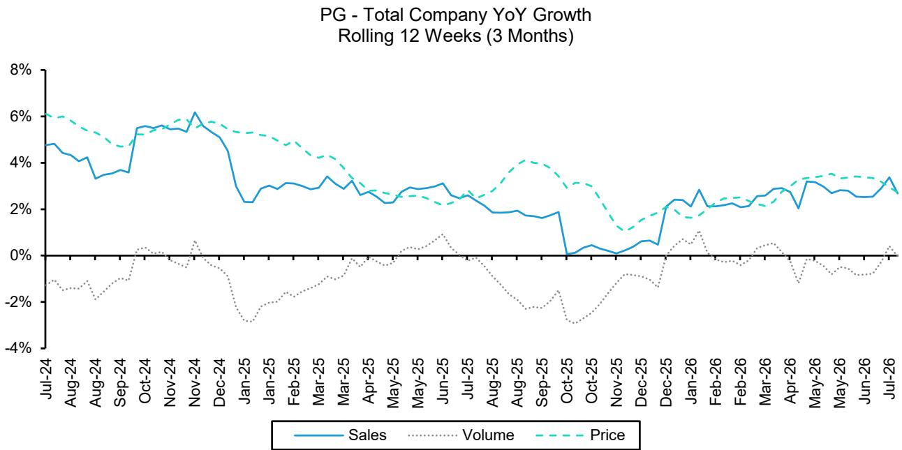  
Source: Nielsen Total US Full View (Modeled) + Conv + Pet Retail + Costco (Model) + Rem Accounts, Bernstein Analysis

## EXHIBIT 5: PG Performance Trends by Segment

PG - Fabric & Home Care YoY Growth Rolling 12 Weeks (3 Months)  
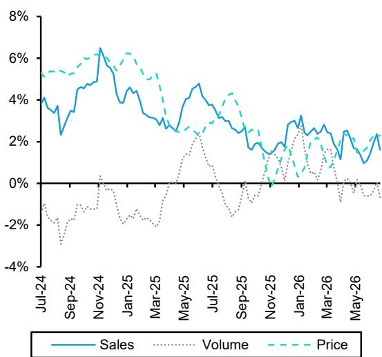

PG - Baby, Feminine & Family Care YoY Growth Rolling 12 Weeks (3 Months)  
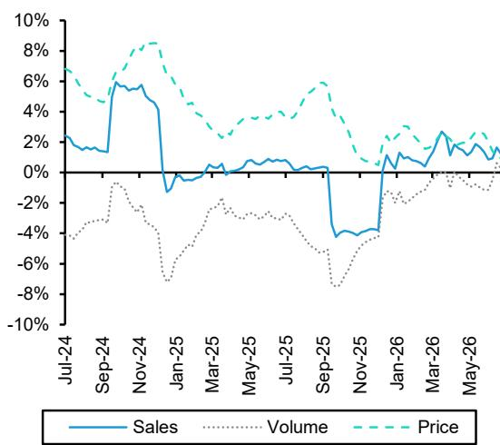

PG - Grooming YoY Growth
Rolling 12 Weeks (3 Months)  
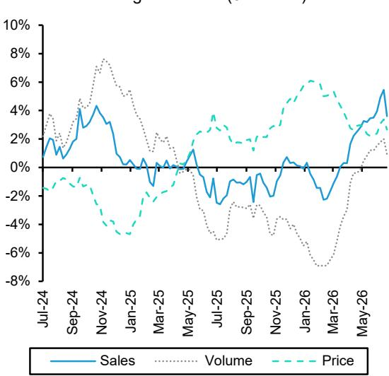

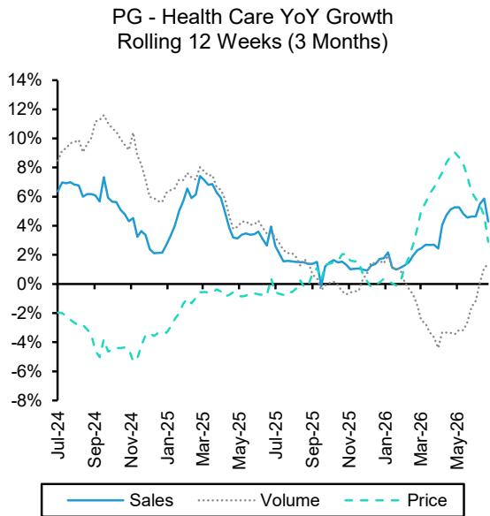

PG - BeautyYoY Growth
Rolling 12 Weeks (3 Months)  
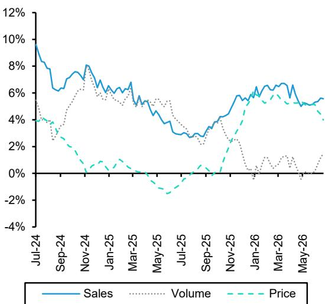

## EXHIBIT 6: 2026 Q3 QTD Performance - CL

Latest Period End: 2026-07-11

<table><tr><td></td><td>Sales ($M)</td><td>Volume (EQ, M)</td><td>Price ($/EQ)</td><td>YoY Sales Growth</td><td>YoY Volume Growth</td><td>YoY Price Growth</td><td>Sales Mix (%)</td><td>Market Share (%)</td><td>YoY Mkt Share Chg (pp)</td><td>Category Growth YoY</td></tr><tr><td>Oral Care</td><td>187</td><td>247</td><td>0.76</td><td>1.7%</td><td>-2.4%</td><td>4.2%</td><td>19.2%</td><td>17.8%</td><td>0.1%</td><td>0.8%</td></tr><tr><td>Personal Care</td><td>90</td><td>352</td><td>0.26</td><td>-4.0%</td><td>-8.9%</td><td>5.3%</td><td>9.2%</td><td>2.2%</td><td>-0.2%</td><td>4.5%</td></tr><tr><td>Home Care</td><td>104</td><td>1,332</td><td>0.08</td><td>8.3%</td><td>10.1%</td><td>-1.7%</td><td>10.6%</td><td>3.8%</td><td>0.2%</td><td>1.9%</td></tr><tr><td>Oral, Personal, and Household Care</td><td>381</td><td>1,930</td><td>0.20</td><td>1.9%</td><td>4.4%</td><td>-2.4%</td><td>39.0%</td><td>4.9%</td><td>-0.1%</td><td>3.1%</td></tr><tr><td>Pet</td><td>214</td><td>54</td><td>3.97</td><td>6.5%</td><td>-0.5%</td><td>7.0%</td><td>21.9%</td><td>5.1%</td><td>0.1%</td><td>3.3%</td></tr><tr><td>Total</td><td>595</td><td>1,984</td><td>0.30</td><td>3.5%</td><td>4.3%</td><td>-0.7%</td><td>61.0%</td><td>0.8%</td><td>0.0%</td><td>2.3%</td></tr></table>

Source: Nielsen Total US Full View (Modeled) + Conv + Pet Retail + Costco (Model) + Rem Accounts, Bernstein Analysis

## EXHIBIT 7: 2026 Q2 Performance - CL

Latest Period End: 2026-06-27

<table><tr><td></td><td>Sales ($M)</td><td>Volume (EQ, M)</td><td>Price ($/EQ)</td><td>YoY Sales Growth</td><td>YoY Volume Growth</td><td>YoY Price Growth</td><td>Sales Mix (%)</td><td>Market Share (%)</td><td>YoY Mkt Share Chg (pp)</td><td>Category Growth YoY</td></tr><tr><td>Oral Care</td><td>608</td><td>790</td><td>0.77</td><td>2.1%</td><td>-1.4%</td><td>3.6%</td><td>18.8%</td><td>16.8%</td><td>-0.4%</td><td>4.8%</td></tr><tr><td>Personal Care</td><td>295</td><td>1,174</td><td>0.25</td><td>2.2%</td><td>-4.6%</td><td>7.1%</td><td>9.1%</td><td>2.2%</td><td>-0.1%</td><td>8.2%</td></tr><tr><td>Home Care</td><td>338</td><td>4,143</td><td>0.08</td><td>2.8%</td><td>-0.6%</td><td>3.4%</td><td>10.5%</td><td>3.6%</td><td>0.0%</td><td>2.6%</td></tr><tr><td>Oral, Personal, and Household Care</td><td>1,242</td><td>6,108</td><td>0.20</td><td>2.3%</td><td>-1.5%</td><td>3.9%</td><td>38.5%</td><td>4.7%</td><td>-0.2%</td><td>5.7%</td></tr><tr><td>Pet</td><td>745</td><td>189</td><td>3.94</td><td>7.0%</td><td>0.3%</td><td>6.7%</td><td>23.1%</td><td>5.1%</td><td>0.2%</td><td>3.6%</td></tr><tr><td>Total</td><td>1,987</td><td>6,297</td><td>0.32</td><td>4.0%</td><td>-1.4%</td><td>5.5%</td><td>61.5%</td><td>0.7%</td><td>0.0%</td><td>3.0%</td></tr></table>

Source: Nielsen Total US Full View (Modeled) + Conv + Pet Retail + Costco (Model) + Rem Accounts, Bernstein Analysis

## EXHIBIT 8: 2026 Q1 Performance - CL

Latest Period End: 2026-03-21

<table><tr><td></td><td>Sales ($M)</td><td>Volume (EQ, M)</td><td>Price ($/EQ)</td><td>YoY Sales Growth</td><td>YoY Volume Growth</td><td>YoY Price Growth</td><td>Sales Mix (%)</td><td>Market Share (%)</td><td>YoY Mkt Share Chg (pp)</td><td>Category Growth YoY</td></tr><tr><td>Oral Care</td><td>516</td><td>697</td><td>0.74</td><td>-1.6%</td><td>-3.5%</td><td>1.9%</td><td>18.9%</td><td>16.5%</td><td>-1.0%</td><td>4.1%</td></tr><tr><td>Personal Care</td><td>232</td><td>1,130</td><td>0.21</td><td>2.0%</td><td>2.2%</td><td>-0.2%</td><td>8.5%</td><td>2.2%</td><td>-0.2%</td><td>9.2%</td></tr><tr><td>Home Care</td><td>293</td><td>3,623</td><td>0.08</td><td>-0.8%</td><td>-4.2%</td><td>3.5%</td><td>10.7%</td><td>3.6%</td><td>-0.1%</td><td>3.0%</td></tr><tr><td>Oral, Personal, and Household Care</td><td>1,041</td><td>5,450</td><td>0.19</td><td>-0.6%</td><td>-2.8%</td><td>2.3%</td><td>38.2%</td><td>4.7%</td><td>-0.3%</td><td>6.1%</td></tr><tr><td>Pet</td><td>642</td><td>167</td><td>3.84</td><td>6.9%</td><td>0.5%</td><td>6.4%</td><td>23.6%</td><td>5.0%</td><td>0.1%</td><td>4.0%</td></tr><tr><td>Total</td><td>1,683</td><td>5,617</td><td>0.30</td><td>2.1%</td><td>-2.7%</td><td>5.0%</td><td>61.8%</td><td>0.7%</td><td>0.0%</td><td>4.3%</td></tr></table>

Source: Nielsen Total US Full View (Modeled) + Conv + Pet Retail + Costco (Model) + Rem Accounts, Bernstein Analysis

EXHIBIT 9: CL Overall Performance Trends  
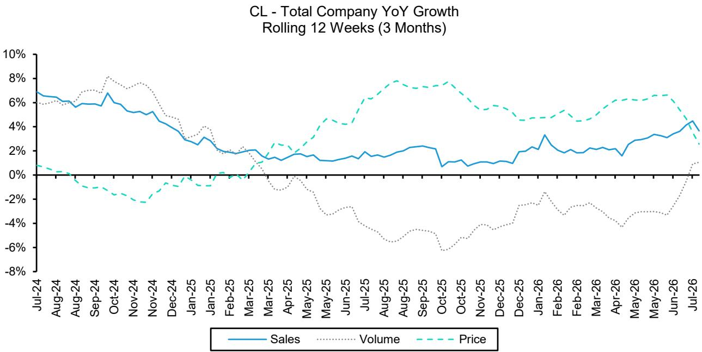  
Source: Nielsen Total US Full View (Modeled) + Conv + Pet Retail + Costco (Model) + Rem Accounts, Bernstein Analysis

EXHIBIT 10: CL Performance Trends by Segment  
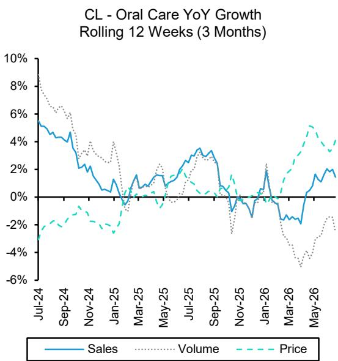

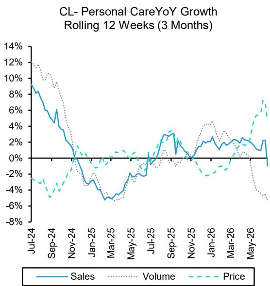

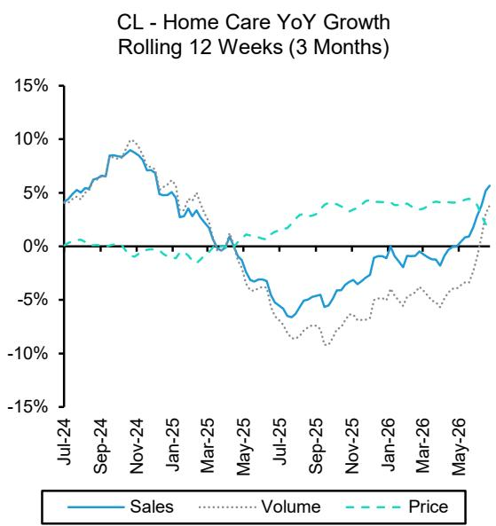

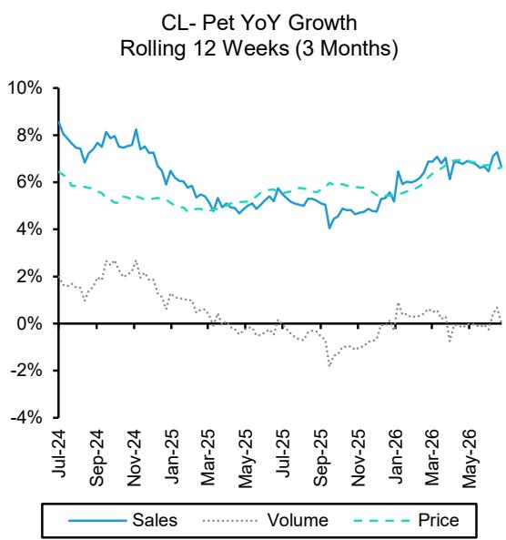  
Source: Nielsen Total US Full View (Modeled) + Conv + Pet Retail + Costco (Model) + Rem Accounts, Bernstein Analysis

## EXHIBIT 11: 2026 Q3 QTD Performance - ELF

Latest Period End: 2026-07-11

<table><tr><td></td><td>Sales ($M)</td><td>Volume (EQ, M)</td><td>Price ($/EQ)</td><td>YoY Sales Growth</td><td>YoY Volume Growth</td><td>YoY Price Growth</td><td>Sales Mix (%)</td><td>Market Share (%)</td><td>YoY Mkt Share Chg (pp)</td><td>Category Growth YoY</td></tr><tr><td>Face Cosmetics</td><td>35</td><td>3</td><td>11.61</td><td>-3.8%</td><td>-8.1%</td><td>4.7%</td><td>40.1%</td><td>23.4%</td><td>-0.7%</td><td>-0.9%</td></tr><tr><td>Eye Cosmetics</td><td>14</td><td>0</td><td>51.51</td><td>5.9%</td><td>-11.3%</td><td>19.4%</td><td>15.6%</td><td>9.4%</td><td>0.5%</td><td>0.7%</td></tr><tr><td>Lip Cosmetics</td><td>9</td><td>0</td><td>35.26</td><td>-34.4%</td><td>-49.8%</td><td>30.7%</td><td>10.4%</td><td>12.4%</td><td>-5.9%</td><td>-3.2%</td></tr><tr><td>All Other Cosmetics</td><td>10</td><td>2</td><td>4.45</td><td>8.7%</td><td>13.7%</td><td>-4.4%</td><td>11.8%</td><td>1.4%</td><td>0.2%</td><td>-5.1%</td></tr><tr><td>Total Cosmetics</td><td>68</td><td>6</td><td>11.62</td><td>-6.3%</td><td>-4.5%</td><td>-1.9%</td><td>77.9%</td><td>6.2%</td><td>-0.2%</td><td>-3.7%</td></tr><tr><td>ELF Skin Care</td><td>9</td><td>2</td><td>4.63</td><td>21.3%</td><td>1.7%</td><td>19.3%</td><td>10.1%</td><td>0.6%</td><td>0.1%</td><td>0.8%</td></tr><tr><td>Naturium Skin Care</td><td>10</td><td>6</td><td>1.74</td><td>58.2%</td><td>88.1%</td><td>-15.9%</td><td>12.0%</td><td>0.8%</td><td>0.3%</td><td>0.8%</td></tr><tr><td>Total Skin Care</td><td>19</td><td>8</td><td>2.43</td><td>38.8%</td><td>56.1%</td><td>-11.1%</td><td>22.1%</td><td>1.4%</td><td>0.4%</td><td>0.8%</td></tr><tr><td>Total</td><td>88</td><td>14</td><td>6.34</td><td>1.0%</td><td>22.9%</td><td>-17.9%</td><td>100.0%</td><td>3.6%</td><td>0.1%</td><td>-1.3%</td></tr></table>

Source: Nielsen Total US xAOC, Bernstein Analysis

## EXHIBIT 12: 2026 Q2 Performance - ELF

Latest Period End: 2026-06-27

<table><tr><td></td><td>Sales ($M)</td><td>Volume (EQ, M)</td><td>Price ($/EQ)</td><td
