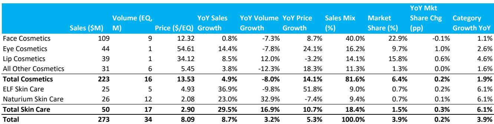
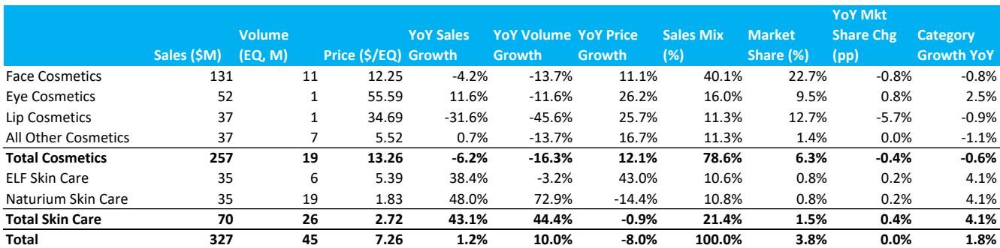
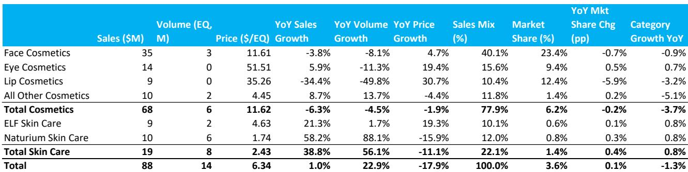

# Bernstein：美国家庭与个人护理扫描更新-美妆为亮点

Bernstein最新发布的美国家庭与个人护理（HPC）扫描数据显示，2026财年第三季度至今（截至7月11日），行业整体表现延续分化。美妆品类继续成为相对少见增长亮点，而家庭护理与家庭用品类别需求表现平稳。这份覆盖宝洁、高露洁和e.l.f. Beauty三家公司的数据更新，为理解当前美国消费品市场的结构性差异提供了最新切片。

报告覆盖的三家公司均呈现一个共同特征：美妆业务增速显著高于其他品类。宝洁的美妆部门第三季度至今实现6.4%的销售增长，远超公司整体2.5%的增速，且量价齐升——销量增长4.7%，价格贡献1.7%。高露洁的美妆相关品类同样表现稳健，但其整体增速从第二季度的4.0%变化至3.5%。e.l.f. Beauty的总销售增速从第二季度的1.2%微降至1.0%，但护肤品类（含Naturium）仍录得38.8%的增长。

> **KC评论：** 美妆品类的韧性并非新现象，但这份数据揭示了一个关键细节：宝洁美妆部门的销量增速（4.7%）远超其整体销量增速（0.5%），说明消费者在非必需品类上的支出意愿并未消退，而是在向特定品牌和产品集中。这与家庭护理品类量价表现相对平稳的趋势形成鲜明对比。

## 1. 宝洁整体增速节奏变化，美妆与家庭护理表现分化

宝洁第三季度至今总销售增长2.5%，低于第二季度的3.0%和第一季度的2.6%。从品类结构看，美妆（6.4%）和Grooming（3.9%）是主要增长引擎，而Fabric & Home Care仅增长2.2%，Baby,Feminine & Family Care更只有0.5%的微增。值得注意的是，宝洁在美妆品类的市场份额同比提升了0.3个百分点，而家庭护理品类的份额虽提升0.7个百分点，但该品类整体增速为-0.5%，说明增长主要来自价格贡献而非需求扩张。

## 2. 高露洁宠物业务持续贡献增量，北美家庭护理仍保持稳定

高露洁第三季度至今总销售增长3.5%，其中宠物业务贡献6.5%的增长，Home Care更录得8.3%的增速。但Oral Care仅增长1.7%，Personal Care则下滑4.0%。报告指出，高露洁的国际化布局是其优势，但北美市场的家庭护理品类面临品类增长平稳和份额变化的不确定性。宠物业务中，猫粮品类单价更高且增速快于狗粮，成为结构性溢价来源。

## 3. e.l.f. Beauty核心化妆品表现平稳，护肤与护发提供新增长点

e.l.f. Beauty第三季度至今总销售仅增长1.0%，化妆品部门下滑6.3%，其中唇部化妆品跌幅达34.4%。但护肤品类表现强劲：自有品牌增长21.3%，收购品牌Naturium更录得58.2%的销售增长，销量增幅高达88.1%。报告特别指出，这是Nielsen首次将e.l.f.的护发业务纳入统计，该品类约占公司销售的4%，成为除化妆品和护肤之外的新增长极。Bernstein认为，e.l.f.拥有适应现代消费者的运营模式——社交媒体渗透力、快速创新周期和产品开发能力，但核心化妆品节奏变化和大规模收购后的盈利波动仍需时间消化。

> **KC评论：** e.l.f.的数据处理方式值得注意。报告改用Nielsen的xAOC数据集而非U.S. Full View，以更准确反映Naturium在亚马逊渠道调整后的真实表现。这种数据口径的调整本身就是一个信号：对于依赖多渠道分销的新锐品牌，单一数据源可能低估或高估其增长轨迹。读者在解读这类公司时，需要关注数据来源的匹配性。

## 4. 品类分化背后的观察框架

这份报告提供了一个可复用的分析框架：将消费品公司的增长拆解为“品类增速”和“市场份额变化”两个维度。宝洁在美妆品类中同时受益于品类增长（3.4%）和份额提升（+0.3pp），而在家庭护理品类中，尽管份额提升（+0.7pp），但品类本身在调整（-0.5%），增长质量完全不同。高露洁的宠物业务同样呈现类似结构：品类增长3.3%，份额提升0.1pp，属于健康的双轮驱动。对于e.l.f.，化妆品品类整体下滑3.7%，公司份额也下降0.2pp，说明其核心业务面临系统性调整，而护肤和护发则处于品类扩张和份额提升的早期阶段。

Bernstein对三家公司均给予Market-Perform评级，认为当前估值已反映部分预期，但盈利增长路径仍需验证。宝洁的多元化组合使其难以被加速或颠覆，但自有品牌在日用品类中的竞争不确定性不会消失；高露洁的全球布局和宠物业务提供结构性支撑，但北美市场的表现仍是关注点；e.l.f.的长期模式被认可，但短期盈利稳定性和利润率扩张是报价回升的前提。

For informational purposes only. Portions may be generated,translated,summarized,or edited with AI assistance based on source materials and may contain omissions or errors. Please verify independently. This is not investment,legal,tax,accounting,or other professional advice.

For informational purposes only. Portions may be generated,translated,summarized,or edited with AI assistance based on source materials and may contain omissions or errors. Please verify independently. This is not investment,legal,tax,accounting,or other professional advice.

