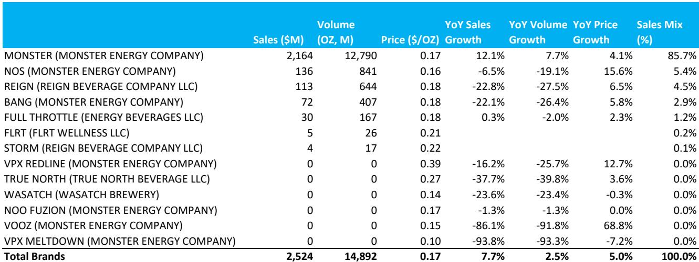
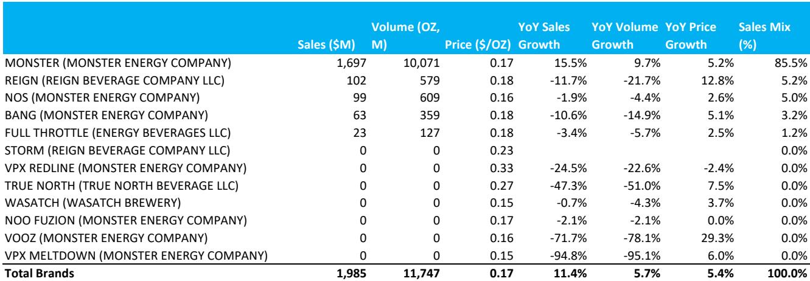
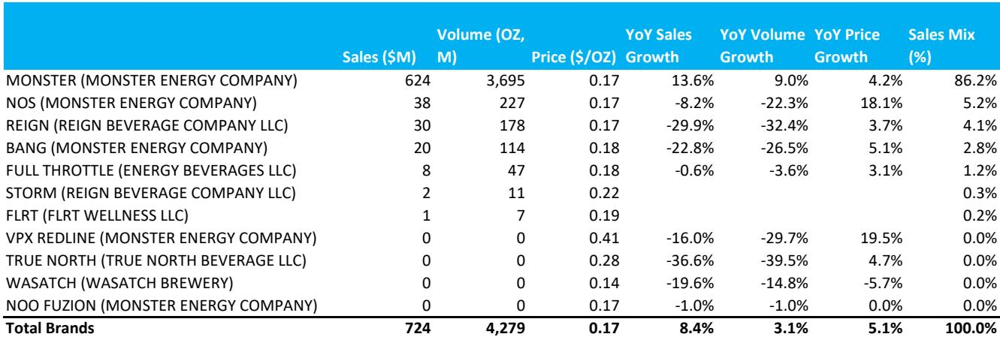

# 美国饮料行业的结构性分化：从最新数据看品牌组合的力量

美国饮料货架的增长并非均匀放缓。2026年第三季度前几周，整个品类增速从第二季度的4.0%和第一季度的6.0%降至3.3%，但有一家公司——可口可乐——反而加速了，第三季度至今销售额增长5.2%，高于上一季度的4.2%。这种分化是近期扫描数据中最重要的信号，它揭示了一个不再“水涨船高”的市场。饮料行业已进入一个阶段：产品组合构成、品牌资产和品类布局比宏观环境更能决定结果。

整体增速从6.0%降至3.3%是真实存在的，但如果将其解读为全面放缓则会产生误导。可口可乐在第三季度至今的市场总份额同比提升了0.4个百分点，而百事可乐则下降了1.0个百分点。相比之下，Keurig Dr Pepper实现了9.1%的销售增长，份额提升了0.6个百分点。这种模式并非随机。它直接反映了哪些公司拥有消费者正在转向的品类，哪些公司则在失去吸引力的品类中固守阵地。

这不是一个关于通胀消退或消费者信心恢复的周期性故事。这是一个关于品类健康和组合策略的结构性故事。如今胜出的公司，其收入结构更倾向于功能性饮料——能量饮料、运动饮料和蛋白质饮品——而非缺乏创新动力的传统碳酸饮料。而处于劣势的公司，其产品组合在那些正在失去份额的品类中暴露过多。

对于观察者和策略师而言，启示是明确的：美国饮料行业下一阶段的价值创造将来自产品组合的构建，而非品类的整体表现。截至2026年7月中旬的数据，为识别哪些公司具备持续增长潜力、哪些可能面临挑战，提供了一个分析框架。

## 可口可乐的加速增长由销量驱动，而非价格，彰显真实的品牌号召力

可口可乐第三季度至今5.2%的销售增长，相比第二季度的4.2%有所加速，其中关键的是3.0%来自销量增长。这与人们在品类放缓时的预期相反。当品类增速从6.0%降至3.3%时，通常的解释是提价已达顶峰，销量正在走软。可口可乐的数据反驳了这一说法，至少对货架上较强的品牌而言是如此。

销量增长集中在两个领域。碳酸饮料（该公司的核心业务）销售额增长7.4%，销量增长4.4%。乳制品蛋白品牌Fairlife销售额增长24.2%，销量增长17.8%。这些并非可口可乐仅靠提价的品类；它正在赢得真实的消费者偏好。该公司在碳酸饮料中的份额提升了1.5个百分点，在Fairlife所属品类（该品类本身增长了14.2%）中提升了2.7个百分点。当一个品牌在一个增长14%的品类中还能获得份额时，其复合效应是强大的。

这里的策略洞察是，可口可乐有效地将其产品组合一分为二。其传统碳酸饮料业务并非仅仅在防守；它正通过零糖趋势（该趋势正在加速需求）来获得份额。其功能性饮料布局（主要通过Fairlife和运动饮料）提供了第二个增长引擎，且仍处于渗透周期的早期阶段。这种组合意味着可口可乐可以在不依赖激进定价的情况下维持中个位数的有机增长，这有助于保护利润率并降低执行风险。

## Keurig Dr Pepper能量饮料增长40.9%，证实功能性布局是关键的组合差异化因素

Keurig Dr Pepper第三季度至今实现了9.1%的销售增长，使其成为覆盖范围内增长最快的公司。增长是广泛的，但引擎是能量饮料，同比增长40.9%。运动饮料增长了26.1%。这些并非KDP的传统优势品类；而是该公司通过收购和品牌建设建立起来的领域。

能量饮料品类本身在第三季度至今增长了8.7%，低于第二季度的9.4%和第一季度的14.8%。这一放缓是重要的背景信息。即使品类增速放缓，KDP的增长速度仍接近品类增速的五倍。这表明该公司正在从那些品牌吸引力下降的竞争对手手中夺取份额。KDP整体市场份额提升0.6个百分点看似不大，但其构成很重要：它正在增长最快的子品类中获胜。

这对组合策略的启示是直接的。KDP的功能性饮料组合——包括能量饮料、运动饮料和补水饮品——现在在其收入结构中的占比越来越高。这使公司的增长特征从成熟的碳酸饮料品类转向人均消费潜力更高、消费者更年轻的细分市场。该公司13.3倍远期收益的估值，并未完全反映这一组合转型。市场将KDP视为一家传统饮料公司，而其增长构成越来越像一家纯粹的功能性饮料公司。

## 百事可乐销售额下降1.1%，揭示过度暴露于失去份额和吸引力的品类的代价

百事可乐第三季度至今销售额下降1.1%，较第二季度0.1%的增长有所恶化。饮料和食品业务均出现广泛下滑，但结构性问题很明确：百事可乐在其渗透率已经很高的品类中正在失去份额，并且在扩张中的品类缺乏足够的增长来弥补。

在饮料方面，百事可乐销售额下降0.7%。碳酸饮料持平（增长0.4%），但失去了0.9个百分点的份额。运动饮料下降0.5%，失去0.8个百分点的份额。能量饮料增长6.9%，但失去0.3个百分点的份额。模式是一致的：百事可乐在其涉足的增长品类中并未按比例参与，同时在其核心品类中正在失守。

食品业务的情况更糟。整体食品销售额下降1.5%，其中玉米片下降2.6%，其他咸味零食下降2.9%。该公司在食品整体中失去了1.1个百分点的份额。这不是品类问题；整个咸味零食品类增长了1.4%。这是份额问题。百事可乐的零食业务，长期以来被视为防御性护城河，正显示出竞争性侵蚀的迹象，这种迹象在本季度之前就已存在，且似乎是结构性的。

策略上的启示令人不安。百事可乐的产品组合横跨饮料和零食，但多元化只有在各组成部分表现不同时才有帮助。在这里，两方面同时表现不佳。该公司的国际业务提供了一定的缓冲，但北美市场的疲软程度足以制约整体增长。对于观察者而言，问题是百事可乐的产品组合能否足够快地重组以扭转这些趋势，或者该公司是否正进入一个长期份额流失的时期，这将压缩其利润率和估值倍数。

## 能量饮料品类正在分化：品牌层面的差异在同一细分市场中创造赢家和输家

能量饮料品类在第三季度至今增长了8.7%，但这个总体数字掩盖了品牌层面的显著差异。Monster Beverage增长了8.4%，由核心Monster品牌13.6%的增长推动。Celsius Holdings增长了7.7%，但这由Alani品牌42.4%的增长和传统Celsius品牌8.7%的下降构成。该品类并非均匀增长；它正在向某些品牌定位倾斜，而远离其他品牌。

这种分化是能量饮料领域最重要的动态。该品类足够大，可以容纳多个品牌，但增长越来越集中在那些拥有高复购率和较大消费者认知空间的品牌上。Alani在强劲的去年同期比较基础上仍实现42.4%的增长，表明它仍处于其采用曲线的早期阶段。相比之下，传统Celsius品牌的下降表明，其初始增长是由分销扩张和营销投入驱动的，而这些现在正面临竞争压力。

对于Monster而言，核心品牌13.6%的增长是一个积极信号，表明尽管竞争加剧，其品牌力依然健康。Monster的国际业务，借助可口可乐的分销网络，提供了一个国内竞争对手无法复制的增长方向。该公司42.1倍远期收益的估值反映了这种国际业务的潜力，但也意味着任何国内份额趋势的放缓都会迅速压缩其估值倍数。

对观察者的策略启示是，能量饮料不再是一个单一的押注。该品类正成为一个由品牌资产、分销关系和消费者忠诚度决定结果的市场。拥有品类是不够的；必须拥有品类中正确的品牌。这有利于那些拥有多品牌组合、能够将资源转向获胜品牌并远离衰落品牌的公司。

## 美国饮料行业组合配置的分析框架

第三季度的扫描数据提供了足够的信号，为观察者评估饮料行业构建一个分析框架。该框架包含三个维度：品类健康度、份额动能和组合灵活性。

品类健康度衡量一家公司所参与的细分品类是在增长还是萎缩。可口可乐的碳酸饮料增长3.3%且份额在提升。百事可乐的玉米片下降1.0%且份额在流失。第一层筛选很简单：避开那些核心品类在萎缩，或者在增长品类中结构性失去份额的公司。

份额动能衡量一家公司在其品类中是赢是输。可口可乐在碳酸饮料中提升了1.5个百分点，在蛋白质饮品中提升了2.7个百分点。Keurig Dr Pepper在能量饮料和运动饮料中获得了份额。百事可乐在其竞争的每个主要品类中都失去了份额。份额动能是收入增长可持续性的先行指标。获得份额的公司即使品类放缓也能增长。失去份额的公司需要品类加速才能维持现状。

组合灵活性衡量一家公司是否拥有可以部署到更高增长领域的资产。可口可乐拥有Fairlife，仍处于渗透曲线的早期。Keurig Dr Pepper拥有一个以数倍于公司平均速度增长的功能性饮料组合。百事可乐的灵活性主要在于国际业务，这提供了缓冲，但并未解决北美的结构性问题。

应用此框架，品类健康度、份额动能和组合灵活性结合较强的公司是可口可乐和Keurig Dr Pepper。可口可乐以合理的估值提供持续增长潜力，且执行风险较低。Keurig Dr Pepper如果市场开始适当评估其功能性饮料布局，则存在估值重估的机会。百事可乐和Monster需要更多关于特定催化剂的确信——百事可乐需要北美业务的扭转，Monster需要其国际增长来抵消国内份额压力。Celsius，由于其Alani和传统Celsius品牌之间的分化，提供了较高的上行潜力，但也伴随着较高的不确定性，取决于其产品组合能否维持当前的份额轨迹。

饮料货架并未衰退。它正在重组。那些理解哪些品类在胜出、哪些品牌在获得份额的公司，将在未来多年持续增长。而那些固守传统地位的公司将面临日益增长的压力。截至2026年7月11日的扫描数据，使这种区分比多年来更加清晰。

*仅供参考。部分内容可能基于源材料通过AI辅助生成、翻译、总结或编辑，可能存在遗漏或错误。请独立核实。本文不构成任何专业建议。*

仅供参考。部分内容可能基于源材料通过AI辅助生成、翻译、总结或编辑，可能存在遗漏或错误。请独立核实。本文不构成任何专业建议。

