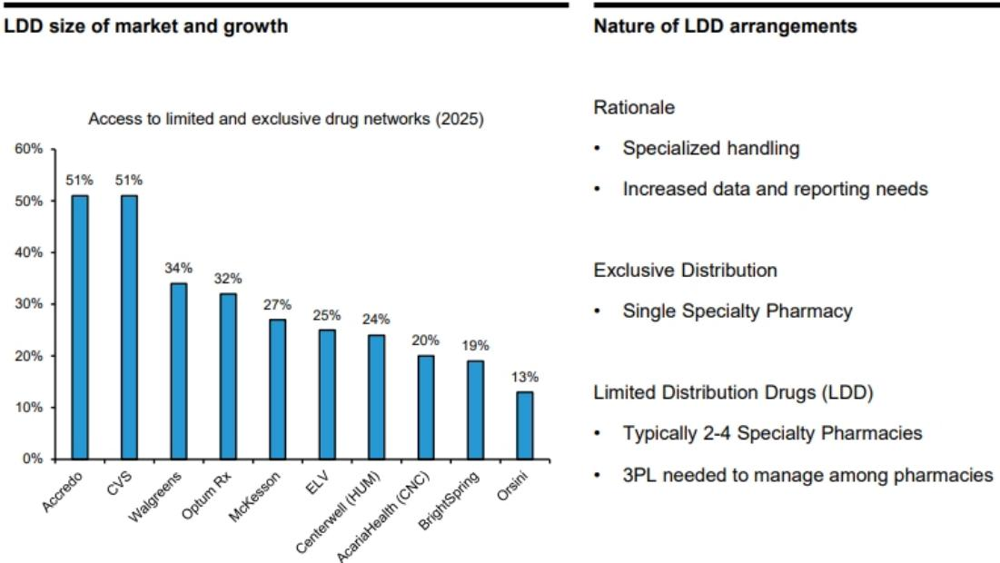
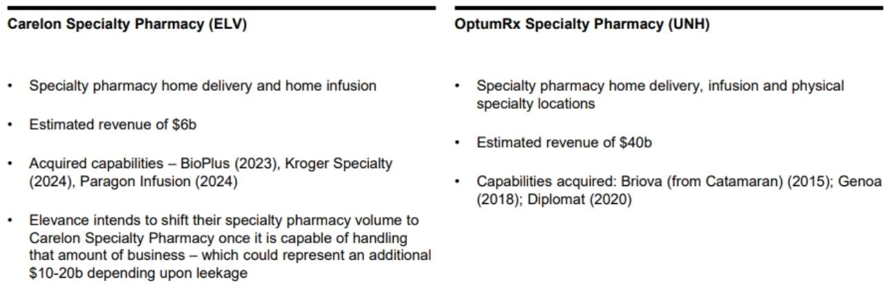
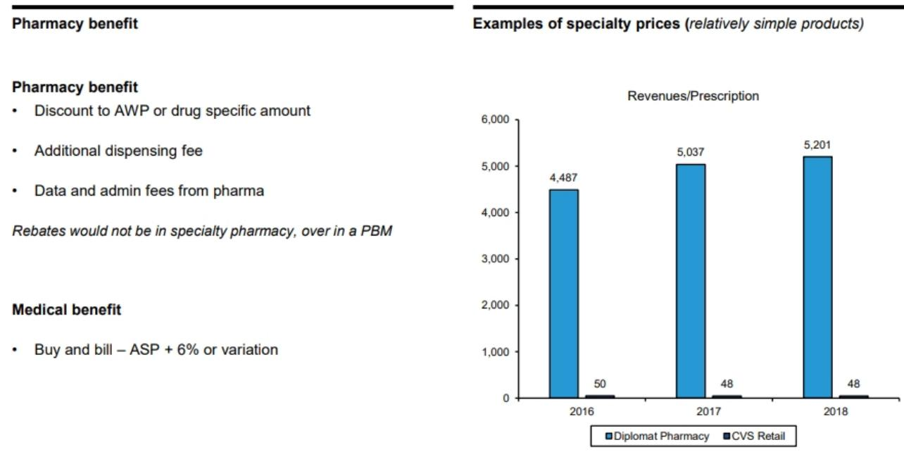

# 专业药房并非PBM的替代品：为何其商业模式的防御性比监管噪音更重要

专业药物仅占美国处方量的3-4%，却产生了超过一半的药品总支出。这一不对称性——极小比例的交易驱动了大部分资金流向——定义了一个行业，在该行业中，规模、垂直整合以及对有限分销网络的访问权比客流量或品牌认知度更能决定盈利能力。对于研究医疗健康服务领域的人来说，很容易通过PBM监管风险的视角来看待专业药房，因为最大的三家专业药房由最大的PBM所有。这种框架是一个错误。专业药房和PBM业务虽然共享所有权结构，但在经济风险敞口、政策脆弱性或竞争护城河方面几乎没有共同点。

这种区别之所以重要，是因为专业药物支出继续以每年约9%的速度增长，几乎是传统药物的四倍。新的生物疗法、基因疗法和孤儿药几乎完全通过专业渠道进入市场。与此同时，PBM商业模式——返利谈判、价差定价、处方集设计——面临的政治和监管压力前所未有地高。华盛顿的立法提案和各州的行动威胁要瓦解或重组PBM的盈利方式。但专业药房通过配药和提供临床支持来赚钱，面临的风险状况根本不同。它们执行的功能即使是PBM最严厉的批评者也认为是必要的：安全地将昂贵、复杂的药物送到患者手中。

结果是战略上的分化。PBM股票带有难以精确建模的重大监管尾部风险。相比之下，专业药房业务提供了更可预测的收益流，与药物使用趋势、生物类似药采用周期和网络合同——这些因素在很大程度上独立于PBM改革。将两者混为一谈的研究者，可能会错误定价那些在结构上比其母公司更具韧性的资产。

## 3-4%的处方量、50%的支出不对称性创造了一种商业模式，其内在可扩展性较低，但比零售药房更具防御性

专业药房的基础经济学是反直觉的。零售药房通过高处方量、便利的位置和店内商品取得成功。典型的零售药房每天处理数百张处方，每张处方产生适度的配药费和药品利润。业务依赖于吞吐量和客流量。专业药房则遵循相反的原则。它们处理的处方要少得多——仅占总处方量的极小比例——但每张处方代表数千美元的药品成本。每笔交易的收入高出几个数量级。

这种不对称性有三个结构性后果。首先，位置变得几乎无关紧要。专业药房是集中配送中心，而不是店面。它们直接将药物运送到患者家中。物理足迹是一个配有临床工作人员的仓库，而不是位于高客流街角的零售租赁点。其次，患者获取依赖于支付方网络和医生关系，而不是品牌营销或便利性。被开出每月1万美元生物制剂处方的患者，不会为了寻找等待时间最短的药房而四处比价。他们会使用其保险覆盖的任何药房，通常是其PBM拥有或关联的药房。第三，临床支持要求要高得多。专业药房团队管理预先授权、共付援助计划、依从性监测和副作用管理。这不是一个交易配药业务；这是一个需要专业知识的服务密集型运营。

防御性来自于支付方关系和临床复杂性的结合。零售药房可以被街对面开业的竞争对手复制。专业药房的竞争地位取决于与PBM的合同、与制造商就有限分销药物的关系，以及展示更好依从性结果的能力。这些更难复制，也需要更长时间来建立。

## 专业药房收入由药物配药驱动，而非返利谈判，使其在结构上较少受到PBM监管改革的影响

当今医疗健康服务中最常见的分析错误是将PBM拥有的专业药房视为PBM风险敞口的替代品。这两项业务共享一家母公司，但拥有完全不同的收入模式。PBM通过谈判从药品制造商那里获得返利以换取有利的处方集位置，并向计划发起人收取管理费来产生收入。返利模式一直受到严格审查：批评者认为PBM有动机偏好标价高、返利大的药物，而非净成本更低的替代品，并且返利并未完全转嫁给药房柜台前的患者。

专业药房不参与制造商的返利安排。它们的收入来自配药费以及药品采购成本与从PBM或计划发起人处获得的报销之间的价差。这是一个根本不同的经济引擎。一项限制返利、强制要求转嫁定价或取消价差定价的PBM改革将直接降低PBM的盈利能力。它对专业药房的配药收入几乎没有直接影响，前提是药房继续以协商好的费率配药。

有一个值得关注的注意事项。如果监管行动超出PBM改革范围，强制要求结构性分离——迫使PBM剥离其专业药房业务——那么所有权优势将消失。PBM目前通过网络设计和降低患者自付费用，将处方量引导至自己的专业药房。强制分离将消除这种受控的患者流。这是一个真实的风险，但这是对所有权结构的风险，而不是对专业药房本身基础经济学的风险。专业药房资产仍然有价值；它们只是需要凭自身实力竞争，而不是受益于内部引导。

## 有限分销药物创造了比价格竞争更持久的护城河，且由现有企业控制

并非所有专业药物都同样容易获得。复杂、高成本疗法的制造商——特别是生物制剂、基因疗法和孤儿药——通常将分销限制在少数专业药房。这些有限分销药物（LDD）为获得它们的药房带来了显著的竞争优势。制造商选择LDD合作伙伴基于临床能力、患者支持基础设施、数据收集以及管理依从性和结果的能力。价格很少是决定性因素。

逻辑很简单。推出每位患者每年花费数十万美元疗法的制造商，不能冒险让一家处理不当产品、未能监测依从性或提供差劲患者支持服务的药房来配药。临床和声誉风险太高了。因此，LDD协议往往具有粘性。一旦专业药房展示了有效管理药物分销的能力，制造商就几乎没有动力更换。

这创造了一个自我强化的循环。最大的专业药房——CVS Specialty、Accredo（由Cigna拥有）和Optum Specialty（由UnitedHealth Group拥有）——拥有赢得LDD合同的规模、临床基础设施和制造商关系。较小的竞争对手难以进入，因为他们无法展示相同水平的能力，而没有LDD合同带来的业务量，他们也无法建立这种能力。护城河不仅关乎规模；它关乎信任的积累和随时间推移证明的绩效。

对于研究者来说，这意味着专业药房的市场份额不容易被新进入者或价格竞争所颠覆。胜负取决于LDD的获取，而现有企业占据着主导地位。

## 生物类似药的采用将重塑经济组合，但在多年时间范围内，对专业药房盈利能力的净影响可能是有利的

生物类似药——在专利到期后进入市场的生物药物的近似复制品——的引入一直是专业药房经济学中最重要的进展之一。生物类似药通常以低于参考生物制剂的价格上市，有时低15-30%或更多。这降低了支付方和计划发起人的每项索赔成本。它也降低了专业药房每张处方的相对美元收入，因为报销与药品成本挂钩。

传统的担忧是生物类似药压缩了专业药房的利润率。对于单个药物而言，这种担忧在短期内是有效的。但在多年时间范围内的总体影响更为微妙，并且可能因三个原因而有利。

首先，生物类似药推动了使用量的扩大。更低的成本使更广泛的患者群体能够获得生物疗法。接受治疗的患者越多，意味着配出的处方越多，从而增加了配药量。其次，生物类似药加速了从医疗福利到药房福利覆盖的转变。许多生物制剂在医生办公室给药，并属于医疗福利覆盖范围，医生购买药物并获得报销。随着生物类似药降低成本，支付方有动力将这些疗法转移到药房福利，在那里它们可以通过专业药房配药，并对使用和依从性有更多控制。这种转变扩大了专业药房的可寻址市场。第三，生物类似药增加了依从性和患者支持的重要性。当一种药物每年花费10万美元时，患者有很强的动力坚持治疗。当生物类似药花费7万美元时，财务紧迫性降低，但临床风险仍然很高。能够展示更好依从性结果的专业药房对支付方和制造商都变得更有价值。

净效应是生物类似药降低了单位收入，但增加了数量并强化了专业药房服务的价值主张。在一个多年的周期中，该行业可能会看到更高的总处方量、通过药房福利流动的支出份额更大，以及基于临床结果的药房间更大差异化。

## 评估专业药房资产的决策框架：区分结构性赢家与周期性参与者的三个问题

对于评估专业药房业务的研究者和策略师来说，关键在于区分结构性优势和周期性顺风。三个问题提供了一个有用的框架。

首先，药房对有限分销药物的获取情况如何？这是竞争持久性最重要的决定因素。拥有广泛LDD组合的药房拥有一个免受价格竞争影响且竞争对手难以复制的收入流。主要依赖开放市场专业药物的药房面临更薄的利润率和更大的网络重新签约风险。

其次，与PBM所有者（如果有的话）的关系如何？如果药房由PBM拥有，关键变量不是PBM是否面临监管压力，而是所有权结构是否可能保持不变。强制剥离情景将消除受控的业务量优势。然而，即使在这种情况下，药房资产作为拥有现有患者关系和制造商合同的独立实体，仍保留其价值。

第三，药房如何管理生物类似药的过渡？快速将患者从参考生物制剂转换到生物类似药、在过渡期间维持依从性并捕获配药量的能力，是对运营能力的考验。有效管理这一过程的药房将获得份额；未能做到的药房将把患者输给竞争对手。

这三个问题——LDD获取、所有权稳定性和生物类似药过渡能力——比短期收入增长或利润率趋势更能提供长期价值的清晰信号，后者可能因药物上市周期和一次性合同变更而失真。

## 专业药房的结构性案例基于使用量增长和临床必要性，而非PBM保护或药品价格上涨

专业药房作为研究主题最持久的论点并非它不受颠覆影响，或它受益于高药价。而是其收入的根本驱动力——针对慢性和罕见疾病的复杂疗法的使用量——很可能因人口和科学原因而继续增长，这些原因在很大程度上独立于政策。美国人口正在老龄化。生物和细胞疗法的管线比以往任何时候都更深。罕见病的诊断能力正在提高，导致更早的识别和治疗启动。

这些趋势都不需要高药价才能对专业药房有利。即使在药品定价改革降低个别疗法成本的情景下，如果使用量继续扩大，数量效应可以抵消价格效应。关键变量不是药物的相对价格，而是接受治疗的患者数量和治疗的持续时间。

专业药房还受益于护理场所的结构性转变。随着支付方推动更低成本的场所，更多疗法正在从医院门诊部转移到医生办公室、输液中心和家庭输液。这些转变中的每一个都有利于拥有在医院外管理分销和临床支持基础设施的专业药房。特别是家庭输液领域正在快速增长，并代表着一个更高利润率、更高接触度的服务模式。

这并不意味着专业药房没有风险。强制PBM-专业药房分离的监管行动将是破坏性的。医疗保险和医疗补助报销的变化可能会压缩利润率。而行业集中在三大参与者之间，带来了为争夺PBM合同而激烈竞争可能侵蚀盈利能力的风险。但这些风险是可控的，并且在大多数情况下，已经部分反映在估值中。

对研究者来说，更重要的风险是概念性的：将专业药房视为PBM风险敞口的衍生品，而不是一个拥有自身经济学、自身竞争动态和自身增长轨迹的独特业务。这些业务是相关的，但它们不可互换。理解这种差异是朝着对美国医疗健康服务价值做出更明智评估迈出的第一步。

*仅供参考。部分内容可能基于源材料通过AI辅助生成、翻译、总结或编辑，并可能包含遗漏或错误。请独立核实。这不构成研究、法律、税务、会计或其他专业建议。*

仅供参考。部分内容可能基于源材料通过AI辅助生成、翻译、总结或编辑，并可能包含遗漏或错误。请独立核实。这不构成研究、法律、税务、会计或其他专业建议。

