# 美国中小型软件与网络安全行业研究

# 网络安全中期调查：AI驱动需求持续增长

Peter Weed

+1 917 344 8390

peter.weed@bernsteinsg.com

Armin Hadavi, CFA

+1 917 344 8463

armin.hadavi@bernsteinsg.com

Luwei Yang

+1 917 344 8342

luwei.yang@bernsteinsg.com

本文为2026年6月进行的半年一度CISO调查样本，共100位美国受访者。

2026年中CISO调查显示，网络安全支出预期增速超过IT整体增速的幅度，较2025年底调查（当时仅略高）更为显著。43%的受访者预计网络安全预算增速将快于IT预算，20%认为IT增速更快（其余持平）。这一结果与年中CIO调查中网络安全为支出增长最快类别的结论一致。金融、科技和服务行业的增长动能较强，年增速约6%（所有行业均预期增速超过4%）。超过半数的CISO上调了全年支出预期，暗示下半年支出将更为强劲，上半年基本符合此前预期。

软件是预算增长最显著的领域，但人员和托管服务的增长也不遑多让（硬件领域整体正面，但主要集中在网络安全设备）。在软件细分领域，身份安全、云安全和端点安全仍是优先投入方向。与2025年底相比，安全运营、身份安全和威胁情报的增量支出动能较强（紧随其后的是网络安全、应用安全和互联网/DDoS防护）。另一方面，尽管基线较高，端点安全的未来一年支出计划降幅位居第二，而原本增长最慢的SSE领域则出现了最大的增量疲软。其他增长较慢的领域（SIEM、邮件安全和安全浏览器）也进一步下滑。值得注意的是，网络安全、DDoS和数据安全领域的支出计划分歧最大，预算增加和削减的情况均较2025年底更为常见。

在供应商方面，超大规模云服务商的声誉普遍提升，其他供应商则保持稳定。这使得多数超大规模云服务商的声誉达到或超过大型网络安全同行的平均水平。更广泛来看，原本就备受青睐的Palo Alto和CrowdStrike的声誉小幅上升，巩固了其领先地位。Splunk是相对少见声誉下降的供应商（与SIEM支出疲软相吻合）。

在整体网络安全策略方面，向软件、供应商托管SaaS和供应商整合的转变趋势明显（涵盖SSE/SASE和更广泛的网络安全领域）。然而，对于大多数受访者而言，摆脱物理防火墙和其他基于设备的安防方案更多是未来预期而非当前现实，当前执行与未来计划之间的差距最大。硬件方面的一个例外是，分支机构和数据中心的物理网络安全设备被取代的预期最低。

GenAI对网络安全支出策略和需求紧迫性产生了重大影响。但这并非指AI编码代理自行构建解决方案并取代供应商预算。网络安全预算似乎也未受到Tokenmaxxing等更广泛的AI驱动预算压力影响。或许令人意外的是，身份安全并未成为GenAI应用的主要受益领域（与市场某些说法相反）。但我们注意到，身份安全已被列为领先的投资领域，这可能意味着其优先级已经很高，GenAI并未进一步推高。最大的AI投资领域是安全运营，尽管受到模型幻觉/准确性问题的制约。而在Mythos事件之后，应用安全预计将受到AI编码代理的显著冲击，这或许并不令人意外。

## BERNSTEIN 公司列表

<table><tr><td rowspan="2"></td><td colspan="4">2026年7月20日</td><td rowspan="2">TTM相对表现</td><td colspan="4">调整后每股收益</td><td colspan="3">调整后市盈率（倍）</td></tr><tr><td colspan="2"></td><td rowspan="2">收盘价</td><td rowspan="2">目标价</td><td colspan="4"></td><td colspan="3"></td></tr><tr><td>代码</td><td>评级</td><td>货币</td><td>表现</td><td>当前</td><td>2025A</td><td>2026E</td><td>2027E</td><td>2025A</td><td>2026E</td><td>2027E</td></tr><tr><td>NET (Cloudflare)</td><td>M</td><td>USD</td><td>272.42</td><td>136.00</td><td>19.8%</td><td>USD</td><td>0.92</td><td>1.33</td><td>1.73</td><td>294.6</td><td>205.5</td><td>157.4</td></tr><tr><td>CRWD (CrowdStrike)</td><td>M</td><td>USD</td><td>198.49</td><td>103.00</td><td>48.6%</td><td>USD</td><td>0.93</td><td>1.25</td><td>1.66</td><td>212.9</td><td>159.4</td><td>119.4</td></tr><tr><td>FTNT (Fortinet)</td><td>M</td><td>USD</td><td>160.36</td><td>92.00</td><td>33.9%</td><td>USD</td><td>2.76</td><td>3.37</td><td>3.93</td><td>58.1</td><td>47.6</td><td>40.8</td></tr><tr><td>OKTA (Okta)</td><td>O</td><td>USD</td><td>148.41</td><td>141.00</td><td>37.3%</td><td>USD</td><td>3.50</td><td>3.91</td><td>4.64</td><td>42.4</td><td>37.9</td><td>32.0</td></tr><tr><td>PANW (Palo Alto Networks)</td><td>O</td><td>USD</td><td>348.66</td><td>253.00</td><td>59.9%</td><td>USD</td><td>3.43</td><td>3.63</td><td>4.89</td><td>101.7</td><td>96.0</td><td>71.3</td></tr><tr><td>S (SentinelOne)</td><td>O</td><td>USD</td><td>19.46</td><td>19.00</td><td>(10.2)%</td><td>USD</td><td>0.20</td><td>0.36</td><td>0.59</td><td>97.1</td><td>53.6</td><td>32.8</td></tr><tr><td>ZS (Zscaler)</td><td>O</td><td>USD</td><td>149.82</td><td>224.00</td><td>(66.3)%</td><td>USD</td><td>3.28</td><td>4.21</td><td>5.42</td><td>45.7</td><td>35.6</td><td>27.7</td></tr><tr><td>SPX</td><td></td><td></td><td>7,443.28</td><td></td><td></td><td></td><td></td><td></td><td></td><td></td><td></td><td></td></tr></table>

O - 优于市场，M - 与市场持平，U - 弱于市场，NR - 未评级，CS - 暂停覆盖

CRWD、OKTA、S的基准年为2026年；

来源：Bloomberg，Bernstein估算与分析。

## 研究启示

## 目标价与研究交流未受影响。

请参考我们近期发布的关于下半年公司预期的报告。与此前观点相比，我们认为本次CISO调查中有以下几点值得关注：

- Zscaler与调查中SSE的疲软：我们认为安全服务边缘仍是企业向云优先SaaS供应商迁移的战略重点，企业希望在全球范围内实现网络安全的统一性和零信任架构的优势。但该领域的支出增长预期在所有网络安全类别中最弱。这可能意味着现有采用者已完成大部分部署，而非采用者因GenAI应用而将SSE部署优先级后移。对于现有客户，CISO似乎将SSE视为一个成熟市场，领先供应商的功能趋于同质化，采购决策转向整合而非增量扩张。在支出环境趋紧的情况下，企业往往优化现有SSE投入而非增加新功能，从而降低了该领域的支出增长紧迫性。

- CrowdStrike/SentinelOne与端点安全投资下降：我们认为端点安全仍是关键任务，但增长放缓可能与领先供应商在最新财报中的说法相悖。他们声称端点需求实际上在加速，因为GenAI催生了现代化剩余约50%尚未采用EDR企业的紧迫性。关键在于桌面AI代理需要被保护，而端点安全解决方案具备这一能力。我们怀疑这是否是一个混合信号：非采用者是强劲的净买家，而现有采用者已成熟，支出不再增长（因为他们已有EDR/XDR）。因此，支出通常集中在续约、供应商整合和平台优化，而非大规模的新部署。CISO还将增量安全预算的更大份额转向AI、身份和数据保护等新兴风险，从而降低了端点安全的相对增长。

- Okta与身份安全的信息冲突：市场说法认为身份安全是AI代理应用的关键投入——如何管理使用AI时的用户访问权限，以及无人干预的独立AI代理的权限。调查显示身份安全是较强的投资领域之一，这合乎逻辑，因为它处于现代攻击向量的中心，并随着GenAI、代理、机器身份和云原生环境的兴起而变得更加关键。但是！当被问及GenAI是否会增加身份安全支出时，CISO的认同度较为温和。我们注意到两个重要细节：1）身份安全本身已是增长最快的领域，因此这可能表明他们不确定在现有计划之外还需要做什么（特别是对于人类参与的AI，它可能使用当前用户的身份基础设施）；2）我们确实看到AI驱动身份安全支出的预期显著上升，这可能反映了率先部署AI应用和自主工作流的组织正在发现需要投入解决的增量身份问题。具体来说，他们可能发现人类和非人类身份的数量显著增加，从而增加了对IAM、PAM、IGA和机器身份解决方案的需求。与端点或SSE不同，身份安全仍受益于结构性增长和不断扩展的应用场景，使其成为CISO继续优先投入的少数安全类别之一。

## 详细分析

2026年中调查显示，CISO的网络安全预算增速超过IT预算增速的幅度加大，2026年下半年隐含增长更为强劲。整体网络安全支出未来12个月展望较2025年底调查略有改善，39%的CISO认为2026年上半年网络安全支出高于此前几个月的预期。展望2026年全年，62%的CISO认为网络安全支出预期上升，暗示下半年可能更强。仅约4%的少数受访者预期网络安全支出增长低于此前预期。从2026年增长幅度来看，分布范围较广，从低个位数到10%以上不等，43%的受访者表示网络安全增速快于IT增速（仅20%认为IT增速将超过网络安全增速）。

网络安全支出预计在2026年持续增长，尤其是软件/SaaS领域——70%的受访者预计未来12个月软件/SaaS支出将增长，几乎无人预期缩减。尽管许多软件类别预计将获得至少一定程度的增量投入，但身份安全、端点安全和云安全是最广泛预期增长的领域（55-60%的受访者）。另一方面，一些与"AI安全"叙事距离较远的主题，如SIEM和安全浏览器，增长预期最弱（20-30%预期增长）。最弱的是SSE，预期增长者不足20%——这些供应商试图讲述AI安全的故事，但当前可能未能引起共鸣。其他许多类别的预期较为相似，40-50%的受访者预期至少适度增长。人力成本预计也将上升，包括内部员工薪酬和外包/托管服务，但增速不及软件（约10%的受访者认为两者都将下降，其中多数认为将显著下降——或许这些CISO是安全运营AI工具的早期采用者？）。另一方面，基于硬件/设备的网络安全预计持平（略有上升）。但如果深入分析硬件领域，网络安全设备是相对少见预期支出适度增长的子类别。

CISO的威胁优先级正被引向多个方向。CISO继续优先考虑基于软件的网络安全和供应商托管的云交付网络安全工具。增量投入主要集中在增强现有供应商，这可能反映了对供应商冗余的担忧。

在网络安全供应商中，CrowdStrike和Palo Alto的正面评价显著高于其他供应商，超大规模云服务商AWS和Microsoft紧随其后，处于次高梯队。相比之下，我们调查的其他多数供应商声誉较为接近，略高于"平均水平"。有几个有趣的例外：Wiz和Arista的评分最低。我们还扩展询问了超大规模云服务商本身，不出所料，Amazon AWS和Microsoft Security获得了最高评分，略低于高质量纯网络安全供应商。另一方面，Oracle和Google Cloud更具争议性，低于平均水平的评分最多。

CISO普遍认为GenAI/LLM是网络安全支出增加的驱动因素，动机包括防御更复杂的AI增强攻击以及自动化安全运营和事件响应。多数CISO认为GenAI/LLM投入是净新增预算，而非取代网络安全预算。虽然许多人计划增加AI代理驱动解决方案的预算，但部分人对模型准确性和误报持谨慎态度，因此更倾向于选择成熟供应商而非新创公司。与此同时，AI对公司预算的影响呈现双重动态：先进防御机制的初期高投入成本预计将通过更快的威胁检测和自动化响应带来显著的长期节省，使公司能够转向更主动的网络安全态势。

## CISO调查显示2026年网络安全支出平均约占IT预算的8%，各行业存在差异

我们的2026年中CISO调查（6月进行）包括100位美国受访者，涵盖不同行业和企业规模（图表17）。平均而言，CISO预计2026年网络安全支出约占IT总预算的8%（图表1），与2025年底调查（2025年10-11月进行）的水平一致。多数受访者预计网络安全支出占IT支出的3%-11%，仅8位CISO预计超过12%——这一范围较上次调查略有收窄。支出最高的行业来自金融、制造、服务和公用事业，可能反映了其"关键"基础设施定位（在某些情况下，其他IT支出较低，如图表3所示）。然而，这些行业中也包含报告网络安全支出比率显著较低的受访者，突显了行业内网络安全投入的广泛差异。在3%-11%的范围内，受访者在三个支出区间分布相对均匀。

我们未观察到不同公司规模组别之间网络安全支出占IT支出比例的显著差异，平均值落在7-8%的范围内（图表2）。这与2025年底调查形成对比，当时最Daiwa最小的公司报告了最高的网络安全支出水平（均超过IT预算的8%），而中型公司仅分配6%-7%。2026年中调查中观察到的趋同可能反映了受访者样本的差异，但也可能表明年收入在10亿至100亿美元之间的公司越来越认识到网络安全作为战略优先事项的重要性。

图表1：2026年中调查显示，网络安全支出占IT支出的极端差异较2025年底调查有所缩小。整体平均值基本保持不变。

网络安全年支出占IT支出的百分比

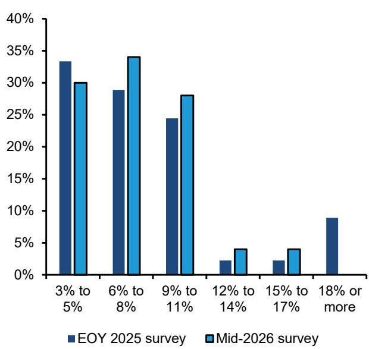  
图表2：所有收入类别的公司均显示网络安全支出占IT支出的7-8%。  
2026年平均支出预期：网络安全占IT支出的百分比，按公司收入规模划分

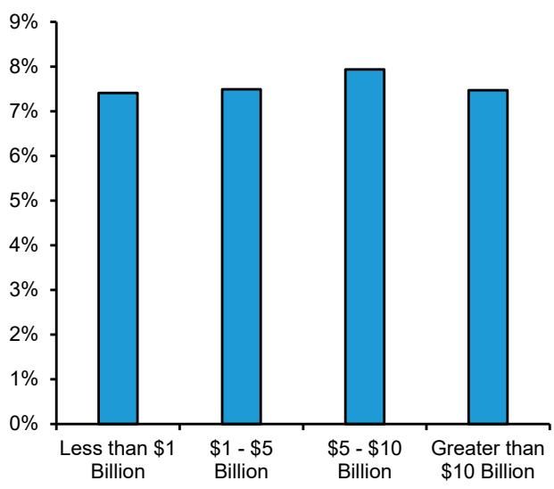  
来源：Bernstein CISO调查  
来源：Bernstein CISO调查

跨行业比较，公用事业和制造业报告IT预算中分配给网络安全的比例最高（但IT占收入的比例较小），而金融、科技和政府则在网络安全占收入比例方面支出最高（图表3）。这可能反映了这些高支出行业在监管上对关键基础设施安全的重视。这些行业经常在相关讨论中被提及。此外，科技供应商本身被期望为其客户提供外包安全服务，因此他们支出更多似乎合乎逻辑。2025年底调查也显示了类似结果，公用事业、科技和制造业是IT预算中网络安全分配比例最高的行业。另一方面，零售和媒体在两次调查中都是网络安全预算最低的行业。这些行业的技术人才配置往往低于其他行业，可能包含利润率较低的参与者，并面临持续的行业变革压力。因此，他们可能在IT方面的预算、战略重点或内部人才方面存在不足。需要指出的是，三个行业的样本量相对较小——媒体、通信和公用事业。因此，这些行业的发现应谨慎解读，可能无法完全反映更广泛的行业支出趋势。

图表3：按收入占比计算，金融、科技和政府在网络安全方面的支出最高。但在一些IT支出较小但网络安全风险真实的行业，如公用事业和制造业，其网络安全预算占IT支出的比例高于所有其他行业。

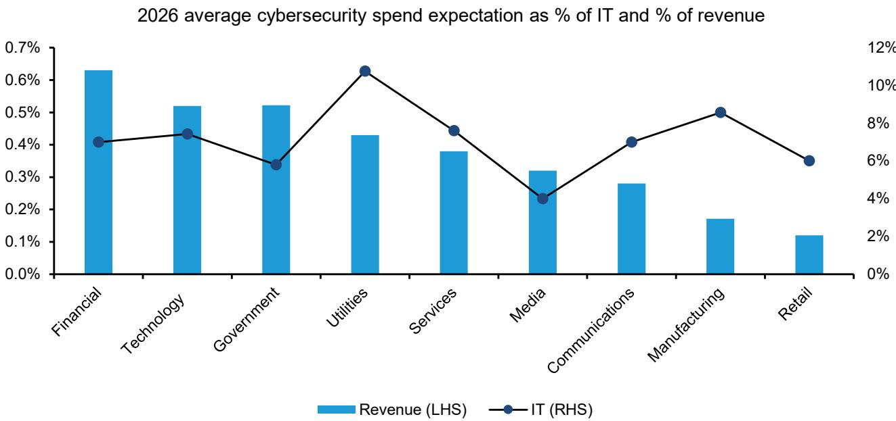  
来源：Bernstein CISO调查；Gartner和Bernstein分析

## 2026年网络安全支出预计较2025年增长7%

平均而言，CISO预计2026年网络安全支出较2025年增长7%，与2025年底调查中2024年相比的增长幅度一致。值得注意的是，绝大多数受访者不预期网络安全预算下降，突显了尽管宏观环境存在不确定性且GenAI应用需求强劲/企业关注度高，网络安全投入仍持续受到优先考虑。然而，各行业预期存在差异。制造业、零售、公用事业和通信（因样本量小，未在下方图表中显示，仅1-4家公司）中有部分受访者预测网络安全支出下降，而零售、科技和金融服务则是多数CISO预期支出增长的行业（图表4）。

43%的CISO预计2026年网络安全预算增速将快于IT总预算增速，高于2025年的约30%（图表6），仅20%预期网络安全支出增长将落后于整体IT支出。这与2025年底调查相比发生了显著变化，当时约半数受访者预期网络安全预算与整体IT支出基本同步增长。最新结果表明，网络安全在IT预算中的占比正在上升，而不仅仅是跟随整体IT支出趋势。与此观点一致，CISO对2026年上半年和全年的网络安全支出前景变得更加乐观（图表6）。有趣的是，对全年持更乐观预期的CISO数量多于对上半年，似乎预示着今年下半年网络安全预算将进一步增强。

4.7%

5.7%

图表4：CISO预计今年（2026年）网络安全预算较去年（2025年）增长约7%。

2026年较2025年网络安全总支出增长预期

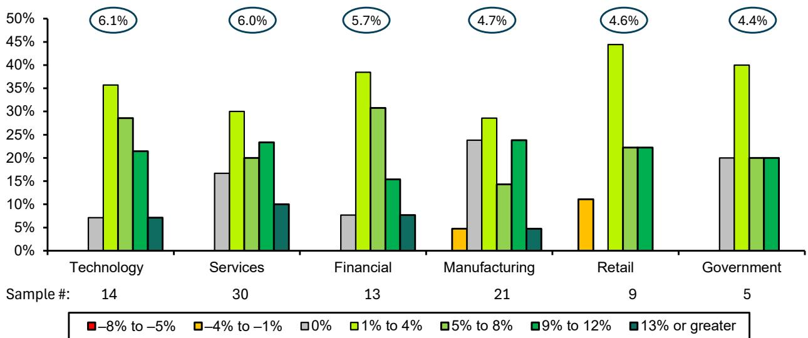  
媒体、通信和公用事业因样本量小未在图表中显示
来源：Bernstein CISO调查  
图表5：2026年中，预期网络安全增速超过IT增速的CISO比例高于六个月前的2025年底调查。  
哪个预算增长更快？  
受访者百分比

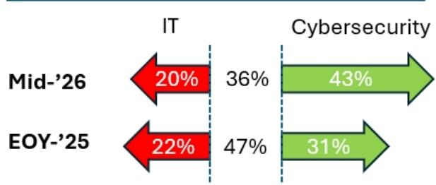  
来源：Bernstein CISO调查  
图表6：过去几个月，对2026年全年和2026年上半年的网络安全支出展望变得更加积极。  
过去几个月网络安全支出计划的变化（%）

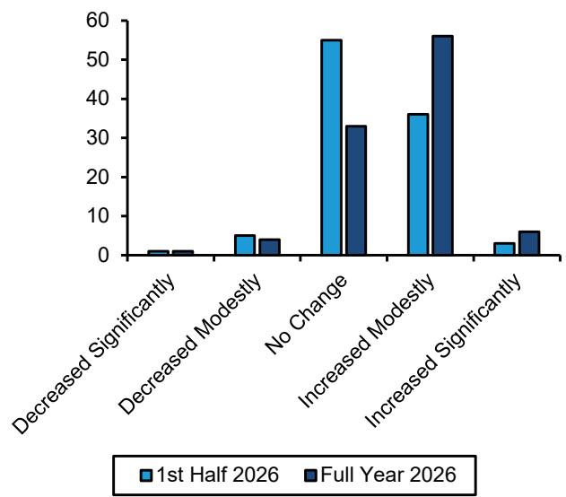  
来源：Bernstein CISO调查

## 软件为最大投资领域，重点关注身份安全与安全运营

在网络安全支出类别中，软件仍是CISO最可能在未来12个月增加投入的领域（图表7）。仅4%的受访者预期网络安全软件支出将适度下降，而19%预期减少网络安全硬件支出。这一模式与2025年底调查结果一致，表明企业继续优先考虑基于软件的安全能力，同时对硬件投入更为谨慎。人员相关支出的前景也大多正面，仅10%-15%的CISO预期员工薪酬或外包网络安全服务将减少，表明企业持续致力于维持内部专业知识和外部安全支持。

在网络安全硬件领域，网络安全设备（如防火墙）是支出意愿较强的细分领域，58%的CISO预期未来一年将增加投入（图表8）。相比之下，物理身份解决方案和基于设备的SASE/SSE部署的支出更为稳定，约80%的受访者预期这些领域的预算在未来12个月内保持不变。这些趋势与2025年底调查基本一致，表明企业继续优先考虑网络安全设备更新周期，同时维持对更成熟硬件安全类别的现有投入。

图表7：对于预期改变支出水平的CISO而言，软件最为正面，硬件最为分化。

预期未来12个月网络安全支出变化的CISO比例（%）

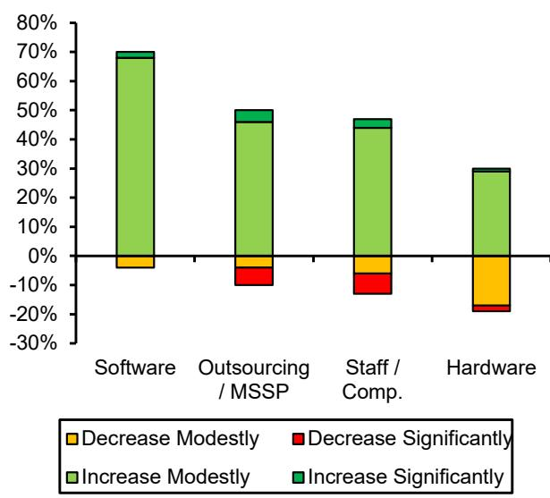  
来源：Bernstein CISO调查  
图表8：在硬件和设备领域，网络安全设备在未来12个月网络安全支出增长中受益最大。  
硬件：预期未来12个月网络安全支出变化的CISO比例（%）

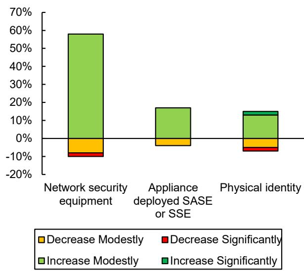  
来源：Bernstein CISO调查

在网络安全软件类别中，身份安全是增量投入最大的领域，没有CISO预期减少该类别支出。强劲的支出前景可能反映了随着企业扩大AI代理的使用，身份和访问管理的重要性日益增加。随着企业采用更多代理工作流，需要认证、授权和持续治理的非人类身份数量预计将显著增加，使身份安全成为基础性控制层。因此，预期AI代理更广泛采用的CISO也更可能优先投入身份管理能力。

云安全和端点安全是次强的投资领域。随着企业持续将工作负载迁移到云端并应对日益复杂的混合和多云环境带来的风险，云安全多年来一直是战略重点。容器化基础设施的复杂性使得掌握风险拓扑变得更加困难。在端点安全方面，普遍认为管理AI代理需要在端点层面进行访问，以处理最终用户的交互位置——因此，将端点保护从传统方案现代化为当代代理变得越来越重要（这也与CrowdStrike最近的财报评论一致）。

在光谱的另一端，DDoS、SIEM、邮件安全、安全浏览器和SSE/Web安全是增量投入关注最少的领域。我们认为这反映了这些领域不被视为与GenAI和AI代理应用相关的核心痛点——例如，我们未看到大量新创公司涌入这些领域推销AI网络安全解决方案。这些领域的供应商似乎更多是拥有成熟市场份额的传统供应商（如DDoS领域的Akamai/Cloudflare、SIEM领域的Splunk和Elastic、邮件安全领域的Proofpoint以及SSE领域的几家大型供应商）。我们注意到，邮件安全、安全浏览器和SSE领域的供应商正试图通过论证其产品在GenAI世界中的相关性和重要性来改变这一叙事——我们期待观察其优先级在未来调查中是否会改善。

图表9：在软件和SaaS领域，身份安全、云安全和端点安全在未来12个月网络安全支出增长中受益最大。

软件和SaaS：未来12个月网络安全支出变化的领域（CISO百分比）

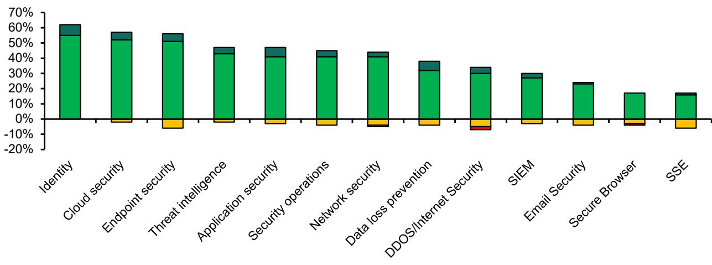  
■适度减少 ■显著减少 ■适度增加 ■显著增加  
来源：Bernstein CISO调查

图表10：原本强劲的威胁情报和身份安全领域需求进一步增加，而安全运营则从中等需求跃升至高端。另一端，原本疲软的SSE进一步走弱，而原本强劲的端点安全则是此前领先领域中相对少见出现回落的。

软件/SaaS：2026年中与2025年底相比，未来一年支出预期的净变化（-2 = 显著减少，0 = 无变化，+2 = 显著增加）

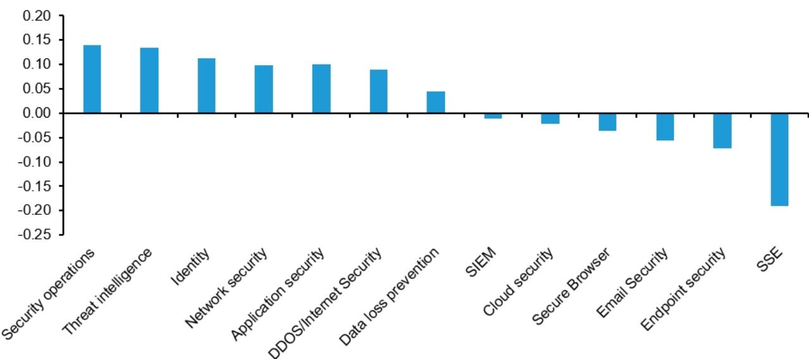  
来源：Bernstein CISO调查

中间有三个类别在支出趋势上呈现两极分化：网络安全、DDoS和DLP。这可能反映了随着企业专注于采用GenAI和AI代理，各方对其关键性和优先级存在不同看法。此外，这可能与OT（对网络安全有更高要求）的暴露程度以及公司是倾向于通过云原生容器向最终用户交付自有应用还是转向无头产品（前者需要DDoS，后者DDoS由平台自然处理）有关。最后，在数据防泄漏方面，这可能反映了对应对新兴AI代理需求的最佳方式存在困惑，以及DLP是否是正确的方法，还是需要针对AI的新方案。

图表11：在所有软件/SaaS支出类别中，有三个类别的未来12个月预期支出变化最为分化，2026年中与2025年底相比，正面和负面变化均更多。

软件/SaaS：2026年中与2025年底相比，网络安全支出预期的净变化（CISO百分比）

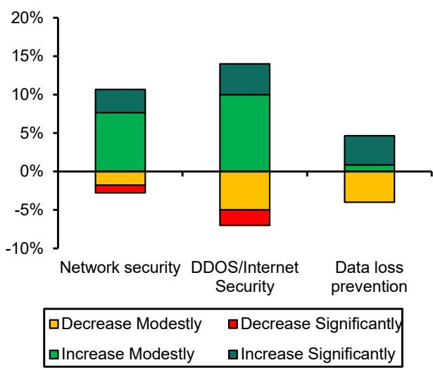  
来源：Bernstein CISO调查

## 网络安全供应商中，CrowdStrike和Palo Alto以显著优势被视为市场领导者

CrowdStrike和Palo Alto Networks在CISO对其网络安全产品质量的评分中最高（图表12），巩固了其市场领导者的地位。AWS和Microsoft的网络安全产品组合也获得正面评价，但这些云服务提供商与两家领先者之间仍存在显著认知差距。相比之下，另外两家超大规模云服务商GCP和Oracle的网络安全能力评分明显较低。在我们覆盖的范围内，SentinelOne的CISO评分最低。CyberArk的排名也低于大多数其他软件安全供应商（可能反映了其较窄的市场定位、传统的本地/自管理重点，而多数公司正在向云/SaaS迁移，或与Palo Alto收购相关的潜在摩擦/担忧）。

与2025年底调查相比，CrowdStrike和Palo Alto Networks保持了领先地位（甚至略有提升）。最显著的变化是AWS，其认知度显著提升，从上次调查中低于Splunk的位置跃升至第三名（事实上，Splunk是相对少见认知度下降的供应商）。总体而言，所有超大规模云服务商的认知度均有所提升。与此同时，CyberArk、Wiz和Arista在产品质量认知方面仍落后于其他软件供应商。

图表12：CrowdStrike、Palo Alto和AWS在供应商网络安全产品质量认知方面得分最高，且与2025年底调查相比均有所提升。

  
来源：Bernstein CISO调查

## 趋势明确：硬件减少、软件增加，供应商冗余推动平台化

CISO正越来越多地从基于硬件或设备的网络安全产品转向基于软件和虚拟化的替代方案（图表13）。这一趋势在网络安全和防火墙领域最为明显。30%的CISO正在减少或限制对基于硬件的安全解决方案的普遍使用，而58%优先考虑基于软件的网络安全产品，突显了向更灵活、面向云架构的持续迁移。

尽管多数CISO短期内不计划大幅减少对防火墙的依赖，但近60%的CISO要么已经在用云替代方案替换物理防火墙，要么预计在未来1-2年内进行。分支机构防火墙似乎是这一转型的主要起点，40%的CISO已经在减少使用物理分支机构专用防火墙，转而采用SSE、SASE或虚拟防火墙等替代方案。这一趋势对Check Point、Cisco以及Fortinet的硬件业务构成长期挑战，因为其物理防火墙产品在分支机构环境中广泛部署。

平台整合是该领域的另一个大趋势。约半数CISO对供应商冗余表示担忧，并已在优先考虑能够整合安全支出的平台，另有24%计划在未来1-2年内进行。与此偏好一致，约50%的CISO表示目前更倾向于购买集成式SASE平台，而非分别采购SSE和SD-WAN解决方案。总体而言，多数CISO继续偏好供应商托管、云交付的网络安全解决方案，而非自托管部署。我们注意到，尽管比例较小，但偏好自托管解决方案的比例有所上升，从2025年底调查的约7%增至本次调查的13%。我们不确定这是否仅为一次性变化（鉴于上次调查样本较小），还是一些组织因某些AI应用场景的运营要求而回归本地部署（我们的硬件同事一直在探讨这一假设）。

<table><tr><td>这是我们当前的做法不是当前，但可能在3年以上考虑</td><td>不是当前，但正在评估在未来1-2年内改变不是当前，未来计划中也不太可能</td></tr></table>

图表13：供应商整合（SASE优于SSE+SD-WAN）和软件定义的网络安全是当前最主导的趋势，而远离防火墙的重视程度较低。  
组织关于网络安全解决方案的策略（受访者人数）  

来源：Bernstein CISO调查

## GenAI被视为网络安全支出的推动力……但采用仍受模型准确性限制

## GenAI对网络安全预算的影响

GenAI和LLM的采用大多与现有网络安全支出并行，而非以牺牲后者为代价。超过半数的CISO不预期GenAI相关投入会取代其网络安全预算，反映了AI带来新需求而非取代现有安全优先事项的观点。在网络安全领域内，代理式安全运营是AI驱动支出的主要受益者。超过60%的CISO计划增加对AI代理驱动安全运营的预算分配，使其成为与GenAI采用相关的首要投资领域。数据和信息安全排名第二，超过40%预期预算分配将增加。相比之下，身份安全的预期更为分化：27%的CISO预期身份安全支出增速将快于整体网络安全支出，而25%预期其在网络安全总预算中的占比将下降。

图表14：公司计划用新增预算投资GenAI/LLM网络安全解决方案，而非削减现有网络安全预算。  
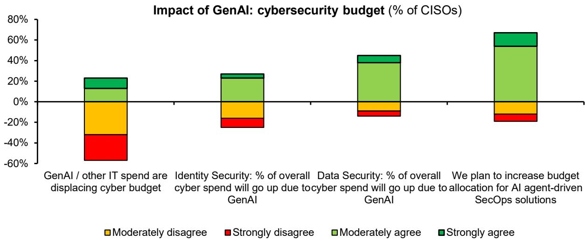  
来源：Bernstein CISO调查

## GenAI在网络安全领域的当前采用情况

超过60%的CISO认为GenAI和LLM提高了网络攻击的速度和复杂性，为其组织带来了额外的安全挑战。这一趋势也是网络安全支出持续超过整体IT预算增长的关键因素之一（图表15）。与此同时，AI编码工具正在重塑网络安全市场的部分领域。虽然多数CISO不将这些工具视为供应商托管网络安全解决方案的替代品，但23%将其视为减少对外部供应商依赖并将某些能力内部化的机会。超过半数的CISO已经看到投入从传统以开发者为中心的供应商转向代码建议平台提供的软件安全产品，增加了GitHub、GitLab和Snyk等供应商持续投资AI能力的竞争压力。

虽然多数CISO仍因对模型准确性的担忧而在采用网络安全专用GenAI/LLM方面存在限制，但约50%的CISO报告称，使用GenAI和LLM后威胁检测和响应能力有所改善。随着模型性能的提升和代理式安全运营解决方案的更广泛采用，我们预计这些收益和采用率将随时间进一步增加。

总体而言，从2025年底调查到2026年中，投资GenAI/LLM的计划显著增加（图表16）

图表15：GenAI已提升部分CISO的威胁检测和响应能力，但AI编码代理尚不足以取代网络安全供应商（传统应用安全供应商除外）

GenAI的影响：组织网络安全策略（CISO百分比）  
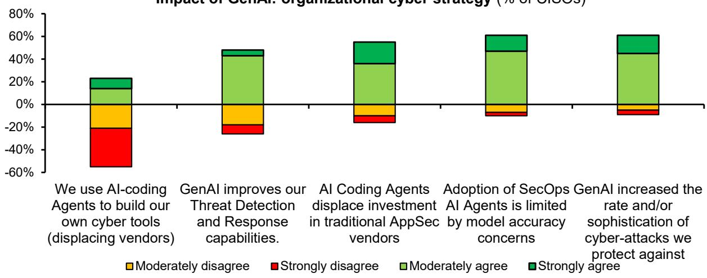  
来源：Bernstein CISO调查  
图表16：公司计划用新增预算投资GenAI/LLM网络安全解决方案。  
GenAI和LLM对组织网络安全策略的影响（加权平均：-2 = 强烈不同意，2 = 强烈同意）

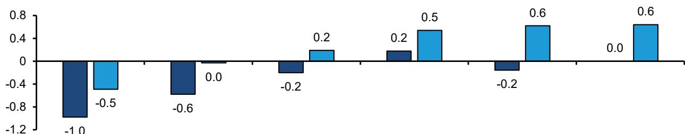  
2025年底 2026年中  
来源：Bernstein CISO调查

## 附录 - 财务预测

图表17：我们的CISO调查包括100位美国参与者，来自不同行业和年收入区间。

CISO调查人口统计：按行业和年收入划分

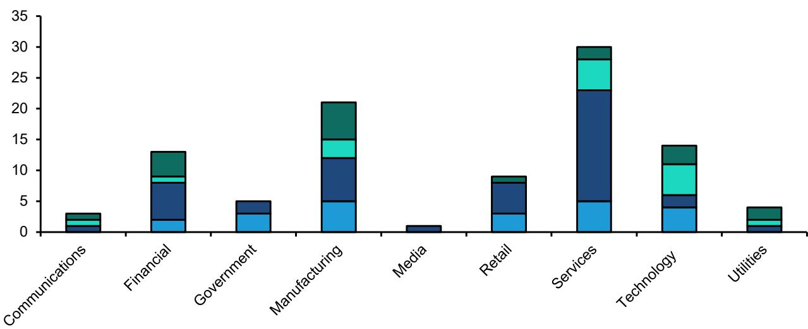  
■低于10亿美元 ■10亿 - 50亿美元 ■50亿 - 100亿美元 ■超过100亿美元  
来源：Bernstein CISO调查
