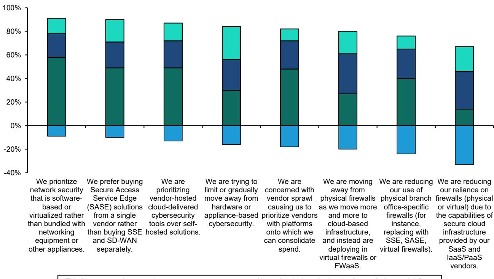
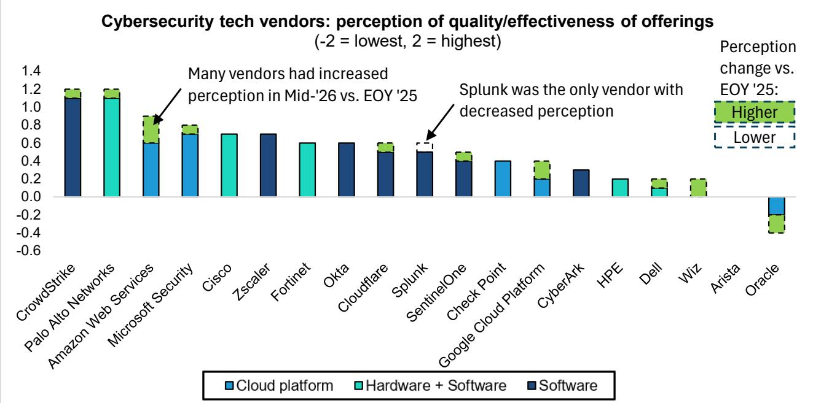

# 网络安全预算在2026年下半年加速增长，但资金流向与多数观察者的预期不同

一家全球性研究机构在2026年中进行的CISO调研揭示了一个清晰且可操作的格局：网络安全支出不仅在增长，而且相对于整体IT预算正在加速，43%的CISO预计网络安全预算将超过IT增长，而只有20%预计相反。这与2025年底的调研相比是一个显著变化，当时两者的差距要小得多。超过一半的受访者相比早期预测提高了2026年全年支出预期，这意味着下半年将明显强于上半年。总体结论对该领域是积极的。但在整体乐观情绪之下，存在一个更微妙且具有战略意义的资金重新分配，这将使一些供应商受益，而另一些则面临挑战。

这项针对100位美国CISO的调研于2026年6月进行，显示平均网络安全支出目前约占IT总预算的8%，与之前的调研一致，但分布更为集中。较强劲的增长动力集中在金融、科技和服务行业，这些行业均预计同比增长约6%。没有行业预计增长低于4%。然而，真正的故事不在于总体数字，而在于这些增量资金被导向何处，以及被 withheld 在何处。软件和SaaS是明显的赢家，70%的受访者预计该类别将增长，几乎没有人预计会下降。员工和托管服务也呈积极态势，但落后于软件。除网络安全设备外，硬件基本持平。其战略含义是，基于设备的网络安全时代正在缓慢结束，尽管这一转变比叙事所暗示的要更为渐进。

## 生成式AI正在推动全新的网络安全预算增长，而非对现有支出的替代

调研中最重要的结构性发现是，CISO普遍将生成式AI和大语言模型视为网络安全支出*增加*的驱动力，而非预算替代的来源。大多数受访者认为，与生成式AI相关的网络安全投资是全新的预算。它们并未取代端点保护、身份管理或云安全方面的现有分配。这直接反驳了市场上一直存在的担忧：即AI基础设施的巨大资本需求会挤占包括安全在内的其他IT支出。调研数据显示了相反的情况。CISO受到两个不同因素的驱动：需要防御由AI增强的复杂攻击，以及希望自动化安全运营和事件响应。两者都创造了增量需求。

在这一生成式AI驱动的浪潮中，最大的近期受益者是安全运营（SecOps）。这符合直觉。CISO将AI视为增强其超负荷分析师团队的工具，提高检测速度并缩短平均响应时间。然而，有一个重要的注意事项：对模型幻觉和准确性的担忧正在抑制热情。CISO并未急于采用来自未经证实初创公司的方案。他们更青睐在安全分析和威胁检测方面有良好记录的成熟供应商。这种对现有供应商的偏好是调研中反复出现的主题，并对供应商选择有直接影响。

也许最令人惊讶的发现，也是与流行市场叙事相矛盾的发现是，身份管理并未成为生成式AI应用的显著增量受益者。这并不是因为身份管理不重要——它仍然是整体三大优先事项之一，与云安全和端点保护并列。相反，调研表明，对于大多数组织而言，现有的身份基础设施被认为足以应对当前以人为中心的AI使用浪潮。增量身份问题——管理机器身份、非人类账户和自主代理权限——才刚刚开始浮现。当CISO被直接问及生成式AI是否会增加身份支出时，调研数据显示了适度的认同，但这可能反映了身份管理*已经*是一个增长领域。CISO可能只是不确定除了现有计划之外还需要哪些增量投入。然而，对于AI驱动应用和自主工作流的早期采用者，调研确实检测到预期的更强提升。这些组织发现人类和非人类身份的数量显著增加，为IAM、PAM、IGA和机器身份解决方案创造了新的需求。其含义是身份支出将加速，但存在滞后。市场目前低估了这一二阶效应。

## 较强的软件类别是身份、云安全和端点，但端点的相对增长正在放缓

纵观整个软件领域，三个类别主导了优先事项列表：身份、云安全和端点保护。55%至60%的CISO预计在未来十二个月内将增加这些领域的支出。这与已经持续数年的结构性驱动因素一致：云迁移仍在继续，身份仍是新的边界，端点安全至关重要。然而，调研揭示了这一高质量梯队内部的关键分化。端点安全尽管基线强劲，但与2025年底的调研相比，其积极支出计划的降幅位居第二。这是一个反直觉的信号，尤其是考虑到领先的端点供应商最近声称，在生成式AI的推动下，需求实际上正在加速——其论点是桌面AI代理需要被保护，而端点解决方案完全有能力做到这一点。

调研表明了一个更微妙的现实。存在两个不同的买家群体。大约50%尚未采用现代端点检测和响应（EDR）的企业仍然是强劲的净买家。对他们而言，生成式AI带来的紧迫性是真实的。但对于另一半已经部署了EDR或XDR的企业，支出主要集中在续约、供应商整合和平台优化上，而非大规模的新部署。增量预算正流向其他地方——面向新兴风险，如AI安全、数据保护和身份。因此，尽管端点支出的相对重要性很高，但其增长率正在放缓。观察者应谨慎将非采用者群体的强劲采用叙事外推到整个市场。

## SSE支出是最弱的类别，挑战了一个关键的市场叙事

调研中最引人注目的负面发现与安全服务边缘（SSE）有关。该类别在我们测试的所有网络安全细分领域中增长预期最低，只有不到20%的CISO预计会增长。这是一个重要信号，因为许多供应商将SSE定位为向云优先架构转型企业的战略优先事项。调研数据表明了一个不同的现实。对于现有采用者，组织已基本完成其初始部署。对于非采用者，与生成式AI采用相关的近期优先事项将SSE的部署推后。更根本的是，CISO似乎将SSE视为一个成熟的市场，领先供应商之间的功能正在趋同。购买决策正转向整合而非增量扩展。在支出环境趋紧的情况下，组织正在优化现有的SSE投入，而非增加新功能。这降低了相对于其他类别的支出增长紧迫性。

对于SSE领域的供应商，特别是那些围绕该类别构建增长叙事的供应商，其含义是发人深省的。调研并未表明SSE正在消亡，但它确实表明，对于相当一部分可寻址市场而言，高增长阶段已经过去。能够成功的供应商将是那些能够将叙事转向相邻用例的供应商——或许围绕AI数据保护或机器身份的安全访问——而非仅仅依赖核心SSE价值主张。

## 供应商声誉动态有利于现有企业和超大规模云服务商，但有一个显著例外

调研的供应商声誉数据强化了现有企业优势的主题。CrowdStrike和Palo Alto Networks在所有网络安全供应商中继续拥有最积极的声誉，在已经很高的水平上略有上升。这巩固了它们的领先地位，并表明它们在整合驱动的环境中处于有利地位，能够获取份额。超大规模云服务商——特别是AWS和微软——也获得了高分，略低于高质量纯安全供应商。这与向平台化安全解决方案和供应商托管SaaS发展的更广泛趋势一致。

显著的例外是Splunk，它是相对少见声誉下降的供应商。这与调研发现SIEM支出是增长最不积极的类别之一相吻合。Splunk的下降是一个警示故事，说明与CISO认为成熟或遗留的类别相关联的风险。调研还显示，在我们询问的网络安全特定供应商中，Wiz和Arista的声誉得分最低，尽管这些较新进入者的样本量较小，应谨慎解读。

## 观察者的决策框架：评估任何网络安全公司时要问的三个问题

调研数据可以提炼为一个简单但强大的决策框架，用于评估网络安全公司。观察者应就这一领域的任何供应商提出三个问题。

第一，该公司的核心类别是经历支出意愿的加速还是减速？调研提供了明确的方向性信号。身份、云安全和SecOps正在加速。端点和SSE相对于其自身基线正在减速。SIEM、电子邮件安全和安全浏览器处于最弱的位置。处于减速类别的供应商需要一个令人信服的理由来相信它可以超越该类别，无论是通过份额增长还是平台扩展。

第二，该公司是否能够抓住生成式AI驱动的增量预算，还是在为一个静态的资金池竞争？调研明确指出，生成式AI正在创造全新的预算，而不仅仅是转移现有资金。但这些新预算不成比例地流向了SecOps、威胁情报和应用安全。能够将其产品与AI驱动的自动化、AI增强的威胁检测或AI代理本身的安全性可信地联系起来的供应商将拥有结构性优势。那些不能的供应商可能会发现自己正在为增长较慢的那部分蛋糕而竞争。

第三，该公司是否拥有在整合环境中获胜的声誉？调研显示，CISO对供应商泛滥感到沮丧，并且越来越专注于增强现有供应商而非增加新供应商。CrowdStrike和Palo Alto Networks受益于这种动态。较小、较新的供应商面临艰巨挑战，除非它们解决一个真正新的且紧迫的需求。调研表明，由AI编码代理的兴起驱动的应用安全，正是预期会发生颠覆的领域之一。该领域的供应商可能是整合规则的一个例外。

## 总结：网络安全支出强劲，但构成变化比总量更重要

2026年中的CISO调研描绘了一个健康且加速增长的网络安全市场。预算增长快于IT，下半年将强于上半年，生成式AI正在创造真正的增量需求。但广泛、类别无关的增长时代已经结束。资金正流向特定领域：软件优于硬件，身份和云安全优于端点和SSE，成熟的平台供应商优于单点解决方案。CISO正在优先考虑整合、自动化和对AI驱动攻击面的防御。对于观察者而言，赢家将是那些与这些结构性转变保持一致的公司，而非那些依赖网络安全总支出的上升潮来提升所有船只的公司。

*仅供参考。部分内容可能基于源材料通过AI辅助生成、翻译、总结或编辑，可能存在遗漏或错误。请独立核实。这不构成研究、法律、税务、会计或其他专业建议。*

仅供参考。部分内容可能基于源材料通过AI辅助生成、翻译、总结或编辑，可能存在遗漏或错误。请独立核实。这不构成研究、法律、税务、会计或其他专业建议。

