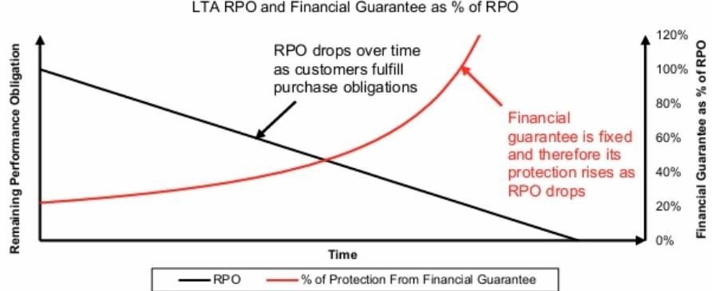
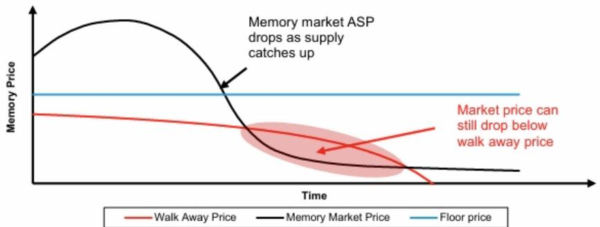
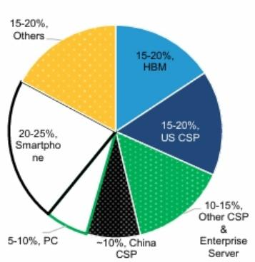
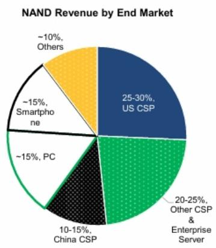
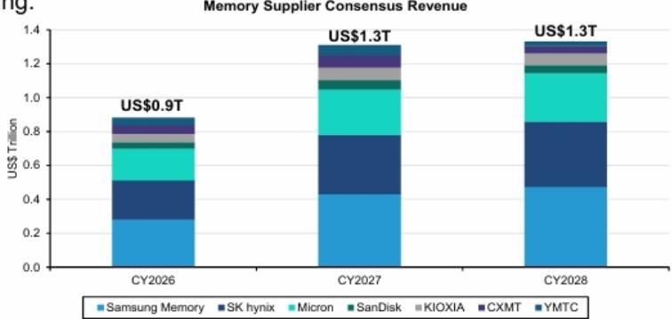
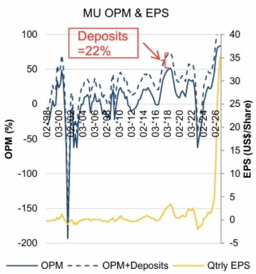
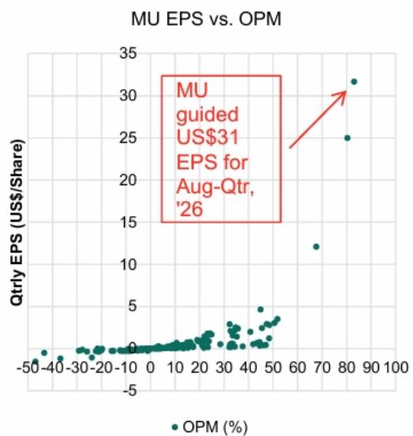
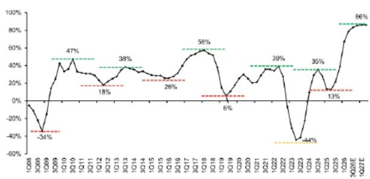
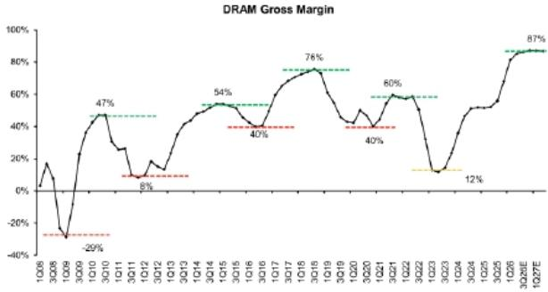

# 全球存储行业观察

## 新一代存储长期协议（LTA）第三部分：多空观点讨论——网络研讨会幻灯片、文字记录与摘要

Mark C. Newman
+1 212 845 7822
mark.newman@bernsteinsg.com

Mark Li
+852 2123 2645
mark.li@bernsteinsg.com

April Li
+1 917 344 8339
april.li@bernsteinsg.com

Phoebe Sun
+1 917 344 8481
phoebe.sun@bernsteinsg.com

Edward Hou, CFA
+852 2123 2623
edward.hou@bernsteinsg.com

Yipin Cai, CFA
+852 2123 2669
yipin.cai@bernsteinsg.com

在深入探讨新一代存储长期协议（LTA）之后（参见第一部分和第二部分），我们于7月9日举办了题为"新一代存储长期协议——半满还是半空？"的网络研讨会。本报告总结了研讨会内容，附有幻灯片和问答环节。回放可在此处获取。

长期协议不会消除存储行业的周期性，但可以通过提高盈利底线、改善收入和利润的可见性，显著降低下行周期的严重程度。长期协议的有效性最终取决于所收取的财务担保是否足够大，足以抵消客户以更低市场价格购买存储产品所能实现的节省。长期协议可以提供有意义的下跌保护，但如果市场价格大幅下跌，仍存在被放弃的风险。

虽然长期协议不太可能渗透到整个终端市场，但最倾向于签署这些协议的客户——超大规模云服务商和AI基础设施提供商——也是行业中质量较高的交易对手。凭借强劲的资产负债表、多元化的收入来源以及确保长期供应的战略动机，这些客户可能更有能力履行其承诺。不过，美光（Micron）入股Anthropic是供应商融资和风险放大的一个例子。此外，与以往因囤积库存或重复下单而膨胀的半导体周期不同，当前的需求更多地受到AI基础设施实际部署的支撑。

尽管相对于这些协议旨在保护的庞大多年收入流而言，财务担保似乎规模不大，但这些新一代存储长期协议的保护力度会随着时间的推移而增强，因为担保是后端加重的。随着剩余采购义务的减少，违约的财务成本相对于合同价值会增加。因此，在协议后期（最需要保护的时候！），下跌保护可以显著改善。

在行业基本面方面，我们对中短期存储供需格局持建设性看法。我们预计中国新进入者不会在未来两年内对市场造成重大干扰，行业供应增长主要由成熟现有企业的资本支出决策驱动。我们还预计，随着传统存储产品利润率的提高，HBM的定价将走高。观点分歧在于NAND：亚洲团队更为谨慎，认为AI需求对DRAM的利好不成比例，且中国竞争在NAND领域构成更大的长期风险。美国团队认为，AI工作负载正变得越来越NAND密集型，因为上下文窗口更大、存储需求不断增长，在供应受限的背景下创造了有利的供需格局。

我们注意到存储供应商在对待长期协议方面存在明显分歧。SanDisk和美光在推动附带财务担保的协议方面最为积极，而亚洲供应商则采取了更具选择性的方式。展望未来，两个团队都认为，进一步的长期协议披露、存储产品平均售价以及SanDisk即将举行的分析师日，将是可能塑造读者对长期协议和存储行业估值看法的关键催化剂。

## BERNSTEIN 股票代码表

<table><tr><td rowspan="2">股票代码</td><td rowspan="2">评级</td><td colspan="4">2026年7月17日</td><td rowspan="2">TTM相对表现</td><td colspan="4">报告每股收益</td><td colspan="3">报告市盈率（倍）</td></tr><tr><td>货币</td><td>收盘价</td><td>目标价</td><td>表现</td><td>货币</td><td>2025A</td><td>2026E</td><td>2027E</td><td>2025A</td><td>2026E</td><td>2027E</td></tr><tr><td>SNDK (SanDisk)</td><td>O</td><td>USD</td><td>1,354.82</td><td>3,000.00</td><td>3092.8%</td><td>USD</td><td>2.99</td><td>65.43</td><td>243.73</td><td></td><td>453.1</td><td>20.7</td><td>5.6</td></tr><tr><td>005930.KS (SEC-三星)</td><td>O</td><td>KRW</td><td>253,500</td><td>440,000</td><td>237.0%</td><td>KRW</td><td>6,611.53</td><td>48,393</td><td>77,273</td><td></td><td>38.3</td><td>5.2</td><td>3.3</td></tr><tr><td>005935.KS (SEC-Pref - 三星)</td><td>O</td><td>KRW</td><td>172,000</td><td>374,000</td><td>180.8%</td><td>KRW</td><td>6,611.53</td><td>48,393</td><td>77,273</td><td></td><td>26.0</td><td>3.6</td><td>2.2</td></tr><tr><td>SMSN.LI (三星)</td><td>O</td><td>USD</td><td>4,200.00</td><td>7,350.00</td><td>217.3%</td><td>USD</td><td>116.15</td><td>812.39</td><td>1,290.80</td><td></td><td>36.2</td><td>5.2</td><td>3.3</td></tr><tr><td>000660.KS (SK海力士)</td><td>O</td><td>KRW</td><td>1,830,000</td><td>3,300,000</td><td>533.2%</td><td>KRW</td><td>60,341</td><td>395,677</td><td>568,862</td><td></td><td>30.3</td><td>4.6</td><td>3.2</td></tr><tr><td>MU (美光)</td><td>O</td><td>USD</td><td>848.95</td><td>1,300.00</td><td>623.7%</td><td>USD</td><td>8.29</td><td>67.39</td><td>158.99</td><td></td><td>102.5</td><td>12.6</td><td>5.3</td></tr><tr><td>285A.JP (铠侠)</td><td>U</td><td>JPY</td><td>52,110</td><td>40,000</td><td>2087.2%</td><td>JPY</td><td>1,014.00</td><td>10,013</td><td>9,656.84</td><td></td><td>51.4</td><td>5.2</td><td>5.4</td></tr><tr><td>SPX</td><td></td><td></td><td>7,457.69</td><td></td><td></td><td></td><td></td><td></td><td></td><td></td><td></td><td></td><td></td></tr><tr><td>ASIAX</td><td></td><td></td><td>1,865.18</td><td></td><td></td><td></td><td></td><td></td><td></td><td></td><td></td><td></td><td></td></tr><tr><td>EM</td><td></td><td></td><td>1,732.38</td><td></td><td></td><td></td><td></td><td></td><td></td><td></td><td></td><td></td><td></td></tr></table>

O - 跑赢大盘，M - 与大盘持平，U - 跑输大盘，NR - 未评级，CS - 暂停覆盖
SNDK、MU的估值为调整后每股收益；SNDK、MU的估值为调整后市盈率（倍）；

来源：彭博社、Bernstein估计与分析。

## 研究启示

我们对SNDK给予跑赢大盘评级，目标价3000美元。

三星电子：我们对三星电子给予跑赢大盘评级，目标价440,000韩元。

SK海力士：我们对SK海力士给予跑赢大盘评级，目标价3,300,000韩元。

美光：我们对美光给予跑赢大盘评级，目标价1,300.00美元。

铠侠：我们对铠侠给予跑输大盘评级，目标价40,000日元。

## 目录

第一部分：多空观点....3
空头论点：长期协议的限制与约束....3
多头论点：新一代存储长期协议的益处与保护....11
第二部分：问答环节....18

## 详情

在深入探讨新一代存储长期协议（LTA）之后（参见第一部分和第二部分），我们于7月9日举办了题为"新一代存储长期协议——半满还是半空？"的网络研讨会。本报告总结了研讨会内容，附有幻灯片和问答环节。回放可在此处获取。

网络研讨会由美国IT硬件分析师Mark Newman和亚洲半导体、设备及全球存储分析师Mark Li主讲。Mark Newman的幻灯片请参见此处。Mark Li的幻灯片请参见此处。

## 第一部分：多空观点

## 空头论点：长期协议的限制与约束

长期协议只有在违约的财务惩罚超过客户通过在其他地方购买存储产品所能获得的节省时，才能保护未来收入。当放弃的担保或其他惩罚使违约变得不经济时，客户通常会履行这些协议。然而，如果现货价格跌至远低于合同价格，节省的费用可能超过惩罚，使违约在财务上变得合理。因此，长期协议的有效性不仅取决于合同的存在，还取决于其经济条款在市场条件变化时是否仍然具有足够的约束力。长期协议的真实保护价值难以量化。相关变量都随时间变化：市场价格、合同底价、剩余采购义务以及任何担保的余额。由于读者不知道这些变量在每个协议生命周期内如何演变，计算确切的下跌保护金额更像是一个概念性练习，而非精确的分析工作。

并非每个客户都是长期协议的自然候选者。超大规模云服务商和HBM客户有强烈的动机提前数年确保供应，而消费电子公司、交易型买家以及一些中国客户通常优先考虑灵活性和最低成本采购。因此，即使在乐观的采用假设下，相当一部分存储需求可能仍将处于长期协议之外，并暴露于行业繁荣与萧条的传统力量之下。

迄今为止披露的保护金额相对于其旨在保护的对象而言似乎很小。存储供应商正在讨论跨越数年并支撑巨大未来收入流的协议。然而，迄今为止宣布的担保仅占该收入基础的一小部分。这并不意味着长期协议毫无价值，而是读者可能夸大了当前担保水平实际提供的保护程度。保护周期高峰期的盈利需要客户做出完全不同规模的承诺。如果目标是通过严重下行周期维持当前的盈利能力，那么需要预先投入的资本数额是巨大的。一旦将这些数字与行业多年的收入机会相比较，所需的担保开始看起来以数千亿计——甚至可能更多。

长期协议可以缓和周期，但不能取代有利的行业基本面。最大的好处可能只是降低未来下行周期的严重程度。历史上可能变得深度为负的利润率，反而可能保持在盈亏平衡附近。但要多年维持高盈利，仍然需要存储行业一直需要的东西：供需之间的持久失衡。长期协议可以在边际上有所帮助，但它们本身无法创造这种失衡。

图表1：美光和SanDisk就财务协议受益方发布的指引存在差异

# 关于财务担保的运作方式，美光和SanDisk的指引明显不同

\- SanDisk表示财务担保将保持固定金额。这意味着随着剩余采购义务（RPO）随时间减少，财务担保/RPO的比率上升，为客户放弃长期协议设置了越来越高的门槛。

\- 然而，美光表示担保将按照预定的时间表返还给客户，该时间表偏向长期协议的后半段。

<table><tr><td></td><td>美光</td><td>SanDisk</td><td>铠侠</td></tr><tr><td>已签署协议数量</td><td>截至2026年6月共16份，包括4个非常大的客户和3个中等规模的客户</td><td>5笔交易，FQ3有3笔，FQ4迄今有2笔</td><td></td></tr><tr><td>最低价格下的总RPO（十亿美元）</td><td>其中14笔交易为1000亿</td><td>3笔交易为420亿</td><td></td></tr><tr><td>合同期限</td><td>通常为5年，从CY26到CY30。汽车客户通常为3年</td><td>最长5年，从FY27开始</td><td>多年期，从CY27开始</td></tr><tr><td>长期协议覆盖范围</td><td>完成后，预计一半或以上收入将处于长期协议下。总体而言，16份长期协议在5年内覆盖美光20%的DRAM产量和1/3的NAND产量。</td><td>5笔交易将占SNDK FY27比特需求的1/3</td><td>计划覆盖CY28出货量的约50%</td></tr><tr><td>定价承诺</td><td>最大的长期协议通常有CQ2市场价格的上限，以及保证利润率远高于过去峰值水平的底价</td><td>固定和可变定价的组合</td><td></td></tr><tr><td>财务担保（十亿美元）</td><td>220亿</td><td>110亿</td><td></td></tr><tr><td>财务担保的返还</td><td>财务担保将按照预定的时间表返还给客户，该时间表偏向长期协议的后半段</td><td>财务担保可能在长期协议整个生命周期内保持不变</td><td></td></tr></table>

注：RPO = 剩余履约义务
来源：公司报告和Bernstein分析

来源：公司报告和Bernstein分析

图表2：合同细节与存储价格随时间变化决定长期协议有效性

# 长期协议的有效性取决于合同细节和随时间变化的价格，无法以自下而上的方式评估

\- 触发客户放弃长期协议的条件

\- RPO - 市场价格 * 剩余数量 > 剩余财务担保，或

\- （底价 – 市场价格）* 剩余数量 > 剩余财务担保

\- 因此，只要剩余数量 > 0，如果市场价格相对于底价足够低，从数学上讲就有可能放弃。

• 长期协议的有效性 = 剩余财务担保 - [（底价 - 市场价格）* 剩余数量] 随时间变化的积分，没有细节就无法量化。

来源：Bernstein分析

长期协议RPO和财务担保占RPO的百分比

图表3：存在存储市场条件，客户可以通过退出长期协议获益
即使财务担保的保护随时间增强，从数学上讲，存储价格下跌仍可能触发客户放弃长期协议

存储市场价格与长期协议底价及放弃价格

来源：公司报告、Bernstein估计与分析

来源：公司报告、Bernstein估计与分析

## 图表4：长期协议渗透率存在上限

## 随着更多谈判的结束，最终有多少存储业务可以被长期协议覆盖？

\- 我们了解到，与美国云服务提供商的谈判大多已完成，与中国云服务提供商的谈判仍在进行中。企业和消费客户将随后跟进。

\- 在最近的一次活动中，SanDisk首席财务官表示，消费业务"更具交易性"，这些长期协议"并不真正适用"。

\- 中国客户应更倾向于与中国供应商签署长期协议，这些供应商将占据市场越来越大的份额。

\- 因此，也许市场中有30-50%永远无法被长期协议覆盖？

按终端市场划分的DRAM收入

按终端市场划分的NAND收入

来源：公司报告、Gartner、TrendForce、Bernstein估计与分析
来源：公司报告、Gartner、TrendForce、Bernstein估计与分析

## 图表5：当前长期协议存款水平似乎不足以结构性降低盈利波动

# 自上而下看，迄今为止存款不到需要保护收入的1%，长期协议能否足以避免盈利波动？

\- 市场共识预计存储公司在CY27和CY28的年收入为1.3万亿美元。

\- 如果长期协议能将这一年度收入维持3-5年，则长期协议需要保护约5.2万亿美元。

\- 迄今为止的担保仅为330亿美元，即受保护金额的0.6%。

\- 三星和SK海力士可能会获得更多担保，但这不太可能产生实质性影响。

\- 即使受保护金额的20%也是1万亿美元。谁能预先提供如此巨额的存款？

\- MU-Anthropic交易凸显了对存储的需求，但通过股权参与实现——即供应商融资。
存储供应商共识收入

注：CXMT和YMTC的收入基于Bernstein估计
来源：公司报告、彭博社、Bernstein估计与分析

来源：公司报告、彭博社、Bernstein估计与分析

## 图表6：担保可以提升低谷经济状况，但无法消除存储盈利周期性

财务担保使下行周期更可承受，并激励产能扩张，但无法将盈利维持在非常高的水平

\- 客户放弃的存款应使低谷利润率更可承受，例如营业利润率0-30%（从-10%到10%），如果我们忽略美光历史上最糟糕的两个案例。

\- 如果营业利润率为0-30%，那么每股收益将仅为当前每股收益运行率的1/10。

来源：公司报告、彭博社、Bernstein估计与分析

来源：公司报告、彭博社、Bernstein估计与分析

## 图表7：空头案例总结

## 总结

\- 要使长期协议具有效力，预先进存款至关重要，但我们认为没有人能拿出如此巨额的预付款来维持高盈利3-5年，可能连一年都维持不了。

\- 长期协议有助于缓解下行风险，但无法维持盈利。

• 对半导体资本设备有利，但对存储股票来说还不够。

\- 持续的短缺才能维持盈利。也就是说，要使盈利具有结构性，短缺必须是结构性的。

来源：Bernstein分析

## 多头论点：新一代存储长期协议的益处与保护

当今的存储长期协议与读者所指的许多失败的合同结构有着根本不同。过去的例子往往缺乏有意义的财务担保。在某些情况下，客户可以几乎不承担后果地放弃协议；在其他情况下，供应商在技术上拥有合同保护，但不得不花费数年时间在法庭上试图追回损失。这些经历让读者自然产生怀疑，但当前的协议结构截然不同。

最重要的区别在于存在预先进财务承诺。客户不仅仅是承诺未来的购买。他们正在存入具有即时经济价值的存款和担保。这为违约创造了切实的成本，并为供应商提供了许多早期半导体合同从未有过的保护。

担保的结构随着时间的推移而变得更强。这些协议的一个关键特征是财务承诺是后端加重的。随着剩余采购义务的减少，担保提供的相对保护增加。到合同的后期，客户可能需要放弃大量价值才能摆脱一个小得多的剩余承诺。

交易对手的质量是另一个重要区别。许多这些合同是与拥有异常强劲资产负债表的超大规模云服务商和其他大型科技公司签署的。与一些历史上客户财务紧张的案例不同，这些交易对手被视为高度可信且负责任的。这使得合同从一开始就更加可信，即使超出已提供抵押品的任何短缺，实际上也是可以追回的。

需求背景看起来也与以往的行业案例根本不同。在过去的几个案例中，长期协议在需求被证明因库存囤积、重复下单或疫情时期的供应链行为而人为膨胀后瓦解。然而，当前的存储需求是由实际消费而非暂时性扭曲驱动的。此外，需求与AI基础设施以及快速增长的训练/推理需求相关联，这意味着存储具有指数级的扩展潜力。

即使在非常严苛的假设下，长期协议似乎也能提供有意义的下跌保护。我们的压力测试假设存储价格严重下跌，并且重要的是，允许客户在经济上合理时放弃协议。尽管有这些假设，盈利仍比没有长期协议的世界要好得多。合同并不能消除下行风险，但它们确实显著降低了风险，尤其是在后期年份。

分析可能实际上低估了这些协议在现实世界中的有效性。模型通常假设客户以完美的经济理性行事，并忽略大多数非财务考虑因素。在现实中，客户可能会考虑诉讼风险、声誉损害、未来供应获取以及维持战略供应商关系的重要性。这些因素可能会显著提高放弃协议的门槛。

这并不意味着存储周期性消失，但它将被显著削弱。价格仍可能下跌，盈利仍可能下降，合同在适当情况下仍可能被打破。我们的论点并非长期协议能永久解决存储行业的问题。相反，它们通过使收入和盈利更难像历史上那样崩溃来改变周期的幅度。

最平衡的结论是，长期协议提高了底线，并在下行周期中提供了强有力的保护。它们不应被视为永远锁定峰值盈利的机制。相反，它们的价值在于降低波动性、提高可见性，并为未来的下行周期提供有意义的缓冲。存储业务仍然是周期性的，但可能比过去周期性更弱。

有关长期协议压力测试的更多详细信息，请参阅我们的《存储：新一代存储长期协议对盈利可持续性和估值意味着什么？将SNDK目标价上调至3000美元》。

有关我们为何认为新一代存储长期协议与众不同的更多详细信息，请参阅我们的《存储：新一代存储长期协议第二部分——Microchip和其他半导体长期协议案例研究——这次有何不同？》

## 图表8：关键信息

## 关键信息

\- 从历史上看，半导体和存储领域的长期协议主要作为买方的工具发挥作用。客户利用长期协议确保有保障的产量，而卖方几乎没有自己的结构性杠杆。

\- 历史长期协议合同的两种结构都为卖方提供了很少的实际下跌保护，因为两者都没有预先的财务承诺来补偿供应商（如果买方放弃）。

\- 两个案例研究说明了以前的长期协议结构在实践中是如何失败的：1. Microchip / 模拟半导体；2. Hemlock / 多晶硅。Hemlock案例与我们在新一代存储长期协议中看到的情况更为相似。

\- 我们确定了传统半导体长期协议与新一代存储长期协议之间的三个结构性差异。

1. 预先进财务承诺：后端加重的现金存款、信用证或第三方担保

2. 更好的交易对手质量：财务稳健、多元化的买家取代了削弱Hemlock和Microchip的资本薄弱或分散的客户群

3. 结构性需求：持续的AI驱动建设取代了最终削弱Microchip的暂时性拉动和重复下单

\- 新一代存储长期协议提供了有意义但并非无限的下跌保护。我们发现，这些新的存储长期协议的结构方式为客户提供了比我们在第一份报告中分析的案例显著更高的放弃协议抑制因素——尤其是在合同期限的后半段。

# 图表9：新一代存储长期协议合同比其前身更能保护供应商

# 新一代存储长期协议合同在结构上与其前身不同。

图表1 - 旧长期协议 vs 新一代存储长期协议：这次确实不同

<table><tr><td>维度</td><td>Microchip PSP</td><td>Hemlock 多晶硅</td><td>SNDK / MU 新一代存储长期协议</td></tr><tr><td>行业结构</td><td>分散；数十个可替代的模拟/MCU供应商，没有个体定价权</td><td>在全球少数生产商中适度集中</td><td>整合的寡头垄断（大约3家DRAM生产商/6家NAND制造商）</td></tr><tr><td>需求增长概况</td><td>短缺驱动的飙升加上重复下单，一旦客户库存过剩，就逆转成过剩</td><td>政策/补贴驱动的太阳能繁荣-萧条；真正的短缺在2008年后转变为典型的商品供应过剩</td><td>结构性AI/数据中心建设；高端存储产品售罄至2026年乃至2027年，双方都在规划2027-30年</td></tr><tr><td>客户集中度</td><td>极其分散；PSP积压订单分布在庞大的客户群中</td><td>小型太阳能组件制造商，其中几家后来倒闭或进入破产程序</td><td>集中在少数高质量的云服务商/AI买家手中</td></tr><tr><td>客户类型/资产负债表</td><td>混合的工业/汽车OEM和分销商；多样化，通常是中等规模的信用质量</td><td>薄利、依赖补贴的太阳能开发商，资产负债表薄弱；SolarWorld AG申请破产</td><td>堡垒资产负债表的巨头，能够提供100-200亿美元以上的现金和信用证</td></tr><tr><td>客户单位经济/履约动机</td><td>终端需求减弱；持有过剩库存的成本高于放弃协议，履行NCNR条款的动机薄弱</td><td>履行意味着以高于市场的价格购买原料，而竞争对手购买更便宜的现货材料，有强烈的动机违约并提起诉讼</td><td>AI基础设施对业务至关重要，存储产品是万亿美元机会的门槛；存款相对于短缺成本微不足道，有强烈的履约动机</td></tr><tr><td>合同条款/可执行性</td><td>12个月滚动NCNR积压订单，无现金；2023年8月放宽至6个月，2024年2月对新订单停止，声誉性，未强制执行</td><td>固定价格照付不议；只能通过多年诉讼执行，即使赢得约7.93亿美元的判决，对破产的交易对手也基本无法收回</td><td>多年期数量和价格承诺，由预先进现金存款、信用证或第三方担保支持，由供应商持有（或可访问），担保覆盖率在后期年份上升至剩余义务的75-100%，提供真正的下跌保护</td></tr></table>

PSP = 首选供应商计划；NCNR = 不可取消、不可重新安排
来源：公司报告、Bernstein分析

## 图表10：供应商的下跌保护已融入新一代存储长期协议

## 通过后端加重的存款，下跌保护已融入合同。

图表2 - 纸面索赔 vs 实际保护

<table><tr><td></td><td>Hemlock 照付不议</td><td>新一代存储长期协议 (SNDK/MU)</td></tr><tr><td>签署时的财务担保</td><td>没有像SNDK/MU那样重要的、后端加重的长期预先进财务担保，只有分期支付的预付款，计入未来采购</td><td>预先进现金存款/信用证/第三方担保，在合同后期返还</td></tr><tr><td>保护的性质</td><td>法律索赔；供应商必须起诉才能追回</td><td>财务担保已由供应商持有（或可访问）</td></tr><tr><td>买方放弃时的补救措施</td><td>提起诉讼，诉讼多年，然后试图追回</td><td>直接动用财务担保</td></tr><tr><td>保护的时间</td><td>静态；合同条款不会随时间增强</td><td>动态；随着收入确认，担保覆盖不断缩小的剩余义务，因此担保覆盖率随时间提高</td></tr><tr><td>后期年份的强度</td><td>弱 - Hemlock只有一些预付款，没有偏向合同后端的财务担保</td><td>较强 - 后端加重的返还时间表意味着覆盖率在后期年份上升至剩余RPO的75-100%</td></tr><tr><td>买方陷入困境时的结果</td><td>判决通常无法收回（SolarWorld AG破产使Hemlock即使在胜诉后也面临风险）</td><td>财务担保已由供应商或可信的第三方持有，因此买方破产不会消除保护</td></tr><tr><td>结果</td><td>胜诉但几乎没有实际经济恢复</td><td>结构性增强的缓冲，恰好在下行周期冲击时保护利润率和盈利</td></tr></table>

来源：公司报告、Bernstein分析

BERNSTEIN | SG GROUP

## 图表11：新一代存储长期协议中的合同交易对手比以前更健康

## 新一代存储长期协议涉及更健康、更稳健的交易对手。

图表3 - 新一代存储长期协议：更好的交易对手风险状况

<table><tr><td></td><td>Hemlock (例如 Sachsen)</td><td>新一代存储长期协议 (例如 云服务商)</td></tr><tr><td>客户类型</td><td>太阳能硅片和组件制造商</td><td>云服务商、大型OEM和AI基础设施提供商</td></tr><tr><td>客户收入结构</td><td>经济几乎完全依赖太阳能价值链；多晶硅是单一、主导的风险敞口</td><td>多元化，涵盖云基础设施、广告、软件和企业服务；存储是众多投入之一</td></tr><tr><td>履行合同对客户的影响</td><td>照付不议价格与崩溃的现货市场之间的差距大到足以摧毁利润率和业务本身</td><td>存储成本占总盈利的一小部分，可以在不威胁核心业务生存的情况下吸收</td></tr><tr><td>客户数量</td><td>众多、分散的太阳能制造商</td><td>少数几家云服务商</td></tr><tr><td>客户财务实力</td><td>几家资本薄弱，经常处于财务困境</td><td>投资级资产负债表，透明的资本计划</td></tr><tr><td>出现短缺时的可收回性</td><td>追回取决于陷入困境的客户群的偿付能力，即使在法庭上胜诉后也是如此</td><td>负责任且可靠；超出已提供抵押品的短缺实际上是可以追回的</td></tr></table>

来源：公司报告、Bernstein分析

## 图表12：AI时代存储需求结构性扩张

# 由于AI需求增长，存储需求在结构上高于过去。

图表4 - 模拟 vs 存储需求：物理限制 vs 指数级AI扩展

<table><tr><td></td><td>模拟/微控制器芯片</td><td>存储芯片 (DRAM/NAND/HBM)</td></tr><tr><td>需求的性质</td><td>必不可少但有限——就像氧气，一旦你有了足够的，就不需要再多一个分子</td><td>AI能力的基础——更多的存储直接使AI模型更智能、更强大</td></tr><tr><td>扩展行为</td><td>不会无限扩展；需求是与单位产量（汽车、家电、工业设备）挂钩的固定分配</td><td>随着AI工作负载的增长而持续扩展——更大的模型、更多的推理、更多的数据中心都需要更多的存储</td></tr><tr><td>短缺期间的需求驱动因素</td><td>主要是提前购买：客户在疫情期间过度下单以建立安全库存，并非因为实际消费增加</td><td>结构性建设：由AI训练和推理工作负载的真实、复合增长驱动</td></tr><tr><td>基本经济逻辑</td><td>一次性填补的固定配给，然后被遗忘</td><td>与AI能力增长相关的持续扩展的资源需求</td></tr><tr><td>对长期协议可信度的结果</td><td>"不可取消"的订单在提前购买逆转后被证明在实践中无法执行</td><td>由真实抵押品支持的长期承诺是可信的，因为基础消费是持久的且在战略上不可替代</td></tr></table>

来源：公司报告、Bernstein分析

BERNSTEIN | SG GROUP

# 图表13：存储长期协议正在推动更大的利润率和定价稳定性 历史NAND和DRAM下行周期

NAND行业毛利率
图表6 - NAND峰值到谷底ASP下降

<table><tr><td>峰值</td><td>谷底</td><td>ASP下降 (峰值到谷底百分比)</td></tr><tr><td>3Q10</td><td>2Q12</td><td>-67%</td></tr><tr><td>3Q13</td><td>4Q15</td><td>-56%</td></tr><tr><td>1Q18</td><td>2Q19</td><td>-60%</td></tr><tr><td>2Q22</td><td>2Q23</td><td>-56%</td></tr><tr><td>3Q24</td><td>1Q25</td><td>-21%</td></tr></table>

来源：Trendforce、Bernstein估计与分析

图表7 - DRAM峰值到谷底ASP下降

<table><tr><td>峰值</td><td>谷底</td><td>ASP下降 (峰值到谷底百分比)</td></tr><tr><td>1Q10</td><td>4Q11</td><td>-66%</td></tr><tr><td>4Q14</td><td>3Q16</td><td>-45%</td></tr><tr><td>3Q18</td><td>4Q20</td><td>-61%</td></tr><tr><td>3Q21</td><td>2Q23</td><td>-58%</td></tr></table>

来源：DRAMEXchange、Bernstein估计与分析
BERNSTEIN | SG GROUP

图表14：在不同渗透率和市场ASP情景下，SanDisk隐含每股收益稳健
SNDK每股收益：新一代存储长期协议提供了显著（但并非无限）的下跌保护。
图表16 - FY29 - 隐含每股收益

<table><tr><td colspan="5">FY29 - 隐含每股收益</td></tr><tr><td>长期协议渗透率</td><td>$0.23-44%</td><td>$0.17-58%</td><td>$0.11-72%</td><td>$0.06-86%</td></tr><tr><td>0%</td><td>$ 186.70</td><td>$ 125.12</td><td>$ 63.54</td><td>$ 1.95</td></tr><tr><td>20%</td><td>$ 199.02</td><td>$ 149.75</td><td>$ 96.10</td><td>$ 34.52</td></tr><tr><td>40%</td><td>$ 211.33</td><td>$ 174.39</td><td>$ 128.
