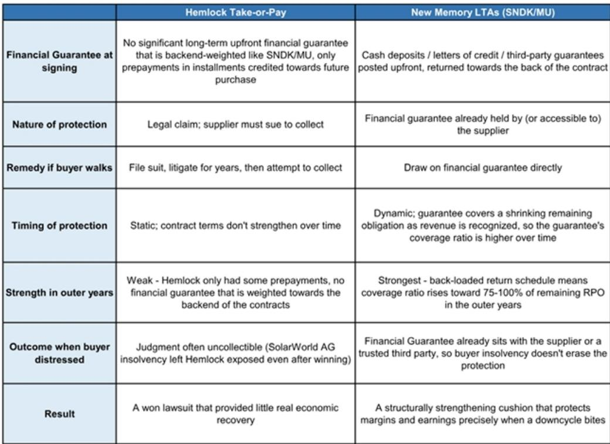
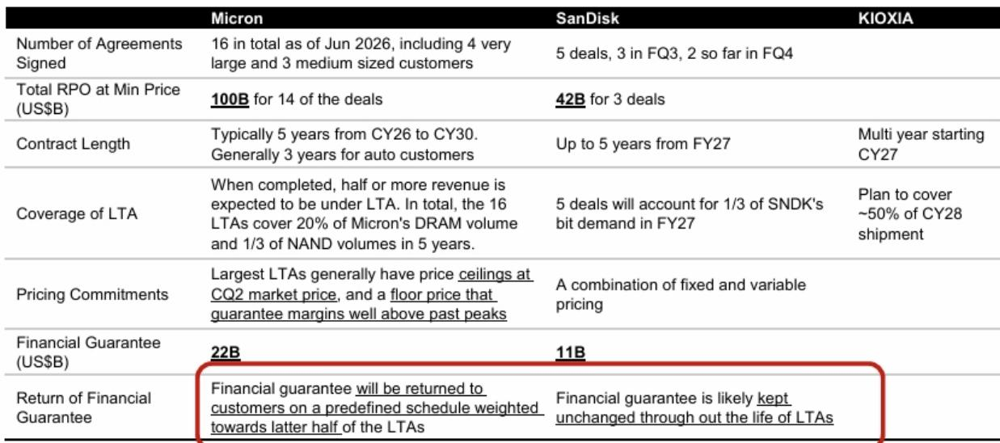
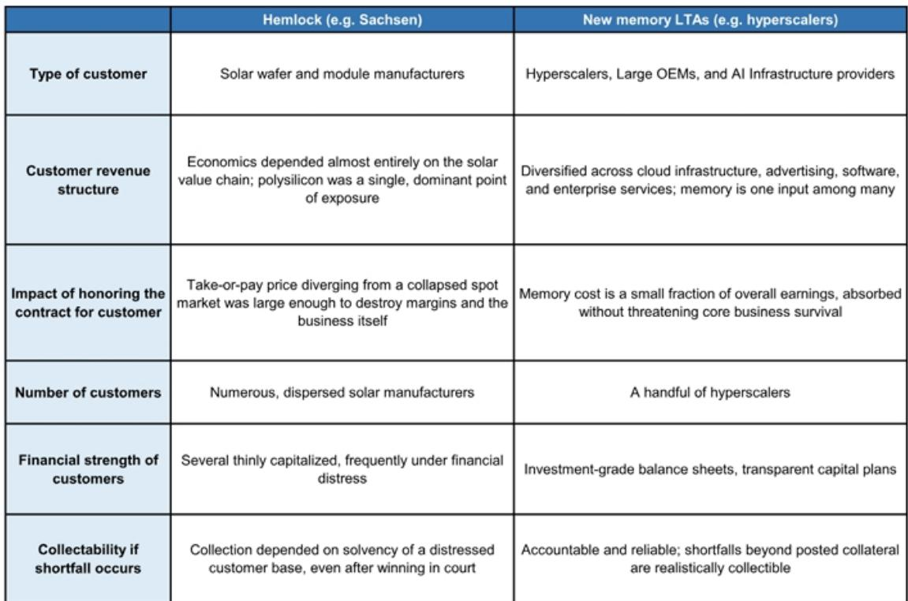

# 长期协议将缓和周期，但无法消除周期：观察者需区分下行保护与持续峰值回报

当前存储行业的核心议题，并非长期协议是否存在，而是其财务担保的规模是否足以从根本上改变行业固有的波动特征。根据近期一份行业研讨会分析，美光和闪迪披露的担保总额约为330亿美元，而市场普遍预期存储供应商在2027至2028年的年收入约为1.3万亿美元。这330亿美元仅占这些协议旨在保护的多年度收入的0.6%。数据并不支持长期协议将消除回报周期性的说法。

长期协议能够做的是在行业下行期间提高回报底线，将深度负值的运营利润率拉近至盈亏平衡点。这是一项有意义的改善，但这与在下行期维持峰值周期的盈利能力并非同一回事。将下行保护与回报稳定性混为一谈的观察者，可能在周期动态转变的关键时刻错误评估存储公司的价值。

这一讨论并非纸上谈兵。存储供应商已签署协议，覆盖美光20%的DRAM产能和三分之一NAND产能，为期五年；闪迪仅三笔交易就报告了420亿美元的剩余履约义务。这些都是具有真实财务承诺的实际合同。但其保护价值取决于观察者无法从公开信息中计算的变量：现货价格相对于合同底价的走势、担保回报的时间安排，以及任何给定时间点剩余采购义务的平衡。

## 长期协议的保护效力集中在后期，这意味着早期年份仍然脆弱

这些协议的一个关键结构性特征是，财务担保按计划返还给客户，且该计划倾向于合同期的后半段。美光已明确表示，担保将按预定计划返还，主要集中在后期年份。相比之下，闪迪似乎在协议期间保持担保固定不变，这意味着随着义务减少，担保与剩余采购义务的比例自然上升。

这一含义直接但常被忽视。在长期协议的早期年份，当剩余采购义务最大时，违约的财务惩罚相对于合同价值最低。如果现货价格在第一年或第二年大幅下跌，客户可能会发现放弃担保并以当前市场价格购买存储在经济上更合理。观察者假设存在的下行保护可能要到第三至第五年才会显现，届时剩余义务已缩小，担保代表了更大的退出成本比例。

这种后期加权造成了行业最易受下行影响时期与合同保护较强时期之间的时间错配。存储行业的下行通常来得迅速且可能严重。在2026年签署五年期长期协议的客户可能在2029年得到充分保护，但如果下行发生在2027年，这种保护的价值就有限了。

## 并非所有客户都同样投入，长期协议的可寻址市场存在硬性上限

最有可能在下行期履行长期协议的客户是超大规模云服务商和AI基础设施提供商。这些对手方拥有强劲的资产负债表、多元化的收入来源以及确保长期存储供应的战略动机。他们也是迄今为止最积极签署这些协议的市场细分领域。

但存储需求的很大一部分来自动机截然不同的客户。消费电子公司优先考虑灵活性和最低成本采购。交易型买家没有战略理由锁定高于现货的价格。正如分析所指出的，某些地区的客户可能更倾向于与市场份额逐渐增加的本地供应商签署长期协议。闪迪首席财务官已明确表示，消费业务“更具交易性”，长期协议“并不真正适用”。

当这些细分领域汇总时，大约30%至50%的存储市场可能永远不会被长期协议覆盖。这使得行业收入的相当一部分暴露于驱动历史周期的相同现货市场动态。即使长期协议覆盖的收入变得更加稳定，未覆盖的部分将继续通过库存去化、价格下跌和产量减少来放大下行周期。

这种长期协议渗透率的上限意味着行业的结构性周期性正在被削弱，而非消除。对于观察者而言，问题是周期性减少50%是否足以证明当前峰值周期回报所对应的估值倍数合理。

## 保护峰值回报所需的担保规模不切实际

分析中最具揭示性的计算是披露的担保与这些担保旨在保护的收入之间的关系。如果存储供应商要在三到五年内维持每年约1.3万亿美元的峰值周期收入，需要保护的总金额约为5.2万亿美元。迄今披露的330亿美元担保仅占该数字的0.6%。

即使对三星和SK海力士的额外担保做出乐观假设，这一比例仍将微不足道。要提供有意义的保护——例如保护金额的20%——将需要约1万亿美元的预付款。世界上没有客户能够提供如此规模的资金，也没有供应商能够要求这样的条件。

美光与Anthropic的交易说明了潜在挑战。美光以股权形式投资Anthropic，作为一种供应商融资，实际上是用资本换取供应保障。这种结构凸显了供应商为确保承诺必须付出的努力，但也表明传统财务担保存在固有的规模限制。股权、供应商融资和其他创新结构可以补充长期协议，但无法取代一个基本现实：保护峰值回报需要不存在的资本承诺规模。

## 决策框架：如何在长期协议时代评估存储公司

对于观察者而言，长期协议的存在改变了分析框架，但并未简化它。以下决策逻辑有助于区分那些定价基于结构性变化的公司与那些定价基于有利周期的公司。

首先，评估长期协议覆盖的收入比例及对手方质量。长期协议覆盖率更高、客户基础更强的供应商，在下行期将经历较不严重的回报下降。但观察者还必须评估当前估值是否已反映这种保护。如果一家公司的估值倍数假设峰值回报可持续，那么长期协议覆盖可能已被定价。

其次，评估担保敞口随时间的变化轨迹。担保固定且剩余义务快速下降的供应商将在后期年份提供更强的下行保护。但任何长期协议的早期年份都是最脆弱的。观察者应针对这些协议的第一年或第二年发生下行的情况进行压力测试。

第三，将长期协议保护的回报与行业的结构性供需平衡进行比较。长期协议可以缓和周期，但无法创造持久的供应短缺。如果基础行业基本面指向供应过剩，长期协议将延迟调整但无法阻止它。对长期协议保护的供应商而言，最佳情况是下行变得更浅、更短，而非消失。

第四，区分DRAM和NAND动态。分析突显了一个明显分化：AI需求通过HBM和高带宽应用不成比例地惠及DRAM，而NAND面临来自某些地区竞争的更大长期风险。然而，AI工作负载通过更大的上下文窗口和不断增长的存储需求正变得越来越NAND密集型。观察者必须评估NAND复苏论点是源于真实需求还是可能逆转的供应限制。

最后，关注亚洲供应商的行为。三星和SK海力士对长期协议采取了比闪迪和美光更具选择性的态度。如果亚洲供应商开始签署担保更大的协议，可能预示着结构性转变。如果他们保持谨慎，则表明他们认为当前周期是暂时的，并倾向于为最终的下行保留灵活性。

## 当前行业基本面有利，但这不等于结构性变化

存储的中短期前景是建设性的。供应增长由成熟企业的资本支出决策驱动，新进入者预计在未来两年内不会扰乱市场。HBM定价预计将走高，同时传统存储变得更加有利可图。这些条件支持当前的回报轨迹。

但有利的基本面并不等同于结构性变化。存储行业一直经历供应紧张和高盈利的时期。问题是长期协议是否改变了周期的性质，还是仅仅改变了其时间安排。证据指向后者。

长期协议将提高回报底线。它们将使下行不那么严重。它们将改善供应商的收入可见性，并为客户提供确保长期供应的机制。但它们不会在下行期维持峰值回报，也不会消除行业的周期性。理解这一区别的观察者将在周期最终转变时处于更有利的位置来评估存储公司。

*仅供参考。部分内容可能基于源材料通过AI辅助生成、翻译、总结或编辑，可能存在遗漏或错误。请独立核实。本文不构成专业建议。*

仅供参考。部分内容可能基于源材料通过AI辅助生成、翻译、总结或编辑，可能存在遗漏或错误。请独立核实。本文不构成专业建议。

