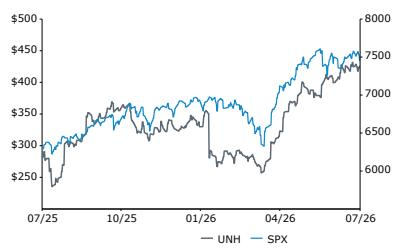
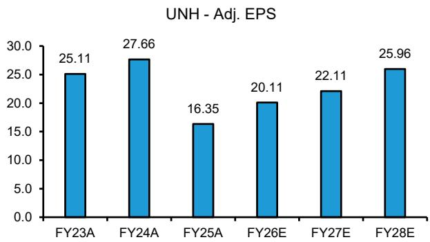
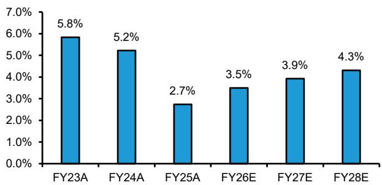
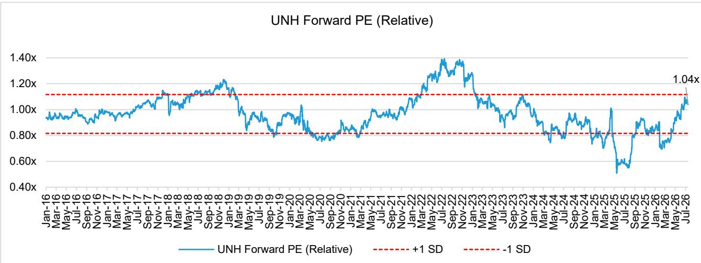

# UNH 2Q26: MA recovery on track, Optum Insights and non-MA UHC present upside; Increase PT to \$512

We maintain a positive view on UNH and adjust our price target to \$512. We have updated our model which improved 2026 adjusted earnings by 6% and by around 0.5% for 2027 and beyond.

We believe the UNH stock has seen an initial recovery from unusually low earnings and valuation, but continues to have attractive upside with 14% earnings CAGR and potential upside in Optum Insights, and potential for greater recovery in UHC Commercial and Medicaid.

Key insights from the quarter - UNH's MA turnaround is on track with margins recovering faster than projected, driven by pricing discipline and meaningful membership decline for 2026. Employer and Medicaid margins are well below target, suggesting pricing discipline for 27 and willingness to exit Medicaid markets.

Optum Insights is operating inline with expectations - we see this as presenting the greatest upside potential relative to market expectation. Optum Insights is a complex operating entity with operating efficiency businesses for hospitals & physicians and for other healthcare companies, financial services for healthcare, and the potential for AI products to improve costs, quality and outcomes in healthcare.

We are hosting a teach-in on Optum Insights on August 27 $^{th}$ (Click here to register).

## Investment Implications

We maintain a positive view on UNH and adjust our price target to \$512 (vs. \$492 prior). We arrive at our price target of \$512 via target P/E of 21.25x (vs. 21.5x earlier) and NTM earnings estimate of \$24.08 (vs. \$22.88 previously). UNH: Model

<table><tr><td>Close Date</td><td>17 Jul 2026</td></tr><tr><td>UNH Close Price (USD)</td><td>426.09</td></tr><tr><td>Price Target (USD)</td><td>512.00</td></tr><tr><td>Upside/(Downside)</td><td>20%</td></tr><tr><td>52-Week Range</td><td>461.62/234.60</td></tr><tr><td>SPX</td><td>7,457.69</td></tr><tr><td>FYE</td><td>Dec</td></tr><tr><td>Div Yield</td><td>2.2%</td></tr><tr><td>Market Cap (USD) (M)</td><td>386,951</td></tr><tr><td>EV (USD) (M)</td><td>430,247</td></tr></table>

<table><tr><td>Performance</td><td>YTD</td><td>1M</td><td>6M</td><td>12M</td></tr><tr><td>Absolute (%)</td><td>29.1</td><td>6.3</td><td>25.9</td><td>50.7</td></tr><tr><td>SPX (%)</td><td>8.9</td><td>0.5</td><td>7.5</td><td>18.4</td></tr><tr><td>Relative (%)</td><td>20.1</td><td>5.8</td><td>18.4</td><td>32.3</td></tr></table>

Source: Bloomberg, Bernstein estimates and analysis.

Price Performance, 1YR  

<table><tr><td>Adjusted EPS</td><td>F25A</td><td>F26E</td><td>F27E</td></tr><tr><td>UNH (USD)</td><td>16.35</td><td>20.11</td><td>22.11</td></tr><tr><td>OLD</td><td>--</td><td>18.86</td><td>21.99</td></tr></table>

Source: Bloomberg, Bernstein estimates and analysis.

<table><tr><td>Financials</td><td>F25A</td><td>F26E</td><td>F27E</td><td>CAGR</td></tr><tr><td>Revenues (M)</td><td>447,567</td><td>449,890</td><td>462,132</td><td>--</td></tr><tr><td>EBITDA (M)</td><td>23,325</td><td>29,797</td><td>32,018</td><td>--</td></tr><tr><td>Reported EPS</td><td>14.06</td><td>19.58</td><td>21.55</td><td>--</td></tr></table>

<table><tr><td>Valuation Metrics</td><td>F25A</td><td>F26E</td><td>F27E</td></tr><tr><td>Adjusted P/E (x)</td><td>26.1</td><td>21.2</td><td>19.3</td></tr></table>

## DETAILS

## Drivers to price target change

We raise our PT to \$512 from \$492, reflecting roll forward of our model and modest changes to earnings in 2027 and beyond. We slightly reduce our target price multiple to 21.25x (from 21.5x prior) and raise our NTM adj. earnings upwards to \$24.08 (vs. \$22.88 earlier)

## 2Q26 Summary

UNH reported 2Q26 results on July $16^{th}$ with a strong beat. Adjusted earnings came in at \$6.38 for the quarter, beating consensus of \$4.89 by 30.4%. Revenues for 2Q came in at \$112.0B, 1.2% above consensus of \$110.7B. MLR was 86.7%, \~170 bps lower than consensus of 88.4%.

Guidance raise. UNH raised their FY26 guidance and now expects an adj earnings to be in the range of \$19.5 to \$20 (up from previous \$18.25+). Net earnings was raised to >\$16.75B (vs. prior of at least \$15.6B). MLR is now expected to be 88.1% +/- 25 bps (vs prior 88.8% +/- 50 bps).

Strong MLR beat. For the quarter, MLR came in at 86.7%, \~170 bps lower than consensus and 270 bps lower YoY. UNH cited that the YoY decrease was driven effective benefit design and pricing discipline, as well as member mix and medical cost management initiatives. Net medical reserve development for the quarter was \$860M.

UHC performance. UHC revenues of \$86B in 2Q26 beat consensus by 1.3% but decreased YoY by \~12 bps. UHC operating margin was 4.6% vs. 2.4% in 2Q25. UNH specified that the higher margins YoY were driven by medical and operating cost management, pricing discipline, and benefit design changes. UHC membership decreased 525K sequentially to 48.5M people in 2Q26.

Optum performance. In 1Q26, Optum revenue of \$67.2B was down -2.3% YoY but beat consensus by 3.3% and grew 3% QoQ. Optum Health revenue was \$23.5B (down 5.1% YoY), Optum Insights revenue was \$5.4B (up 3.2% YoY), and Optum Rx saw revenue of \$38.3B (down 0.4% YoY). All three sub-segments beat consensus by 1.1%, 2.1%, and 1.7%, respectively. Optum Health adj operating margin was 5.1%, driven by strong operational improvements and medical cost management. The YoY decrease in Optum Health revenues was driven primarily by \~700K fewer VBC care patients served.

## INSIGHTS FROM THE CALL OR FOLLOW-UP DISCUSSIONS

## Our top takeaways from the quarter

Medicare Advantage turnaround is performing well, and drives the guidance raise. Pricing discipline is the story here, with the significant membership declines in 2026 driving faster than expected margin recovery, a relationship which makes sense to us. The guidance raises are largely in line with our prior estimates, so our projections beyond 2027 increases only modestly.

Commercial margins are facing headwinds related to higher medical cost trend (11+%), although expectations are reflected in updated guidance. Commercial margins are running at 4% vs target of 7% and Medicaid is running at -1% or lower, both of which represent upside to future earnings growth.

Optum Insights is operating inline with expectations - we see this as presenting the greatest upside potential relative to market expectation. Optum Insights is a complex operating entity with operating efficiency businesses for hospitals & physicians, and for other healthcare companies, financial services for healthcare, and the potential for AI products to improve costs, quality and outcomes in healthcare. We are hosting a teach-in on Optum Insights on August 27 $^{th}$ (Click here to register).

The UNH stock has seen an initial recovery from unusually low earnings and valuation, but continues to have attractive upside with 14% earnings CAGR and potential upside in Optum Insights and greater recovery in UHC Commercial and Medicaid and in Optum Insights.

## UHC MA

MA delivered a strong 2Q, and UNH expects FY26 MA enrollment to decline by 1.1M and for 2026 margins to land above 3%.

Cost trend - Management highlighted that MA medical cost trend remains elevated versus historic levels, but is running below their benefit planning assumptions. They now expect 2026 Medicaid cost trend to come in below their initial estimates of \~10%. They company specifically mentioned that positive claims experience, milder respiratory and weather patterns, and prior year development, were slight tailwinds to the improved cost trend. At the same time, management largely attributed efforts in benefit design and product positioning (resulting in more favorable membership mix), as well as network curation activities as drivers of why the cost trend to date is lower than their original expectations. The company continues to be focused on affordability and management stressed they do not view this as an inflection in underlying utilization and expect core trends to stay high into 2027 — even as they feel comfortable with current 2026 assumptions.

Update on Stars - Management reiterated that Stars remain strategically critical, but given where they are in the measurement and appeals cycle and ongoing industry litigation, they did not want to speculate on Star Year 26-27 outcomes. They noted that industry-wide scores for 2026 are at their lowest level in about a decade.

## Optum Health

Optum Health delivered another quarter of improved care management and tighter operating discipline, with revenues of \$23.5B (1% beat), and a 5.1% operating margin (290 bps higher than consensus). The company attributed the better-than-expected 1H26 margins to better medical performance from care management initiatives (including roughly 10% lower hospitalizations in early markets) and operating investments that expanded access, boosted provider productivity, and raised patient satisfaction. Sales of underperforming and non-strategic PCP practices is taking longer than expected and is forecast to be completed in 2H26.

The business is leaning into its integrated VBC model, now reaching nearly 90% of U.S. counties and performing about 2.5M rural home visits annually. At the same time, the company is rolling out AI-enabled tools such as ambient clinical documentation, which is available to 70% of employed providers today and is on track to exceed 90% by year-end. They are also collaborating earlier with payer partners on 2027 benefit planning.

Management expects nearly all Optum Health earnings to be recognized in 1H26, with only modest profit in 3Q and modest losses in 4Q due to the seasonality of the risk-based business.

## UHC Medicaid

UNH's Medicaid business performed in line with expectations in 2Q26, with 1H26 results benefiting from affordability actions such as network curation, payment integrity work, fraud/waste/abuse efforts, and tighter operating cost disciplines. Management highlighted that medical cost trend remains elevated versus pre-pandemic levels but broadly stable. The company continues to see pressure in specialty pharmacy, home and community-based services, behavioral health, and increasingly in inpatient and SNF costs for complex populations. Additionally, they are working with states on on-cycle and off-cycle rate actions, and continue to expect annualized 2026 rate impacts of 6-7%. That said, rates still lag the elevated trend and UNH still expects margins of -1% to -1.7% in 2026.

## UHC Commercial & Individual

In 2Q26, Commercial continued to show weakness, with medical cost running modestly above the prior \~11% trend expectation and putting pressure on its margin recovery path. Management cited several structural headwinds: (1) an increasingly ineffective No Surprises Act IDR process that is being "exploited by select providers and select geographies" and now adds roughly 50 bps of incremental trend in 2026; (2) more aggressive provider billing and coding intensity across office, ED and other sites of care; and (3) persistent specialty drug inflation, including anti-inflammatories and GLP-1s. The company reiterated that they are not yet seeing any meaningful offsetting pullback in utilization, and while they still aim to return commercial group margins toward their historical \~7%+ level, they now frame 2026 as a delay rather than a step forward in that journey, pushing full normalization beyond 2027. That said, UNH continues to be focused on improving administrative efficiency, AI-enabled fraud/waste/abuse capabilities, and ongoing affordability initiatives to gradually close that gap.

## Optum Insight

Optum Insight came in line for 2Q26, continuing its multiyear reinvestment cycle while building a pipeline of AI-enabled coding, real-time payer-provider interfaces, and clinical quality/safety tools that management believes positions the business to help modernize and simplify the healthcare system. Management expects \~55% of Optum Insight earnings to come in 2H26 as client implementations ramp and growth investments scale.

## Optum Rx

Optum Rx similarly perform in line during 2Q26, with management highlighting strong client retention % in the high-90s and positive feedback on its ongoing shift toward transparent, fee-based pharmacy services. The segment is leaning into a new per-member-per-month (PMPM) pharmacy care model with full PBM and GPO fee transparency and enhanced consumer tools, building on its commitment to move more than 95% of clients to 100% rebate pass-through by year-end 2026, and its earnings are expected to be second-half weighted alongside Optum Insight as implementations and growth investments ramp.

## AI initiatives

UHC - For UHC, management framed AI as a core enabler of its modernization agenda, already embedded in almost every member and provider interaction to provide predictive insights to advocates, automate complex claims with higher accuracy, support real-time underwriting, and move toward processing 80% of prior authorizations in real time by 2027. In fact, efficiency gains are expected to build into 2027 and become more meaningful for 2028 and beyond. The company emphasized that while AI will drive substantial administrative savings and allow more targeted utilization management, clinical decisions will continue to be made by clinicians and contact centers will remain staffed to support more concierge-like human interactions.

Optum - For Optum, management described AI as a transformational, durable lever that simultaneously improves economics and experiences. Management noted AI's ability to boost administrative efficiency, highlighting that AI enabled a 40% faster case summarization for nurse care managers and a digital prior auth product with a 96% first pass approval rate. The company also sees AI providing clinical support via ambient documentation tools. In fact, management underlined that in 70% of employed Optum Health clinicians have access to the AI-based ambient listening, with UNH targeting 90% by year-end. Management also highlighted that about 1/3 of this year's AI investment is aimed at commercializing internal solutions into external Optum products. This would then create a pathway for AI to contribute increasingly to Optum's revenue and margin expansion over 2027-28. They spotlighted their digital prior auth platform as an example, citing that it has already processed roughly half a million prior authorizations and saved about 69,000 administrative hours for external customers.

## Other

Earnings cadence - UNH continues to expect earnings to be weighted 2/3 to the first half and 1/3 to the second half. For UHC specifically, management expects \~75% in 1H26. For Optum Health, they expect nearly all earnings in 1H26. On the other hand, Optum Insight and Optum Rx are expected to be more back half weighted.

Optum Health Teach-in - We held a teach-in on UNH's Optum Health recently to provide a view inside the black box including a review of Optum Health, its businesses, its clinical model, and economic drivers. We summarize the teach-in in our note - UnitedHealth (UNH): A summary of our teach-in on Optum Health

Model changes - We have further updated our model to account for the 2Q 2026 earnings. We lowered revenues by \~2% over FY26 to FY 29 while MLR was lowered by 10bps over the forecast years, reflecting pricing discipline. Our adj. earnings for FY 2026 improved by 6.6% for FY26, and FY27 and beyond were increased by around 0.5%.

UHC operating margin expectation largely remained the same vs. our earlier estimates (3.5% in FY26 moving up to 4.9% in FY30). Our expectations for Optum went up by 40bps for FY26 with 10-30 bps improvements in later years. Optum Health operating earnings improved to 2.46% vs. 1.84% earlier for FY26 with 20-30 bps improvements during FY27-FY30. Optum Insight improved to 22.3% vs. 21.7% earlier, while we moved to estimates to 22% for FY27-FY30 from 22.9% previously. Optum Rx was largely in-line with our earlier estimates.

## Investment Thesis

We maintain a positive view on UNH with 20% upside potential based on potential for continued strong earnings growth.

We see 1) a sector turnaround as MA and Medicaid recover from trough margins following the MA rate shock and withdrawal of competition; 2) company-specific margin turnaround as UNH exits unprofitable MA and Optum Health products; 3) UNH valuation is attractive given our expectation for strong earnings growth recovery over the next 4 years.

## We expect UHC recovery in '26 - '28 driven by MA

UHC margins were down 48% (2.5% on an absolute basis) in '25, while revenues were up 16% driven by MA mispricing, along with pressure in other lines. We expect '26 MA membership to decline 12+%, from pricing discipline driving UHC revenues down 3%, and UHC earnings up 16% YoY. We expect 2027 will continue to see incremental MA margin progress, albeit somewhat lower, through pricing discipline (benefit cuts and network cost management).

EXHIBIT 1: UNH - Adj. EPS  
  
Source: Company reports, Bernstein analysis and estimates  
UHC - Operating margin, %

EXHIBIT 2: UHC - Operating margins

  
Source: Company reports, Bernstein analysis and estimates

Valuation - UNH's multiple had recovered rapidly since August, led by expectations for MA margin recovery driven by pricing discipline and reduced competition. Valuations dropped after CMS released MA advanced rates for 2027, leading to a fall in relative P/E multiple to 0.71x. Following the higher-than-expected MA final rate and beat and raise in 1Q26 and in 2Q26, UNH's relative P/E multiple has recovered to \~1.0x (levels last seen around October 2025). On an absolute basis, UNH is trading at a P/E multiple of \~21x.

We expect upside drivers for UNH (including MA margin recovery driven by pricing discipline and reduced competition) to enable multiple years of strong earnings growth. The same factors will drive the recovery within Optum Health's VBC business. While the pace of recovery may vary, we expect several years of outsized earnings growth. We see UNH valuation as modestly discounted vs the SPX.

EXHIBIT 3: UNH Relative NTM PE  
  
Source: Bloomberg, Bernstein analysis

## 2Q 2026 RESULTS

EXHIBIT 4: UnitedHealth 2Q 2026 Result vs. Bernstein and Consensus Estimates

<table><tr><td rowspan="2"></td><td rowspan="2">Reported Actual</td><td>Bernstein Forecast</td><td rowspan="2">Consensus Mean</td><td rowspan="2">% vs Bernstein</td><td rowspan="2">% vs Consensus</td><td colspan="4">Comparison</td></tr><tr><td>2Q 2026</td><td>2Q 2025</td><td>YoY Growth</td><td>1Q 2026</td><td>QoQ Growth</td></tr><tr><td colspan="10">Revenues</td></tr><tr><td>Premiums</td><td>86,956</td><td>87,787</td><td>86,271</td><td>(0.9%)</td><td>0.8%</td><td>87,905</td><td>(1.1%)</td><td>87,561</td><td>(0.7%)</td></tr><tr><td>Services</td><td>10,018</td><td>10,420</td><td>9,483</td><td>(3.9%)</td><td>5.6%</td><td>9,039</td><td>10.8%</td><td>9,779</td><td>2.4%</td></tr><tr><td>Products</td><td>13,835</td><td>14,583</td><td>14,074</td><td>(5.1%)</td><td>(1.7%)</td><td>13,564</td><td>2.0%</td><td>13,250</td><td>4.4%</td></tr><tr><td>Investment and other Income</td><td>1,223</td><td>974</td><td>982</td><td>25.5%</td><td>24.5%</td><td>1,108</td><td>10.4%</td><td>1,131</td><td>8.1%</td></tr><tr><td>United Healthcare</td><td>86,017</td><td>87,173</td><td>84,911</td><td>(1.3%)</td><td>1.3%</td><td>86,103</td><td>(0.1%)</td><td>86,265</td><td>(0.3%)</td></tr><tr><td>Optum</td><td>65,663</td><td>65,683</td><td>65,100</td><td>(0.0%)</td><td>0.9%</td><td>67,225</td><td>(2.3%)</td><td>63,749</td><td>3.0%</td></tr><tr><td>Eliminations</td><td>(39,648)</td><td>(39,092)</td><td>(39,336)</td><td>1.4%</td><td>0.8%</td><td>(41,712) restated</td><td>(4.9%)</td><td>(38,293)</td><td>3.5%</td></tr><tr><td>Optum Health</td><td>23,472</td><td>24,178</td><td>23,218</td><td>(2.9%)</td><td>1.1%</td><td>24,725</td><td>(5.1%)</td><td>24,109</td><td>(2.6%)</td></tr><tr><td>Optum Insight</td><td>5,402</td><td>5,229</td><td>5,292</td><td>3.3%</td><td>2.1%</td><td>5,232</td><td>3.2%</td><td>5,125</td><td>5.4%</td></tr><tr><td>Optum Rx</td><td>38,292</td><td>37,535</td><td>37,646</td><td>2.0%</td><td>1.7%</td><td>38,459</td><td>(0.4%)</td><td>35,736</td><td>7.2%</td></tr><tr><td>Optum Elimination</td><td>(1,503)</td><td>(1,258)</td><td>(1,204)</td><td>19.5%</td><td>24.9%</td><td>(1,191)</td><td>26.2%</td><td>(1,221)</td><td>23.1%</td></tr><tr><td>Total Revenues</td><td>112,032</td><td>113,764</td><td>110,675</td><td>(1.5%)</td><td>1.2%</td><td>111,616</td><td>0.4%</td><td>111,721</td><td>0.3%</td></tr><tr><td colspan="10">Membership (&#x27;000)</td></tr><tr><td>Total Commercial</td><td>29,920</td><td>29,701</td><td>29,634</td><td>0.7%</td><td>1.0%</td><td>29,970</td><td>(0.2%)</td><td>30,065</td><td>(0.5%)</td></tr><tr><td>Risk-based</td><td>7,655</td><td>7,339</td><td>7,344</td><td>4.3%</td><td>4.2%</td><td>8,440</td><td>(9.3%)</td><td>7,725</td><td>(0.9%)</td></tr><tr><td>Fee-based (excl. Tricare)</td><td>22,265</td><td>22,362</td><td>22,275</td><td>(0.4%)</td><td>(0.0%)</td><td>21,530</td><td>3.4%</td><td>22,340</td><td>(0.3%)</td></tr><tr><td>Government</td><td>18,605</td><td>18,838</td><td>18,667</td><td>(1.2%)</td><td>(0.3%)</td><td>20,145</td><td>(7.6%)</td><td>18,985</td><td>(2.0%)</td></tr><tr><td>Medicare Advantage</td><td>7,565</td><td>7,479</td><td>7,444</td><td>1.1%</td><td>1.6%</td><td>8,350</td><td>(9.4%)</td><td>7,555</td><td>0.1%</td></tr><tr><td>Medicaid</td><td>6,780</td><td>7,088</td><td>6,958</td><td>(4.4%)</td><td>(2.6%)</td><td>7,490</td><td>(9.5%)</td><td>7,160</td><td>(5.3%)</td></tr><tr><td>Medicare Supplement</td><td>4,260</td><td>4,270</td><td>4,266</td><td>(0.2%)</td><td>(0.1%)</td><td>4,305</td><td>(1.0%)</td><td>4,270</td><td>(0.2%)</td></tr><tr><td>Total Domestic</td><td>48,525</td><td>48,539</td><td>48,871</td><td>(0.0%)</td><td>(0.7%)</td><td>50,115</td><td>(3.2%)</td><td>49,050</td><td>(1.1%)</td></tr><tr><td>International (HFS)</td><td>1,145</td><td>1,160</td><td>1,053</td><td>-</td><td>8.7%</td><td>1,165</td><td>(1.7%)</td><td>1,160</td><td>(1.3%)</td></tr><tr><td>Total</td><td>49,670</td><td>49,699</td><td>49,924</td><td>(0.1%)</td><td>(0.5%)</td><td>51,280</td><td>(3.1%)</td><td>50,210</td><td>(1.1%)</td></tr><tr><td colspan="10">Optum Rx</td></tr><tr><td>Adj. Scripts Volume (mn)</td><td>387</td><td>387</td><td>384</td><td>(0.0%)</td><td>0.7%</td><td>414</td><td>(6.5%)</td><td>383</td><td>1.2%</td></tr><tr><td>Revenue per Rx ($)</td><td>99</td><td>90</td><td>na</td><td>10.4%</td><td>na</td><td>85</td><td>15.9%</td><td>84</td><td>18.2%</td></tr><tr><td colspan="10">Operating Costs</td></tr><tr><td>Medical Costs</td><td>75,358</td><td>77,253</td><td>76,274</td><td>(2.5%)</td><td>(1.2%)</td><td>78,585</td><td>(4.1%)</td><td>73,489</td><td>2.5%</td></tr><tr><td>Operating Costs</td><td>14,268</td><td>14,789</td><td>13,875</td><td>(3.5%)</td><td>2.8%</td><td>13,778</td><td>3.6%</td><td>15,390</td><td>(7.3%)</td></tr><tr><td>Cost of Products Sold</td><td>13,375</td><td>14,014</td><td>13,212</td><td>(4.6%)</td><td>1.2%</td><td>13,019</td><td>2.7%</td><td>12,823</td><td>4.3%</td></tr><tr><td>Depreciation and Amortization</td><td>1,040</td><td>1,018</td><td>979</td><td>2.2%</td><td>6.2%</td><td>1,084</td><td>(4.1%)</td><td>1,029</td><td>1.1%</td></tr><tr><td>Total Operating Costs</td><td>104,041</td><td>107,074</td><td>104,177</td><td>(2.8%)</td><td>(0.1%)</td><td>106,466</td><td>(2.3%)</td><td>102,731</td><td>1.3%</td></tr><tr><td>Earnings from Operations</td><td>7,991</td><td>6,690</td><td>6,525</td><td>19.4%</td><td>22.5%</td><td>5,150</td><td>55.2%</td><td>8,990</td><td>(11.1%)</td></tr><tr><td>Adj. Net Earnings</td><td>5,792</td><td>4,727</td><td>4,440</td><td>22.5%</td><td>30.5%</td><td>3,716</td><td>55.9%</td><td>6,578</td><td>(11.9%)</td></tr><tr><td>Diluted share count</td><td>906</td><td>905</td><td>908</td><td>0.1%</td><td>(0.2%)</td><td>910</td><td>(0.4%)</td><td>910</td><td>(0.4%)</td></tr><tr><td>Diluted EPS</td><td>6.04</td><td>4.88</td><td>4.63</td><td>23.8%</td><td>30.4%</td><td>3.74</td><td>61.5%</td><td>6.90</td><td>(12.5%)</td></tr><tr><td>Adjusted Diluted EPS</td><td>6.38</td><td>5.22</td><td>4.89</td><td>22.2%</td><td>30.4%</td><td>4.08</td><td>56.2%</td><td>7.23</td><td>(11.7%)</td></tr><tr><td>Medical Cost Ratio (%)</td><td>86.7%</td><td>88.0%</td><td>88.4%</td><td>-130 bps</td><td>-171 bps</td><td>89.4%</td><td>-270 bps</td><td>83.9%</td><td>277 bps</td></tr><tr><td>Cost of Products Ratio (%)</td><td>96.7%</td><td>96.1%</td><td>93.9%</td><td>58 bps</td><td>280 bps</td><td>96.0%</td><td>69 bps</td><td>96.8%</td><td>-10 bps</td></tr><tr><td>SG&amp;A Expense Ratio (%)</td><td>12.7%</td><td>13.0%</td><td>12.5%</td><td>-26 bps</td><td>20 bps</td><td>12.3%</td><td>39 bps</td><td>13.8%</td><td>-104 bps</td></tr><tr><td>Adj. Net Margin</td><td>5.2%</td><td>4.2%</td><td>4.0%</td><td>101 bps</td><td>116 bps</td><td>3.3%</td><td>184 bps</td><td>5.9%</td><td
