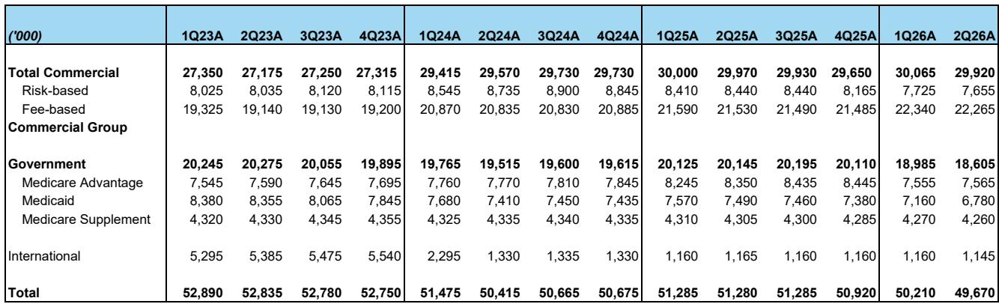
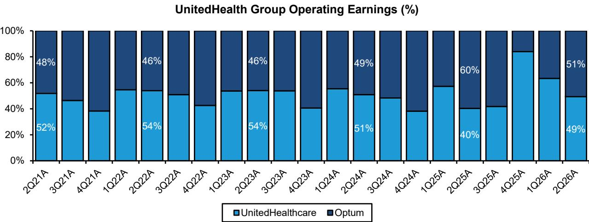
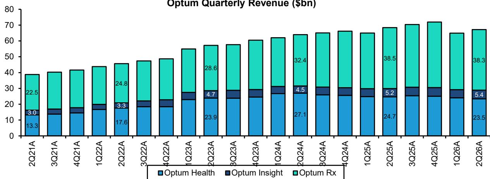

# UnitedHealth的利润率恢复是真实的，但真正的看点在于Optum Insights——而非仅靠Medicare Advantage

联合健康集团（UnitedHealth Group）2026年第二季度调整后每股收益为6.38美元，超出市场共识预期30.4%。公司已将全年指引从此前18.25美元的底线上调至19.50–20.00美元。今年以来，市场已将该公司的报价重新定价，累计上涨29%，从Medicare Advantage费率冲击后的低谷估值中恢复。然而，最初的反弹掩盖了一个更重要的结构性故事。Medicare Advantage的转机正在按计划推进，且很大程度上已被市场消化。下一阶段的看点——也是最有可能让市场感到意外的地方——来自一个大多数观察者仍视为黑箱的业务：Optum Insights。

如今持有联合健康的理由，并不仅仅是Medicare Advantage利润率正在恢复。而是该公司拥有三个处于不同周期的独立盈利引擎。Medicare Advantage处于早期恢复阶段，由于有意识地收缩会员规模，利润率改善速度快于预期。商业和Medicaid业务仍处于低迷状态，提供了从2027年开始的多年正常化空间。而Optum Insights，这个最不被理解的部门，正在悄然构建一个AI赋能产品的管线，可能彻底改变其盈利轨迹。该公司目前的报价约为未来收益的21.2倍，与标普500指数大致持平，尽管其未来三年盈利年复合增长率达到14%。一旦市场充分理解Optum Insights正在成为什么，这一折价不太可能持续。

## Medicare Advantage利润率恢复速度快于预期，因为联合健康选择牺牲会员规模而非利润率

第二季度医疗损失率为86.7%，比市场共识低170个基点，比上年同期低270个基点。管理层将这一改善归因于有效的福利设计、定价纪律以及有意识地调整会员结构。这一结果并非偶然。联合健康预计，2026年全年MA会员数量将减少110万人，较峰值水平下降约12%。这是一个战略选择的直接结果：退出无利可图的地域和产品，而不是为边缘会员在价格上竞争。

其机制简单明了，但常被误解。当一家管理式医疗组织失去高成本特征的会员时，即使总保费缩水，剩余的业务也会变得更有利可图。联合健康的UHC部门第二季度收入同比下降12个基点，但营业利润率几乎弹性较高，从2.4%升至4.6%。这一权衡是有意且可持续的。管理层指出，医疗成本趋势仍高于历史水平，但低于其福利规划假设，这得益于较为温和的呼吸道疾病季节和有利的往年准备金释放。关键的是，他们并不认为当前的成本经验是基础利用率的拐点。核心趋势预计将持续高位至2027年。因此，利润率恢复是由定价和结构驱动的，而非基于利用率将正常化的假设。

对于观察者而言，这意味着Medicare Advantage的恢复有清晰的轨迹，但从此处继续超预期的空间有限。指引上调基本符合先前预期。该公司的报价相对于标普500的市盈率倍数已从0.71倍重新定价至约1.0倍。恢复中容易的部分已经完成。未来MA利润率的改善将是渐进的，而非指数级的。

## 商业和Medicaid利润率仍低于目标，创造了多数观察者尚未充分认识的多年正常化机会

商业团体医疗利润率目前约为4%，远低于公司历史目标7%。Medicaid利润率为负，在-1%至-1.7%之间。这两个领域都面临结构性挑战，需要时间解决，但方向是明确的——且潜在的盈利波动是实质性的。

在商业领域，管理层指出了三个持续的成本驱动因素：《无意外法案》独立争议解决流程日益低效，在2026年增加了约50个基点的增量趋势；激进的医疗服务提供者账单和编码强度；以及包括GLP-1药物在内的专科药物通胀。公司尚未看到利用率有任何抵消性的回落。管理层将2026年描述为利润率恢复旅程中的延迟，将全面正常化推至2027年之后。这是一个清醒的评估，但也意味着当前的利润率水平包含了相当程度的悲观预期。如果趋势稳定，或者2027年销售季的定价纪律改善，利润率与目标之间的差距代表了约300个基点的运营杠杆空间。

Medicaid则更为严峻。尽管费率每年增长6-7%，利润率仍为负值，因为成本趋势在专科药房、家庭和社区服务、行为健康以及复杂人群的住院护理方面持续高企。管理层预计2026年全年利润率为-1%至-1.7%。公司正在与各州就周期内和周期外的费率行动进行合作，并且已表现出在费率无法覆盖成本的地区退出市场的意愿。这里的上行空间是二元而非渐进的：要么费率赶上趋势，利润率正常化至盈亏平衡或低个位数正数区间；要么联合健康退出表现不佳的州并重新配置资金。无论哪种结果，相对于当前的拖累，都是对盈利有利的。

战略要点在于，这两个领域代表了2027-2028年盈利的一个看涨期权，而这一期权尚未反映在共识预期中。Medicare Advantage的恢复是基础情形。商业和Medicaid的正常化是上行情形，而大多数模型仅部分包含了这一点。

## Optum Insights是联合健康组合中最被低估的盈利驱动因素，其AI管线可能改变该部门的增长格局

Optum Insights第二季度收入为54亿美元，同比增长3.2%，符合预期。这个总体数字低估了该业务的战略重要性。Optum Insights并非单一产品线。它是一个为医院、医生和其他医疗公司提供运营效率服务的组合，同时结合了医疗金融服务和新兴的AI赋能产品。管理层将该部门描述为处于多年再投资周期中，全年约55%的盈利预计在下半年实现，随着客户实施工作的推进。

AI管线是关键细节。今年约三分之一的AI投资旨在将内部解决方案商业化，转化为外部Optum产品。数字预授权平台已处理约50万次授权，为外部客户节省了69,000个行政工时。环境临床文档工具已可供70%的Optum Health受雇临床医生使用，目标是在年底前达到90%。这些并非推测性的试点项目。它们是已部署的产品，具有可衡量的成果。

Optum Insights的研究逻辑基于一个特定机制。联合健康运营着全球最大的医疗交付和融资系统之一。它产生的数据和运营洞察是任何独立技术供应商无法复制的。当公司为自己构建预授权工具或临床文档助手时，它可以以较低的边际成本将该工具产品化，提供给外部客户。因此，AI投资周期具有双重目的：它既提高了内部效率，又创建了一个产生收入的产品管线。该部门第二季度22.3%的营业利润率已经反映了这种杠杆效应，管理层对下半年权重的预期表明，随着实施规模扩大，还有进一步改善的空间。

对于观察者而言，风险在于，在外部AI产品的收入贡献在报告的分部结果中变得可见之前，Optum Insights仍然是一个“需要证明”的故事。这是一个合理的担忧。但反方论点是，市场目前对这一选择权赋予的价值为零。该公司报价的恢复完全由Medicare Advantage利润率改善驱动。如果Optum Insights在未来四个季度相对于当前预期实现哪怕适度的上行，盈利修正周期将加速。

## 评估联合健康三个盈利引擎的决策框架

如今评估联合健康的观察者应审视三个不同的问题，每个问题对应不同的盈利驱动因素和时间跨度。

首先，Medicare Advantage的恢复是否按预期进行？答案是肯定的，证据在于第二季度的医疗损失率、指引上调以及有意识的会员数量下降。风险在于市场已经对这一改善进行了定价。该公司的相对市盈率倍数已回到1.0倍，这是2025年10月以来的水平。MA恢复中容易赚的钱已经赚到了。

其次，商业和Medicaid利润率何时会迎来拐点？商业利润率比目标低300个基点，管理层明确将全面正常化推至2027年之后。Medicaid利润率为负。改善的触发因素将是2027年的定价周期，届时联合健康在MA中愿意失去会员的做法表明，它将对商业和Medicaid应用类似的纪律。如果公司退出无利可图的Medicaid市场或实现费率充足，对2028年盈利的影响可能比当前估计高出5-10%。这是一个12至18个月的催化剂，而非短期催化剂。

第三，Optum Insights是否有潜力重新定价整个公司的估值倍数？这是最重要的问题。联合健康目前的报价约为未来收益的21.2倍，与标普500指数大致持平。如果Optum Insights被视为一个具有经常性收入和高增量利润率的医疗技术平台，该公司的报价可能获得类似市场赋予健康技术公司的溢价倍数。这种重新定价对股价的贡献将远远超过任何单一保险部门的利润率改善。

该框架得出了一个清晰的结论：Medicare Advantage的恢复是基础，商业和Medicaid的正常化是上行空间，而Optum Insights是重新定价的催化剂。每个都有不同的时间跨度和风险特征。它们共同支撑了14%的盈利年复合增长率，而这一增长率尚未完全反映在估值中。

## 该公司报价的恢复迅速，但盈利故事仍有多个章节有待书写

联合健康的股价今年以来已反弹29%，过去十二个月累计上涨51%，大幅跑赢标普500指数。相对市盈率倍数已从0.71倍的谷底恢复至约1.0倍。这是任何深度估值错位后的初始反弹。下一阶段的恢复将由盈利修正驱动，而非倍数扩张。

该公司2026年调整后每股收益估计为20.11美元，较2025年实际值16.35美元增长23%。2027年估计为22.11美元，意味着再增长10%。这些并非激进的假设。它们反映了已在第二季度业绩中可见的Medicare Advantage恢复。这些数字的上行风险来自2027-2028年商业和Medicaid的正常化，以及Optum Insights的AI产品管线，而当前估计中并未包含明确的收入贡献。

该估值基于未来12个月盈利估计24.08美元的21.25倍。该倍数略低于标普500指数的远期倍数，尽管联合健康拥有更优越的盈利增长轨迹和Optum Insights中嵌入的选择权。随着市场吸收未来两到三个季度的证据，这一折价将收窄。第二季度业绩提供了这些证据。下一个催化剂是定于8月27日举行的Optum Insights说明会，届时管理层预计将提供有关AI产品管线及该部门长期利润率轨迹的更多细节。

联合健康的故事已不再是关于MA费率冲击后的生存。它关乎一个多元化的医疗企业，拥有三个独立的盈利引擎，每个都处于其周期的不同阶段，而其中一个——Optum Insights——对市场而言仍基本不可见。该公司的报价已经恢复，但盈利故事才刚刚开始。

*仅供参考。部分内容可能基于源材料通过AI辅助生成、翻译、总结或编辑，可能存在遗漏或错误。请独立核实。本文不构成研究、法律、税务、会计或其他专业建议。*

仅供参考。部分内容可能基于源材料通过AI辅助生成、翻译、总结或编辑，可能存在遗漏或错误。请独立核实。本文不构成研究、法律、税务、会计或其他专业建议。

