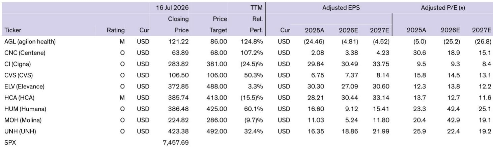
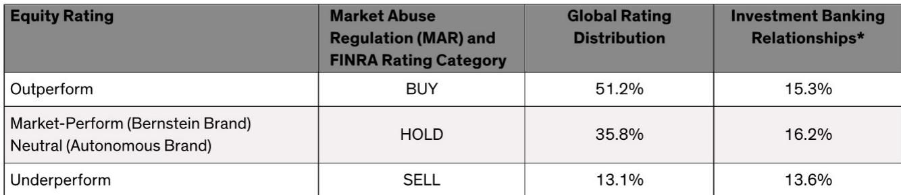
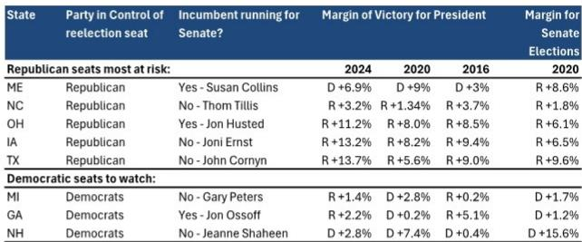

# Bernstein：行业规则与主题变化观察

美国中期选举临近，Bernstein在最新医疗政策周报中提出一个核心判断：如果民主党在中期选举中至少拿下众议院，医疗政策环境将出现方向性调整。报告基于当前民调和预测市场数据，认为民主党夺回众议院控制权的概率较高，参议院归属仍属悬而未决。该机构认为，读者应提前关注2027年至2028年期间可能出现的政策变化窗口。

报告将民主党可能的政策优先序归纳为四个方向：逆转特朗普时期的医疗政策、扩大保险覆盖、改善可负担性，以及人工智能与垂直整合等新兴监管议题。Bernstein强调，中期选举前不会出现重大政策变动，真正的政策博弈将在选举后展开。

## 1. 逆转特朗普政策被视为民主党优先事项

Bernstein认为，如果民主党掌控国会至少一个议院，首要政策目标将是逆转或延迟特朗普时期在Medicaid和Marketplace领域的削减措施。具体而言，民主党将寻求恢复增强型Marketplace补贴，并试图推翻或推迟《一院一预算法案》中的部分条款。

报告特别指出，Medicaid工作要求条款是民主党重点攻击目标。上月已有25个州加上哥伦比亚特区联合起诉特朗普政府，指控CMS在实施工作要求时偏离了最初指引。Bernstein分析认为，民主党可能通过立法手段延迟工作要求实施，因为各州已基于此前CMS指引投入大量资源更新资格系统、人员配置和受益人沟通。

> **KC评论：** 报告引用的CBO数据显示，OBBBA法案预计在2025-2034年间削减约8860亿美元Medicaid支出，影响约750万人失去保险。这些数字是理解政策博弈规模的关键锚点。

## 2. 扩大保险覆盖路径：从恢复峰值到公共选项

在逆转特朗普政策之后，Bernstein认为民主党将寻求进一步扩大保险覆盖。报告列出了三种路径：恢复ACA在2025年达到的2430万会员峰值、推进联邦或州层面的公共选项、以及全民医保方案。

公共选项被报告视为最可能胜出的方案。Bernstein以康涅狄格州州长拉蒙特近期提出的“康涅狄格选项”为例，说明这种模式并非传统意义上的政府承担不确定性并管理计划，而是由州政府设计、私人保险公司运营，类似科罗拉多州自2023年起运行的项目。科罗拉多模式已实现保费和自付费用平均降低15%。

报告同时指出，全民医保的政治支持已从参议院转向公共选项。目前有17名民主党参议员是全民医保法案的共同提案人，但新任候选人中，如俄亥俄州前参议员布朗，已从支持全民医保转向聚焦公共选项。

## 3. 改善可负担性：自付费用上限成为政策焦点

Bernstein将改善可负担性列为两党都可能关注的议题。报告引用KFF健康系统追踪数据，显示过去二十年中，参保高免赔额计划的人群比例持续上升，这直接推高了消费者的自付负担。

民主党可能的政策工具包括立法设定自付医疗费用上限、限制免赔额、或提供额外补贴。报告认为，过去已实施的措施包括员工和ACA保单的自付上限、胰岛素价格上限、以及《通胀削减法案》对Medicare Part D患者自付费用的限制。未来可能进一步推出按月支付自付费用的机制，而非按服务发生时一次性支付。

## 4. Medicare Advantage可能成为政策资金来源

Bernstein提出一个值得关注的逻辑：民主党可能将Medicare Advantage作为扩大覆盖的资金来源。报告提到的《2026年拯救医疗保险法案》提案中，包括终止Stars质量奖金支付、调整不确定性调整模型、以及限制家庭不确定性评估等措施。

不过报告也谨慎指出，直接削减MA在政治上具有挑战性，更可能的路径是通过支付方法改革来产生节余，并将这些资金重新导向Marketplace和Medicaid扩展，或加强传统Medicare福利。Bernstein认为，MA改革在民主党优先事项中概率较低，但限制事先授权等其他形式可能成为医疗一揽子方案的一部分。

> **KC评论：** 报告对MA的分析提供了一个观察框架：当政策制定者需要为扩大覆盖寻找资金来源时，MA的支付方法改革往往成为选项。读者需要区分“政治口号”和“可执行立法”之间的差距。

## 5. 时间线与研究含义：2027年成为关键观察窗口

Bernstein明确给出了政策时间线：中期选举前无重大变化；选举后若民主党掌控国会，重点将是逆转特朗普时期的削减；2027年随着两党初选升温，读者将开始关注2028年后的政策环境。

报告认为，民主党在众议院（以及可能参议院）的胜利将有利于Medicaid管理式医疗组织和医院，而对Medicare Advantage可能带来估值不确定性。Bernstein点名MOH、CNC、ELV和HCA可能受益于民主党胜选预期，而HUM因对Stars奖金恢复的依赖度更高，可能面临更大影响。

这份报告的核心价值不在于预测选举结果，而在于为读者提供了一个可复用的政策分析框架：将选举结果、政策优先级、立法可行性和时间线四个维度结合起来，评估不同情景下医疗板块的相对表现。

For informational purposes only. Portions may be generated,translated,summarized,or edited with AI assistance based on source materials and may contain omissions or errors. Please verify independently. This is not investment,legal,tax,accounting,or other professional advice.

For informational purposes only. Portions may be generated,translated,summarized,or edited with AI assistance based on source materials and may contain omissions or errors. Please verify independently. This is not investment,legal,tax,accounting,or other professional advice.

