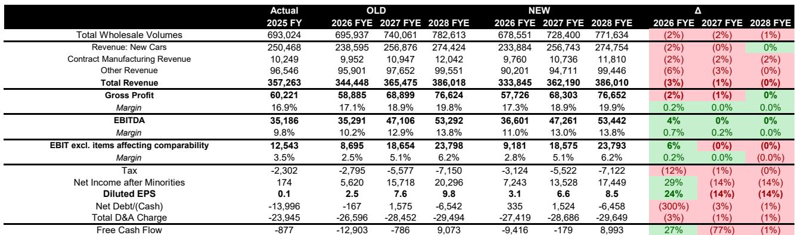
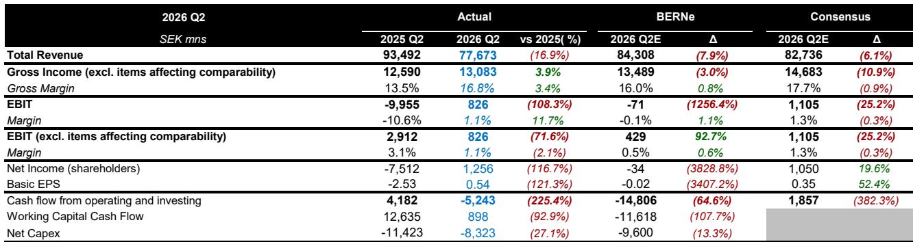
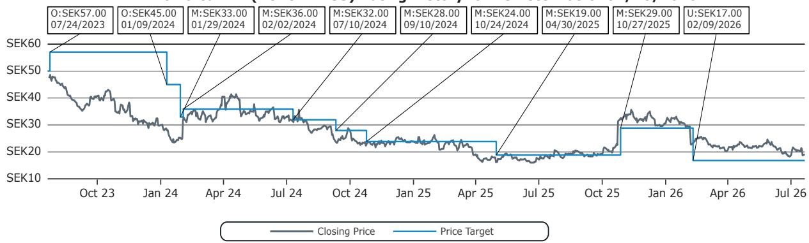

# Bernstein：沃尔沃汽车业务与季度数据观察

沃尔沃汽车刚刚经历了一个比市场预期更复杂的第二季度。Bernstein在最新报告中指出，公司营收低于市场预期6%，EBIT低于预期25%，并取消了全年销量增长指引。这些数字背后，是多重市场层面不确定性与公司自身结构性调整的叠加。

报告认为，沃尔沃当前面临的核心问题并非公司执行力，而是市场环境出现变化。中国市场的价格体系仍在调整和欧洲品牌表现下滑，欧洲市场的折扣不确定性，以及美国市场电动车补贴的取消，共同构成了对销量和产品组合的持续影响。公司层面的成本削减虽然领先于计划，甚至在电动化车型领域全球份额有所提升，但这些正面因素尚不足以抵消外部变化。

Q2的业绩下滑主要由销量和产品组合驱动。沃尔沃当季销售结构更偏向EX30和EX40等较小、定价较低的车型，同时插电混动车型销量同比下降12%。上半年全球销量下降4%，公司因此撤回全年销量增长指引，但仍预期2026年自由现金流达到盈亏平衡。

> **KC评论：** 产品组合下移是理解Q2利润低于营收降幅的关键。当一家公司卖出更多低价车型时，即使总销量变化不大，利润也会被压缩。沃尔沃在EX30和EX40上的依赖度上升，恰好说明其高端化战略在当前的竞争环境中遇到了阻力。

## 1. 二季度EBIT低于预期25%，中国市场零售销量下降37%

具体来看，沃尔沃Q2营收为777亿瑞典克朗，低于市场预期的827亿。毛利率16.8%，低于市场预期90个基点。EBIT为8.26亿克朗，低于市场预期的11.05亿。零售销量同比下降6%，其中中国市场下降37%，欧洲市场持平，美国市场增长9%。美国市场在5月和6月出现复苏迹象，但欧洲市场的定价不确定性仍在持续。

EBIT下滑的主要原因是产品组合和定价不利、批发销量下降、折旧摊销影响，以及排放积分收入从去年同期的17亿克朗降至8亿克朗。自由现金流为负52亿克朗，显著低于市场预期的正19亿克朗。公司仍预期下半年自由现金流将显著改善，全年达到盈亏平衡。

## 2. 成本削减领先计划，但下半年同比改善空间收窄

沃尔沃在成本控制方面确有进展。上半年成本削减金额已超过全年50亿克朗的目标，但Bernstein提醒，这一数字可能包含一次性因素。更重要的是，2025年下半年成本削减曾显著改善业绩，但2026年下半年的同比改善空间将明显收窄。

原材料成本上涨、排放积分销售的比较基数变高，以及EX60新车型的爬坡不确定性，都是下半年的潜在影响。EX60预计对集团利润率有正向贡献，但爬坡过程将在夏季逐步推进，真正影响要到第四季度。Bernstein认为，EX60的爬坡并非没有不确定性。

## 3. 欧洲市场份额上半年下降，中国品牌竞争持续加剧

报告特别指出，在中国品牌竞争加剧的背景下，沃尔沃上半年在欧洲市场失去了份额。Bernstein不认为这一波新竞争会节奏变化。在读者与公司管理层的十大问题中，竞争环境被放在重要位置：公司如何看待当前的竞争格局？各地区定价不确定性是否在加大？中国电动车品牌在欧洲的竞争力如何？

这些问题反映出市场对沃尔沃长期竞争地位的关注。公司在中国的处境尤为复杂：报告认为，沃尔沃在成本上难以与中国本土品牌竞争，其品牌定位如何在中国市场形成有效吸引力，是一个需要持续观察的问题。

## 4. 自由现金流指引仍存不确定性，Bernstein预期低于公司目标

尽管沃尔沃预期2026年自由现金流盈亏平衡，但Bernstein的模型仍低于这一指引。公司上半年自由现金流为负150亿克朗，下半年需要大幅改善才能实现全年目标。报告认为，即便考虑到资本支出和研发费用低于此前预期，自由现金流指引仍存在不及预期的可能。

Bernstein对2026年EPS的预测从2.48克朗上调至3.09克朗，主要因公司研发费用低于预期。但2027年EPS预测从7.61克朗下调至6.56克朗，反映了对中期盈利能力的审慎判断。

> **KC评论：** Bernstein对沃尔沃的判断核心在于，当前的市场不确定性并非短期波动，而是结构性变化。中国品牌在欧洲的扩张、电动车补贴退坡、以及产品组合下移，这些因素叠加在一起，使得沃尔沃的盈利修复路径比市场预期的更长。EX60能否成为转折点，是下半年最重要的观察变量。

For informational purposes only. Portions may be generated,translated,summarized,or edited with AI assistance based on source materials and may contain omissions or errors. Please verify independently. This is not investment,legal,tax,accounting,or other professional advice.

For informational purposes only. Portions may be generated,translated,summarized,or edited with AI assistance based on source materials and may contain omissions or errors. Please verify independently. This is not investment,legal,tax,accounting,or other professional advice.

