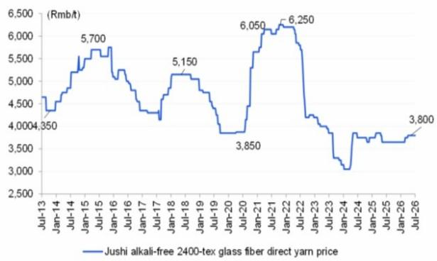
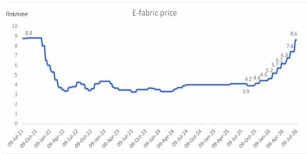
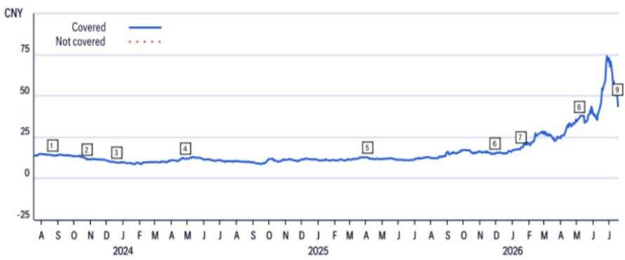
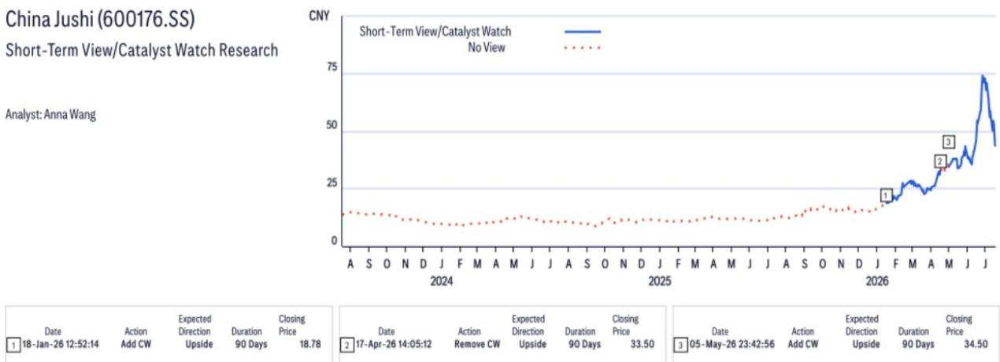

# 行业观察

# 玻璃纤维与电子布 - 周度观察 - 20260716

## 研究观点

截至7月16日当周，国内玻璃纤维市场呈现分化态势。粗纱价格持续承压，季节性需求偏弱，下游加工企业开工率较低，库存逐步累积。相比之下，电子纱基本面表现强劲。经过最新一轮提价后，G75及电子布价格在高位企稳，下游覆铜板需求保持旺盛。尽管整体产能稳定，但有效电子纱供应仍偏紧，新增产能尚未完全释放，高端产品供应有限。在供需偏紧、库存低位和议价能力较强的支撑下，电子纱有望延续较好表现。

价格方面——1）2400tex缠绕直接纱主流成交价维持在3500-3900元/吨，全国均价3768.5元/吨，环比上周下降0.26%，同比上涨3.27%。部分区域因需求偏弱，企业以出货和库存控制为主，价格继续承压。2）G75电子纱价格稳定在16800-17500元/吨，均价约16987.5元/吨，经历前期快速上涨后环比持平。3）7628电子布价格维持高位，在8.5-8.7元/米区间，按量议价持续。

供应方面——上周共有122条窑炉产线运行，总产能维持在903.8万吨/年，环比持平，同比增加8.03%。当周无产线变动报告。粗纱因出货偏弱，库存小幅增加；电子纱及电子布库存仍处低位。下游电子客户持续面临供应偏紧局面，部分企业新增订单承接意愿有限。

需求方面——1）粗纱：需求偏弱，南方高温及降雨天气继续影响下游加工活动。多数深加工客户维持低开工率，采购积极性有限，出货动能偏弱。2）电子纱：需求保持韧性，覆铜板客户持续积极备货。经历前期提价后价格虽已企稳，但多个规格仍供不应求，高端产品订单持续增长。

展望方面——1）粗纱：短期内价格预计仍将承压，季节性偏弱持续，库存消化仍有难度，下游需求恢复有限。2）电子纱：短期价格预计保持稳定，中期仍有上行空间。月度订单基本锁定，供应偏紧、库存低位及覆铜板需求旺盛，有望继续支撑价格。

图1. 玻璃纤维价格

© 2026 Citi Inc. 未经Citi书面许可不得转载。来源：Citi, SCI

图2. 电子布价格

© 2026 Citi Inc. 未经Citi书面许可不得转载。来源：Citi, SCI

图3. 重点区域玻璃纤维库存

© 2026 Citi Inc. 未经Citi书面许可不得转载。来源：Citi, SCI

## 中国巨石

(600176.SS; 43.8元; 1; 2026年7月17日; 15:00)

## 估值

我们对巨石的目标价为67元/股，基于2027年预期市盈率26倍，相当于该标的上市以来历史平均市盈率加一个标准差，但仍低于可比标的当前远期估值。我们基于2027年盈利设定目标价，认为这能更好地反映电子布提价、产能释放及产品结构升级带来的全年盈利改善。我们认为该目标倍数合理，基于巨石在全球的成本优势、电子纱及电子布一体化平台，以及在此轮电子布上行周期中的盈利弹性。同时，我们尚未对其远期产能扩张或特种电子布产品的潜在增长赋予显著价值。

## 风险因素

主要下行风险包括：1）玻璃纤维产品需求不及预期；2）能源/电力成本上升；3）产能增加超出预期。主要上行风险包括：1）需求好于预期；2）供给端自律有助于保护利润空间。

上述任一风险因素均可能导致标的报价偏离目标价。

以上评级/目标价变动反映美东时间。

如您有视觉障碍并希望就本文档中图表详情与Citi代表沟通，请致电美国1-888-500-5008（TTY：711），美国境外请拨打+1-210-677-3788。

## 附录A-1

## 分析师认证

主要负责本研究报告编制和内容的研究分析师，要么在作者栏中以"AC"标识，要么以粗体列于相关内容旁。若作者栏中指定了多位AC分析师，每位分析师仅就其负责部分进行认证，但不包括：(a) 以粗体列于内容旁的其他AC认证分析师所负责的内容；(b) 仅针对特定发行人的观点，该观点归属于下方该发行人价格图表或评级历史表中标识的其他AC认证分析师。每位分析师就其负责的报告部分认证：(1) 其中表达的观点准确反映了其个人对每个提及的发行人和证券的看法，并以独立方式编制，包括对Citi Global Markets Inc.及其关联方；(2) 研究分析师的薪酬的任何部分从未、现在或将来直接或间接与该研究分析师在本报告中表达的具体建议或观点相关。

## 重要披露

\*表示变动
以上评级/目标价变动反映美东时间

CW - 催化剂观察, STV - 短期观点

Citi Global Markets Inc.或其关联方在过去12个月内因非投行服务从中国巨石获得报酬。

Citi Global Markets Inc.或其关联方在过去12个月内拥有或曾拥有以下客户，并提供非投行、证券相关服务：中国巨石。

Citi Global Markets Inc.或其关联方在过去12个月内拥有或曾拥有以下客户，并提供非投行、非证券相关服务：中国巨石。

分析师薪酬由Citi管理层及高级管理层确定，基于旨在惠及Citi Global Markets Inc.及其关联方（"公司"）读者客户的活动和服务。薪酬不与特定交易或建议挂钩。与所有公司员工一样，分析师的薪酬受公司整体盈利能力影响，包括投行、销售交易及自营交易收入。股权研究分析师薪酬的一个因素是在机构客户与被覆盖公司管理层之间安排企业交流活动。通常，当分析师对公司持积极看法时，公司管理层更可能参与。

对于公司未担任做市商的金融工具，公司是该等金融工具（及任何基础工具）的流动性提供者，并可能就相关工具的交易担任主体。公司是可能在本产品中推荐的证券挂钩的可交易金融工具的常规发行人。公司定期交易本产品中讨论的发行人证券。公司可能以与本产品不一致的方式进行证券交易，并就本产品涵盖的证券以主体身份向客户买入或卖出。

Citi股权评级分布

<table><tr><td></td><td colspan="3">12个月评级</td><td colspan="3">催化剂观察</td></tr><tr><td>截至2026年7月1日数据</td><td>买入</td><td>持有</td><td>卖出</td><td>买入</td><td>持有</td><td>卖出</td></tr><tr><td>Citi全球基础覆盖（中性=持有）</td><td>61%</td><td>32%</td><td>7%</td><td>36%</td><td>48%</td><td>16%</td></tr><tr><td>各评级类别中为投行客户的公司的百分比</td><td>38%</td><td>42%</td><td>27%</td><td>42%</td><td>37%</td><td>36%</td></tr></table>

## Citi基础研究投资评级指南：

Citi股票推荐包括投资评级和可选的高风险股票风险评级。风险评级同时考虑价格波动性和基本面标准。股票将没有风险评级或分配高风险评级。

投资评级：Citi投资评级为买入、中性及卖出。我们的评级基于分析师对预期总回报（"ETR"）和风险的预期。ETR是未来12个月内预测价格升值（或贬值）加上股息回报表现的总和。目标价基于12个月时间范围。投资评级定义：买入（1）ETR为15%或以上，或高风险股票为25%或以上；卖出（3）为负ETR。任何未分配买入或卖出的被覆盖股票为中性（2）。对于评级为中性（2）的股票，若分析师认为缺乏足够的估值驱动因素和/或投资催化剂以得出正面或负面的投资观点，经Citi管理层批准，可选择不分配目标价，从而不推导ETR。Citi可能因监管和/或内部政策原因暂停评级和目标价，并分配"评级暂停"状态。Citi也可能因其他特殊情况（如缺乏对分析师论点关键的信息、交易暂停）影响公司及/或公司证券交易而暂停评级和目标价，并分配"审查中"状态。在这两种情况下，评级和目标价将在评级历史价格图表中显示为"—"和"—"。在2022年4月11日之前，Citi对两种情况均分配"审查中"状态，在2020年11月11日之前仅在特殊情况下分配。在实际可行的情况下，分析师将尽快发布重新建立评级和投资论点的说明。投资评级由初始覆盖、投资和/或风险评级变更或目标价变更时上述范围确定（受有限管理酌情权约束）。有时，由于市场价格波动和/或其他短期波动或交易模式，预期总回报可能落在此范围之外。此类临时偏差将被允许，但须经研究管理部门审查。您购买或出售证券的决定应基于您的个人投资目标，并仅在评估标的的预期表现和风险后做出。

## 催化剂观察/短期观点（"STV"）评级披露：

催化剂观察和STV上行/下行判断：Citi还可能包括催化剂观察或STV上行或下行判断，以表明分析师预期在30或90天的指定期限内，股价将因一项或多项影响公司或市场的特定近期催化剂或事件而相对上涨（下跌）。当分析师对股价影响将发生的信心较高时，将发布催化剂观察；信心水平中等时，将发布STV。催化剂观察或STV上行/下行判断将在指定的30/90天期限结束时自动到期。如果股价表现（按市场收盘价计算）超过判断方向的15%，催化剂观察也将自动移除（除非分析师推翻）。分析师也可能在指定期限结束前通过发布的研究说明移除催化剂观察或STV判断。催化剂观察/STV上行或下行判断可能不同于且不影响股票的基础股权评级，后者反映更长期的相对总回报预期。就FINRA评级分布披露规则而言，催化剂观察/STV上行判断对应买入建议，催化剂观察/STV下行判断对应卖出建议。任何未分配催化剂观察上行、催化剂观察下行、STV上行或STV下行判断的股票被视为催化剂观察/STV无观点。就FINRA评级分布披露规则而言，我们在催化剂观察/STV上行/下行评级系统的评级分布表中将催化剂观察/STV无观点对应为持有。然而，我们重申不认为无观点是一种建议。对于所有催化剂观察/STV上行/下行判断，存在催化剂和相关的股价变动可能不会按预期实现的风险。

## 研究分析师关联/非美国研究分析师披露

本报告作者的雇佣实体如下所列（其监管机构进一步列明）。编制本报告的非美国研究分析师（即除被标识为受雇于Citi Global Markets Inc.之外的所有下述研究分析师）未在FINRA注册/合格为研究分析师。此类研究分析师可能不是成员组织的关联人士（但受雇于成员组织的关联方），因此可能不受FINRA规则2241关于与主题公司沟通、公开露面及交易研究分析师账户持有证券的限制。

Citi Global Markets Asia Limited

Anna Wang; Jimmy Feng, CFA; Jack Shang, CFA; Cynthia Wu

## 其他披露

除非另有说明，建议中提及的工具的任何价格均为该工具主要市场前一日市场收盘价。

本研究报告中任何建议的完成和首次传播时间为产品顶部显示的美国东部日期时间。如果产品引用其他分析师的看法，请参阅价格图表或评级历史表以了解该看法的完成和首次传播的日期/时间。

各司法管辖区的法规要求，如果建议与作者此前12个月内发布的关于同一金融工具或发行人的任何先前建议不同，应指明变更及该先前建议的日期。对于基础覆盖，请参阅本披露附录中的价格图表或评级变更历史，或发行人披露摘要，网址为https://www.citivelocity.com/cvr/eppublic/citi\_research\_disclosures。

Citi已实施相关政策，用于识别、考虑和管理因发布或分发投资研究而产生的潜在利益冲突。这些政策的描述可在https://www.citivelocity.com/cvr/eppublic/citi\_research\_disclosures找到。

过去12个月每个季度末所有Citi研究建议中相当于"买入"、"持有"、"卖出"的比例（括号内为过去12个月内接受Citi投资公司服务的比例）如下：2026年第一季度买入33%（63%），持有44%（52%），卖出23%（46%），相对价值0.5%（89%）；2025年第四季度买入33%（63%），持有44%（50%），卖出23%（46%），相对价值0.4%（91%）；2025年第三季度买入33%（61%），持有44%（52%），卖出23%（50%），相对价值0.4%（80%）；2025年第二季度买入33%（63%），持有44%（51%），卖出23%（49%），相对价值0.4%（86%）。为披露除股权外的建议（其定义可在相应披露部分找到），"买入"指正向方向性交易想法；"卖出"指负向方向性交易想法；"相对价值"指任何不具有明确投资策略方向的交易想法。

欧洲法规要求在引用证券过往表现时提供5年价格历史。CitiVelocity的图表工具（https://www.citivelocity.com/cv2/#go/CHARTING\_3\_Equities）提供创建可定制价格图表的功能，包括五年选项。该工具可在CitiVelocity（https://www.citivelocity.com/）任何资产类别菜单下的数据与分析部分找到。如需更多信息，请联系CitiVelocity支持（https://www.citivelocity.com/cv2/go/CLIENT\_SUPPORT）。除非另有说明，所有引用价格来源为DataCentral，该数据库从LSEG Data & Analytics获取价格信息。过往表现并非未来结果的保证或可靠指标。预测并非未来表现的保证或可靠指标。

读者在投资前应始终仔细考虑ETF的投资目标、风险、费用和开支。适用的ETF招股说明书和关键读者信息文件（如适用）应包含该ETF的相关信息。在投资前仔细阅读任何此类招股说明书非常重要。客户可从适用的分销商或授权参与者、ETF上市的交易所以及/或适用的ETF发行人网站获取ETF的招股说明书和关键读者信息文件。投资及任何应计收入的价值可能下跌或上涨。任何过往表现、预测或预估均不预示未来或可能的表现。本文所含任何ETF信息仅供说明之用，不应被视为出售或招揽购买任何ETF单位的要约，无论是明示或暗示。所表达的意见为作者的意见，不一定反映ETF发行人、其任何代理人或其关联方的观点。Citi Global Markets India Private Limited和/或其关联方可能不时实际或实益拥有主题发行人债务证券的1%或以上。

请注意，根据经修订的第13959号行政命令（"该命令"），美国人士被禁止投资于美国政府确定为该命令主题的任何公司的证券。本研究无意以任何可能导致违反该命令的方式使用或依赖。鼓励读者依靠自己的法律顾问就遵守该命令以及美国财政部外国资产控制办公室管理和执行的其他经济制裁计划提供建议。

本通讯面向符合以色列《投资咨询、投资营销和投资组合管理法》（1995年）（"咨询法"）定义的"合格客户"的人士。在以色列境内，本通讯不面向零售客户，Citi不会向零售客户或非合格客户提供此类产品或交易。演讲者未获得以色列证券管理局（"ISA"）的投资顾问或投资营销许可，本通讯不构成投资或营销建议。本文所含信息可能涉及ISA未监管的事项。本通讯主题的任何证券不得向任何以色列人士发行或出售，除非根据《以色列证券法》（1968年）的证券发行豁免及据此制定的公开发售规则。

Citi广泛并同时通过公司专有的电子分发平台（如Citi Velocity和各种全球财富平台）向公司的机构和零售客户分发其研究内容。为方便起见，某些（但非全部）研究内容可能通过第三方聚合器分发。客户可能通过电子邮件收到已发布的研究报告，基于酌情决定，且仅在此类研究内容已广泛分发之后。某些研究仅提供给机构读者以满足监管要求。Citi分析师向客户提供的服务水平和类型可能因多种因素而异，例如客户对与分析师沟通频率和方式的个人偏好、客户的风险状况和投资焦点及视角（如市场范围、行业特定、长期、短期等）、与公司整体客户关系的规模和范围以及法律和监管限制。

根据Comissão de Valores Mobiliários Resolução 20和ASIC Regulatory Guide 264，Citi须披露Citi关联公司或业务是否与主题公司有商业关系。鉴于Citi在100多个国家运营多项业务，Citi很可能与主题公司有商业关系。

公司推荐、提供或销售的证券：(i) 不受联邦存款保险公司保险；(ii) 不是任何受保存款机构（包括Citibank）的存款或其他义务；(iii) 受投资风险影响，包括可能损失本金投资金额。本产品仅供参考，不构成购买或出售证券的要约或招揽。任何购买本产品中提及的证券的决定必须考虑该证券的现有公开信息或任何注册招股说明书。尽管信息来自并基于公司认为可靠的来源，但我们不保证其准确性，且信息可能不完整和经过浓缩。但请注意，公司已采取一切合理措施确定本产品重要披露部分中披露的准确性和完整性。公司的研究部门已获得本产品中提及的主题公司的协助，包括但不限于与主题公司管理层的讨论。公司政策禁止研究分析师向主题公司发送研究草案。但应假定本产品作者已与主题公司进行讨论以确保发布前的事实准确性。关于ESG（环境、社会、治理）因素的陈述和观点通常基于受影响公司的公开声明或其他公开新闻，作者可能未独立核实。ESG因素是读者在做出投资决策时可能考虑的一个因素。所有意见、预测和估计构成作者截至本产品日期的判断，这些以及本产品中包含的任何其他信息如有变更，恕不另行通知。金融工具的价格和可用性也可能随时变更，恕不另行通知。尽管公司内其他部门向本产品中讨论的公司提供建议，但在此类角色中获得的信息不用于本产品的编制。虽然Citi未设定预定的发布频率，但如果本产品是基础股权或信用研究报告，Citi有意提供对被覆盖发行人的研究覆盖，包括回应影响发行人的新闻。对于非基础研究报告，Citi可能不定期更新报告中的观点、建议和事实。尽管Citi保持对发行人的覆盖、提出建议或讨论发行人，但Citi可能因法律或政策原因被定期限制引用某些发行人。如果已发布交易想法的一个组成部分受到限制，该交易想法将从本产品中包含的任何开放交易想法列表中移除。限制解除后，如果分析师继续支持该交易想法，该交易想法将重新列入开放交易想法列表，否则将正式关闭。Citi可能向不同类别的客户提供不同的研究产品和服务（例如，基于长期或短期投资期限），这可能导致不同的结论或建议，可能影响证券价格，与替代研究产品中的建议相反，前提是每个产品与其各自的评级系统一致。

投资非美国证券，包括ADR，可能涉及某些风险。非美国发行人的证券可能未在美国证券交易委员会注册，也不受其报告要求的约束。关于外国证券的信息可能有限。外国公司通常不受与美国统一的审计和报告标准、实践和要求的约束。某些外国公司的证券可能流动性较低，价格比可比的美国公司证券更波动。此外，汇率变动可能对美国读者投资外国股票的价值及其相应的股息支付产生不利影响。ADR读者的净股息是估计的，使用预扣税率惯例，视为准确，但鼓励读者咨询其税务顾问以获取精确的股息计算。从公司收到本产品的读者可能被禁止在某些州或其他司法管辖区从公司购买本产品中提及的证券。请向您的财务顾问咨询更多详情。Citi Global Markets Inc.对美国境内的本产品负责。美国读者因本产品所含信息而下的任何订单只能通过Citi Global Markets Inc.下达。

对本产品生产负责的Citi法律实体是第一署名作者受雇的法律实体。

本产品在澳大利亚通过Citi Global Markets Australia Pty Limited提供。（ABN 64 003 114 832和AFSL No. 240992），ASX集团的参与者，受澳大利亚证券和投资委员会监管。Citi Centre, 2 Park Street, Sydney, NSW 2000。Citi Global Markets Australia Pty Limited不是《1959年银行法》下的授权存款机构，也不受澳大利亚审慎监管局监管。

本产品在巴西由Citi Global Markets Brasil - CCTVM SA提供，受CVM - Comissão de Valores Mobiliários（"CVM"）、BACEN - 巴西中央银行、APIMEC - Associação dos Analistas e Profissionais de Investimento do Mercado de Capitais和ANBIMA – Associação Brasileira das Entidades dos Mercados Financeiro e de Capitais监管。Av. Paulista, 1111 - 14º andar(parte) - CEP: 01311920 - São Paulo - SP。

本产品在智利通过Banchile Corredores de Bolsa S.A.提供，该公司是Citi Inc.的间接子公司，受Comisión Para El Mercado Financiero监管。Enrique Foster Sur, 20, piso 6, Las Condes, Santiago, Chile。

哥伦比亚共和国读者披露：本通讯或信息不构成第2555号法令（2010年）第2.40.1.1.2条或其修改、替代或补充法规意义上的专业研究交流。编制和分发本文所述的研究报告和一般通讯不需要成为哥伦比亚金融监管局监管的实体。

本产品在德国由Citi Global Markets Europe AG（"CGME"）提供，受欧洲中央银行和德国联邦金融监管局（Bundesanstalt für Finanzdienstleistungsaufsicht BaFin）监管。Börsenplatz 9, 60313 Frankfurt am Main, Germany。

除非另有说明，如果编制本报告的分析师位于香港且涉及"证券"（定义见香港法例第571章《证券及期货条例》），则该报告由Citi Global Markets Asia Limited在香港发布。Citi Global Markets Asia Limited受香港证券及期货事务监察委员会监管。如果报告由非香港分析师编制，请注意该分析师（及其受雇或认可的法律实体）未在香港获得许可/注册，且不声称如此。请参阅"研究分析师关联/非美国研究分析师披露"部分以了解分析师雇佣实体的详情。

本产品在印度由Citi Global Markets India Private Limited（CGM）提供，受印度证券交易委员会（SEBI）监管，作为研究分析师（SEBI注册号INH000000438）。CGM还积极参与印度的商人银行业务（SEBI注册号INM000010718）和股票经纪业务（SEBI注册号INZ000263033），并已就此向SEBI注册。SEBI授予的注册、在孟买证券交易所（BSE）的上市以及国家证券市场研究所（NISM）的认证绝不保证中介机构的业绩或向读者提供任何回报保证。CGM的注册办公室位于1202, 12th Floor, First International Financial Centre (FIFC), G Block, Bandra Kurla Complex, Bandra East, Mumbai – 400098，注册电话：+91 22 61759999。Citi维持健全的政策、程序、控制和培训，以确保持续遵守所有适用的规则和法规。本文包含的所有建议均由合格的研究分析师做出。CGM的公司识别号为U99999MH2000PTC126657，其合规官[Vishal Bohra]的联系方式为：电话：+91-022-61759994，传真：+91-022-61759851，电子邮件：cgmcompliance@citi.com。关于研究分析师的读者章程、合规审计报告和投诉信息可在https://www.citivelocity.com/cvr/eppublic/citi\_research\_disclosures找到。申诉官[Niraj Mody]的联系方式为：电话：+91-22-42775002，电子邮件：EMEA.CR.Complaints@citi.com。证券市场投资受市场风险影响。在投资前仔细阅读所有相关文件。SEBI规定的客户条款和条件可在https://www.citivelocity.com/rendition/authfilelinksvcs/eppublic/V1/file?paramData=ZmlsZU5hbWU9L1MzL0dETVMvcHViRGlzY2xvc3VyZUh0bWxzL2dkbV9kaXNfc2ViaV9UZXJtc29mVXNILmh0bWw找到。

本产品在印度尼西亚通过PT Citi Sekuritas Indonesia提供。Citibank Tower 10/F, Pacific Century Place, SCBD lot 10, Jl. Jend Sudirman Kav 52-53, Jakarta 12190, Indonesia。本产品及其任何副本不得在印度尼西亚或向任何印度尼西亚公民（无论其居住地）或印度尼西亚居民分发，除非符合适用的资本市场法律法规。本产品不是印度尼西亚的证券要约。本产品中提及的证券尚未根据相关资本市场法律法规在资本市场和金融服务局（OJK）注册，不得在印度尼西亚共和国境内或向印度尼西亚公民通过公开发售或在构成印度尼西亚资本市场法律法规意义上的要约的情况下发行或出售。

本产品在日本由Citi Global Markets Japan Inc.（"CGMJ"）提供，受金融厅、证券交易监督委员会、日本证券业协会、东京证券交易所和大阪证券交易所监管。Otemachi Park Building, 1-1-1 Otemachi, Chiyoda-ku, Tokyo 100-8132 Japan。如果在CGMJ研究报告中发现错误，修订版将发布在公司的Citi Velocity网站上。如果您对Citi Velocity有疑问，请致电(813) 6270-3019寻求帮助。

本产品在沙特阿拉伯王国根据沙特法律通过Citi Saudi Arabia提供，受资本市场管理局（CMA）监管，CMA许可证号17184-31。2239 Al Urubah Rd – Al Olaya Dist. Unit No. 18, Riyadh 12214 – 9597, Kingdom Of Saudi Arabia。

本产品在韩国由Citi Global Markets Korea Securities Ltd.（CGMK）提供，受金融委员会、金融监督院和韩国金融投资协会（KOFIA）监管。CGMK的地址为Citibank Center, 50 Saemunan-ro, Jongno-gu, Seoul 03184, Korea。KOFIA在其网站上提供研究分析师的注册信息。如果您希望查找CGMK研究分析师的KOFIA注册信息，请访问以下网站：http://dis.kofia.or.kr/websquare/index.jsp?w2xPath=/wq/fundMgr/DISFundMgrAnalystList.xml&divisionId=MDISO3002002000000&serviceId=SDISO3002002000。本产品在韩国由Citibank Korea Inc.提供，受金融委员会和金融监督院监管。地址为Citibank Center, 50 Saemunan-ro, Jongno-gu, Seoul 03184, Korea。本研究报告仅面向韩国《金融投资服务和资本市场法》及其执行法令定义的"专业读者"。

本产品在马来西亚由Citi Global Markets Malaysia Sdn Bhd（注册号199801004692 (460819-D)）（"CGMM"）向其客户提供，CGMM就其内容对CGMM客户负责。CGMM受马来西亚证券委员会监管。请就本产品引起或与之相关的任何事宜联系CGMM，地址为Level 43 Menara Citibank, 165 Jalan Ampang, 50450 Kuala Lumpur, Malaysia。

本产品在墨西哥由Citi México Casa de Bolsa, S.A. de C.V., Grupo Financiero Citi México提供，该公司是Citi Inc.的全资子公司，受Comision Nacional Bancaria y de Valores监管。Prolongación Reforma 1196, 24 floor, Colonia Santa Fe, Alcaldía Cuajimalpa de Morelos, C.P. 05348, Ciudad de México。

本产品在波兰由Biuro Maklerskie Banku Handlowego（DMBH）提供，DMBH是Bank Handlowy w Warszawie S.A.的独立部门，后者是Citi Inc.的子公司，受Komisja Nadzoru Finansowego监管。Biuro Maklerskie Banku Handlowego (DMBH), ul.Senatorska 16, 00-923 Warszawa。

本产品在新加坡通过Citi Global Markets Singapore Pte. Ltd.（"CGMSPL"）提供，CGMSPL持有资本市场服务和豁免财务顾问牌照，受新加坡金融管理局监管。请就本文件分析引起或与之相关的任何事宜联系CGMSPL，地址为8 Marina View, 21st Floor Asia Square Tower 1, Singapore 018960。本产品面向《2001年证券和期货法》定义的认可、专家和机构读者。对于Citi Private Bank，本产品在新加坡由Citi Private Bank通过Citibank, N.A., Singapore Branch提供。Citibank N.A., Singapore Branch是新加坡的持牌银行，受新加坡金融管理局监管。如果您对本文件有任何疑问或任何事宜，请联系您在Citibank N.A., Singapore Branch的私人银行家。本产品面向《2001年证券和期货法》定义的认可、专家和机构读者。对于Citibank Singapore Limited（"CSL"），本产品在新加坡由CSL向选定的Citigold/Citigold Private Clients分发。CSL不提供关于本产品实质内容或编制的独立研究或分析。如果您对本文件有任何疑问或任何事宜，请联系您在CSL的Citigold//Citigold Private Client关系经理。本产品面向《证券和期货法》（第289章）定义的认可读者。

Citi Global Markets (Pty) Ltd.在南非共和国注册成立（公司注册号2000/025866/07），注册办公室位于145 West Street, Sandton, 2196, Saxonwold。Citi Global Markets (Pty) Ltd.受JSE证券交易所南非、南非储备银行和金融服务委员会监管。本文所述的投资和服务不适用于南非的私人客户。

本产品在中华民国（台湾）通过Citi Global Markets Taiwan Securities Company Ltd.（"CGMTS"）提供，地址为台湾台北市松智路1号14楼、15楼及16楼，邮编110，受许可证范围和中华民国（台湾）适用法律法规的约束。CGMTS受中华民国（台湾）金融监督管理委员会证券期货局监管。未经CGMTS书面授权，中华民国（台湾）的新闻媒体或任何第三方不得复制或引用本产品的任何部分。根据中华民国（台湾）适用法律法规，本产品接收者不得利用本产品参与任何可能产生利益冲突的事宜。如果本产品涵盖不允许在中华民国（台湾）发行或交易的证券，则本产品及其中包含的任何信息均不得被视为在中华民国（台湾）宣传该证券或推荐该证券。本产品仅供参考，不构成购买或出售证券或金融产品的要约或招揽。任何购买本产品中提及的证券或金融产品的决定必须考虑该证券或金融产品的现有公开信息或任何注册招股说明书。

本产品在泰国通过Citicorp Securities (Thailand) Ltd.提供，受泰国证券交易委员会监管。399 Interchange 21 Building, 18th Floor, Sukhumvit Road, Klongtoey Nua, Wattana, Bangkok 10110, Thailand。

土耳其共和国读者披露：本产品在土耳其通过Citibank AS提供，受资本市场委员会监管。Tekfen Tower, Eski Buyukdere Caddesi # 209 Kat 2B, 23294 Levent, Istanbul, Turkey。根据土耳其资本市场法（第6362号法律），此处的投资信息、评论和建议不属于投资咨询活动的范围。此处的评论和建议基于提供这些评论和建议的个人的个人意见。这些意见可能不适合您的财务状况、风险和回报偏好。因此，仅依赖此处信息做出投资决定可能不会产生符合您预期的结果。此外，Citi是Citi Global Markets Inc.（"公司"）的一个部门，该公司确实并寻求与本研究报告涵盖的公司和/或证券进行业务往来。因此，读者应注意公司可能存在可能影响本报告客观性的利益冲突，但读者也应注意到公司已建立组织和管理安排以管理此类潜在利益冲突。

在阿联酋，这些材料（"材料"）由Citi Global Markets Limited, DIFC branch（"CGML"）传达，该公司在迪拜国际金融中心（"DIFC"）注册，由迪拜金融服务管理局（"DFSA"，许可证号CL0221）许可和监管，仅面向DFSA法规定义的"专业客户"和"市场对手方"，不应依赖或分发给"零售客户"。材料相关的金融产品和/或服务仅面向专业客户和市场对手方提供。Citi Global Markets Limited DIFC分支注册地址为Level 3, Gate District Building 02, Dubai International Financial Centre，联系电话+971 4 509 97 90。

本产品在英国由Citi Global Markets Limited提供，该公司由审慎监管局（"PRA"）授权，受金融行为监管局（"FCA"）和PRA监管。本材料可能涉及英国境外人士的投资或服务，或PRA未授权且FCA和PRA未监管的其他事项，如需了解详情，可应要求就本材料提供。Citi Centre, Canada Square, Canary Wharf, London, E14 5LB。

本产品在美国和加拿大由Citi Global Markets Inc.提供，该公司是FINRA成员，并在美国证券交易委员会注册。388 Greenwich Street, New York, NY 10013。

除非另有说明，在欧盟成员国，本产品由Citi Global Markets Europe AG（"CGME"）提供，受欧洲中央银行和德国联邦金融监管局（Bundesanstalt für Finanzdienstleistungsaufsicht-BaFin）监管。

本产品不得被解释为在任何不允许提供此类服务的司法管辖区提供投资服务。

根据本产品的性质和内容，其中描述的投资受价格和/或价值波动影响，读者可能收回少于最初投资的金额。某些高波动性投资可能遭受突然和大幅的价值下跌，可能等于或超过投资金额。本产品中引用的CMO（抵押贷款支持债券）的回报表现和平均期限将根据抵押贷款持有人提前偿还CMO基础抵押贷款的实际利率和当前利率的变化而波动。任何政府机构对CMO的担保仅适用于CMO的面值，而不适用于任何溢价支付。本产品中包含的某些投资可能对私人客户产生税务影响，税收水平和基础可能发生变化。如有疑问，读者应寻求税务顾问的建议。本产品不旨在识别特定交易的具体市场或其他风险的性质。本产品中的建议是一般性的，不应被解释为个人建议，因为其编制未考虑任何特定读者的目标、财务状况或需求。因此，读者在根据建议采取行动前，应考虑建议的适当性，考虑其目标、财务状况和需求。在获取任何金融产品之前，客户有责任获取该产品的相关发售文件，并在决定是否购买该产品前予以考虑。

卡片洞察。如果本报告引用Card Insights数据，Card Insights包括来自Citi专有信用卡交易子集的选择性数据。此类数据经过严格的安全协议，以保持所有客户信息的机密和安全；数据经过高度聚合和匿名化处理，所有相对少见的客户可识别信息在报告作者接收或分发给外部方之前已从数据中移除。此数据应结合其他经济指标和公开可用信息进行考虑。此外，由于选择方法或其他限制，所选数据仅代表Citi专有信用卡交易的一个子集，不应被视为指示或预测Citi或其信用卡业务的过去或未来财务表现。

Citi产品可能从dataCentral获取数据。dataCentral是Citi专有数据库，包括公司的估计、公司报告数据和来自LSEG Data & Analytics的数据。除非另有说明，所有引用价格来源为DataCentral。过往表现并非未来结果的保证或可靠指标。预测并非未来表现的保证或可靠指标。研究报告的印刷版和可打印版可能不包括所有信息（例如某些财务摘要信息和可比公司数据），这些信息链接到公司专有电子分发平台上的在线版本。

如果本报告中包含MSCI来源信息，该信息是MS Capital International Inc.（MSCI）的专有财产。未经MSCI事先书面许可，不得复制、再分发或用于创建任何金融产品，包括任何指数。此信息按"原样"提供。用户承担使用此信息的全部风险。MSCI、其关联方及任何参与计算或编制信息的第三方特此明确否认关于此信息的原创性、准确性、完整性、适销性或特定用途适用性的所有保证。在不限制前述规定的情况下，MSCI、其任何关联方或任何参与计算或编制信息的第三方在任何情况下均不对任何类型的损害承担责任。MSCI、MS Capital International和MSCI指数是MSCI及其关联方的服务标志。如果数据归属于Morningstar，则该数据© 2026 Morningstar,
