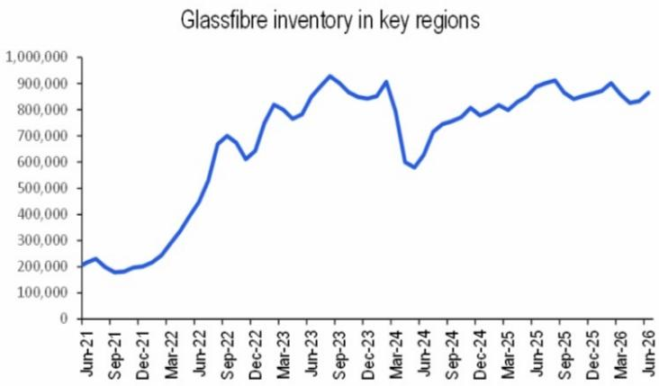

# Citi：截至7月16日当周中国玻纤市场，粗纱承压电子纱偏强

截至7月16日当周，中国玻纤市场延续了粗纱承压、电子纱偏强的分化格局。粗纱价格在季节性需求调整下继续面临不确定性，下游加工企业开工率偏低，库存逐步累积。而电子纱基本面依然突出，G75及电子布价格在最新一轮提价后稳定于高位，下游覆铜板需求保持旺盛。Citi在周度报告中指出，尽管整体产能稳定，但电子纱有效供给仍受约束——新增产能尚未完全爬坡，高端产品可用量有限。供需偏紧、低库存和较强的市场定价能力共同支撑了电子纱的相对强势。

## 1. 粗纱价格承压，库存消化仍是短期挑战

2400tex缠绕直接纱主流成交价维持在每吨3500-3900元，全国均价为每吨3768.5元，周环比下降0.26%，同比仍上涨3.27%。报告指出，部分区域价格不确定性持续，生产商在需求仍在调整下优先出货和管控库存。南方高温和降雨天气继续抑制下游加工活动，多数深加工客户维持低开工率，采购意愿有限，出货动能偏弱。粗纱库存因出货不畅而小幅增加，短期价格预计仍将承压。

## 2. 电子纱供需偏紧，价格稳定但中期仍有上行空间

G75电子纱价格稳定在每吨16800-17500元，周均价约每吨16987.5元，在前期快速上涨后环比持平。7628电子布价格维持于每米8.5-8.7元，成交按量议价。报告强调，电子纱和电子布库存仍处低位，下游电子客户持续面临供应约束，部分厂商接受新增订单的意愿有限。尽管价格短期趋稳，但月度订单已基本锁定，供给约束、低库存和强劲的CCL需求应能继续支撑后续价格进一步上涨。

> **KC评论：** 电子纱的供应瓶颈不在于总产能，而在于新增产能尚未完全释放以及高端产品结构性短缺。这意味着即便整体产能数据没有变化，有效供给仍可能持续偏紧，这是理解电子纱定价能力的关键。

## 3. 产能稳定但结构性差异显著，有效供给是关键变量

当周在产窑炉122条，总产能维持在903.8万吨/年，周环比持平，同比增加8.03%。报告期内无产线变动。粗纱与电子纱的库存走势形成鲜明对比：粗纱库存因出货不畅小幅上升，而电子纱和电子布库存持续低位。这种结构性差异背后，是下游需求强度的根本不同——粗纱受建筑和基建季节性影响较大，电子纱则受益于CCL和PCB产业链的持续景气。Citi认为，电子纱的供需偏紧格局短期内难以逆转，新增产能的爬坡进度和高端产品供应能力将是决定中期价格走势的核心变量。

## 4. 观察框架：从库存、产能爬坡和下游开工率追踪电子纱拐点

对于关注电子纱产业链的读者，Citi报告提供了三个可追踪的先行指标。第一，电子纱和电子布库存水平是判断供需紧张程度最直接的信号，当前低库存意味着价格支撑仍然坚实。第二，新增产能的爬坡进度——报告明确提到有效供给仍受约束，后续需关注在产产线利用率和新增产能的达产时间。第三，下游CCL客户的采购行为，当前“积极锁定供应”和“部分规格仍短缺”的描述表明需求端尚未出现松动迹象。这三个维度结合起来，可以帮助判断电子纱价格从“稳定”走向“进一步上涨”的触发条件是否成熟。

For informational purposes only. Portions may be generated,translated,summarized,or edited with AI assistance based on source materials and may contain omissions or errors. Please verify independently. This is not investment,legal,tax,accounting,or other professional advice.

For informational purposes only. Portions may be generated,translated,summarized,or edited with AI assistance based on source materials and may contain omissions or errors. Please verify independently. This is not investment,legal,tax,accounting,or other professional advice.

