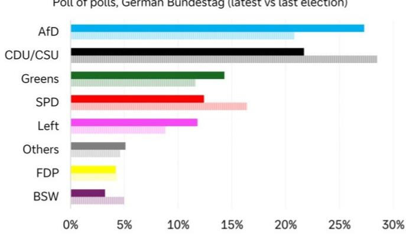
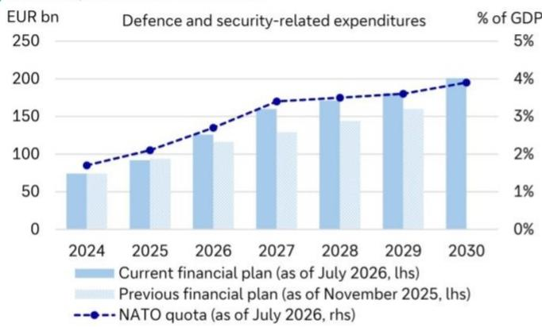

# 德国国防预算：从支出计划到2029年的三重锁定

德国2027年预算草案为国防与安全领域拨款1600亿欧元，占GDP的2.7%——这一增幅远超政府去年秋季的规划，自首份中期财政计划以来，新增了220亿欧元的债务融资支出。这并非渐进式调整，而是一次结构性转向。政府已承诺到2028年达到北约GDP占比3.5%的目标，2029年达到3.6%，这意味着到本十年末，核心预算中每三欧元就有一欧元用于国防与安全。累计来看，德国目前计划在2025年至2029年间为国防支出约7300亿欧元，高于去年秋季计划中暂定的6400亿欧元。其中大部分——至少5000亿欧元——将通过新增债务直接融资，这得益于债务刹车规则的慷慨豁免。

对这一财政轨迹的传统解读是，德国只是在履行北约义务。这种理解过于狭隘。实际情况是，德国政府现在追求的是效果，而非成本。2029年这一截止日期——北约评估认为俄罗斯可能对北约领土发动常规攻击的年份，也是下一届联邦大选的年份——为国防支出创造了三重锁定，且在未来三年内只会进一步收紧。政府的最新财政计划代表的是下限，而非上限。而采购的构成——批评者称之为短视——实际上是对压缩时间线的理性回应。

## 2029年截止日期创造了具有约束力的财政与政治约束，使国防支出成为政府的首要优先事项

关于德国国防预算最重要的事实并非相对数字，而是驱动其增长的时间逻辑。政府与北约一致评估认为，俄罗斯可能在2029年前做好对北约领土发动常规攻击的准备。美国可能在2029年初迎来一位更孤立主义总统的可能性，进一步加剧了紧迫感。柏林方面需要不迟于那一年展现出可信的军事威慑力和强有力的财政承诺。这一外部威胁时间线是政府持续加码国防预算计划的主要原因，即便其他财政优先事项面临审视。

国内政治日历加剧了这一压力。德国下一届联邦大选定于2029年春季举行。共同改革债务刹车的中右翼政党——基民盟/基社盟、社民党和绿党——目前民调支持率为48%，得益于5%的门槛，刚好足以获得微弱多数席位。如果到下次大选时这一多数地位丧失，将很难从其他两个政党那里获得对大规模债务融资国防预算的支持。因此，政府有一个狭窄的时间窗口，在政治格局可能发生变化之前锁定支出承诺。自去年秋季以来，每一次预算修订都朝着同一个方向：向上。

外部与国内政治风险在2029年左右的集中，形成了报告所称的德国国防支出的“三重锁定”。政府不仅计划增加支出，而且在结构上承诺增加支出，无论成本超支还是竞争性需求如何。国防预算似乎是两个执政联盟伙伴达成一致共识的少数领域之一，两党内部均无明显异议。当总理默茨在最近的新闻发布会上强调这一共识时，他是在传递一个信号：国防支出不受制于其他部门面临的正常预算权衡。

## 债务刹车豁免创造了财政体制变革，但欧盟财政规则可能成为比宪法更具约束力的限制

修改后的债务刹车对政府为国防借款的能力没有施加宪法限制。计入修改后刹车规则的GDP 1%规则几乎只是遮羞布。将国防支出从债务刹车中剥离，比设立另一个国防专项基金更具深远意义的财政体制变革。5000亿欧元的基础设施与气候转型专项基金面临被快速上涨的建筑成本侵蚀的风险，但政府将有能力且愿意保护其雄心勃勃的国防预算免受价格上涨影响。这也是政府开始将一些与安全相关的基础设施项目——铁路、公路、桥梁——从基础设施基金重新划归国防预算的原因之一。民用与国防相关基础设施之间的界限模糊，政府正在利用这种模糊性。

然而，一个较少被注意到的约束正来自布鲁塞尔。欧盟财政规则中针对国防支出的豁免条款将于2028年底到期。虽然德国目前的赤字凭借该条款勉强符合3%的参考值，但如果该条款不延长，将很难避免过度赤字程序。这可能在政府的“不惜一切代价”战略与其在欧洲财政治理下的义务之间产生潜在冲突。虽然很难想象德国的欧洲伙伴会大声抗议，但违反欧盟财政规则可能会在国内政治辩论中削弱国防战略的可信度。具有讽刺意味的是，宪法约束已被化解，但超国家约束可能恰恰在政府需要最大财政灵活性时重新浮现。

## 采购策略看似短视，因为它确实如此——而这正是时间压力下次优策略的关键

批评者指出，德国的军事采购过度集中于从德国和美国公司订购的传统武器系统。基尔世界经济研究所的研究人员估计，德国近期在自主平台等“新范式系统”上的支出不到10%，而波兰为16%。此外，近期近90%的订单流向了德国公司，此前曾有一波来自美国的订单。更优策略的论点是，德国应推动欧洲建立真正的国防产品单一市场，并加大对前沿技术的投入，借鉴在乌克兰观察到的战争范式。更重视前沿技术将建立更可信的威慑力，并通过技术溢出效应带来更高的经济增长红利。

这种批评在分析上是合理的，但在战略上却是天真的。政府的采购策略看似短视，因为它本就是有意为之的短视。政府面临时间压力，需要填补德国常规能力中最明显的缺口，同时继续向乌克兰提供军事援助。在国内，它面临政治压力，需要拿出切实证据，证明在本届议会任期内借入的数千亿欧元取得了成果。这意味着要补充军事仓库——在数十年的支出不足和对乌克兰多年的援助之后——并在德国国防领域创造新的就业机会。政府正在优化速度和政治可见度，而非长期技术优势。

如果这一策略奏效，将允许未来的中右翼政府从2029年起转向技术更先进、财政更可持续的采购策略。当前的策略是一座桥梁，而非终点。政府现在正在争取时间和能力，以便下一届政府能够在之后发展能力。当最优策略需要太长时间才能产生结果时，这是一个理性的次优策略。

## 读者的决策框架：三重锁定创造了到2029年国防支出和借款持续增长的可预测模式

对于观察者、政策制定者和企业战略家而言，关键启示在于，德国的国防支出并非可削减或延迟的酌情预算项目。它是一个结构性的承诺支出路径，几乎肯定会超过当前预测。三重锁定——外部威胁时间线、国内政治截止日期和财政体制变革——为未来三年创造了可预测的模式。

首先，政府的财政计划代表的是下限，而非上限。报告明确指出，2028年预算草案中的国防支出显著高于当前计划，这并不令人意外。国防行业的价格上涨将推高名义支出。政府追求的是效果，而非成本，这意味着它将吸收成本超支，而非缩减订单。

其次，借款需求将大于当前预测。在7300亿欧元的累计国防支出中，至少5000亿欧元将通过债务融资。如果国防预算进一步上升，发行量也将随之增加。政府拥有借款的宪法空间，并且会加以利用。

第三，在本届议会任期内，采购构成将继续集中于传统系统和国内供应商。传统国防制造业、与国防相关的基础设施以及德国工业供应链中的企业将受益。押注于快速转向自主平台或欧洲跨境采购的企业可能会发现市场发展慢于预期。

第四，2028年欧盟财政规则到期引入了一个尾部风险，如果豁免条款不延长，该风险可能成为具有约束力的限制。这是一个需要密切关注的变量，因为它可能在德国需要最大财政灵活性时引发柏林与布鲁塞尔之间的政治对抗。

## 时代转折必须在2029年前完成，政府正据此支出

始于2022年初俄罗斯对乌克兰行动后的德国国防政策范式转变，如今有了一个硬性截止日期：2029年。政府不仅是在增加支出，而且是带着特定的时间线在支出，这条时间线解释了其采购的规模和构成。次优策略是对压缩时间窗口的理性回应。如果成功，德国将拥有可信的常规威慑力，并为下一个十年更精细的策略奠定政治基础。如果失败，后果将不是以预算超支来衡量，而是以战略脆弱性来衡量。政府已经做出了选择：它优先考虑速度而非优雅，并且正在借钱来实现这一目标。

*仅供参考。部分内容可能基于源材料通过AI辅助生成、翻译、总结或编辑，可能存在遗漏或错误。请独立核实。这不构成专业建议。*

仅供参考。部分内容可能基于源材料通过AI辅助生成、翻译、总结或编辑，可能存在遗漏或错误。请独立核实。这不构成专业建议。

