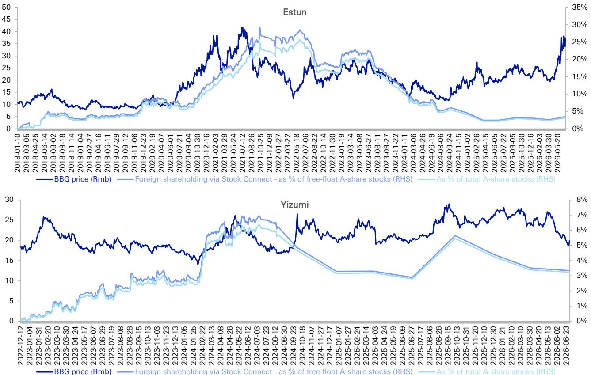
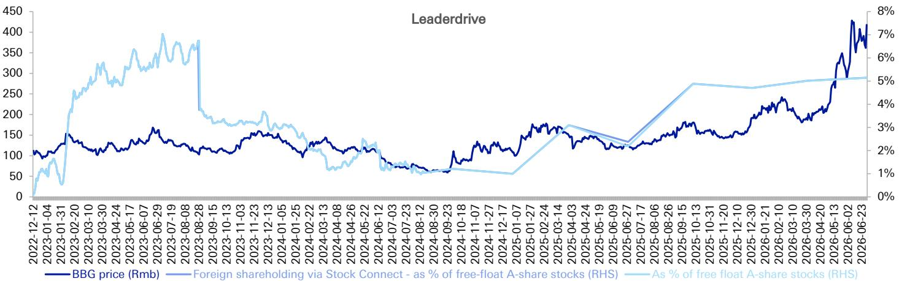
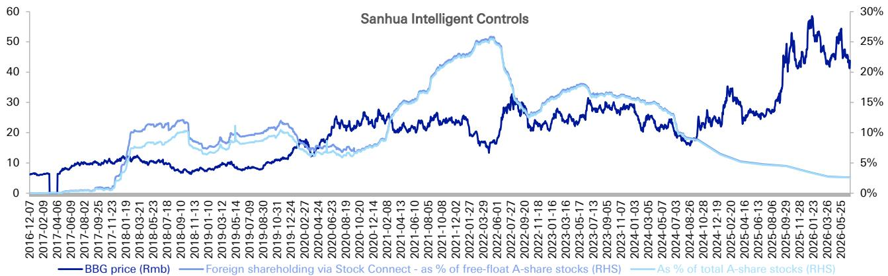

# 外资回流中国工业自动化龙头，但复苏范围有限且具有选择性

根据某全球投资银行追踪的数据，截至2026年第二季度末，八家A股工业自动化与机械公司外资平均持股比例为7.5%，较第一季度环比提升0.8个百分点。这是外资从中国工业领域撤离较长时间后首次出现整体回升，但总体数字掩盖了一个关键分化：仅恒立液压和双环传动两家公司贡献了大部分流入，而其他多家公司的外资持股比例仍在收缩或停滞于多年低位附近。数据显示，外资并未广泛重新进入中国自动化领域，而是高度选择性地押注那些能够展现盈利韧性、市场份额增长或终端市场需求复苏的公司。对于关注中国资金流向的观察者而言，关键问题不在于外资情绪是否转变，而在于哪些公司具备维持这种重新关注的结构性特征。

这份季度外资持股数据，依据2024年8月从每日披露转为季度披露的监管框架发布，为观察国际读者在这一过去两年大部分时间不受青睐的中国市场板块中的持仓情况提供了难得窗口。0.8个百分点的环比改善相对值虽不大，但代表了经过数个季度停滞或下滑后的重要转折。更重要的是，资金流向的构成揭示了一种自下而上选股策略的模式，而非宏观驱动的重新配置。第二季度吸引最多外资的公司具有共同特征：它们所处的工业自动化细分领域，中国企业已实现与全球同行真正的技术对等，国产替代仍处于早期阶段，或者盈利轨迹明显比整体工业周期更稳定。

## 恒立液压3.7个百分点跃升预示结构性重估，而非周期性反弹

恒立液压在第二季度录得所有覆盖标的中最大的外资持股环比增幅，上升3.7个百分点至12.8%。这是自2025年第四季度以来连续第三个季度改善，该比例现已回升至接近2023年中期约14%的峰值水平。这一模式引人注目：恒立液压的外资持股从2023年中期峰值开始持续下降至2024年大部分时间，但始于2025年末的回升在2026年上半年加速。这不是死猫反弹。持续三个季度的资金流入表明，外资正在重新评估恒立液压的业务模式，而非在下跌后简单底部观察。

是什么支撑了这种信心？恒立液压从事液压元件和工业自动化子行业，这是一个中国制造商历史上落后于德国和日本老牌企业的细分领域。然而，过去两年中，恒立液压展示了在用于工程机械、注塑机和重型工业设备的精密液压系统中获取市场份额的能力——这些终端市场一直受到中国房地产领域调整的显著影响。外资在终端市场仍显疲弱之际增加对一家与建筑相关终端市场有联系公司的敞口，表明研究逻辑聚焦于市场份额增长和产品组合升级，而非总需求复苏。读者押注恒立液压的技术进步将使其在当前调整期后以永久更高的可寻址市场份额脱颖而出，这一动态将支撑更高的均衡估值倍数。

## 双环传动反弹确认精密零部件制造商吸引结构性外资兴趣

双环传动录得第二大增幅，第二季度外资持股环比上升2.1个百分点至11.6%。这一回升尤其值得注意，因为它发生在连续两个季度下降之后，表明近期流入代表此前估值下调的逆转，而非趋势延续。双环传动为电动汽车、风力涡轮机和工业机械制造精密齿轮和传动部件——这些终端市场结构性增长，但过去18个月经历了激烈的价格竞争和利润率压缩。

双环传动的外资买入模式与恒立液压的逻辑相似：读者关注那些在正在经历本土化或技术升级的供应链中拥有防御性地位的公司。就双环传动而言，该公司一直是中国本土电动汽车供应链快速扩张的直接受益者，其中电动传动系统的精密齿轮部件已成为高增长领域。外资持股在反弹前下降两个季度的事实表明，早前的减持可能源于对电动汽车需求增长或贸易关系的宏观担忧，而第二季度的流入则反映了对双环传动竞争护城河的重新评估。此前观望的读者现在正以他们认为提供有利风险回报的水平重新进入，考虑到该公司对很大程度上独立于中国更广泛经济周期的长期增长趋势的敞口。

## 汇川技术仍为外资持股最高标的，但主导地位引发集中度风险问题

汇川技术生产工业自动化控制系统和伺服驱动器，在八家覆盖公司中仍为外资持股比例最高的标的，第二季度外资持股上升0.9个百分点至19.6%。这是该比例在2025年第二季度触及近期低点后连续第二个季度改善。汇川技术在2025年第三季度超越双环传动成为外资持股最多的标的，此后领先优势持续扩大。

外资在汇川技术的集中是一把双刃剑。一方面，它反映了市场认可汇川技术已构建中国自动化领域较完整面的产品组合之一，涵盖可编程逻辑控制器、伺服系统和人机界面。该公司提供与西门子、三菱和罗克韦尔自动化直接竞争的集成解决方案的能力，使其成为中国推动工业自主化的自然受益者。另一方面，接近20%的外资持股比例意味着汇川技术日益面临持仓限制和监管披露门槛的风险。根据现行规则，外资持股总额不得超过总股本的30%，一旦比例超过24%则触发每日披露。汇川技术现已接近该披露门槛，任何进一步的外资买入都可能引发监管关注或触发资金流入的自然上限。

对于考虑增持汇川技术的读者而言，关键问题不在于公司基本面是否支持更高配置——很可能支持——而在于剩余的外资持股空间是否足以容纳额外流入而不产生自我限制的动态。双环传动的经历——其外资持股总额在2025年9月跌破24%的每日披露门槛，此前曾长期超过该水平——是一个警示。当外资持股变得过于集中时，边际买家面临任何负面催化剂都可能引发不成比例大规模流出的风险，因为潜在卖家池严重偏向于可能对地缘政治或监管消息更敏感的外资读者。

## 埃斯顿低持股掩盖了外资仍在忽视的结构性故事

埃斯顿在第二季度录得外资持股环比小幅上升0.8个百分点至3.1%，但这一改善几乎未改变更广泛的叙事：埃斯顿的外资持股仍仅为2022年第二季度超过25%峰值的一小部分。从峰值的下跌代表了中国自动化领域最显著的估值下调之一，当前水平表明外资尚未被说服以任何有意义的方式回归。

这令人费解，因为埃斯顿是少数拥有可信机器人业务且延伸至本土市场以外的中国公司之一。该公司生产用于焊接、搬运和装配应用的工业机器人，并一直在积极投资海外分销和服务网络。埃斯顿的业务战略与其外资持股水平之间的脱节可能反映了对公司盈利轨迹、其焊接机器人业务对房地产领域的敞口，或中国机器人公司在向国家安全担忧加剧的市场出口时所面临的更广泛风险的持续担忧。无论原因如何，数据表明外资将埃斯顿视为一个“证明给我看”的故事：他们需要看到盈利复苏或市场份额增长的持续证据，才愿意从当前水平重建仓位。

## 中国自动化领域资金配置决策框架

2026年第二季度的外资持股数据为构建一个简单但有效的决策框架提供了基础。读者应根据外资持股的轨迹和水平将八家覆盖标的分为三个层级，然后将其配置决策与外资资金流向所隐含的信号对齐。

第一层级包括外资持股既高且上升的标的：汇川技术和恒立液压。这些公司即使在具有挑战性的宏观环境下也展示了吸引增量外资的能力，表明研究逻辑基于公司特定因素而非对中国市场的贝塔敞口。对于对中国自动化有战略配置的读者，这些标的应构成组合核心，但需注意汇川技术的高持股比例要求仔细监控监管门槛。

第二层级包括外资持股从低谷回升但仍远低于历史峰值的标的：双环传动，以及程度较轻的豪迈科技。这些标的为那些认为外资情绪复苏将扩大到前两大标的之外的读者提供了更具吸引力的风险回报。双环传动对电动汽车和风电供应链的敞口提供了长期增长锚点，而豪迈科技稳定的持股轨迹表明最严重的资金外流可能已经过去。

第三层级包括外资持股要么下降要么停滞在低位的标的：中控技术、三花智控和埃斯顿。对于中控技术和三花智控，外资持股的环比下降——分别为0.9个百分点和0.1个百分点——确认了外资继续减少敞口。中控技术的外资持股自2023年第三季度以来持续收缩，目前为1.6%，是覆盖范围内持股比例最低的标的。三花智控在2022年中期达到约25%的外资持股峰值后经历了稳步侵蚀，最近才刚开始放缓。埃斯顿尽管有小幅改善，但仍处于表明深度怀疑的水平。考虑这些标的的读者应在投入资金前要求明确的催化剂——如盈利超预期、重大合同中标或终端市场条件变化——因为外资持股数据未提供抛售压力已缓解的信号。

## 监管框架为外资持股设置自然上限，读者须纳入退出策略考量

2024年8月实施的互联互通持股从每日披露转为季度披露，降低了外资资金流向的透明度，增加了本土与国际读者之间的信息不对称。在当前制度下，外资持股数据按季度提供，在每季度结束后五个交易日发布，除非比例超过24%，此时恢复每日披露。这意味着对于绝大多数标的，读者实际上是在对外资持仓情况有长达三个月的滞后理解下进行操作。

这一监管约束对组合管理具有实际影响。对于汇川技术等外资持股接近24%门槛的标的，恢复每日披露将提供关于资金流向方向的宝贵实时信息。对于中控技术和三花智控等外资持股低且下降的标的，季度披露滞后问题较小，因为趋势已明确确立。但对于处于中间水平的标的——双环传动11.6%或恒立液压12.8%——季度披露创造了一个不确定性窗口，在此期间外资可能正在建立或退出仓位，而读者需等到下一次数据发布才能知晓。

30%的外资持股硬性上限增加了另一层复杂性。覆盖范围内目前没有公司接近这一限制，但该上限的存在为外资持股比例的上行空间设置了自然天花板。对于考虑在那些外资持股上升的标的中建立大仓位的读者而言，该上限充当潜在的退出信号：如果外资持股接近30%，外资进一步加仓的能力受到机械性约束，边际买家必须来自本土来源，后者可能具有不同的估值阈值和持有周期。这一动态表明，对外资读者而言，最具吸引力的入场点可能出现在持股比例低但正在回升的标的中，而非持股比例已高且接近监管约束的标的。

*仅供参考。部分内容可能基于源材料通过AI辅助生成、翻译、总结或编辑，可能存在遗漏或错误。请独立核实。本文不构成研究、法律、税务、会计或其他专业建议。*

仅供参考。部分内容可能基于源材料通过AI辅助生成、翻译、总结或编辑，可能存在遗漏或错误。请独立核实。本文不构成研究、法律、税务、会计或其他专业建议。

