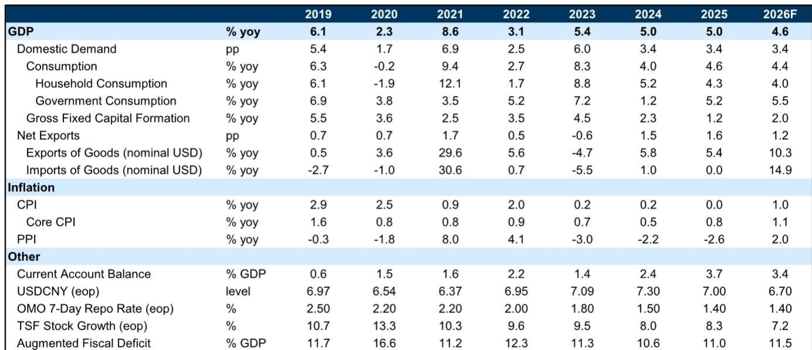
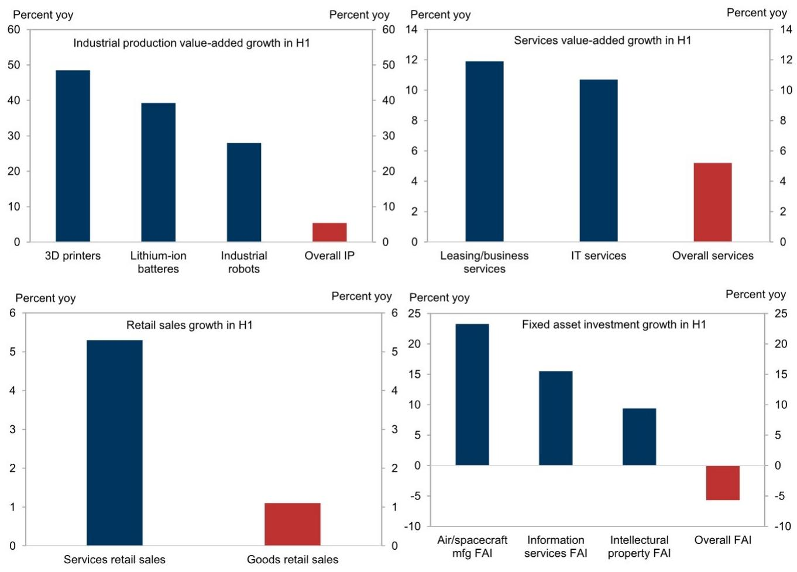
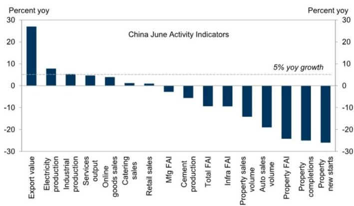

# GS：行业规则与主题变化观察

二季度中国实际GDP环比年化增速从一季度的5.3%降至3.6%，零售额和固定资产研究均明显走弱。这份GS研报的核心判断是：当前宏观环境与2024年中期相似，政策宽松的窗口正在打开，但决策者在安全、科技竞争和财政约束之间面临取舍。

报告指出，二季度增长减速中约40%可归因于财政脉冲转负。一季度GDP数据较强后，相关方面调整了财政支出节奏。伊朗战争导致化工和成品油产量下降，贡献了约30%的减速。其余部分来自天气因素和春节前置消费的透支效应。随着伊朗局势再度升级以及7月台风和洪水持续影响，报告假设三季度财政脉冲将重新转正，才能支撑环比增长反弹。

## 1. 宏观环境分化从“K型”走向更极端的“K型”

6月主要活动指标中，只有出口、发电量和工业增加值同比增速超过5%。国内宏观环境中，房地产销售和汽车销量同比分别下降14%和19%，房地产、基建和制造业研究分别下降24.2%、9.4%和2.8%。

报告用统计局发布的细分数据展示了“K型”有多极端：上半年3D打印机产量同比增长48.5%，锂电池增长39.3%，工业机器人增长28.0%，远高于整体工业增加值5.4%的增速。服务业中，租赁和商务服务、信息技术服务分别增长11.9%和10.7%，是整体服务业增速的两倍以上。但零售中商品销售仅增长1.1%，固定资产研究总量明显调整。

> **KC评论：** 这张“K型”图表的含义在于，高增长部门集中在与AI和高端制造相关的领域，而更广泛的国内需求部门仍在调整。出口的韧性反映的是国内产能过剩背景下的被动外溢，而非外需本身强劲。

## 2. 市场型、长期型、扩张型、需求型政策更有效

报告从四个维度对比了当前政策选项。市场型政策方面，6月新发放按揭贷款平均利率为3.1%，而制造业贷款利率已降至2.74%。许多城市租金回报表现低于2.5%，房价预期偏弱，按揭利率仍过高。香港和上海的经验表明，降低有效按揭利率相对于租金回报表现，比地方政府收购空置公寓更有效。

长期型政策方面，消费品以旧换新补贴拉动了耐用品替换需求，但效果不可持续。家电销售额从去年5月同比增长53%骤降至今年5月的同比下降15.6%。报告认为，创造就业、提高收入和增强信心的长期政策比短期补贴更能支撑可持续消费。

扩张型政策方面，二季度企业中长期贷款增速大幅下滑，多项指标显示需要扩张性周期政策。但财政政策实际呈调整态势：1-5月一般公共预算收入同比增长4%，部分来自通胀和加强税收征管，而一般公共预算支出同比下降0.8%。

需求型政策方面，过去几年政策偏重供给端，包括扩大新兴产业产能和建设商业步行街，同时推动地方化解隐性债务、退出融资平台、收紧资金监管，这些措施无意中加剧了供需失衡，产能利用率持续下降。“反内卷”运动在遏制过剩产能方面效果有限，多晶硅价格已跌至2025年中水平以下。

## 3. 政策路径：先加速现有工具，再考虑追加资源

报告认为，从纯宏观视角看，政策选择与决策者实际会做的选择存在差距。地缘政治紧张和中美科技竞争使高层持续聚焦安全和科技创新，而高政府债务和赤字使决策者对财政扩张持谨慎态度。

但当前环境与2024年中期有相似之处：GDP增速节奏变化，消费和研究减速，权益市场走弱，部分地方政府因财政不确定性加强税收征管，政府关联宏观环境学家呼吁政策宽松的声音加大。这些信号表明政策宽松的概率上升。

报告预计7月政治局会议将释放更强宽松信号。具体路径分三步：第一步，加速使用现有政策空间，包括尚未动用的8000亿元政策性资金工具和近7万亿元政府债券剩余额度，预计三季度加快发债和支出。如果财政脉冲仍不足以逆转减速，第二步是动用往年未使用的约1.8万亿元政府债券额度。若仍不足，第三步是提请全国人大批准追加财政资源，但门槛较高。

报告维持全年实际GDP增长4.6%的预测。不确定性来自两方面：中央层面的自满情绪——下半年基数效应有利，如果决策者认为只需4.3%的同比增速即可完成全年目标，可能保持财政保守；地方层面的执行约束——即使资金充足，有限的可盈利项目、持续的反腐败行动和明年党代会前的政治交接，可能阻碍下半年财政支出加速。

For informational purposes only. Portions may be generated,translated,summarized,or edited with AI assistance based on source materials and may contain omissions or errors. Please verify independently. This is not investment,legal,tax,accounting,or other professional advice.

For informational purposes only. Portions may be generated,translated,summarized,or edited with AI assistance based on source materials and may contain omissions or errors. Please verify independently. This is not investment,legal,tax,accounting,or other professional advice.

