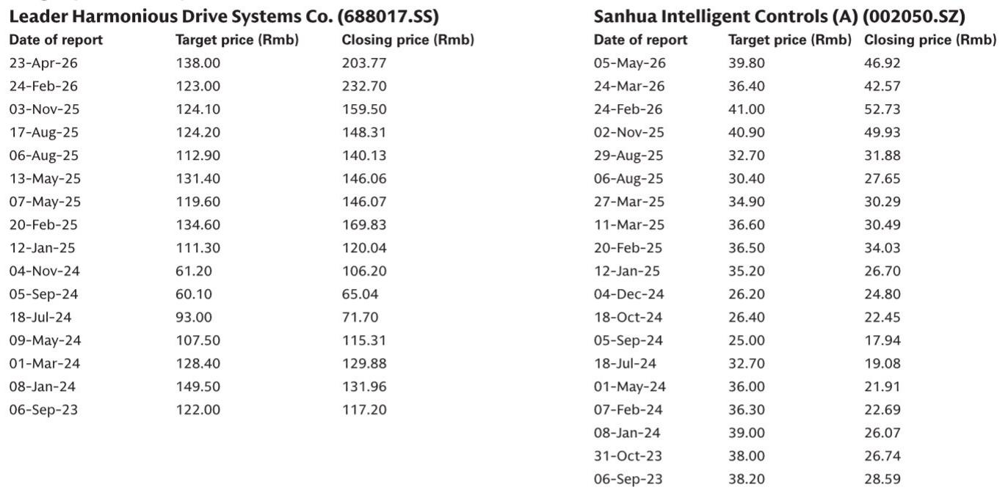
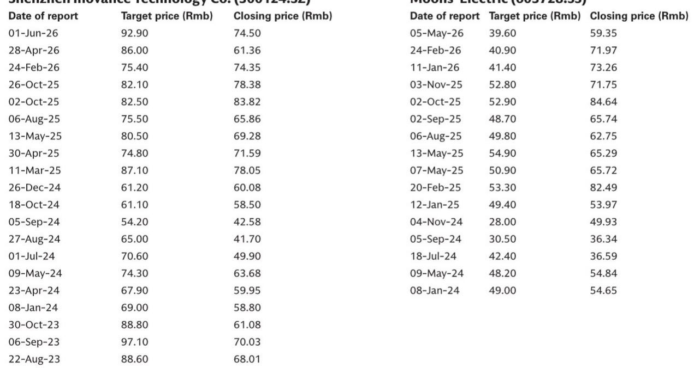
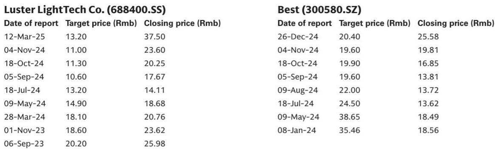

# Humanoid Robot Commercialization Is Real, But Only in Narrow Corridors: WAIC 2026 Proves the Gap Between Demonstration and Deployment Is Still Wide

The 2026 World Artificial Intelligence Conference in Shanghai was not a speculative showcase. It was a stress test. With 242 embodied intelligence exhibitors—a 203% year-over-year increase—and over 300 humanoid robots performing live demonstrations, the industry has clearly moved past the "concept art" phase. Yet the most revealing data point was not the volume of robots, but the divergence in their performance. Logistics sorting and structured warehouse operations achieved near-production-level accuracy and tempo. Household chores like folding clothes and making breakfast failed with alarming regularity. The same conference that proved humanoid robots can work also proved they cannot yet work where it matters most for mass adoption.

This is not a story of uniform progress. It is a story of tiered readiness, and the implications for observers are sharply asymmetrical. The companies that understand where commercialization is genuinely possible—and where it remains a distant frontier—will capture the value. Those that treat all humanoid applications as equally viable will face significant resource misallocation. WAIC 2026 provided the clearest evidence yet that the humanoid robot supply chain is forming, but it is forming around specific, narrow use cases, not general-purpose humanoids.

## The Convergence of VLA and WAM Has Become the Industry's Unquestioned Architecture, Creating a Clear Technical Standard That Benefits Incumbents with Integrated Capabilities

The most significant strategic development at WAIC 2026 was not a single product launch, but the near-universal adoption of the Vision-Language-Action (VLA) plus World-Action Model (WAM) dual-system architecture. Every major embodied AI booth emphasized this convergent stack. VLA handles visual and semantic understanding—identifying objects, parsing commands, grounding tasks in the physical world. WAM handles physical dynamics, future-state prediction, and action consequences—essentially, the system's intuition for how the world behaves. This is a "System 1" (fast motor control) and "System 2" (slow cognitive reasoning) framework, and its standardization means the industry has agreed on the fundamental problem structure.

The consequence is that model capability is no longer a differentiator in itself. The architecture is settled. What now separates leaders from laggards is the quality and scale of training data, the robustness of cross-embodiment generalization, and the ability to fine-tune models for specific environments. WAIC 2026 revealed that despite pre-training foundations, fully "out-of-the-box" capabilities have not materialized. Every commercial deployment still requires specific environmental trajectory collection and on-site fine-tuning. This creates a structural advantage for companies that already possess deep integration expertise in industrial automation, because they understand the environments where humanoids will first be deployed.

For observers, the key insight is that the technical convergence reduces uncertainty about the model architecture but increases the importance of downstream execution. The winners will not be those with the best algorithm alone, but those with the best feedback loop between real-world deployment data and model improvement. This favors companies like Inovance, which already holds dominant market share in servo systems and variable-frequency drives across Chinese factory floors. Their existing industrial footprint provides a natural deployment corridor for humanoid robots, along with the environmental data necessary for fine-tuning.

## The Shift from Teleoperation to Egocentric Video Data Collection Has Triggered a Volume Race, But Quality Divergence Means Not All Data Is Equally Valuable

The second major consensus shift at WAIC 2026 was the abandonment of teleoperation as the primary data collection method in favor of non-embodiment, egocentric video data. Lightweight devices are proliferating: Universal Manipulation Interface (UMI) handheld dual-finger grippers, first-person vision hardware, and exoskeleton data collection gloves. The global non-embodiment data volume is projected to reach the hundred-million-hour scale within three to five years, up from an estimated 10 million hours in 2026. The goal is to trigger the Scaling Law in model capabilities—the hypothesis that model performance improves predictably with data volume.

However, this volume race masks a critical divergence in data strategy. Some teams emphasize that high-quality data—featuring precise tactile and force-control feedback—matters far more than the mere stacking of data hours in enhancing model generalization. The data collection solutions for dexterous hands have not yet converged, with exoskeleton, pure finger-cot, and tactile glove designs all coexisting. This fragmentation creates a strategic choice: pursue scale and hope quality follows, or pursue quality and accept slower volume growth.

For the supply chain, the implications are direct. Companies that produce dexterous hand components—motors, sensors, actuators—face a market where technology roadmaps remain unsettled. Moons' Electric, heavily exposed to upstream motors and dexterous hand components, illustrates the risk. The number of dexterous hand vendors at WAIC surged from 9 in 2025 to 38 in 2026, and technology routes remain fragmented across direct-driven, linkage, and cable-driven designs with 11 to 42 degrees of freedom. This explosion in supply-side competition, combined with unresolved technical standards, points toward rapid commoditization and margin compression. The volume race in data collection does not automatically translate into volume demand for any specific hardware configuration.

## Commercialization Maturity Follows a Clear Hierarchy: Structured Industrial Environments Are Ready, Retail Is Functional but Inefficient, and Household Remains a Distant Frontier

The most actionable insight from WAIC 2026 is the tiered divergence in deployment maturity across end-markets. This is not a matter of opinion; it is observable in the performance data from live demonstrations.

At the top of the readiness hierarchy, logistics sorting and warehouse material handling stand out as commercially ready. Some leading manufacturers' palletizing solutions achieved accuracy and tempo sufficient for long-term, continuous automated operations. These environments are structured, predictable, and error-tolerant within defined parameters. The path from proof of concept to volume adoption is visible. Precision manufacturing and production line assembly show a more nuanced picture: a few players achieved high success rates in specific precision workstations—wire harness assembly, fine mobile phone assembly, battery module plugging—but many enterprises experienced high failure rates during detailed operations like screwing and unplugging parts, with operation times still significantly lagging behind human labor.

In retail settings—pharmacies, catering, hotels—commercialization exploration is active but remains in a "functional but inefficient" stage. Smart pharmacy displays can achieve multi-SKU recognition and grasping, but single-item retrieval time reaches the minute level. Some food preparation and commercial greeting scenarios retain strong display and gimmick attributes, with their capability to cope with high-frequency, high-intensity continuous commercial operation still unverified.

Household and consumer scenarios are the most difficult by a wide margin. In chores like breakfast making, clothes folding, and item organization, most applications appear immature. Tasks involving refined and soft-object operations—putting bread into a toaster, folding clothes while keeping them neat, cleaning messy desktops—generally have low success rates. Limited gripper ranges of motion, insufficient perception of soft-object deformation, and frequent errors or item drops during operations indicate that current technology is still far from commercialization. The gap between short-term demonstrations and hours of continuous high-intensity operations in the real world remains wide.

For observers, this hierarchy dictates where attention should flow. Companies targeting logistics and structured industrial environments have a credible near-term revenue thesis. Companies targeting household applications are making long-term bets that may take five to ten years to materialize. The risk of overpaying for household exposure is substantial.

## The Ecosystem Is Rapidly Fragmenting into Four Distinct Player Types, Each with Different Strategic Incentives and Profiles

WAIC 2026 revealed that the humanoid robot ecosystem is moving away from isolated, vertically integrated silos toward an interconnected network of specialized players. Four distinct categories emerged, each with different risk-return characteristics.

Embodied AI startups represent the most high-profile group. Many claim full-stack control of software and hardware through in-house foundation models, data infrastructures, and multi-form humanoid bodies. Their value proposition is technological leadership, but their risk is that full-stack integration is capital-intensive and may not be necessary if the ecosystem standardizes around modular components.

Legacy hardware vendors from logistics robots, collaborative robots, and rehabilitation robots are leveraging existing customer trust and vertical-scenario engineering to focus on reliability breakthroughs in specific applications. Their advantage is domain expertise and installed customer bases. Their risk is that they may be too narrowly focused to capture the broader humanoid opportunity.

Internet and large language model giants are exploring cross-embodiment AI—the "one brain, multiple bodies" concept, where a centralized AI operates and shares learned skills across a wide variety of physical bodies and hardware. Their advantages are computing infrastructure, multimodal large model APIs, and cloud training platforms. Their risk is that they lack the hardware integration expertise to make cross-embodiment generalization work reliably.

Vertical industry companies—automakers, auto component suppliers, electronics manufacturers, pharmacy chains—are transforming from robot purchasers into co-builders. They bind with humanoid body makers or model vendors, opening up their production lines, warehouses, retail stores, and hazardous operational environments to jointly build embodied AI training hubs with data feedback loops. Their advantage is access to real-world deployment environments and the ability to generate proprietary training data. Their risk is that they become locked into specific technology partners.

The strategic implication is that the ecosystem is becoming more interconnected but also more complex to navigate. Pure-play humanoid robot companies face competition from multiple directions. The most attractive opportunities may be in companies that sit at the intersection of multiple ecosystem categories—for example, industrial automation leaders like Inovance that can serve as both hardware suppliers and deployment partners for multiple player types.

## A Decision Framework for Humanoid Robot Supply Chain Observation: Prioritize Structural Bottlenecks, Avoid Commoditized Components, and Favor Companies with Industrial Deployment Corridors

The evidence from WAIC 2026 supports a selective, bottleneck-focused approach. The following framework translates the conference takeaways into actionable criteria.

First, identify structural bottlenecks in the supply chain that cannot be easily bypassed or commoditized. Harmonic reducers, planetary roller screws, and precision actuators are examples where manufacturing complexity, equipment capacity constraints, and high technique barriers create durable competitive advantages. LeaderDrive, as China's leading harmonic reducer manufacturer, benefits from growing total addressable market expansion across industrial robots, collaborative robots, and humanoid robots. However, current valuations already price in mid-term growth, limiting upside. BEST Precision benefits from the domestic substitution of planetary roller screws, but mass production scaling, equipment capacity constraints, and high manufacturing technique barriers limit near-term upside.

Second, avoid components where technology roadmaps are fragmented and supply is proliferating. The dexterous hand market is the clearest example. The surge from 9 to 38 vendors in one year, combined with unresolved technology routes across multiple designs, points toward rapid commoditization. Moons' Electric illustrates the risk: despite a leading position in coreless motor products, the evolving technology roadmap for dexterous hands and intensifying supply chain competition create significant margin pressure. The observation is consistent with the evidence that component commoditization is accelerating.

Third, favor companies that have existing industrial deployment corridors. Inovance's dominant market share in servo systems and variable-frequency drives across Chinese factory floors provides a natural pathway for humanoid robot deployment. The company does not need to create new customer relationships; it needs to extend existing ones. This optionality to participate in the transition from pilot demonstrations to commercial factory floor deployments is a structural advantage that pure-play humanoid startups cannot replicate.

Fourth, evaluate valuation discipline relative to commercialization timelines. Sanhua Intelligent's H-shares offer a superior risk-reward profile compared to its A-shares because the H-share valuation discounts the humanoid robot actuator business less aggressively. The A-share valuation currently reflects a higher premium on the robot actuator business, creating asymmetry in risk. The H-share provides exposure to the same fundamental growth thesis—Sanhua's leadership in thermal management and its ability to scale humanoid robot actuator production using automotive and HVAC mass-production synergies—but at a more attractive entry point.

Fifth, recognize that the gap between demonstration and mass production is widest for general-purpose applications. The companies that succeed in the near term will be those that focus on narrow, structured environments with clear performance metrics and error tolerance. The companies that pursue broad household or retail applications without first proving reliability in industrial settings are taking on technology risk that is not yet priced into their valuations.

The humanoid robot industry is real. The demonstrations at WAIC 2026 were not fake. But the distance between a robot that can sort boxes in a warehouse for eight hours and a robot that can fold laundry in a cluttered living room is measured in years, not months. The opportunity lies in identifying which companies are building the infrastructure for the former while avoiding those that are overpaying for the latter.

*For informational purposes only. Portions may be generated, translated, summarized, or edited with AI assistance based on source materials and may contain omissions or errors. Please verify independently. This is not professional advice.*

For informational purposes only. Portions may be generated, translated, summarized, or edited with AI assistance based on source materials and may contain omissions or errors. Please verify independently. This is not professional advice.

