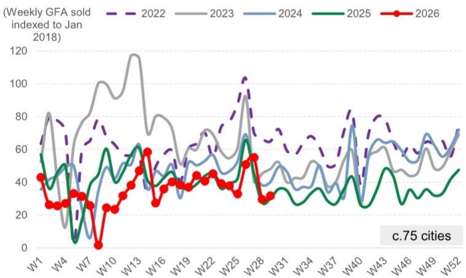
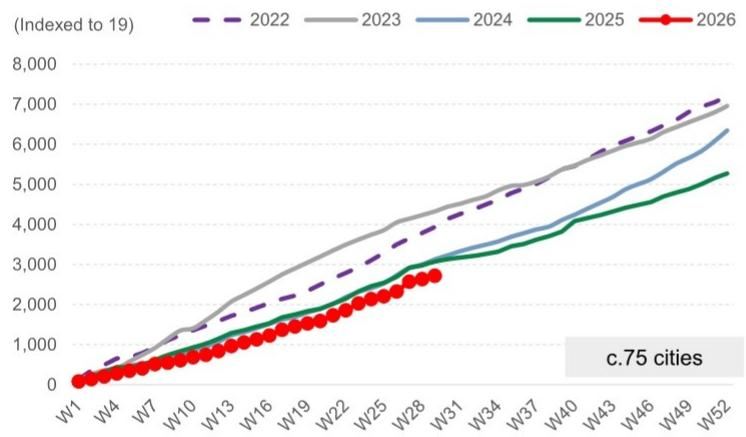
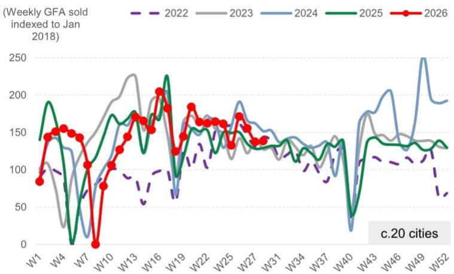
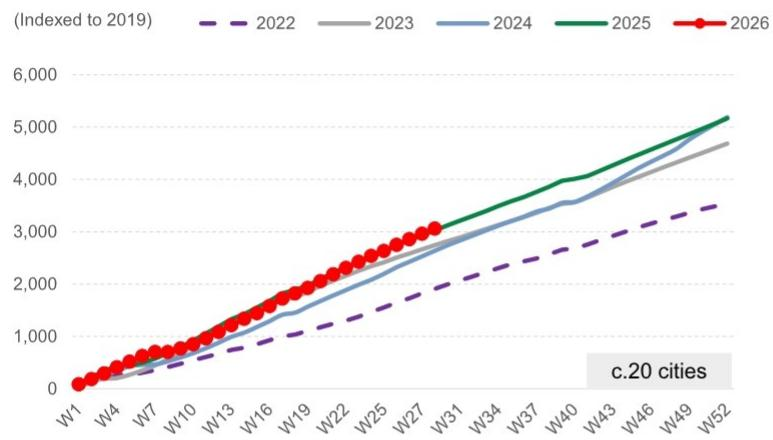
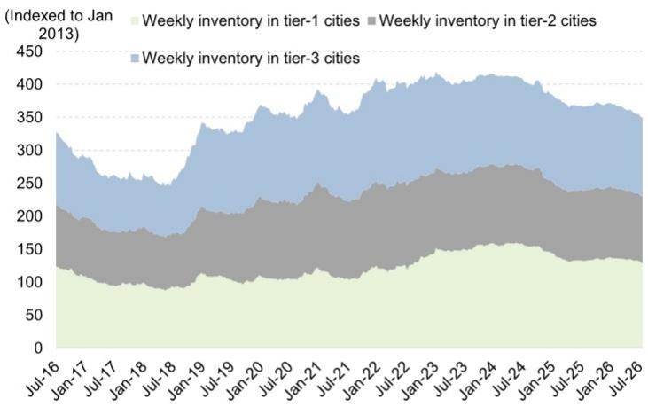
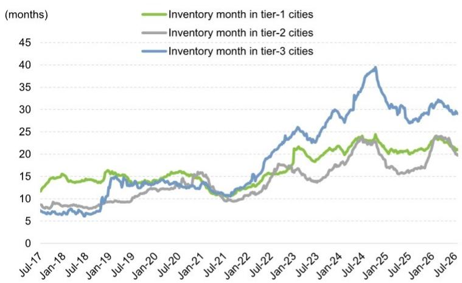
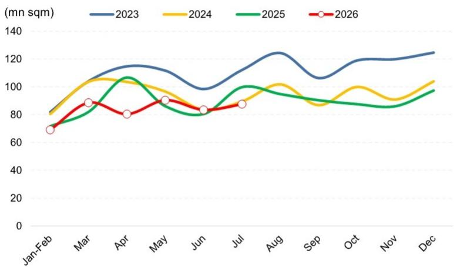
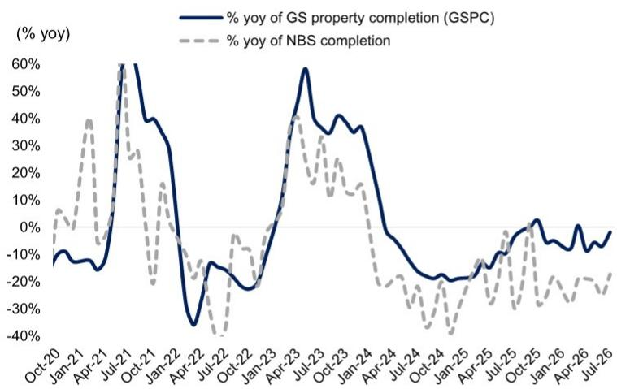

# 行业观察周报

## 第29周观察 - 市场活跃度与情绪边际改善

### 本周要点：

**市场表现：** 新房/二手房成交量环比分别增长7%/1%，7月至今同比分别增长6%/2%。成交量扩大反映在：1）二手房带看量环比增长2%；2）中介和卖方价格预期略有改善；3）新增挂牌量环比收缩4%（较6月均值低8%，较2025年7月水平低19%），尽管二手房认购签约量（领先登记签约1-2周）基本持平，新房搜索量环比微降0.2%。

### 关键数据：

■ 新房成交量环比增长7%，同比增长5%；新房搜索量环比微降0.2%。

二手房成交量环比增长1%，同比增长7%；中介和卖方价格预期略有改善。

7月至今：新房成交面积中位数环比下降9%，同比增长6%；二手房成交面积中位数环比下降10%，同比增长2%。

年初至今：新房成交面积均值同比下降12%，较2024/2023年水平分别下降13%/37%；二手房成交面积均值同比增长1%，较2024/2023年水平分别增长16%/12%。

\- 库存环比下降0.3%，去化周期为26.9个月（6月均值为27.5个月）。

**估值：** 覆盖的较强国企开发商报价环比平均增长7%，其中招商蛇口（001979.SZ，中性）和保利发展（600048.SS，中性）表现领先，环比分别增长10%/8%；其他开发商报价环比平均增长5%。境外/境内覆盖标的目前较2026年末预估净资产价值平均折价34%/32%，对应2026年预估市净率0.5倍/0.4倍。

### 观察：

■ 约75城销售数据显示，前100开发商7月合同销售同比可能下降3%，6月为同比下降13%。

■ 竣工：GSPC跟踪指标显示7月同比降幅为百分之十几（国家统计局/研究机构预估6月同比降幅为25%/约20%），研究机构预估2026全年同比下降15%。

新开工：基于300城土地出让趋势和全国水泥发运率（环比下降2.6个百分点至39%），7月新开工同比降幅为百分之二十几（国家统计局/研究机构预估6月同比降幅为26%/百分之二十几）。

■ 贝壳GTV（新房和二手房）2026年二季度同比可能增长2%（新房/二手房分别为-23%/+12%）。

## 新房市场第29周：成交面积环比增长7%，同比增长5%，年初至今同比下降12%

图表1：上周约75城新房成交面积环比增长7%，同比增长5%

  
来源：中指院，研究机构全球研究  
图表2：约75城年初至今新房成交面积均值同比下降12%，较2024/2023年水平分别下降13%/37%

  
来源：中指院，研究机构全球研究

## 二手房市场：第29周/年初至今成交量同比分别增长7%/1%，中介和卖方价格预期略有改善

图表3：上周约20城二手房成交面积环比增长1%，同比增长7%  
二手房周均成交量

  
来源：Wind，研究机构全球研究  
图表4：约20城年初至今二手房成交面积同比增长1%，较2024/2023年水平分别增长16%/12%  
2026年二手房成交量 vs 2022-2025年

  
来源：Wind，研究机构全球研究

来源：中原地产

## 库存第29周：库存环比下降0.3%，较2025年末下降5.9%，去化周期26.9个月（6月均值27.5个月）

图表7：库存环比下降0.3%，较2025年末下降5.9%  
约20城库存按城市层级分类

  
来源：中指院，研究机构全球研究  
图表8：去化周期环比下降0.5%，较2025年末下降3.8%  
约20城去化周期（12个月滚动）按城市层级分类

  
来源：中指院，研究机构全球研究

## GSPC指标显示7月竣工同比降幅为百分之十几，研究机构预估2026全年同比下降15%

研究机构竣工跟踪指标显示，基于下游供需关系（来自国内浮法玻璃行业展望及周度浮法玻璃需求模型），7月竣工同比降幅为百分之十几（国家统计局/研究机构预估6月同比降幅为25%/约20%），研究机构预估2026全年同比下降15%。

图表9：GSPC指标隐含月度竣工...
GSPC指标隐含月度竣工面积 - 基于浮法玻璃供需模型

  
1-2月为1月和2月均值。  
图表10：...显示7月竣工同比降幅为百分之十几
GSPC同比变化 - 基于浮法玻璃供需模型

  
来源：卓创资讯，Wind，国家统计局，研究机构全球研究  
来源：卓创资讯，Wind，国家统计局，研究机构全球研究

## 估值：市净率处于周期低位

第29周，覆盖的较强国企开发商报价环比平均增长7%，其中招商蛇口（001979.SZ，中性）和保利发展（600048.SS，中性）表现领先，环比分别增长10%/8%；其他开发商报价环比平均增长5%。

境外覆盖标的报价环比平均增长6%（MSCI中国指数基本持平）；境内覆盖标的报价环比平均增长7%（沪深300指数下降2%）。

境外覆盖标的目前较2026年末预估净资产价值平均折价34%，对应2026年预估市净率0.5倍，而2008年下半年、2011年下半年和2014年上半年周期低位分别为折价39%/市净率0.7倍、折价73%/市净率0.9倍、折价58%/市净率0.9倍。

境内覆盖标的目前较2026年末预估净资产价值平均折价32%，对应2026年预估市净率0.4倍，而2008年下半年、2011年下半年和2014年上半年周期低位分别为折价67%/市净率1.6倍、折价64%/市净率1.5倍、折价61%/市净率1.2倍。

图表11：第29周，覆盖的较强国企开发商报价环比平均增长7%，其中招商蛇口（001979.SZ，中性）和保利发展（600048.SS，中性）表现领先，环比分别增长10%/8%；其他开发商报价环比平均增长5%。境外覆盖标的报价环比平均增长6%（MSCI中国指数基本持平）；境内覆盖标的报价环比平均增长7%（沪深300指数下降2%）。

<table><tr><td rowspan="2">公司</td><td rowspan="2">代码</td><td rowspan="2">类型</td><td rowspan="2">截至2026/7/20报价</td><td colspan="3">报价表现</td></tr><tr><td>过去一周</td><td>本月至今</td><td>年初至今</td></tr><tr><td colspan="3">较强国企开发商</td><td>(本币)</td><td colspan="3"></td></tr><tr><td>招商蛇口</td><td>001979.SZ</td><td>央企</td><td>7.0</td><td>10%</td><td>8%</td><td>-19%</td></tr><tr><td>中国海外发展</td><td>0688.HK</td><td>央企</td><td>13.7</td><td>4%</td><td>13%</td><td>12%</td></tr><tr><td>华润置地</td><td>1109.HK</td><td>央企</td><td>34.5</td><td>5%</td><td>15%</td><td>27%</td></tr><tr><td>绿城中国</td><td>3900.HK</td><td>混合所有制</td><td>7.4</td><td>6%</td><td>9%</td><td>-13%</td></tr><tr><td>中国金茂</td><td>0817.HK</td><td>央企</td><td>1.4</td><td>7%</td><td>12%</td><td>14%</td></tr><tr><td>保利发展</td><td>600048.SS</td><td>央企</td><td>5.0</td><td>8%</td><td>9%</td><td>-17%</td></tr><tr><td colspan="4">均值</td><td>7%</td><td>11%</td><td>0%</td></tr><tr><td colspan="3">其他开发商</td><td>(本币)</td><td colspan="3"></td></tr><tr><td>龙湖集团</td><td>0960.HK</td><td>民企</td><td>6.7</td><td>7%</td><td>12%</td><td>-22%</td></tr><tr><td>新城发展</td><td>1030.HK</td><td>民企</td><td>1.4</td><td>5%</td><td>7%</td><td>-31%</td></tr><tr><td>万科A</td><td>000002.SZ</td><td>混合所有制</td><td>3.2</td><td>4%</td><td>6%</td><td>-32%</td></tr><tr><td>万科H</td><td>2202.HK</td><td>混合所有制</td><td>2.4</td><td>6%</td><td>15%</td><td>-26%</td></tr><tr><td colspan="4">均值</td><td>5%</td><td>10%</td><td>-28%</td></tr><tr><td colspan="4">H股均值</td><td>6%</td><td>12%</td><td>-6%</td></tr><tr><td colspan="4">MSCI中国指数</td><td>0%</td><td>4%</td><td>-13%</td></tr><tr><td colspan="4">A股均值</td><td>7%</td><td>8%</td><td>-23%</td></tr><tr><td colspan="4">沪深300指数</td><td>-2%</td><td>-8%</td><td>-1%</td></tr><tr><td colspan="4">产业链指数</td><td colspan="3"></td></tr><tr><td colspan="4">建筑材料</td><td>-11%</td><td>-29%</td><td>4%</td></tr><tr><td colspan="4">建筑企业</td><td>-4%</td><td>-8%</td><td>-12%</td></tr><tr><td colspan="4">建筑产品</td><td>-3%</td><td>-12%</td><td>-20%</td></tr><tr><td colspan="4">家用电器</td><td>0%</td><td>1%</td><td>-9%</td></tr><tr><td colspan="4">家居用品</td><td>-4%</td><td>-7%</td><td>-23%</td></tr></table>

建筑材料指数（801710.SI）、建筑企业指数（801720.SI）、建筑产品指数（801713.SI）、装修装饰指数（801722.SI）、家用电器指数（801110.SI）和家居用品指数（801142.SI）由Wind编制。

来源：Datastream，Wind，研究机构全球研究数据汇编

图表12：国内开发商估值对比

<table><tr><td rowspan="2">公司</td><td rowspan="2">代码</td><td colspan="2">日均流动性（百万美元）</td><td colspan="3">截至报价</td><td rowspan="2">12个月目标价</td><td rowspan="2">潜在上行/下行空间（%）</td><td rowspan="2">目标价相对净资产价值折价</td><td rowspan="2">2026年末预估净资产价值</td><td rowspan="2">报价相对净资产价值（折价）/溢价</td><td colspan="4">核心市盈率（倍）</td><td colspan="4">市净率（倍）（不含重估收益）</td><td colspan="4">股息率（%）</td></tr><tr><td>市值（十亿美元）</td><td>1个月</td><td>类型</td><td>评级</td><td>2026/7/20</td><td>25</td><td>26E</td><td>27E</td><td>28E</td><td>25</td><td>26E</td><td>27E</td><td>28E</td><td>25</td><td>26E</td><td>27E</td><td>28E</td></tr><tr><td colspan="24"></td></tr><tr><td colspan="24">开发商</td></tr><tr><td colspan="24">较强国企开发商</td></tr><tr><td>招商蛇口</td><td>001979.SZ</td><td>9.3</td><td>74</td><td>央企</td><td>中性</td><td>6.97（人民币）</td><td>10.10</td><td>45</td><td>-15%</td><td>11.93</td><td>(42)</td><td>n.m.</td><td>17.2</td><td>14.3</td><td>13.2</td><td>0.6</td><td>0.6</td><td>0.6</td><td>0.6</td><td>0.7</td><td>2.6</td><td>3.1</td><td>3.4</td></tr><tr><td>中国海外发展</td><td>0688.HK</td><td>19.1</td><td>40</td><td>央企</td><td>买入</td><td>13.7（港元）</td><td>14.70</td><td>8</td><td>-10%</td><td>16.36</td><td>(16)</td><td>10.5</td><td>11.3</td><td>10.5</td><td>9.2</td><td>0.4</td><td>0.4</td><td>0.4</td><td>0.4</td><td>3.6</td><td>3.5</td><td>3.8</td><td>4.4</td></tr><tr><td>华润置地</td><td>1109.HK</td><td>31.4</td><td>90</td><td>央企</td><td>买入</td><td>34.5（港元）</td><td>36.60</td><td>6</td><td>-10%</td><td>40.68</td><td>(15)</td><td>10.0</td><td>11.1</td><td>10.8</td><td>9.8</td><td>1.1</td><td>1.0</td><td>0.9</td><td>0.9</td><td>3.7</td><td>3.5</td><td>3.6</td><td>4.0</td></tr><tr><td>绿城中国</td><td>3900.HK</td><td>2.4</td><td>10</td><td>混合所有制</td><td>买入</td><td>7.4（港元）</td><td>11.10</td><td>51</td><td>-15%</td><td>13.02</td><td>(43)</td><td>3.4</td><td>3.8</td><td>3.7</td><td>3.5</td><td>0.5</td><td>0.5</td><td>0.4</td><td>0.4</td><td>-</td><td>2.8</td><td>4.9</td><td>7.2</td></tr><tr><td>中国金茂</td><td>0817.HK</td><td>2.4</td><td>10</td><td>央企</td><td>买入</td><td>1.4（港元）</td><td>1.70</td><td>23</td><td>-10%</td><td>1.89</td><td>(27)</td><td>35.2</td><td>19.6</td><td>10.2</td><td>5.5</td><td>0.6</td><td>0.6</td><td>0.6</td><td>0.5</td><td>2.2</td><td>2.1</td><td>4.2</td><td>7.7</td></tr><tr><td>保利发展</td><td>600048.SS</td><td>8.9</td><td>97</td><td>央企</td><td>中性</td><td>5.04（人民币）</td><td>6.50</td><td>29</td><td>-10%</td><td>7.24</td><td>(30)</td><td>58.3</td><td>n.m.</td><td>n.m.</td><td>n.m.</td><td>0.3</td><td>0.3</td><td>0.3</td><td>0.3</td><td>0.7</td><td>-</td><td>-</td><td>-</td></tr><tr><td colspan="8">均值</td><td>27</td><td>-12%</td><td></td><td>(29)</td><td>10.5</td><td>11.3</td><td>10.5</td><td>9.2</td><td>0.6</td><td>0.6</td><td>0.5</td><td>0.5</td><td>1.8</td><td>2.4</td><td>3.3</td><td>4.4</td></tr><tr><td colspan="24">其他开发商</td></tr><tr><td>龙湖集团</td><td>0960.HK</td><td>6.1</td><td>18</td><td>民企</td><td>中性</td><td>6.7（港元）</td><td>7.50</td><td>12</td><td>-25%</td><td>9.94</td><td>(33)</td><td>n.m.</td><td>n.m.</td><td>39.9</td><td>20.2</td><td>0.3</td><td>0.4</td><td>0.4</td><td>0.3</td><td>1.2</td><td>-</td><td>0.8</td><td>1.6</td></tr><tr><td>新城发展</td><td>1030.HK</td><td>1.3</td><td>4</td><td>民企</td><td>卖出</td><td>1.4（港元）</td><td>1.80</td><td>27</td><td>-50%</td><td>3.64</td><td>(61)</td><td>24.1</td><td>35.8</td><td>16.6</td><td>9.4</td><td>0.3</td><td>0.3</td><td>0.3</td><td>0.3</td><td>-</td><td>-</td><td>-</td><td>-</td></tr><tr><td>万科A</td><td>000002.SZ</td><td>4.5</td><td>65</td><td>混合所有制</td><td>卖出</td><td>3.15（人民币）</td><td>3.70</td><td>17</td><td>-10%</td><td>4.10</td><td>(23)</td><td>n.m.</td><td>n.m.</td><td>n.m.</td><td>n.m.</td><td>0.3</td><td>0.4</td><td>0.4</td><td>0.5</td><td>-</td><td>-</td><td>-</td><td>-</td></tr><tr><td>万科H</td><td>2202.HK</td><td>0.7</td><td>8</td><td>混合所有制</td><td>卖出</td><td>2.44（港元）</td><td>2.90</td><td>19</td><td>-35%</td><td>4.47</td><td>(45)</td><td>n.m.</td><td>n.m.</td><td>n.m.</td><td>n.m.</td><td>0.2</td><td>0.3</td><td>0.3</td><td>0.3</td><td>-</td><td>-</td><td>-</td><td>-</td></tr><tr><td colspan="8">均值</td><td>19</td><td>-30%</td><td></td><td>(41)</td><td>n.m.</td><td>n.m.</td><td>n.m.</td><td>n.m.</td><td>0.3</td><td>0.3</td><td>0.3</td><td>0.4</td><td>0.3</td><td>-</td><td>0.2</td><td>0.4</td></tr><tr><td colspan="24"></td></tr><tr><td colspan="8">覆盖均值</td><td>24</td><td></td><td></td><td>(34)</td><td>23.6</td><td>16.5</td><td>15.2</td><td>10.1</td><td>0.5</td><td>0.5</td><td>0.5</td><td>0.5</td><td>1.2</td><td>1.5</td><td>2.0</td><td>2.8</td></tr><tr><td colspan="8">H股均值</td><td>21</td><td></td><td></td><td>(34)</td><td>16.7</td><td>16.3</td><td>15.3</td><td>9.6</td><td>0.5</td><td>0.5</td><td>0.5</td><td>0.4</td><td>1.5</td><td>1.7</td><td>2.5</td><td>3.5</td></tr><tr><td colspan="8">A股均值</td><td>30</td><td></td><td></td><td>(32)</td><td>58.3</td><td>17.2</td><td>14.3</td><td>13.2</td><td>0.4</td><td>0.4</td><td>0.4</td><td>0.5</td><td>0.5</td><td>0.9</td><td>1.0</td><td>1.1</td></tr></table>

来源：Datastream，研究机构全球研究

## 附录

## 分析师声明

我们，Yi Wang, CFA、Shi Xu和Kaiyan Jing，特此证明本报告中表达的所有观点准确反映了我们对相关公司及其证券的个人观点。我们还证明，我们的薪酬中没有任何部分直接或间接与报告中表达的具体建议或观点相关。

撰稿作者：Yi Wang, CFA 研究机构（中国）证券有限公司，Shi Xu 研究机构（中国）证券有限公司，Kaiyan Jing 研究机构（中国）证券有限公司。

除非另有说明，本报告撰稿作者披露中列出的个人均为研究机构全球研究部分析师。

## 研究机构因子概况

研究机构因子概况通过将关键属性与市场（即我们评级的公司范围）及其行业同行进行比较，为股票提供研究背景。描绘的四个关键属性是：增长、财务回报、倍数（如估值）和综合（增长、财务回报和倍数的综合）。增长、财务回报和倍数是通过使用每只股票特定指标的标准化排名计算得出。然后将指标的标准化排名进行平均，并转换为相关属性的百分位数。每个指标的具体计算可能因财年、行业和地区而异，但标准方法如下：

增长基于股票的未来销售增长、EBITDA增长和EPS增长（对于金融股，仅EPS和销售增长），百分位数越高表示公司增长越高。财务回报基于股票的未来ROE、ROCE和CROCI（对于金融股，仅ROE），百分位数越高表示公司财务回报越高。倍数基于股票的未来市盈率、市净率、价格/股息、EV/EBITDA、EV/FCF和EV/债务调整后现金流（对于金融股，仅市盈率、市净率和价格/股息），百分位数越高表示股票交易倍数越高。综合百分位数计算为增长百分位数、财务回报百分位数和（100% - 倍数百分位数）的平均值。

财务回报和倍数使用研究机构分析师对未来至少三个季度后的财年末预测。增长使用对未来至少七个季度后的财年输入，与未来至少三个季度后的财年进行比较（所有指标均按每股基础计算）。

有关我们如何计算研究机构因子概况的更详细描述，请联系您的研究机构代表。

## 并购排名

在我们的全球覆盖范围内，我们使用并购框架审视股票，考虑定性因素和定量因素（可能因行业和地区而异），以纳入某些公司可能被收购的可能性。然后我们分配并购排名，作为对我们评级覆盖的公司从1到3进行评分的方式，1表示公司成为收购目标的可能性高（30%-50%），2表示可能性中等（15%-30%），3表示可能性低（0%-15%）。对于排名为1或2的公司，按照我们的标准部门指南，我们将并购组成部分纳入我们的目标价。并购排名为3被视为不重要，因此不计入我们的目标价，并且可能在研究中讨论或不讨论。

## Quantum

Quantum是研究机构专有数据库，提供详细的财务报表历史、预测和比率访问。可用于对单一公司进行深入分析，或比较不同行业和市场的公司。

## 披露

## 评级/投资银行关系分布

研究机构全球研究股权覆盖范围

<table><tr><td rowspan="2"></td><td colspan="3">评级分布</td><td colspan="3">投资银行关系</td></tr><tr><td>买入</td><td>持有</td><td>卖出</td><td>买入</td><td>持有</td><td>卖出</td></tr><tr><td>全球</td><td>50%</td><td>34%</td><td>16%</td><td>65%</td><td>59%</td><td>43%</td></tr></table>

截至2026年7月1日，研究机构全球研究对3,104只股权证券有研究评级。研究机构将股票指定为买入和卖出，分别列入各区域研究清单；未如此指定的股票被视为中性。为满足FINRA规则要求的上述披露，此类指定等同于买入、持有和卖出。请参见下文“评级、覆盖范围及相关定义”。投资银行关系图表反映了每个评级类别中研究机构在过去十二个月内提供投资银行服务的公司百分比。

## 监管披露

## 美国法律法规要求的披露

请参见上述公司特定监管披露，了解本报告中提及的公司所需的任何以下披露：待定交易中的经理或联合经理；1%或以上所有权；特定服务的报酬；客户关系类型；前期公开发行的管理/联合管理；董事职位；对于股权证券，做市和/或专家角色。研究机构可能作为本金交易或可能交易本报告中讨论的发行人的债务证券（或相关衍生品）。

以下是额外要求的披露：所有权和重大利益冲突：研究机构政策禁止其分析师、向分析师报告的专业人员及其家庭成员持有分析师覆盖范围内的任何公司的证券。分析师薪酬：分析师的部分薪酬基于研究机构的盈利能力，其中包括投资银行收入。分析师作为高管或董事：研究机构政策通常禁止其分析师、向分析师报告的人员或其家庭成员在分析师覆盖范围内的任何公司担任高管、董事或顾问。非美国分析师：非美国分析师可能不是研究机构& Co. LLC的关联人员，因此可能不受FINRA规则2241或FINRA规则2242关于与主题公司沟通、公开露面以及交易分析师覆盖证券的限制。

## 美国以外司法管辖区法律法规要求的额外披露

以下披露是各司法管辖区要求的披露，除非已根据美国法律法规在上文作出。澳大利亚：研究机构澳大利亚有限公司及其关联公司不是澳大利亚的授权存款机构（如《1959年银行法》（联邦）所定义），在澳大利亚不提供银行服务，也不从事银行业务。除非研究机构另有约定，本研究及其任何访问仅适用于澳大利亚《公司法》含义内的“批发客户”。在编制研究报告时，研究机构澳大利亚全球研究部的成员可能参加由其研究报告主题的公司和其他实体主办或组织的实地考察和其他会议。在某些情况下，如果研究机构澳大利亚认为在实地考察或会议的具体情况下适当且合理，此类实地考察或会议的部分或全部费用可能由相关发行人承担。如果本文件内容包含任何金融产品建议，则仅为一般性建议，由研究机构在未考虑客户的目标、财务状况或需求的情况下编制。客户在根据任何此类建议采取行动前，应考虑该建议是否适合其自身的目标、财务状况和需求。研究机构澳大利亚和新西兰某些利益披露以及研究机构澳大利亚卖方研究独立性政策声明的副本可在以下网址获取：https://www.goldmansachs.com/disclosures/australia-new-zealand/index.html。巴西：与CVM第20号决议相关的披露信息可在https://www.gs.com/worldwide/brazil/area/gir/index.html获取。在适用的情况下，根据CVM第20号决议第20条定义，本研究报告内容的主要负责巴西注册分析师为本报告开头指定的第一作者，除非文本末尾另有说明。加拿大：此信息仅供您参考，在任何情况下均不应被解释为研究机构& Co. LLC为在加拿大购买任何加拿大证券而进行的广告、要约或招揽。研究机构& Co. LLC未在加拿大任何司法管辖区根据适用的加拿大证券法注册为交易商，通常不被允许交易加拿大证券，并且可能被禁止在加拿大某些司法管辖区销售某些证券和产品。如果您希望在加拿大交易任何加拿大证券或其他产品，请联系研究机构加拿大公司（研究机构集团公司的关联公司）或其他注册的加拿大交易商。香港：有关本研究中提及的覆盖公司证券的更多信息，可向研究机构（亚洲）有限责任公司索取。印度：有关本研究中提及的主题公司的更多信息，可从研究机构（印度）证券私人有限公司获取，研究分析师 - SEBI注册号INH000001493，地址：10th Floor, Ascent-Worli, Sudam Kalu Ahire Marg, Worli, Mumbai-400 025, India，企业识别号U74140MH2006FTC160634，电话+91 22 6616 9000，传真+91 22 6616 9001。研究机构可能实益拥有本研究报告提及的主题公司1%或以上的证券（如印度《证券合约（监管）法》1956年第2(h)条所定义）。SEBI授予的注册和NISM的认证不以任何方式保证中介机构的业绩或向读者提供任何回报保证。研究机构（印度）证券私人有限公司合规官和读者投诉联系详情、年度合规审计报告副本以及其他相关信息和披露可在以下链接找到：https://www.goldmansachs.com/worldwide/india/research-analyst。日本：见下文。韩国：除非研究机构另有约定，本研究及其任何访问仅适用于《金融服务和资本市场法》含义内的“专业读者”。有关本研究中提及的主题公司的更多信息，可从研究机构（亚洲）有限责任公司首尔分行获取。新西兰：研究机构新西兰有限公司及其关联公司不是新西兰的“注册银行”或“存款接受者”（如《1989年新西兰储备银行法》所定义）。除非研究机构另有约定，本研究及其任何访问适用于《2008年金融顾问法》含义内的“批发客户”。研究机构澳大利亚和新西兰某些利益披露的副本可在以下网址获取：https://www.goldmansachs.com/disclosures/australia-new-zealand/index.html。俄罗斯：在俄罗斯联邦分发的研究报告不是俄罗斯立法中定义的广告，而是信息和分析，其主要目的不是产品推广，并且不提供俄罗斯评估活动立法含义内的评估。研究报告不构成俄罗斯法律法规定义的个人化研究建议，不针对特定客户，并且在未分析客户的财务状况、研究概况或风险概况的情况下编制。研究机构不对客户或任何其他人基于本研究可能做出的任何研究决策承担任何责任。新加坡：研究机构（新加坡）私人有限公司（公司编号：198602165W），受新加坡金融管理局监管，接受对本研究的法律责任，如有任何与本研究报告相关的事宜，应与其联系。台湾：此材料仅供参考，未经许可不得转载。读者应仔细考虑自身的研究风险。研究结果由个人读者自行负责。英国：在英国被归类为零售客户（如金融行为监管局规则所定义）的人士，应结合研究机构先前关于本研究报告提及的覆盖公司的研究阅读本研究报告，并应参考研究机构国际已发送给他们的风险警告。这些风险警告的副本以及本报告中使用的某些金融术语的词汇表，可向研究机构国际索取。

欧盟和英国：与欧盟委员会授权条例（EU）（2016/958）第6(2)条相关的披露信息（该条例补充欧洲议会和理事会条例（EU）第596/2014号，包括该授权条例在英国脱离欧盟和欧洲经济区后转化为英国国内法律和法规的情况），涉及研究建议或其他建议或暗示研究策略的信息的客观呈现技术安排以及特定利益或利益冲突迹象的披露，可在https://www.gs.com/disclosures/europeanpolicy.html获取，其中说明了研究机构关于管理研究相关利益冲突的欧洲政策。

日本：研究机构日本有限公司是在关东财务局注册的金融工具交易商，注册号Kinsho 69，是日本证券交易商协会、日本金融期货协会、第二类金融工具交易商协会和日本研究管理协会的成员。股票买卖需支付与客户预先确定的佣金加上消费税。有关日本证券交易所、日本证券交易商协会或日本证券金融公司要求的任何适用披露，请参见公司特定披露。

## 评级
