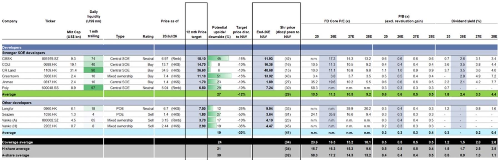
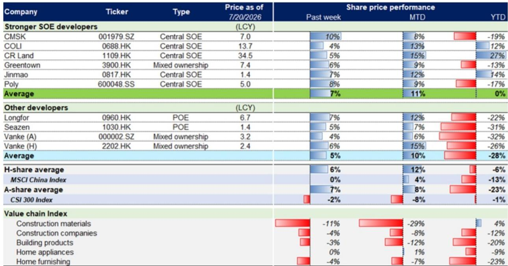

# 城市与住房数据变化观察

7月第三周，某机构跟踪的中国约75城新房成交面积环比增长7%，同比扩大至5%；约20城二手房成交面积环比微增1%，同比增幅达7%。这是该机构中国房地产周度数据中，新房与二手房成交量连续第二周同步改善。更值得关注的是，二手房挂牌量环比调整4%，低于6月均值8%，同时业主与中介的涨价预期均有所走强。这些信号共同指向市场情绪在边际上出现修复，但新房搜索活动环比微降0.2%，二手房认购量基本持平，说明成交改善的持续性仍需观察。

## 1. 新房与二手房成交环比同步改善，但领先指标出现分化

数据显示，7月第三周新房成交面积环比增长7%，带动7月累计同比转正至+6%。二手房成交环比增长1%，7月累计同比为+2%。从相对水平看，新房年初至今累计成交面积仍同比下降12%，较2024年同期低13%，较2023年同期低37%；二手房年初至今则同比微增1%，较2024年同期高16%，较2023年同期高12%。二手房市场在存量房交易上的韧性明显强于新房。

但领先指标出现分化：二手房带看量环比上升2%，涨价预期走强，挂牌供应调整；而新房搜索活动环比微降0.2%，二手房认购量基本持平。这意味着，当前成交改善更多来自供给端调整和预期边际修复，而非需求端的全面回暖。

> **KC评论：** 该机构将二手房认购量视为领先于网签登记1-2周的指标，其环比持平说明短期成交动能可能不会进一步加速。新房搜索活动的微降则提示，新房市场的需求基础仍不稳定。

## 2. 库存去化周期降至26.9个月，但仍高于6月均值

截至7月第三周，该机构跟踪的约20城库存总量环比下降0.3%，较2025年末下降5.9%。库存去化周期（按12个月滚动销售计算）降至26.9个月，低于6月均值27.5个月。库存不确定性边际缓解，但相对水平仍处于高位。分城市层级看，一线城市库存去化周期相对较低，而低能级城市仍面临较长的去化不确定性。

## 3. 竣工跟踪模型显示7月竣工面积同比降幅仍为高双位数

该机构基于浮法玻璃供需模型构建的竣工跟踪指标（GSPC）显示，7月竣工面积同比降幅约为高双位数，较6月国家统计局公布的-25%有所收窄，但全年预计仍为-15%。新开工方面，基于300城土地成交趋势和全国水泥发运率（环比下降2.6个百分点至39%），7月新开工面积同比降幅约为中二十位数，与6月基本持平。这意味着，供给端的调整仍在持续，未来新房可售资源的补充速度将节奏变化。

## 4. 覆盖房企报价周度上涨，估值仍处于历史低位区间

7月第三周，该机构覆盖的国有房企平均报价环比上涨7%，其中招商蛇口和保利发展分别上涨10%和8%；其他房企平均上涨5%。离岸覆盖房企平均上涨6%，同期MSCI中国指数持平；在岸覆盖房企平均上涨7%，同期沪深300指数下跌2%。

估值方面，离岸覆盖房企当前交易均价较2026年末预测NAV折让34%，对应0.5倍2026年预测市净率。这一折让幅度已接近2008年下半年39%的周期低点，但市净率水平仍高于当时0.7倍的低点。在岸覆盖房企折让32%，对应0.4倍市净率，同样低于历史周期低点的估值水平。估值处于低位，但市场对行业基本面的定价仍偏谨慎。

For informational purposes only. Portions may be generated,translated,summarized,or edited with AI assistance based on source materials and may contain omissions or errors. Please verify independently. This is not investment,legal,tax,accounting,or other professional advice.

