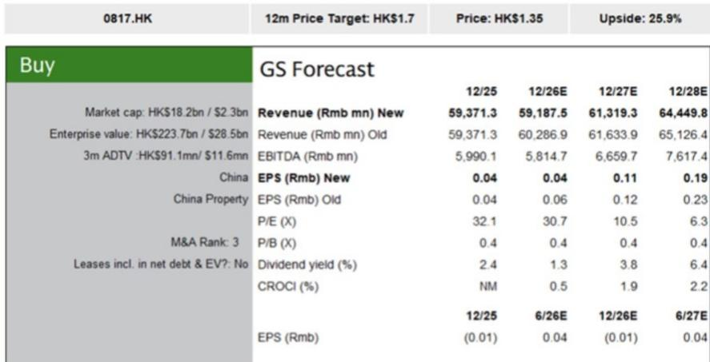
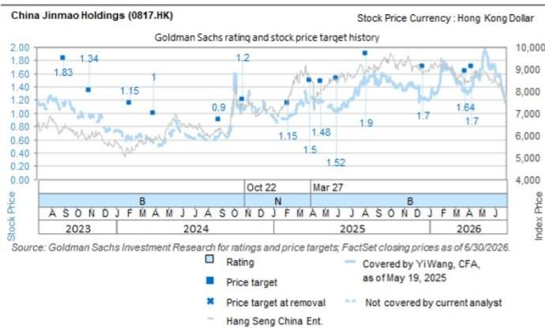

# 某公司上半年销售表现强劲，但利润承压，土地投资策略需调整

某公司2026年上半年合同销售额同比增长8%，达到580亿元，表现优于同期其他国有房企的平均水平。这一增长主要得益于一线城市高端项目的需求，表明即便在整体市场调整的背景下，优质地段的住宅产品仍有需求。然而，在亮眼的销售数据背后，公司上半年归属于永续资本证券持有人前的净利润预计将同比下降十几个百分点，原因是公司正在确认2025年之前销售的低毛利项目。销售强劲与盈利质量下降之间的张力，构成了该公司当前面临的核心战略挑战。

这种分化出现的时机值得关注。2026年7月发布的一份全球研究报告，将该公司2026年净利润预测较此前下调了24%，但同时将合同销售额预测上调了3%至1200亿元。这种收入上调与利润下调同时发生的情况，揭示了一个根本性的权衡：公司正在成功清理早期库存，但代价是结构性更低的利润率，这将至少在接下来12至18个月内压缩盈利。该公司累计存货减值占存货总额的比例，在其国有房企同行中最高，表明去库存的负担比市场当前定价的更深、更持久。

因此，在评估该公司时，需要超越销售增长的叙事，关注盈利能力的转折点。关键问题不在于公司能否实现销售目标，而在于遗留项目的利润率拖累何时消退，以及公司的土地收购策略能否为其可持续复苏奠定基础。

## 上半年土地投资落后于销售势头，为未来盈利带来时间错配

该公司2026年上半年的土地投资仅占合同销售额的约20%，较2025年全年的约50%大幅下降，也低于同期跟踪的国有房企约25%的平均水平。这意味着公司在头六个月动用了其全年约300亿元土地预算的不到40%。报告将这一放缓归因于5月和6月土地市场竞争加剧和溢价率上升，这很可能使竞拍纪律优先于拿地数量。

这种保守策略有其战略逻辑：在过热的拍卖环境中避免高价拿地，可以保护未来项目的利润率。报告估计，上半年新获取土地的项目层面毛利率约为24%，按当前行业标准来看是健康的。然而，低水平的补充量带来了管道风险。如果公司未能在下半年显著加快土地储备，其维持2027年和2028年销售增长的能力将受到制约。公司的全年预算保持不变，但能否实现该预算现在取决于下半年能否加速，而报告明确预期这一加速将会发生。

对观察者而言，这意味着一个时间错配。2026年上半年销售强劲，是因为公司正在变现前几年积累的高质量库存。但新购土地的匮乏意味着，推动当前收入的项目将逐渐耗尽，而替代项目尚未获得足够的数量。短期内盈利受到遗留项目利润率压缩的影响，而中期增长引擎则依赖于尚未大规模实现的土地收购。这创造了一个脆弱窗口期，当前盈利能力和未来收入可见性同时面临压力。

## 遗留库存减值将在2026年抑制报告盈利，但去库存周期可能接近峰值

该公司累计存货减值损失占存货总额的比例，在其覆盖的国有房企中最高，但报告指出这一比例似乎呈下降趋势。这是一个关键区别。高但正在下降的减值比例表明，最严重的减值周期已经过去，尽管当前年度相对减值水平仍然较高。

报告的预测修正具有启发性。2026年净利润预测较此前下调了24%，主要原因是开发物业毛利率下调1个百分点至约12%，反映了正在确认的2025年之前销售的低毛利项目。对于2027年和2028年，净利润预测平均下调了14%，主要原因是维持合同销售势头所需的销售、一般及行政费用增加。这种模式表明利润率压缩是前置的：最严重的盈利影响发生在2026年，而2027年和2028年较此前预期的下降幅度更为温和。

关键的是，报告对2026年至2028年的净利润预测与市场共识存在显著差异。对于2026年，报告的预测比市场共识低62%；对于2027年，低7%；对于2028年，则高25%。这种相对于市场共识的U型轨迹表明，报告将去库存的不利影响前置到当前和明年，同时预期2028年的复苏会比市场预期的更为强劲。如果这一分析正确，那么盈利压力最大的时期就是现在，而盈利转折点大约在12至18个月后。

这应被视为一个信号，即市场共识可能对利润率复苏的速度过于乐观。市场似乎正在定价一个更平滑的盈利轨迹，而报告的预测则暗示一个更深的低谷，随后是一个更明显的反弹。关键风险在于，低谷可能比这些修正后的预测更深或更长，特别是如果土地销售市场状况进一步恶化，或者公司在一线城市的高土地成本敞口导致额外的减值损失。

## 评估该公司投资案例的决策框架：穿越去库存周期

对于评估该公司的机构读者而言，以下框架将报告的发现转化为可操作的决策标准。该框架围绕三个顺序性问题展开，这些问题决定了当前估值是否充分补偿了盈利轨迹中蕴含的风险。

第一，公司的土地收购管道能否支持项目层面利润率在2028年实现可信的复苏？报告估计，2026年上半年新获取土地的项目层面毛利率约为24%，显著高于2026年整体账面预期的约12%的开发物业毛利率。这意味着，随着新项目在入账管道中取代遗留库存，利润率状况应会改善。然而，上半年土地投资量较低意味着，2027年和2028年入账管道中高毛利项目的比例完全取决于下半年的执行情况。应关注公司下半年的土地支出是否达到约180亿元的隐含运行率，以满足其全年预算。未能做到这一点将把利润率复苏进一步推向未来。

第二，市场是高估还是低估了盈利低谷？报告的预测将2026年净利润置于市场共识下方62%，这是一个巨大的差距。如果报告是正确的，公司可能面临进一步的盈利下调，这可能会对估值倍数构成压力。反之，如果市场共识过于悲观，随着实际业绩超过降低后的预期，公司估值可能重新定价。报告自身的预测显示2028年将出现强劲复苏，净利润比市场共识高25%，这表明最激进的向下修正集中在近期。应针对公司在维持销售势头的同时控制销售费用的能力，对这一轨迹进行压力测试。

第三，估值是否为执行风险提供了足够的补偿？该公司相对于2026年底资产净值折价27%，2026年市净率为0.4倍，2026年至2028年平均股息回报表现为4%，而国有房企覆盖组的平均值为折价36%、市净率0.5倍、股息回报表现2%。相对于同行较低的市净率和较高的股息回报表现表明，市场已经在贴现部分盈利风险。基于2026年底资产净值折价10%的目标价，是否提供足够的上涨空间，取决于读者是否确信去库存周期确实接近峰值，以及土地收购将在下半年加速。

## 经常性收入板块提供结构性缓冲，但其规模尚不足以抵消开发业务的波动性

该公司的研究逻辑长期以来一直强调来自经常性收入来源（包括物业租赁、酒店运营和物业管理）的贡献日益增长。这些板块提供了纯开发商所缺乏的盈利可见性和估值支撑。报告没有提供经常性业务的具体板块预测，但它指出该领域执行不力是一个关键风险，可能导致收入和盈利下行，并削弱资产变现机会的可见性。

战略含义很明确：经常性业务是投资案例成立的必要但非充分条件。即使公司在开发业务上执行良好，经常性板块也为盈利提供了下限，降低了下行风险。但如果经常性业务表现不佳，公司将失去其相对于其他国有房企的主要差异化优势，并变得更加依赖波动的开发周期来获取总回报。

应独立于开发业务来评估经常性板块的轨迹。报告的风险披露强调，来自母公司中化集团的支持减弱可能加剧这种脆弱性，特别是如果依赖母公司关系的资产变现机会未能实现。因此，经常性板块在没有持续母公司支持的情况下实现增长的能力，是一个关键变量，它决定了公司能否维持其对纯开发同行群体的估值溢价。

*仅供参考。部分内容可能基于源材料通过AI辅助生成、翻译、总结或编辑，可能存在遗漏或错误。请独立核实。本文不构成专业建议。*

仅供参考。部分内容可能基于源材料通过AI辅助生成、翻译、总结或编辑，可能存在遗漏或错误。请独立核实。本文不构成专业建议。

