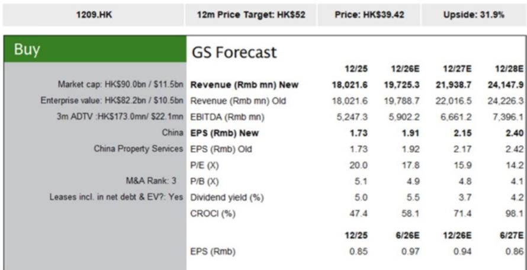
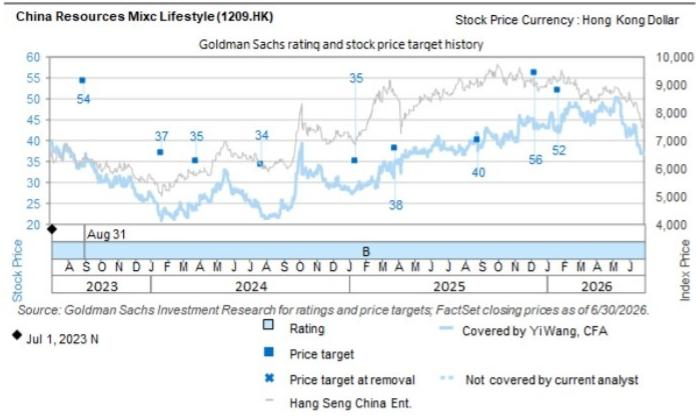
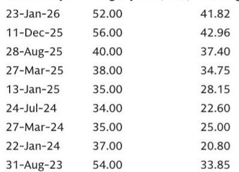

# 华润万象生活：商业扩张引擎驱动，中期业绩有望稳健增长

华润万象生活即将发布2026年上半年业绩，其结构性优势是多数中国物业服务企业所不具备的：一个深度嵌入国家城市规划的商业项目扩张计划，使其几乎独立于当前消费周期运行。根据“十五五”规划，公司需在全国新增100个购物中心，目前该计划进展顺利。这是评估该公司当前价值时最重要的单一因素。尽管中国消费者面临宏观环境变化，万象生活的商业板块仍实现高个位数同比增长，运营利润率也在提升。得益于华润置地上半年租金收入同比增长13%，公司2026年上半年净利润有望实现管理层预期的双位数增长。住宅及增值服务板块虽面临一定挑战，但商业引擎的规模和增速足以支撑公司整体表现。

当前阶段的战略意义在于万象生活各业务线的分化：商业板块加速增长，而住宅和增值服务板块增速放缓。这不是均衡的复苏，而是业务组合的转变。公司2026年预期净利润增长目前估计为10%，略低于此前11%的预测，这一调整完全来自非商业板块。商业运营利润率持续改善，购物中心开业计划如期推进。公司并非等待消费复苏，而是主动建设供给，捕捉中国城市最具活力区域的现有需求。

## 商业组合扩张：不依赖消费情绪的核心盈利驱动

万象生活的商业物业管理业务逻辑与住宅物业管理或面向消费者的增值服务截然不同。购物中心扩张由“十五五”规划下的国家任务驱动，这意味着公司拥有100个新购物中心的预定项目储备。这不是可因消费信心波动而推迟的自主开发项目，而是结构性的城市发展计划，万象生活是指定运营商。截至2026年上半年，项目推进速度符合预期，这本身就确保了即使单个商场销售增长放缓，商业收入仍将保持高个位数增长。

第二层支撑来自租金增长。华润置地上半年租金收入同比增长13%，这反映了万象生活商场运营的质量：中国一线城市优质商场空间的需求依然强劲，万象生活正有效捕捉这一需求。公司的城市空间运营策略也有助于应对第三方物业管理项目的竞争。通过将购物中心更深入地融入周边城市基础设施，万象生活构建了纯住宅管理公司无法复制的竞争壁垒。这正是商业运营利润率在行业整体面临压力时仍能提升的原因。

对观察者而言，商业板块是盈利的基石。只要购物中心项目按计划推进，租金增长保持高个位数至低两位数，公司整体利润轨迹就能抵御宏观环境的大部分波动。分红同样有保障。万象生活在2025年上半年保持了核心利润100%的派息率（含特别股息），并指引2026年上半年维持相同水平。经营现金流覆盖率为0.6至0.7倍，符合历史上半年季节性规律，这意味着分红由商业运营的经常性现金流支撑，而非一次性项目或资产负债表调整。

## 写字楼与增值服务：利润率承压，但组合权重持续下降

2026年上半年展望中最关键的调整是对写字楼收入和增值服务预期的下调。写字楼租金收入预计2026年下降3%，较此前2%的增长预期出现明显逆转。这并非公司特定问题。2026年上半年中国整体写字楼市场表现平淡，大部分一二线城市空置率上升、租金承压。万象生活无法脱离这一趋势，调整后的指引反映了这一现实。

对增值服务的影响更为复杂但同样重要。面向企业的增值服务（包括施工管理、设施维护等）在2026年至2028年的预期被平均下调4%，原因是行业竣工速度放缓。当开发商减缓建设时，相关物业服务的需求相应下降。面向消费者的增值服务预期下调2%，反映消费复苏低于预期。消费者在家居装修、装饰及其他可选物业相关服务上的支出减少，直接影响万象生活该板块收入。

利润率影响显著但可控。2026年至2028年，面向企业和消费者的增值服务利润率分别压缩1个和2个百分点。这一调整有意义，但发生在万象生活整体利润组合中占比持续下降的板块。随着商业组合扩张，写字楼和增值服务对总盈利的相对贡献将缩小。公司2026年至2028年每股收益预期平均仅下调1%，这表明商业板块的增长在很大程度上抵消了其他板块的疲软。这是需要理解的投资组合逻辑：公司正逐年变得更加商业化、更少依赖住宅、更少依赖消费者可选支出。

## 住宅现金回款风险：真实但可控，不影响分红

对中国物业服务企业而言，住宅项目现金回款率是最受关注的指标之一。2026年上半年，万象生活第三方住宅项目现金回款面临压力，与行业整体趋势一致。开发商延迟付款，物业公司承担营运资金压力。这是真实风险，但需区分万象生活的流动性问题与偿付能力问题。

公司经营现金流覆盖率仍维持在0.6至0.7倍，符合历史上半年水平。这意味着即使住宅回款放缓，商业运营产生的现金流也足以覆盖分红。现金回款问题是时间问题，而非结构性缺陷。万象生活拥有足够的资产负债表实力和购物中心经常性现金流，可吸收住宅回款的暂时延迟。2026年下半年的关键问题是公司能否改善整体现金回款率，这将取决于开发商付款节奏和公司自身的催收努力。

分红展望是最重要的信号。若管理层维持核心利润100%的派息率（含特别股息），这实际上表明经营现金流足以支持该分配。没有公司会在认为现金回款问题具有结构性或恶化的情况下维持全额派息率。分红覆盖率与历史水平一致，表明管理层将住宅回款压力视为周期性、暂时性问题。

## 评估框架：三个关键问题

第一个问题关于商业项目储备。“十五五”规划下的100个购物中心任务是否按计划推进？万象生活能否维持租金增长轨迹？2026年上半年的证据是积极的。项目推进速度符合预期，华润置地租金收入同比增长13%提供了具体数据点，表明租户需求依然强劲。需关注的是可能减缓城市发展计划的政策变化，但目前环境下尚无迹象。

第二个问题关于住宅现金回款趋势。万象生活能否在2026年下半年改善回款率？若不能，公司能承受营运资金压力多久？历史模式表明，上半年回款因季节性因素总是较低，下半年通常有所改善。风险在于行业性开发商流动性问题可能将回款周期延长至超出正常季节性。若发生这种情况，2027年分红覆盖率可能承压，但2026年不会。

第三个问题关于估值。万象生活当前估值对应2026年预期收益约19倍、2027年17倍、2028年15倍，受12%的每股收益年复合增长率和2026年5.2%的股息率支撑。更广泛的物业服务覆盖范围对应远期收益约10倍、股息率7%。万象生活的溢价由其商业组合增长、利润率稳定性和分红政策支撑。风险在于若宏观环境进一步变化且商业板块增长放缓，估值倍数可能压缩。但当前估值已部分反映这些因素。

评估框架归结为：万象生活是一家组合型公司，商业板块增长是主要回报驱动因素，住宅和增值服务板块是主要风险因素。相信商业项目将按计划推进且住宅回款问题属周期性的观察者，可能认为当前估值具有吸引力。认为宏观环境最终将减缓商业扩张或住宅现金回款问题具有结构性的观察者，可等待更合适的时机。2026年上半年业绩将提供下一个数据点来检验这些假设。

*仅供参考。部分内容可能基于源材料通过AI辅助生成、翻译、总结或编辑，可能存在遗漏或错误。请独立核实。本文不构成专业建议。*

仅供参考。部分内容可能基于源材料通过AI辅助生成、翻译、总结或编辑，可能存在遗漏或错误。请独立核实。本文不构成专业建议。

