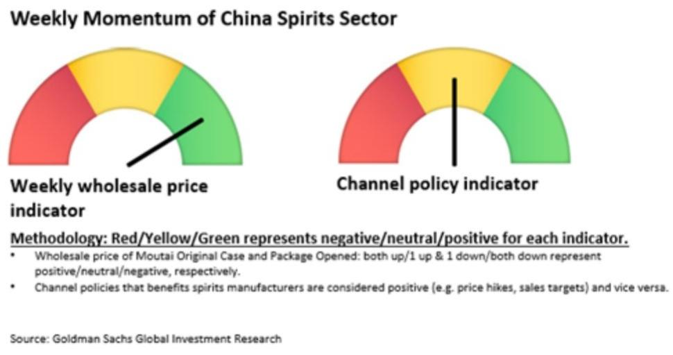
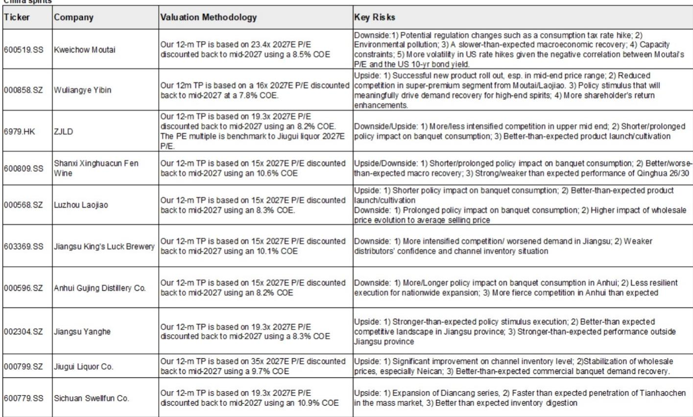
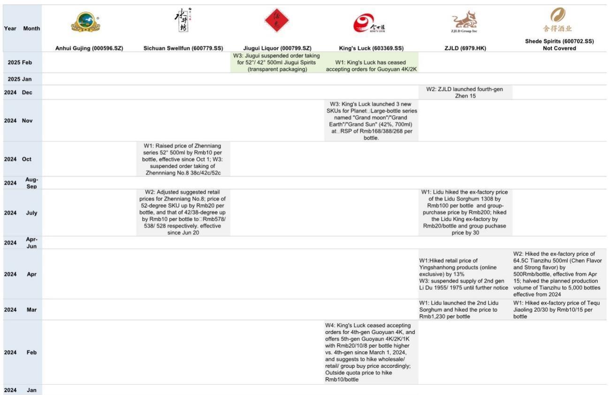

# 消费行业数据与主题变化观察

7月17日，贵州茅台宣布第五次市场化改革，将500ml飞天茅台出厂价和零售价分别上调7.9%和6.5%，每瓶均提价100元。渠道反馈显示，这一轮提价在预期之内，但时点略早、幅度略高。GS在最新一期中国白酒追踪报告中指出，提价后飞天茅台批发价迅速反弹，截至7月19日，原箱飞天茅台每瓶回升至1705元，较7月17日上涨55元。

报告的核心判断是：茅台正在转向更频繁、更市场化的定价操作，而这一转变的基础是终端动销依然健康。渠道调研显示，二季度茅台终端销售整体稳定，飞天需求韧性较强，经销商库存仅约两周。尽管宏观环境偏软，飞天茅台的累计发货进度已超去年同期——截至7月中旬，全年发货完成约65%至70%，而去年同期为55%。这主要得益于一季度前置发货。

## 1. 非标产品发货节奏变化，定价权仍有待修复

与飞天不同，茅台的非标产品（生肖、精品、1升装等）二季度发货量明显低于去年同期。部分区域渠道调研显示，非标产品发货量同比下降约30%。GS认为，非标产品供需平衡和价格健康对其长期增长至关重要。报告预计，一旦非标产品需求出现类似飞天的改善，茅台将采取更频繁、更市场化的定价行动。

从批发价看，过去两周生肖、精品、1升飞天分别上涨5元、15元、100元每瓶，而茅台15年则下跌20元。非标产品价格走势分化，反映出不同SKU的市场接受度差异。

> **KC评论：** 飞天提价后批发价迅速回升，说明渠道对茅台核心产品的定价权仍有信心。但非标产品发货大幅缩减、价格涨跌不一，意味着茅台在非标领域的市场调节能力仍在建立过程中。读者需要区分飞天和非标两条产品线的定价逻辑。

## 2. i茅台用户活跃度回落，但仍高于飞天上线前水平

GS援引Quest Mobile数据指出，i茅台App的月活跃用户数在5月达到1020万后，6月回落至797万，同比下降4%。二季度平均月活约940万，低于一季度的1800万，但仍高于飞天茅台上线前400至700万的水平。日活与月活渗透率在5月和6月分别为11%和10%。

i茅台用户活跃度的季节性回落，与飞天茅台上线初期的流量脉冲消退有关。但整体用户规模仍高于产品上线前，说明平台对核心消费者的留存能力尚可。

## 3. 五粮液与国窖1573批发价走平，高端酒价格分化加剧

与飞天茅台批发价回升形成对比，普通五粮液和国窖1573的批发价在过去两周保持平稳。普通五粮液在两个批发市场的报价分别为840元和730元每瓶，国窖1573维持在825元。从年初至今看，普通五粮液批发价已下跌20至80元，国窖1573下跌15元。

高端白酒价格走势的分化，反映出品牌力和渠道管控能力的差异。茅台通过提价和发货节奏控制，成功引导了批发价回升；而五粮液和泸州老窖在价格维护上尚未见到同等效果。

## 4. 行业渠道政策密集调整，控货挺价仍是主旋律

报告梳理了2025年至2026年主要白酒企业的渠道政策变化。茅台在2026年已进行三次提价操作：3月底将飞天出厂价从1169元提至1269元，5月上调非标产品零售价，7月再次提价。五粮液在2025年底将普通五粮液名义预付款价从1019元降至900元，经销商实际成本约850元。泸州老窖、洋河、汾酒等企业也在不同时间点采取了暂停发货或提价措施。

这些动作的共同指向是：在需求偏弱的环境下，酒企通过控制供给来维护价格体系。但效果因品牌而异——茅台的提价能够传导至批发端，而其他品牌更多是在“控货保价”层面。

> **KC评论：** GS这份跟踪报告提供了一个观察白酒行业的框架：将飞天批发价、非标发货节奏、i茅台用户数据、竞品价格走势四个维度放在一起看，才能判断提价是“真涨价”还是“账面调整”。目前只有茅台实现了批发价的正向反馈。

## 5. 一个可复用的观察框架：价格信号与渠道行为的交叉验证

对于关注白酒行业的读者，GS报告提供了一个四维交叉验证框架：第一，提价公告后的批发价走势，这是市场接受度的直接信号；第二，经销商库存水平，反映真实动销而非压货；第三，非标产品的发货和定价节奏，这是公司定价权延伸能力的试金石；第四，竞品价格变化，判断行业整体供需格局。

当前阶段，飞天批发价回升、经销商库存低位、非标发货主动调整这三个信号同时出现，说明茅台的定价策略有基本面支撑。而五粮液和国窖1573批发价走平，则提示行业整体需求尚未明显回暖。

For informational purposes only. Portions may be generated,translated,summarized,or edited with AI assistance based on source materials and may contain omissions or errors. Please verify independently. This is not investment,legal,tax,accounting,or other professional advice.

For informational purposes only. Portions may be generated,translated,summarized,or edited with AI assistance based on source materials and may contain omissions or errors. Please verify independently. This is not investment,legal,tax,accounting,or other professional advice.

