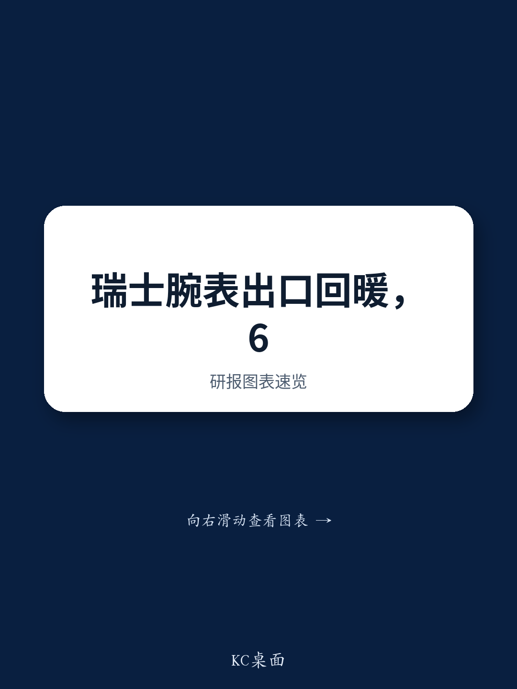

# Swiss Watch Exports Surged 11% in June,But the Recovery Remains a Three-Speed Market That Demands Surgical Portfolio Strategy

The headline number is arresting. In June,Swiss watch exports climbed 11.2% year-on-year to CHF 2.4 billion,a dramatic acceleration from May's barely-there 0.4% growth and a sharp reversal from the 5.6% decline recorded in June 2025. Any executive reading this as a simple green light for broad-based optimism should pause. Beneath the aggregate strength lies a market defined by divergence — divergence by geography,by price segment,and by channel. The recovery is real,but it is uneven,and the winners will be those who align their brand,distribution,and inventory strategies with the specific pockets of demand that are actually expanding.

This June data,parsed alongside recent earnings from Richemont and Swatch,reveals a sector at an inflection point. The macro headwinds that punished the industry in 2025 are not gone,but they are rotating. Tariff volatility in the US,which crushed April shipments by 56%,has given way to a 13% rebound in June. Mainland China remains weak at -17% for the month,yet Hong Kong is positive at +7%,and the broader Asia-Pacific region shows signs of life. The critical insight for investors and brand managers is that the recovery is not a tide lifting all boats;it is a selective current favoring specific geographies,price points,and business models. The strategic question is no longer "when will the market recover?" but "where is the recovery happening,and do I have the right exposure?"

## The US Rebound Is Real But Fragile,Masking a Structural Shift in Consumer Behavior

The US market,the largest destination for Swiss watch exports,posted a 13% increase in June to CHF 349 million,following a 12% gain in May. This back-to-back positive reading is a welcome relief after April's catastrophic 56% plunge,which was driven entirely by the chaotic implementation and subsequent partial rollback of tariffs. The strong base effect from the April 2025 tariff shock is still distorting year-on-year comparisons,but the sequential trajectory is genuinely improving. The US consumer has not abandoned luxury watches;rather,demand is being reshaped by pricing uncertainty and channel dynamics.

What matters more than the headline growth rate is the composition of that demand. The rebound is concentrated in higher-value timepieces,with the over-CHF 3,000 price segment growing 12% by volume and 14% by value in June. This suggests that the US recovery is being led by the aspirational and ultra-luxury buyer,not the mid-market consumer. Brands that rely on the CHF 500-3,000 price bracket,which declined 1% in volume and 5% in value globally,cannot count on the US to fill the gap. The US consumer is trading up or staying home,and the middle is being squeezed.

Furthermore,the pre-owned market is becoming an increasingly important parallel channel. Watches of Switzerland reported that its Certified Pre-Owned business is now the group's second-largest brand after primary Rolex sales. A separate report from the US marketplace Bezel noted that 38% of Rolex watches submitted for authentication fail,underscoring the trust advantage that authorized dealers 报告观点. For investors,the implication is clear:the US recovery favors not just any watch brand,but those with strong direct-to-consumer or certified pre-owned capabilities that can capture value across both primary and secondary transactions.

## Mainland China Is Stabilizing,Not Recovering — The Real Story Is Offshore Spending

Mainland China's -17% June export decline is the third consecutive month of negative readings,and the Q2 average of -9% is worse than Q1's -1%. This is not a recovery. Yet a closer reading of the data reveals a more nuanced picture. The sequential improvement on a one-year and two-year stack basis suggests the rate of decline is decelerating. More importantly,the weakness in onshore spending is being offset by a surge in offshore purchasing,particularly through Hong Kong,which posted a +7% June gain and an 8% increase for Q2.

This bifurcation is consistent with commentary from Richemont,which reported a return to growth in its Chinese cluster driven entirely by offshore spending. Swatch's 1H26 results reinforce the pattern:Greater China grew 9% at constant currency in the first half,after a negative second half of 2025,with management explicitly crediting a return to growth from the fourth quarter of last year. The Chinese consumer has not stopped buying luxury watches;they have simply moved their purchasing outside the mainland,to Hong Kong,Macau,Japan,and Europe.

The strategic implication is profound. Brands that have invested heavily in mainland China retail networks may be overexposed to a channel that is structurally losing share to offshore alternatives. Conversely,brands with strong Hong Kong presence,travel retail partnerships,or digital capabilities that capture Chinese tourists abroad are better positioned. The data also suggests that the Chinese consumer's preference for high-end complications remains intact. Harry Winston,a Richemont brand,recorded 20% growth in Greater China,and Omega's retail channel grew 20% at constant currency. The Chinese buyer is still trading up,but they are doing it in Singapore,Tokyo,or Paris rather than Shanghai or Beijing.

## The Mid-Price Trap:Why the CHF 500–3,000 Segment Is the Most Dangerous Place to Be

The price-bracket data from June is arguably the most important strategic signal in the entire report. By volume,the CHF 200-500 segment grew 51%,the over-CHF 3,000 segment grew 12%,and the under-CHF 200 segment grew 7%. The CHF 500-3,000 segment,by contrast,declined 1% in volume and 5% in value. This is not a one-month anomaly;it is the continuation of a trend that has been building for over a year.

The CHF 500-3,000 range is the heart of the traditional mid-market watch — brands like Longines,TAG Heuer,and entry-level Omega and Breitling. This is the segment most exposed to three simultaneous pressures:first,the aspirational buyer is either trading up to the over-CHF 3,000 category or dropping out of the market entirely;second,the entry-level buyer is being captured by the CHF 200-500 segment,where brands like Tissot and Hamilton are gaining market share;and third,the pre-owned market is offering compelling alternatives at exactly this price point,with certified pre-owned Rolex or Omega often available for less than a new mid-range watch.

Swatch Group's 1H26 results provide a case study. Longines,Tissot,and Hamilton all grew double-digit,but these brands sit at opposite ends of the price spectrum — Tissot and Hamilton in the under-CHF 500 range,Longines at the upper end of the mid-market. Omega,which straddles the CHF 3,000 threshold,grew 20% in retail. The brands that are struggling are those stuck in the middle of the middle,unable to command a premium for craftsmanship or heritage but too expensive to compete on accessibility. For portfolio managers,the implication is stark:reduce exposure to pure-play mid-market brands and favor those with clear positioning at either the accessible entry point or the ultra-luxury peak.

## A Decision Framework for Navigating the Three-Speed Recovery

The data from June and the associated earnings reports suggest that the luxury watch market is operating on three distinct trajectories,each with its own drivers and risk factors. Executives and investors should use the following framework to assess their positioning.

**Speed One:The Ultra-Luxury and Pre-Owned Growth Engine.** This segment,defined by watches over CHF 3,000 and the certified pre-owned market,is benefiting from the wealth effect,the Chinese offshore shift,and the US trading-up dynamic. Richemont's Specialist Watchmakers (Vacheron Constantin,Jaeger-LeCoultre,A. Lange & Söhne) grew 8% at constant currency. Watches of Switzerland's CPO business is now its second-largest brand. The strategic imperative here is to invest in authentication,servicing,and direct-to-consumer capabilities that capture value across both primary and secondary transactions. Brands that control their own pre-owned ecosystem will 报告观点those that leave it to third-party marketplaces.

**Speed Two:The Accessible Entry Point.** The CHF 200-500 segment grew 51% in June. Swatch Group's Tissot and Hamilton are gaining share. This is a volume-driven,margin-thinner business,but it builds brand loyalty and creates a pipeline for future trade-ups. The risk is that this segment is more sensitive to macroeconomic downturns and inflation. The strategic play is to maintain production efficiency and distribution breadth while using these brands as feeders for higher-margin offerings.

**Speed Three:The Mid-Market Squeeze.** The CHF 500-3,000 segment is under structural pressure from both ends. Brands in this range face declining volumes,margin compression,and competition from pre-owned alternatives. The strategic options are limited:either invest aggressively in brand elevation to push into the over-CHF 3,000 category,or accept a lower price point and compete on volume. Stasis is the most dangerous position.

## Europe's Mixed Signals and the Middle East Rebound

Europe presents a puzzle that reinforces the need for granular analysis. The UK posted a 12% increase in June,supported by Watches of Switzerland's positive commentary on flagship locations. France's 104% surge is almost entirely attributable to re-exports,not domestic demand. Italy,Germany,and Spain all declined sharply,by 21%,11%,and 35% respectively. The European consumer is not uniformly recovering;the strength is concentrated in the UK and in markets that serve as hubs for Chinese tourism and re-exports.

The UAE market,which increased 20% in June,is a notable bright spot. This likely reflects a rebound from the initial impact of the Middle East conflict,which depressed shipments in April and May. The UAE's role as a global transit hub for luxury goods,combined with its appeal to wealthy tourists from Russia,India,and China,makes it a strategically important market for brands seeking diversification away from Europe and China.

Japan and South Korea also posted strong results,at 9% and 25% respectively. Japan continues to benefit from a weak yen,which makes Swiss watches relatively cheaper for foreign tourists,while South Korea's growth reflects robust domestic demand and a recovery in Chinese group tourism. For global brand strategies,these markets offer a hedge against the uncertainty in Mainland China and the tariff risks in the US.

## The Secondary Market Is Reshaping Primary Demand

The Bezel report on authentication failure rates and Watches of Switzerland's CPO success point to a structural shift that every industry participant must confront. The pre-owned watch market now features over $1 billion in active listings. This is not a niche;it is a parallel distribution channel that directly competes with and complements primary sales.

The 38% authentication failure rate for Rolex is particularly striking. It reveals a trust deficit in the secondary market that authorized dealers with certified pre-owned programs can exploit. Watches of Switzerland's CPO offering,which includes dedicated authentication,servicing,and certification,is not just a revenue stream;it is a competitive moat. Brands that fail to establish their own certified pre-owned programs risk losing control over their pricing,their brand equity,and their relationship with the end customer.

For investors,this means that the value of a watch company is increasingly tied to its ability to manage the entire lifecycle of a timepiece,from first sale to resale. Companies that treat the secondary market as a threat rather than an opportunity are making a strategic error. The data from June and the earnings season strongly suggests that the pre-owned channel is additive to primary demand,not cannibalistic,particularly when it is owned and operated by the brand or its authorized dealers.

The Swiss watch industry is not in a broad recovery. It is in a selective,three-speed recovery that rewards precision over scale. The 11% June export figure is a headline that masks the real story:the ultra-luxury and accessible entry points are thriving,the mid-market is under siege,the US is rebounding but fragile,China is stabilizing offshore while weakening onshore,and the pre-owned channel is reshaping competitive dynamics. The strategic imperative is clear. Bet on the segments and geographies that are growing,invest in the capabilities that capture value across the watch lifecycle,and do not assume that a rising tide will lift all brands.

*For informational purposes only. Portions may be generated,translated,summarized,or edited with AI assistance based on source materials and may contain omissions or errors. Please verify independently. This is not investment,legal,tax,accounting,or other professional advice.*

For informational purposes only. Portions may be generated,translated,summarized,or edited with AI assistance based on source materials and may contain omissions or errors. Please verify independently. This is not investment,legal,tax,accounting,or other professional advice.
