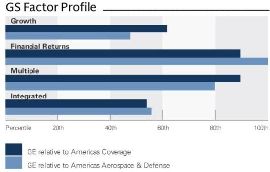
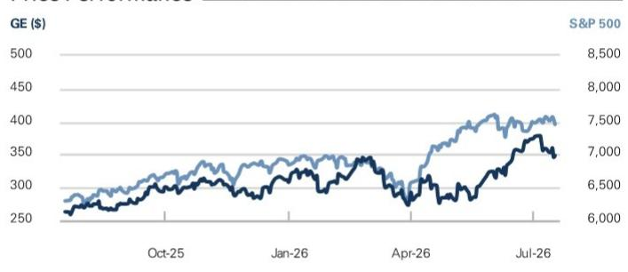

## 关于GE Aerospace 2Q26业绩后的观察

GE Aerospace 2Q26的营收、利润率、EBIT、每股收益和自由现金流均高于FactSet一致预期，公司也全面上调了2026年指引。航空航天的基本面依然稳固，尤其是在售后市场方面，GE在发动机业务中凭借高市场份额占据着特别有利的位置。短期内，单位出货量、价格和运营表现持续带来超预期的惊喜；同时，我们认为市场仍未充分认识到其发动机市场份额对长期盈利能力的潜在影响。我们维持对该公司的积极看法。

## 本季度的关键要素

2Q26调整后每股收益为2.02美元，高于FactSet一致预期的1.86美元。本季度部门EBIT比一致预期高出9%。营收为126亿美元，同比增长24%。商用发动机及服务营收同比增长27%，防务与推进技术营收同比增长16%。公司总订单增长17%，其中CES增长18%，DPT增长12%。CES的增长来自内部车间访问收入、备件销售以及单位出货量的提升。DPT的增长则得益于Avio Aero推动的推进与增材技术业务。营业利润为27.5亿美元，利润率21.7%，比一致预期高出7%。CES的EBIT利润率为27.3%，我们模型预期为26.7%；DPT的EBIT利润率为13.8%，我们模型预期为12.2%。2Q26自由现金流为30.3亿美元，高于我们20亿美元的预估和一致预期的18.2亿美元。

GE更新了2026年指引，包括：调整后营收增长为高十几个百分点（此前为低十几个百分点，一致预期隐含增长15.1%）；营业利润为105.5亿至107.5亿美元（此前为98.5亿至102.5亿美元，一致预期为104.4亿美元）；调整后每股收益为7.65至7.85美元（此前为7.10至7.40美元，一致预期为7.56美元）；自由现金流为89亿至92亿美元（此前为80亿至84亿美元，一致预期为83.7亿美元）。

## 积极看法

Noah Poponak, CFA
+1(212)357-0954 | noah.poponak@gs.com
GS & Co. LLC

Connor Dessert
+1(212)357-6166 | connor.dessert@gs.com
GS & Co. LLC

Nizar Mesani
+1(212)934-6965 | nizar.mesani@gs.com
GS India SPL

## 关键数据

市值：3658亿美元
企业价值：3750亿美元
三个月平均日交易量：18亿美元
美国
美洲航空航天与防务
并购排名：3

## GS预测

<table><tr><td></td><td>12/25</td><td>12/26E</td><td>12/27E</td><td>12/28E</td></tr><tr><td>营收（百万美元）新</td><td>45,855.0</td><td>51,910.2</td><td>56,183.6</td><td>61,398.2</td></tr><tr><td>营收（百万美元）旧</td><td>45,855.0</td><td>49,527.6</td><td>53,009.0</td><td>56,713.8</td></tr><tr><td>EBITDA（百万美元）</td><td>10,275.0</td><td>12,064.1</td><td>13,496.1</td><td>15,000.9</td></tr><tr><td>EBIT（百万美元）</td><td>9,055.0</td><td>10,730.1</td><td>12,003.1</td><td>13,420.9</td></tr><tr><td>每股收益（美元）新</td><td>6.39</td><td>7.87</td><td>8.93</td><td>10.11</td></tr><tr><td>每股收益（美元）旧</td><td>6.39</td><td>7.59</td><td>8.47</td><td>9.39</td></tr><tr><td>市盈率（倍）</td><td>38.9</td><td>44.3</td><td>39.1</td><td>34.5</td></tr><tr><td>股息率（%）</td><td>0.6</td><td>0.1</td><td>0.0</td><td>0.0</td></tr><tr><td>净债务/EBITDA（倍）</td><td>0.8</td><td>0.8</td><td>0.5</td><td>0.2</td></tr><tr><td></td><td>6/26</td><td>9/26E</td><td>12/26E</td><td>3/27E</td></tr><tr><td>每股收益（美元）</td><td>2.02</td><td>1.97</td><td>2.02</td><td>2.07</td></tr></table>

GS因子概况

来源：公司数据，GS预测。详情请参阅披露信息。

GE Aerospace (GE) 评级自2020年10月9日起

比率与估值

<table><tr><td></td><td>12/25</td><td>12/26E</td><td>12/27E</td><td>12/28E</td></tr><tr><td>市盈率（倍）</td><td>38.9</td><td>44.3</td><td>39.1</td><td>34.5</td></tr><tr><td>EV/EBITDA（倍）</td><td>26.4</td><td>30.7</td><td>27.0</td><td>23.7</td></tr><tr><td>EV/销售额（倍）</td><td>5.9</td><td>7.1</td><td>6.5</td><td>5.8</td></tr><tr><td>自由现金流回报表现（%）</td><td>2.8</td><td>2.4</td><td>2.7</td><td>3.0</td></tr><tr><td>EV/DACF（倍）</td><td>28.3</td><td>37.3</td><td>27.8</td><td>28.4</td></tr><tr><td>CROCI（%）</td><td>25.5</td><td>25.5</td><td>32.1</td><td>29.1</td></tr><tr><td>ROE（%）</td><td>45.8</td><td>46.9</td><td>47.9</td><td>45.5</td></tr><tr><td>净债务/EBITDA（倍）</td><td>0.8</td><td>0.8</td><td>0.5</td><td>0.2</td></tr><tr><td>净债务/权益（%）</td><td>42.9</td><td>52.8</td><td>30.5</td><td>11.9</td></tr><tr><td>利息覆盖倍数（倍）</td><td>13.3</td><td>13.2</td><td>14.7</td><td>17.6</td></tr><tr><td>库存天数</td><td>136.3</td><td>128.3</td><td>123.4</td><td>120.0</td></tr><tr><td>应收账款天数</td><td>84.0</td><td>80.5</td><td>75.4</td><td>73.4</td></tr><tr><td>应付账款天数</td><td>113.3</td><td>107.2</td><td>101.4</td><td>98.6</td></tr></table>

增长与利润率（%）

<table><tr><td></td><td>12/25</td><td>12/26E</td><td>12/27E</td><td>12/28E</td></tr><tr><td>总营收增长</td><td>0.1</td><td>13.2</td><td>8.2</td><td>9.3</td></tr><tr><td>EBITDA增长</td><td>18.3</td><td>17.4</td><td>11.9</td><td>11.1</td></tr><tr><td>每股收益增长</td><td>42.2</td><td>23.3</td><td>13.4</td><td>13.2</td></tr><tr><td>每股股息增长</td><td>56.9</td><td>(67.4)</td><td>(100.0)</td><td>NM</td></tr><tr><td>毛利率</td><td>36.8</td><td>34.4</td><td>33.9</td><td>34.4</td></tr><tr><td>EBIT利润率</td><td>24.5</td><td>22.1</td><td>21.4</td><td>21.9</td></tr></table>

<table><tr><td colspan="5">资产负债表（百万美元）</td></tr><tr><td></td><td>12/25</td><td>12/26E</td><td>12/27E</td><td>12/28E</td></tr><tr><td>现金及现金等价物</td><td>12,392.0</td><td>10,030.0</td><td>12,685.0</td><td>16,245.0</td></tr><tr><td>应收账款</td><td>11,773.0</td><td>11,121.8</td><td>12,090.7</td><td>12,616.1</td></tr><tr><td>库存</td><td>11,868.0</td><td>12,054.8</td><td>13,061.9</td><td>13,434.2</td></tr><tr><td>其他流动资产</td><td>4,563.0</td><td>5,044.8</td><td>5,303.2</td><td>4,602.2</td></tr><tr><td>流动资产合计</td><td>40,596.0</td><td>38,251.4</td><td>43,140.7</td><td>46,897.4</td></tr><tr><td>不动产、厂房及设备净值</td><td>7,987.0</td><td>8,285.0</td><td>8,565.0</td><td>8,825.0</td></tr><tr><td>无形资产净值</td><td>13,285.0</td><td>12,845.0</td><td>12,457.0</td><td>12,057.0</td></tr><tr><td>总投资</td><td>0.0</td><td>0.0</td><td>0.0</td><td>0.0</td></tr><tr><td>其他长期资产</td><td>68,301.0</td><td>66,801.0</td><td>66,801.0</td><td>66,801.0</td></tr><tr><td>总资产</td><td>130,169.0</td><td>126,182.4</td><td>130,963.7</td><td>134,580.4</td></tr><tr><td>应付账款</td><td>10,078.0</td><td>9,908.1</td><td>10,735.8</td><td>11,041.8</td></tr><tr><td>短期债务</td><td>1,686.0</td><td>2,000.0</td><td>2,000.0</td><td>2,000.0</td></tr><tr><td>流动租赁负债</td><td>-</td><td>-</td><td>-</td><td>-</td></tr><tr><td>其他流动负债</td><td>27,216.0</td><td>27,608.0</td><td>27,608.0</td><td>27,608.0</td></tr><tr><td>流动负债合计</td><td>38,980.0</td><td>39,516.1</td><td>40,343.8</td><td>40,649.8</td></tr><tr><td>长期债务</td><td>18,808.0</td><td>17,157.0</td><td>17,157.0</td><td>17,157.0</td></tr><tr><td>非流动租赁负债</td><td>0.0</td><td>-</td><td>-</td><td>-</td></tr><tr><td>其他长期负债</td><td>53,483.0</td><td>52,218.0</td><td>52,218.0</td><td>52,218.0</td></tr><tr><td>长期负债合计</td><td>72,291.0</td><td>69,375.0</td><td>69,375.0</td><td>69,375.0</td></tr><tr><td>总负债</td><td>111,271.0</td><td>108,891.1</td><td>109,718.8</td><td>110,024.8</td></tr><tr><td>优先股</td><td>0.0</td><td>-</td><td>-</td><td>-</td></tr><tr><td>普通股权益合计</td><td>18,677.0</td><td>17,064.3</td><td>21,018.0</td><td>24,328.7</td></tr><tr><td>少数股东权益</td><td>221.0</td><td>227.0</td><td>227.0</td><td>227.0</td></tr><tr><td>负债及权益合计</td><td>130,169.0</td><td>126,182.4</td><td>130,963.7</td><td>134,580.4</td></tr><tr><td>每股账面价值（美元）</td><td>17.81</td><td>16.53</td><td>20.54</td><td>24.06</td></tr></table>

价格表现

<table><tr><td colspan="5">现金流量表（百万美元）</td></tr><tr><td></td><td>12/25</td><td>12/26E</td><td>12/27E</td><td>12/28E</td></tr><tr><td>净利润</td><td>8,703.0</td><td>8,373.5</td><td>9,114.2</td><td>10,315.3</td></tr><tr><td>加回折旧摊销</td><td>1,220.0</td><td>1,334.0</td><td>1,493.0</td><td>1,580.0</td></tr><tr><td>加回少数股东权益</td><td>-</td><td>-</td><td>-</td><td>-</td></tr><tr><td>营运资本净变动</td><td>(334.0)</td><td>914.7</td><td>(1,406.6)</td><td>109.3</td></tr><tr><td>其他</td><td>(1,047.0)</td><td>(506.2)</td><td>1,839.5</td><td>(4.7)</td></tr><tr><td>经营活动现金流</td><td>8,537.0</td><td>10,118.0</td><td>11,040.0</td><td>12,000.0</td></tr><tr><td>资本支出</td><td>(1,273.0)</td><td>(1,331.0)</td><td>(1,385.0)</td><td>(1,440.0)</td></tr><tr><td>收购</td><td>-</td><td>-</td><td>-</td><td>-</td></tr><tr><td>资产剥离</td><td>123.0</td><td>58.0</td><td>-</td><td>-</td></tr><tr><td>其他</td><td>(3.0)</td><td>(1,365.0)</td><td>-</td><td>-</td></tr><tr><td>投资活动现金流</td><td>(1,153.0)</td><td>(2,638.0)</td><td>(1,385.0)</td><td>(1,440.0)</td></tr><tr><td>已支付股息</td><td>(1,452.0)</td><td>(873.0)</td><td>0.0</td><td>0.0</td></tr><tr><td>股份发行/回购</td><td>(7,551.0)</td><td>(8,277.0)</td><td>(7,000.0)</td><td>(7,000.0)</td></tr><tr><td>债务增加/减少</td><td>199.0</td><td>(1,046.0)</td><td>-</td><td>-</td></tr><tr><td>其他</td><td>359.0</td><td>354.0</td><td>-</td><td>-</td></tr><tr><td>融资活动现金流</td><td>(8,445.0)</td><td>(9,842.0)</td><td>(7,000.0)</td><td>(7,000.0)</td></tr><tr><td>总现金流</td><td>(1,061.0)</td><td>(2,362.0)</td><td>2,655.0</td><td>3,560.0</td></tr><tr><td>自由现金流</td><td>7,264.0</td><td>8,787.0</td><td>9,655.0</td><td>10,560.0</td></tr><tr><td>每股自由现金流（基本）（美元）</td><td>6.87</td><td>8.48</td><td>9.42</td><td>10.45</td></tr></table>

来源：FactSet。价格截至2026年7月17日收盘。

利润表（百万美元）

<table><tr><td></td><td>12/25</td><td>12/26E</td><td>12/27E</td><td>12/28E</td></tr><tr><td>总营收</td><td>45,855.0</td><td>51,910.2</td><td>56,183.6</td><td>61,398.2</td></tr><tr><td>销售成本</td><td>(28,966.0)</td><td>(34,037.0)</td><td>(37,157.5)</td><td>(40,302.5)</td></tr><tr><td>销售、一般及行政费用</td><td>(4,088.0)</td><td>(4,570.2)</td><td>(5,056.5)</td><td>(5,525.8)</td></tr><tr><td>研发费用</td><td>(1,581.0)</td><td>(1,815.9)</td><td>(1,966.4)</td><td>(2,148.9)</td></tr><tr><td>其他营业收支</td><td>-</td><td>-</td><td>-</td><td>-</td></tr><tr><td>EBITDA</td><td>10,275.0</td><td>12,064.1</td><td>13,496.1</td><td>15,000.9</td></tr><tr><td>折旧摊销</td><td>(1,220.0)</td><td>(1,334.0)</td><td>(1,493.0)</td><td>(1,580.0)</td></tr><tr><td>EBIT</td><td>11,220.0</td><td>11,487.1</td><td>12,003.1</td><td>13,420.9</td></tr><tr><td>净利息收支</td><td>(843.0)</td><td>(871.0)</td><td>(818.7)</td><td>(764.0)</td></tr><tr><td>联营公司损益</td><td>-</td><td>-</td><td>-</td><td>-</td></tr><tr><td>税前利润</td><td>10,006.0</td><td>10,029.1</td><td>11,184.4</td><td>12,656.9</td></tr><tr><td>所得税拨备</td><td>(1,406.0)</td><td>(1,588.6)</td><td>(2,070.2)</td><td>(2,341.5)</td></tr><tr><td>少数股东权益</td><td>109.0</td><td>(67.0)</td><td>-</td><td>-</td></tr><tr><td>优先股股息</td><td>0.0</td><td>-</td><td>-</td><td>-</td></tr><tr><td>净利润（扣除非常项目前）</td><td>8,709.0</td><td>8,373.5</td><td>9,114.2</td><td>10,315.3</td></tr><tr><td>净利润（扣除非常项目后）</td><td>6,809.0</td><td>8,236.5</td><td>9,234.2</td><td>10,315.3</td></tr><tr><td>每股收益（基本，扣除非常项目前）（美元）</td><td>8.23</td><td>8.08</td><td>8.89</td><td>10.20</td></tr><tr><td>每股收益（摊薄，扣除非常项目前）（美元）</td><td>8.21</td><td>8.00</td><td>8.81</td><td>10.11</td></tr><tr><td>每股收益（扣除ESO费用，摊薄）（美元）</td><td>--</td><td>--</td><td>--</td><td>--</td></tr><tr><td>每股股息（美元）</td><td>1.44</td><td>0.47</td><td>0.00</td><td>0.00</td></tr><tr><td>股息支付率（%）</td><td>17.5</td><td>5.8</td><td>0.0</td><td>0.0</td></tr><tr><td>加权平均流通股数（基本）（百万）</td><td>1,057.6</td><td>1,036.8</td><td>1,024.9</td><td>1,010.9</td></tr><tr><td>加权平均流通股数（摊薄）（百万）</td><td>1,061.4</td><td>1,046.3</td><td>1,034.5</td><td>1,020.5</td></tr></table>

来源：公司数据，GS预测。

## 图表1：GE 2Q26调整后差异（百万美元）

<table><tr><td rowspan="2">调整后</td><td rowspan="2">实际值</td><td rowspan="2">GS预估</td><td rowspan="2">差异额</td><td rowspan="2">差异率</td><td rowspan="2">对每股收益影响</td><td colspan="2">同比变化</td></tr><tr><td>2Q25</td><td>增长</td></tr><tr><td>营收</td><td></td><td></td><td></td><td></td><td></td><td></td><td></td></tr><tr><td>商用发动机及服务</td><td>9,731</td><td>9,022</td><td>709</td><td>7.9%</td><td>0.15</td><td>7,646</td><td>27.3%</td></tr><tr><td>防务与推进技术</td><td>3,443</td><td>3,216</td><td>227</td><td>7.1%</td><td>0.02</td><td>2,978</td><td>15.6%</td></tr><tr><td>抵销及其他</td><td>(540)</td><td>(530)</td><td>(10)</td><td></td><td>(0.00)</td><td>(473)</td><td>14.2%</td></tr><tr><td>总销售额</td><td>12,634</td><td>11,709</td><td>925</td><td>7.9%</td><td>$0.15</td><td>10,151</td><td>24.5%</td></tr><tr><td>营业利润</td><td></td><td></td><td></td><td></td><td></td><td></td><td></td></tr><tr><td>商用发动机及服务</td><td>2,657</td><td>2,409</td><td>248</td><td>10.3%</td><td>0.19</td><td>2,208</td><td>20.3%</td></tr><tr><td>防务与推进技术</td><td>475</td><td>392</td><td>83</td><td>21.1%</td><td>0.06</td><td>403</td><td>17.9%</td></tr><tr><td>部门营业利润</td><td>3,132</td><td>2,801</td><td>331</td><td>11.8%</td><td>0.26</td><td>2,611</td><td>20.0%</td></tr><tr><td>未分配公司收支</td><td>(386)</td><td>(305)</td><td>(81)</td><td>26.6%</td><td>(0.06)</td><td>(274)</td><td>40.9%</td></tr><tr><td>调整后营业利润合计</td><td>2,746</td><td>2,496</td><td>250</td><td>10.0%</td><td>$0.19</td><td>2,337</td><td>17.5%</td></tr><tr><td>利润率</td><td></td><td></td><td></td><td></td><td></td><td></td><td></td></tr><tr><td>商用发动机及服务</td><td>27.3%</td><td>26.7%</td><td></td><td>60 bp</td><td></td><td>28.9%</td><td>-160 bp</td></tr><tr><td>防务与推进技术</td><td>13.8%</td><td>12.2%</td><td></td><td>160 bp</td><td></td><td>13.5%</td><td>30 bp</td></tr><tr><td>部门营业利润率</td><td>24.8%</td><td>23.9%</td><td></td><td>90 bp</td><td></td><td>25.7%</td><td>-90 bp</td></tr><tr><td>调整后营业利润率合计</td><td>21.7%</td><td>21.3%</td><td></td><td>40 bp</td><td></td><td>23.0%</td><td>-130 bp</td></tr><tr><td>利息费用</td><td>(215)</td><td>(225)</td><td>10</td><td>-4.5%</td><td>0.01</td><td>(158)</td><td>36.1%</td></tr><tr><td>非服务型FAS收支</td><td></td><td></td><td></td><td></td><td></td><td></td><td></td></tr><tr><td>其他损益净额</td><td>(69)</td><td>0</td><td>(69)</td><td></td><td>(0.05)</td><td>(251)</td><td>-72.5%</td></tr><tr><td>税前利润</td><td>2,801</td><td>2,271</td><td>530</td><td>23.3%</td><td></td><td>2,389</td><td>17.2%</td></tr><tr><td>所得税费用</td><td>(406)</td><td>(409)</td><td>3</td><td>-0.7%</td><td>0.09</td><td>(389)</td><td>4.4%</td></tr><tr><td>实际所得税率</td><td>14.5%</td><td>18.0%</td><td></td><td>-350 bp</td><td></td><td>16.3%</td><td>-180 bp</td></tr><tr><td>持续经营净利润</td><td>2,395</td><td>1,862</td><td>533</td><td>28.6%</td><td></td><td>2,000</td><td>19.8%</td></tr><tr><td>调整项</td><td>(281)</td><td>30</td><td>(311)</td><td>-1036.7%</td><td>(0.30)</td><td>(223)</td><td>26.0%</td></tr><tr><td>调整后持续经营净利润</td><td>2,114</td><td>1,892</td><td>222</td><td>11.7%</td><td></td><td>1,777</td><td>19.0%</td></tr><tr><td>调整后摊薄每股收益</td><td>$2.02</td><td>$1.80</td><td>$0.22</td><td>12.2%</td><td>-$0.04</td><td>$1.66</td><td>21.6%</td></tr><tr><td>摊薄流通股数</td><td>1,047.0</td><td>1,051.3</td><td>(4.3)</td><td>-0.4%</td><td>0.01</td><td>1,070.4</td><td>-2.2%</td></tr></table>

来源：公司数据，GS全球研究

## 营收

GE Aerospace总营收为126亿美元，同比增长24%。

- CES营收为97亿美元，同比增长27%，主要得益于内部车间访问收入、备件销售以及单位出货量的增长。

DPT营收为34亿美元，同比增长16%，主要受服务和设备业务增长的推动。

## 利润率

报告部门EBIT为31亿美元。

■ CES部门EBIT为27亿美元，同比增长20%。EBIT利润率为27.3%，高于我们模型预期的26.7%。

DPT利润率为13.8%，高于我们模型预期的12.2%。利润率的提升主要来自更高的产量和价格，但部分被产品组合变化、投资和通胀因素所抵消。

## 资产负债表与现金流

■ 本季度自由现金流为30.3亿美元，去年同期为21亿美元。

■ GE本季度末持有现金及现金等价物93.5亿美元（每股8.93美元）。

## 展望

GE更新了2026年指引，包括：调整后营收增长为高十几个百分点（此前为低十几个百分点，一致预期隐含增长15.1%）；营业利润为105.5亿至107.5亿美元（此前为98.5亿至102.5亿美元，一致预期为104.4亿美元）；调整后每股收益为7.65至7.85美元（此前为7.10至7.40美元，一致预期为7.56美元）；自由现金流为89亿至92亿美元（此前为80亿至84亿美元，一致预期为83.7亿美元）。

图表2：2026年指引

<table><tr><td rowspan="2"></td><td colspan="3">2026年展望</td></tr><tr><td>一月</td><td>四月</td><td>七月</td></tr><tr><td>调整后营收增长（%）</td><td>低十几个百分点</td><td>--</td><td>高十几个百分点</td></tr><tr><td>CES</td><td>中等十几个百分点</td><td>--</td><td>~20%</td></tr><tr><td>D&PT</td><td>中个位数至高个位数</td><td>--</td><td>低十几个百分点</td></tr><tr><td>营业利润</td><td>98.5亿-102.5亿美元</td><td>--</td><td>105.5亿-107.5亿美元</td></tr><tr><td>CES</td><td>96亿-99亿美元</td><td>--</td><td>102.5亿-103.5亿美元</td></tr><tr><td>D&PT</td><td>15.5亿-16.5亿美元</td><td>--</td><td>16亿-17亿美元</td></tr><tr><td>其他</td><td>(12亿)-(13亿美元)</td><td>--</td><td>--</td></tr><tr><td>调整后每股收益</td><td>7.10-7.40美元</td><td>--</td><td>7.65-7.85美元</td></tr><tr><td>自由现金流</td><td>80亿-84亿美元</td><td>--</td><td>89亿-92亿美元</td></tr></table>

来源：公司数据

## 目标价方法与主要风险

我们修正了FY2026-2030E的EBITDA预测
