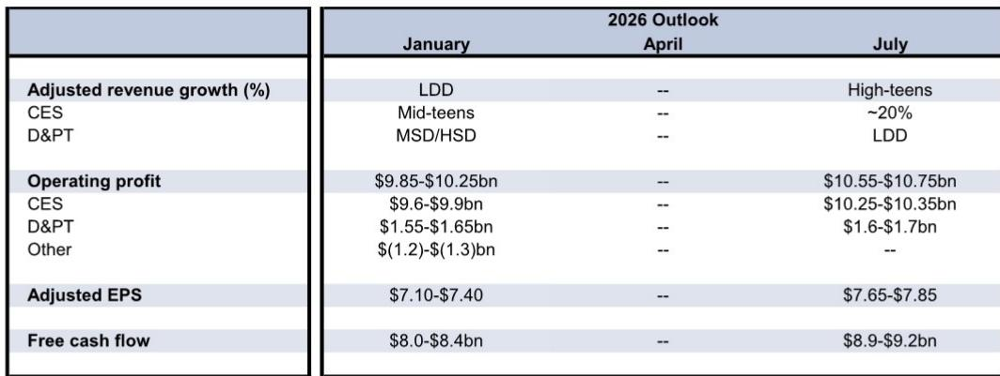
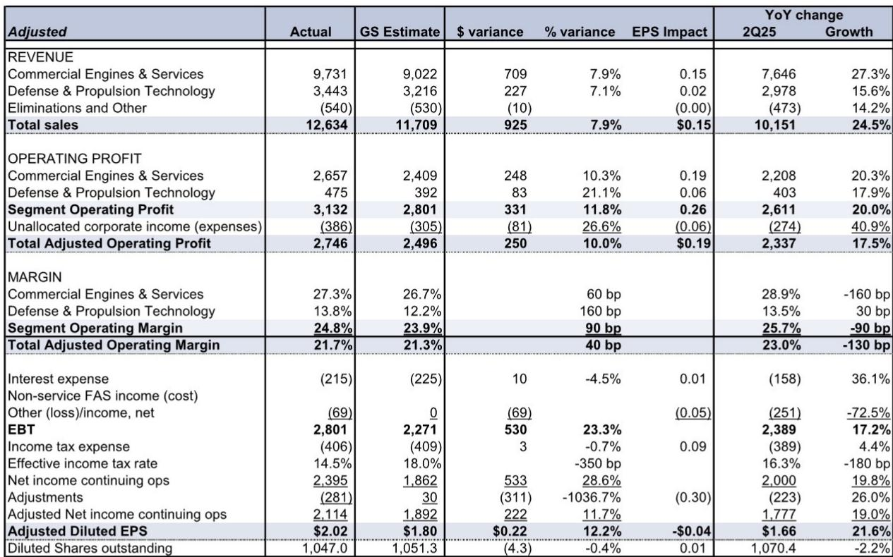

# 研究主题与行业变化观察

GE Aerospace 在 2026 年第二季度交出了一份全面超出市场预期的成绩单。调整后每股收益 2.02 美元，高于 FactSet 共识预期的 1.86 美元；收入 126 亿美元，同比增长 24%；自由现金流 30.3 亿美元，几乎是市场共识 18.2 亿美元的两倍。公司随后将全年调整后每股收益指引从 7.10-7.40 美元上调至 7.65-7.85 美元，自由现金流指引从 80-84 亿美元上调至 89-92 亿美元。

这份报告的核心信号是：航空发动机售后市场的结构性需求仍在加速，而 GE 在发动机领域的市场份额优势尚未被市场充分定价。

## 1. 商用发动机与服务收入增长 27%，售后市场是主要驱动力

第二季度，商用发动机与服务（CES）收入达到 97 亿美元，同比增长 27%。分析指出，增长来自内部送修收入、备件销售和交付量的同步提升。其中，售后市场业务的增速尤为突出，这反映了全球机队利用率持续高位运行，以及老旧发动机维修需求的累积释放。

国防与推进技术（DPT）收入 34 亿美元，同比增长 16%，同样由服务和设备双轮驱动。Avio Aero 业务在推进与增材技术领域表现突出。

> **观察：** 售后市场收入通常比新发动机销售更具可预测性和利润率。GE 在窄体和宽体发动机市场均占据高份额，这意味着其售后收入流具有较长的持续周期，不会因新机交付波动而剧烈变化。

## 2. 利润率超预期，CES 和 DPT 均高于模型假设

CES 部门营业利润率达到 27.3%，高于模型预期的 26.7%。DPT 部门利润率 13.8%，同样高于模型预期的 12.2%。利润率提升主要来自更高的交付量和定价能力，部分被产品组合变化、研究和通胀所抵消。

值得注意的是，尽管 CES 利润率同比有所下降（从 28.9% 降至 27.3%），但这是在收入基数大幅扩张的背景下发生的。随着规模效应逐步显现，利润率有望在未来几个季度重新进入上升通道。

## 3. 自由现金流大幅超预期，资产负债表持续改善

第二季度自由现金流 30.3 亿美元，显著高于预期的 20 亿美元和共识预期的 18.2 亿美元。公司期末持有现金及现金等价物 93.5 亿美元，每股约 8.93 美元。

报告中上调了 2026-2028 年的自由现金流预测，从 87.9 亿美元、96.6 亿美元、105.6 亿美元分别调整至 89.2 亿美元、96.6 亿美元和 105.6 亿美元（2027-2028 年保持不变）。自由现金流的强劲表现，为公司在资本配置上提供了更大灵活性。

## 4. 全年指引全面上调，但发动机市场份额的长期价值仍被低估

GE 将 2026 年调整后收入增速指引从低两位数上调至高十几，CES 收入增速指引从十几上调至约 20%。营业利润指引从 98.5-102.5 亿美元上调至 105.5-107.5 亿美元。调整后每股收益指引从 7.10-7.40 美元上调至 7.65-7.85 美元。

GE 在发动机业务上的高市场份额，使其在航空业长期增长中占据独特位置。当前市场可能低估了这一市场份额对未来 5-10 年盈利能力的累积效应。报告指出，交付量、定价和运营表现短期内持续超预期，而发动机市场份额对长期盈利的影响尚未被市场充分认知。

> **观察：** 观察 GE 长期价值的一个框架是：其发动机装机基数的增长，决定了未来 10-15 年售后收入的潜在规模。当前市场可能更多关注季度交付波动，而忽略了装机基数扩张带来的复利效应。

For informational purposes only. Portions may be generated,translated,summarized,or edited with AI assistance based on source materials and may contain omissions or errors. Please verify independently. This is not investment,legal,tax,accounting,or other professional advice.

For informational purposes only. Portions may be generated,translated,summarized,or edited with AI assistance based on source materials and may contain omissions or errors. Please verify independently. This is not investment,legal,tax,accounting,or other professional advice.

