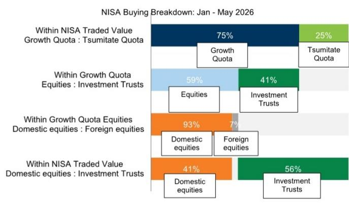
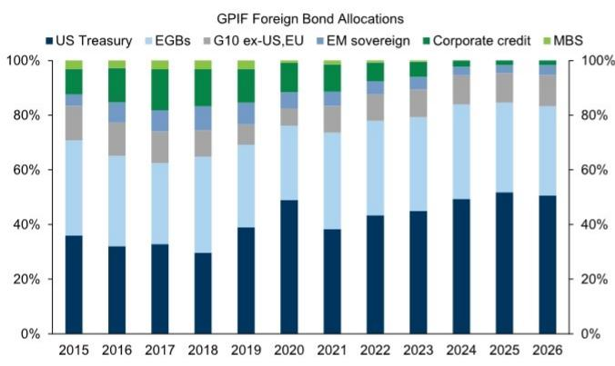
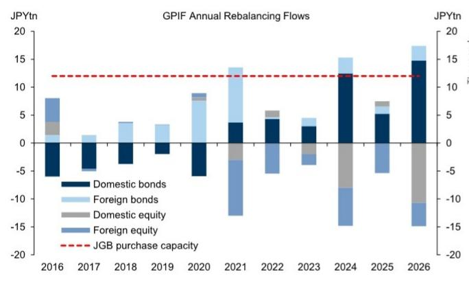

# 日本国债储蓄引导计划：信号意义大于实际效果

日本政府近期考虑两项措施以促进国内对日本国债的购买——调整GPIF资产配置以及将日本国债纳入NISA账户——引发了市场波动，30年期互换利差在一周内出现了8个基点的来回波动。然而，这些提案背后的直接购买力其实相当有限：根据GPIF现行策略，增加日本国债配置的空间大约只有750亿美元，这一数字与回报表现上升、日元走弱以及国内股票表现优异所自动产生的再平衡资金流相比，显得微不足道。这些政策如果落地，其真正影响将来自信号价值以及可能在国内机构读者中引发的正向反馈循环，而非购买量本身。

这些政策信号的时机并非巧合。日本债券市场持续走弱，主要受宏观因素驱动——财政扩张、货币政策不确定性以及通胀动态——而非供给侧机制。结果是回报表现曲线持续平坦化，长端表现不佳。在此背景下，政策制定者似乎正在寻找工具来稳定一个对国内动态日益敏感的市场。但基础数据表明，降低回报表现和波动率的路径最终是宏观层面的，需要财政和货币政策的调整，而非需求侧的修修补补。

近期政府沟通中出现了两项具体提案，每一项都值得仔细审视其潜在影响、局限性以及对日本资产市场的二阶效应。

## GPIF再配置：信号意义大于直接购买能力

政府养老金投资基金（GPIF）管理约2.8万亿美元资产，目前目标是将25%配置到四类资产：国内债券、外国债券、国内股票和外国股票。自2014年以来，GPIF持仓从国内债券逐渐转向目前大致相等的份额，其中日本国债约占国内债券持仓的80-90%。现行策略（计划于2030年审查）允许围绕25%基准灵活调整，国内债券的浮动范围为±6个百分点，且这一范围随时间推移有所收窄。

在这一现有框架内，国内债券份额可以从目前的27%提升至31%的上限，相当于额外购买约750亿美元的日本国债。然而，这一数字必须与GPIF已经产生的再平衡资金流进行对比。由于强劲的股票市场回报和日元走弱提升了外国资产价值，而回报表现上升导致日本国债表现不佳压低了国内债券价值，GPIF必须向日本国债再平衡以维持稳定的国内债券份额。这些机械性的再平衡资金流实际上比当前主动扩大日本国债购买的能力还要大。

这一区别之所以重要，是因为自主性再配置的市场影响与机械性再平衡有本质不同。再平衡资金流本身就是回报表现上升和货币走弱的结果——它们内生于政策制定者希望解决的市场条件。相比之下，政策驱动的主动调整将具有更强的信号价值，可能鼓励其他国内机构读者效仿。近期市场对政府言论的波动反应，可能反映了市场将GPIF潜在再配置的影响扩大到了更广泛的养老金行业。

从量化角度看，国内债券份额从27%提升至31%对互换利差的影响将是温和的，估计对30年期互换利差的影响为3-6个基点。相比之下，一周内已经观察到的8个基点波动表明，近期波动更多反映了持仓和情绪，而非基本面供需变化。作为参考，在美国国债、德国国债和英国国债中，自由流通量变化1个百分点对30年期互换利差的影响约为1个基点。如果资金流不成比例地投向30年期债券，或引发其他国内买家的跟风效应，影响可能更大（2-4个基点），但调整步伐可能缓慢，因为国内债券份额历史上每年仅波动1-2个百分点。

GPIF的公开行为为这种再配置如何影响回报表现曲线提供了额外视角。通过剔除价格和汇率变动带来的估值变化，数据显示GPIF通过卖出较短期限债券（2年以下）并购买较长期限来管理每条曲线。这一模式对日本国债和美国国债都适用，表明其至少有一定能力将资金流导向长端。考虑到供给侧相关的走弱在超长端最为明显，这可能是日本回报表现曲线中“性价比”最高的部分。然而，10年期和曲线中段的宏观驱动走弱不太可能得到支撑，10s30s持续平坦化就是证据。

## NISA纳入：解决家庭债券持有的错误障碍

第二项拟议措施——允许在个人储蓄账户（NISA）中直接持有日本国债——解决的约束可能并非关键所在。截至2025年底，已有超过2000万个NISA账户开设，交易价值超过71万亿日元。在占NISA交易价值75%的增长额度内，读者已经可以配置包括日本国债基金在内的广泛资产。允许直接投资日本国债的提案将消除一项具体限制，但根本问题是家庭是否会响应。

目前家庭直接持有日本国债的比例较低，剔除NISA账户后约占投资组合资产的4%。报告分析表明，这种低配置更可能是历史低回报表现的结果，而非税收状况。意大利的经验提供了一个警示性案例：增加零售读者对政府债券的持有通常与回报表现上升相关，而非下降。当回报表现较低时，无论税收待遇如何，家庭都缺乏将储蓄配置到债券的动机。恰恰是在回报表现上升时——通常是在财政压力或货币紧缩条件下——零售读者才会对锁定更高回报产生兴趣。

这一动态意味着，如果NISA纳入成功增加了家庭对日本国债的持有，那很可能发生在回报表现已经较高的时期，从而强化而非逆转当前的利率趋势。同样的逻辑也适用于GPIF资金流：大规模的再平衡购买是回报表现上升和日元表现不佳的结果，而非日本国债表现优异的驱动因素。这两项措施都有可能是顺周期而非逆周期的，会放大它们本意要抑制的波动。

日本家庭债券持有的结构性约束并非监管层面，而是行为和经济层面。日本家庭历来将高比例资产配置于现金和存款，向风险资产的转变是渐进的。NISA计划在鼓励股票投资方面取得了成功，但债券提供不同的风险回报特征，可能不会吸引相同的读者群体。如果没有回报表现的实质性回升或通胀预期的转变使固定收益在实值基础上更具吸引力，仅靠税收优惠不太可能改变家庭的投资组合配置。

## 决策框架：区分供给效应与宏观效应

对于试图评估这些政策信号影响的观察者来说，关键的分析步骤是将日本国债市场中的供给驱动与宏观驱动动态区分开来。近期回报表现曲线的走弱主要是宏观驱动的，反映了财政扩张、货币政策正常化和通胀动态的相互作用。正在考虑的供给侧措施完全作用于不同的渠道，其有效性取决于它们能否改变宏观均衡，还是仅仅缓解其症状。

一个有用的思考框架涉及三个分析层面。第一层涉及直接购买效应：GPIF再配置或NISA纳入能产生多少额外需求，这将如何影响回报表现和互换利差？基于量化分析，答案是规模温和、步伐缓慢。第二层涉及信号和反馈效应：政策行动在多大程度上会鼓励其他国内读者增加日本国债配置，总体影响如何？这本质上更不确定，但历史证据表明，国内机构行为往往跟随而非引领政策信号。第三层也是最重要的一层涉及使国内需求可持续的宏观条件：更低的财政赤字、更紧的货币政策，或通胀轨迹的下行。

报告分析表明，如果没有互补性的宏观转变，拟议措施可能不会为日本资产创造新的均衡条件。日本已经是G10国家中政府债券外国持有比例最低的国家之一，约为14%，这限制了进一步将国内储蓄转向日本国债的空间。利用日本强劲的国际净投资头寸来支撑国内资产和稳定货币，会带来经济风险，特别是如果它抑制了外国投资或扭曲了资本配置。

对观察者来说，最可行的启示是日本国债曲线的长端——20年和30年——提供了更多走强的空间，同时20年和30年期互换利差更宽。这是供给侧相关走弱最为明显的区域，使其对需求侧政策措施最为敏感。相比之下，曲线中段和10年期部分更多受宏观基本面驱动，不太可能从供给侧干预中受益。10s30s曲线的持续平坦化反映了这一结构性动态。

## 可持续的日本国债稳定需要财政和货币政策调整，而非需求管理

分析的最终结论是，拟议措施虽然作为信号工具并非没有价值，但不太可能为日本国债波动提供持久解决方案。曲线走弱的大部分是政策相关的——是日本财政轨迹、日本央行货币政策正常化以及通胀预期演变的结果。需求侧措施可以在边际上缓解波动，特别是在供给效应最为集中的长端，但它们无法替代解决利率波动根本原因的宏观调整。

这并不意味着政策信号无关紧要。政府正在积极考虑支持债券市场的方式，并且似乎关注日本国债市场的风险，这本身就是积极的发展。市场对近期言论的反应虽然波动且部分回撤，但表明读者正在寻找官方部门参与的迹象。但参与和解决方案之间的区别至关重要。前者可以提供战术性机会，特别是在互换利差和曲线定位方面。后者则需要日本财政和货币政策组合的更根本转变。

对于观察者而言，启示是将政策信号视为战术性定位机会的来源，而非修正长期宏观观点的理由。20年和30年期部分提供了最大的表现潜力，因为它们对供给侧动态更为敏感。但日本国债波动的可持续下降需要证据表明宏观驱动因素——财政扩张、货币正常化和通胀预期——正朝着与更低利率波动一致的方向发展。在这些证据出现之前，拟议措施应被理解为它们本来的样子：试图管理宏观挑战的症状，而非解决它。

*仅供参考。部分内容可能基于源材料通过AI辅助生成、翻译、总结或编辑，可能存在遗漏或错误。请独立核实。本文不构成投资、法律、税务、会计或其他专业建议。*
