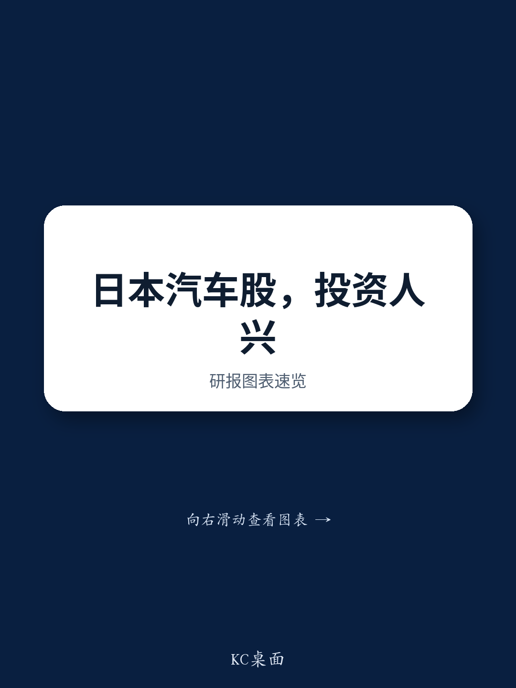

# GS：汽车行业数据与主题变化观察

7月中旬，GS分析师在亚洲读者路演中观察到，对日本整车厂商和轮胎制造商的关注度正在上升，而零部件板块的情绪依然偏弱。这份基于香港和新加坡两地面谈的反馈，提供了一个观察日本汽车产业链资金流向的切片。

报告显示，本田和丰田是读者讨论最集中的整车标的。本田的吸引力来自其在美国市场的高敞口以及摩托车业务的持续增长。丰田方面，与几个月前相比，读者的问题明显转向了上行不确定性——具体包括本财年盈利超预期的可能幅度以及未来的资本配置策略。日元持续贬值和4-6月美国市场稳健的销售数据，为整车板块的整体关注度回升提供了支撑。

## 1. 零部件板块面临中国供应商竞争仍在调整

与整车形成对比的是，读者对零部件制造商普遍持谨慎态度。报告指出，在本田和三菱汽车等主要整车厂接连宣布将单车成本削减数十万日元后，市场开始担忧零部件供应商与中国制造商的全面竞争正在展开。尤其值得关注的是，那些在中国及亚洲其他地区长期保持较高盈利水平的零部件公司，被读者视为不确定性暴露最集中的群体。

> **KC评论：** 整车厂降本不确定性向供应链传导的逻辑并不新鲜，但这次的关键变量是“数十万日元”的量级——这个数字意味着降本目标已从个别部件优化转向系统性的设计变更和采购重组，中国供应商的参与范围可能比市场预期的更广。

## 2. 轮胎制造商受益于提价与市场份额扩张

轮胎板块的讨论基调相对积极。尽管中东地缘政治不确定性仍在，但成功的提价行动为读者提供了信心基础。横滨橡胶获得了最高的关注度，其市场份额扩张和低成本生产能力是主要吸引力。住友橡胶则吸引了大量关于下财年新产品发布计划的提问。轮胎板块的讨论结构表明，读者更看重企业能否在成本端和定价端同时建立防御能力。

## 3. 人形机器人主题升温但差异化路径存疑

人形机器人成为此次路演中一个新兴的讨论主题，催化剂是三菱汽车近期公布的量产计划——目标2027年起每月生产1000台人形机器人。报告提到，读者也在重新评估丰田和本田等传统企业在机器人领域的中长期前景，这两家公司已在该领域布局多年。然而，多数读者对后来者如何在人形机器人领域实现差异化仍持怀疑态度。美国和中国企业在AI大脑以及具备60-70个自由度的高端执行器方面占据压倒性市场份额，这是后来者难以绕开的结构性障碍。

这份反馈报告的价值不在于给出结论，而在于揭示了当前读者对日本汽车产业链各环节的差异化定价逻辑：整车看汇率和区域敞口，轮胎看定价能力和成本结构，零部件看中国竞争不确定性，机器人则看技术壁垒和先发优势。这些维度为跟踪后续资金流向提供了可复用的观察框架。

For informational purposes only. Portions may be generated,translated,summarized,or edited with AI assistance based on source materials and may contain omissions or errors. Please verify independently. This is not investment,legal,tax,accounting,or other professional advice.

For informational purposes only. Portions may be generated,translated,summarized,or edited with AI assistance based on source materials and may contain omissions or errors. Please verify independently. This is not investment,legal,tax,accounting,or other professional advice.

