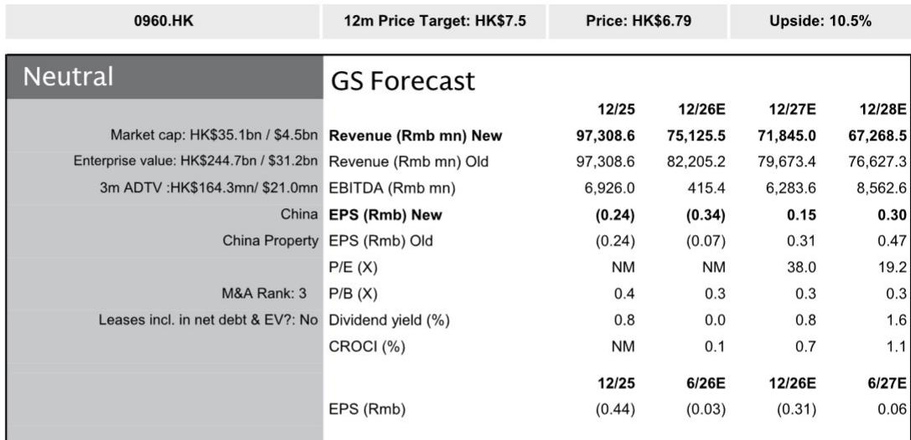
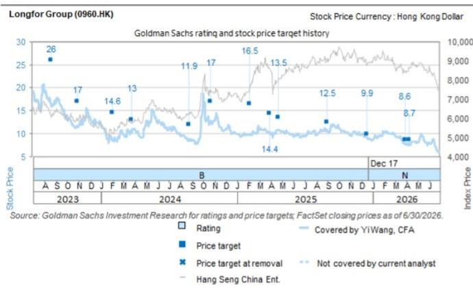

# Longfor's Property Development Margin Has Shifted Beyond Recovery, and Its Non-Property Engines Cannot Compensate

Longfor Group reported a 53% year-on-year decline in contract sales for the first half of 2026, a shift that far exceeds the mid-teens percentage decline seen across its covered developer peers and the top-100 industry list. This is not a market-wide issue; it is a company-specific structural factor rooted in a nearly frozen landbank replenishment strategy and an aged inventory composition that now accounts for roughly 80% of saleable resources. The implication is clear: Longfor's core property development business is entering a period of sustained negative gross margins, with the research team now forecasting a 2026E gross profit margin of negative 16% and a net loss of Rmb2.4 billion for the full year. The company's non-property segments—rental income, property management, and long-term rental apartments—are growing, but at rates that are too modest to offset the deepening losses in development. For observers, the critical question is not whether Longfor will navigate the cycle, but whether its current valuation adequately reflects the multi-year earnings adjustment that its aged inventory and constrained land acquisition will impose.

## The Aged Inventory Overhang Makes a Gross Margin Recovery Unattainable in the Near Term

Longfor's gross profit margin for property development is projected to fall to negative 16% in 2026E, a deterioration from an already weak 2H25 trough, and the research team sees limited room for recovery. The primary mechanism is the composition of Longfor's saleable resources: by 2025, approximately 80% of these resources were classified as "aged inventory," meaning projects acquired before the current downturn that are now being sold into a market with persistent pricing pressure, particularly outside top-tier cities. These projects carry high historical cost bases, and with property prices continuing to adjust in non-core markets, the company is forced to sell at a loss to generate cash flow and reduce debt. The research team has also expanded its joint venture loss assumptions, reflecting that the profitability pressure is not confined to wholly owned projects but extends across the partnership portfolio. The consequence is that even if Longfor achieves its revised 2026 contract sales target of Rmb26 billion—implying a 42% year-on-year decline and a historically low 35% sell-through rate against the Rmb105 billion budgeted for the year—the revenue generated will be insufficient to cover the cost of goods sold. This is not a cyclical trough that will automatically reverse; it is a structural margin issue driven by the vintage of the asset base.

## Land Acquisition Will Remain Muted Until Late Next Year, Perpetuating the Sales Decline

Longfor's land investment in the first half of 2026 remained nearly nonexistent, in stark contrast to the tracked state-owned enterprise developers that spent an average in the mid-twenties percentage of their contract sales on landbanking. The company is constrained by its deleveraging plan, which requires annual debt reduction of Rmb10 billion from 2026E to 2028E, down from the Rmb20 billion average achieved between 2023 and 2025. Given this deleveraging imperative, the aged inventory overhang, and the prolonged property market adjustment, the research team expects Longfor to be unlikely to resume meaningful land acquisition until late next year. The implication for future contract sales is significant: without replenishing the landbank with higher-quality, better-margin plots, Longfor's future saleable resources will continue to consist of the same aged inventory that is currently affecting margins. The research team has lowered its 2027E-2028E contract sales forecasts by an average of 27%, reflecting a structural decline in the company's ability to generate new revenue from development. For observers, this means that the top-line contraction is not a one-year event but a multi-year trajectory, and any recovery in property development earnings is contingent on a land acquisition cycle that will not begin until late 2027 at the earliest.

## Non-Property Segments Are Growing, but the Growth Rates Are Too Low to Offset Development Losses

Longfor's rental income grew 4% year-on-year in the first half of 2026, a figure that lags behind China Resources Land's 13% growth and only marginally exceeds Seazen's 2% growth. The underperformance is attributed to low occupancy and unfavorable rent reversion in Longfor's long-term rental apartment assets, while the mall portfolio is expected to deliver high-single-digit percentage growth on the back of enhanced operations and post-renovation same-store sales growth recovery. However, even this mall growth, while respectable, is insufficient to move the needle against a property development segment that is generating negative gross margins on a revenue base that is shrinking by more than 40% per year. Similarly, the property management and related services segment has had its growth forecast cut to 2% per annum for 2026E-2028E, down from a prior estimate of 7%, reflecting weakened delivery volume and more competitive third-party bidding increasingly dominated by state-owned enterprise property managers. The research team expects the non-property segments to provide a low-single-digit percentage contribution to topline and profit growth, which will largely be buffered by the continued drag from development. The arithmetic is simple: when the core business is generating losses equal to roughly 16% of its own revenue, a 4% growth in a smaller ancillary business cannot close the gap. Longfor's diversification strategy, while prudent in concept, is not scaled enough to serve as a profit substitute.

## A Decision Framework for Observers: Three Scenarios for Longfor's Recovery Path

Observers evaluating Longfor should consider three scenarios that map to the key variables identified in the research team's outlook. The base case, which underpins the current view, land acquisition remains paused until late 2027, and non-property segments grow at low-single-digit percentages. In this scenario, the company generates net losses in 2026E, returns to modest profitability of Rmb1.1 billion in 2027E, and reaches Rmb2.2 billion in 2028E, with the stock trading at 0.3 times 2026E price-to-book and a 32% discount to net asset value. The upside scenario would require a faster-than-expected clearance of vintage inventory through government land swaps or rezoning, a resumption of land acquisition with higher-quality plots within the next 12 months, and a sustained acceleration in mall rental growth that lifts non-property earnings to high-single-digit contributions. In this case, the gross margin could stabilize sooner, and the net profit inflection could occur in 2026E rather than 2027E. The downside scenario, which the research team's estimate revisions already partially capture, would involve a further deterioration in sell-through rates below 35%, additional impairment charges on aged inventory, and a slower-than-expected debt reduction pace that constrains land acquisition into 2028. In this scenario, the net loss in 2026E could widen, and the return to profitability could be delayed beyond 2028E. Observers should use these scenarios to assess whether the current valuation discount adequately reflects the downside risk, particularly given that consensus estimates for 2027E-2028E core earnings are approximately 60% higher than the research team's forecasts.

## Debt Reduction Is on Track, but It Comes at the Cost of Business Reinvestment

Longfor's debt reduction plan is proceeding as expected, with Rmb10 billion per annum targeted for 2026E-2028E, a pace that is half the Rmb20 billion average achieved in 2023-2025. The near-term repayment needs are manageable: only Rmb2.3 billion is scheduled for the remainder of 2026E, and this is likely well covered by rental-supported operating cash flow. The company is also exploring the swapping of high-interest financing with low-cost operating loans secured against its investment property portfolio, which could further reduce interest expense. However, the strategic cost of this deleveraging is that it consumes cash flow that could otherwise be used for land acquisition, project development, or portfolio reinvestment. The research team explicitly notes that Longfor will likely not resume land acquisition until late next year, and that the company's ability to replenish its landbank with higher-quality, better-margin plots is directly constrained by the need to continue reducing debt. For observers, this trade-off is the central tension in the Longfor story: the company is executing a financially prudent deleveraging plan that protects its balance sheet, but that same plan structurally affects its ability to grow its core business. The stock's valuation at 0.3 times 2026E price-to-book and a 32% discount to net asset value already reflects a high degree of skepticism about the development business, but it may not yet fully reflect the multi-year earnings drag that the aged inventory and constrained land acquisition will impose.

*For informational purposes only. Portions may be generated, translated, summarized, or edited with AI assistance based on source materials and may contain omissions or errors. Please verify independently. This is not professional advice.*

For informational purposes only. Portions may be generated, translated, summarized, or edited with AI assistance based on source materials and may contain omissions or errors. Please verify independently. This is not professional advice.

