# 宏观观察：地缘因素与柴油价差

■ 海湾地区流量变化与价格关联。中东地区局势变化以及波斯湾地区流量估算值降至冲突前水平的45%以下，推动原油报价回升（图表1）。布伦特期货曲线目前略高于我们对2026年第四季度和2027年的预测，该预测假设2026年第四季度局势缓和。

■ 价格存在上行可能。我们认为价格预测面临的上行可能性较大，尤其是在短期内（图表2）。主要的上行风险包括：

□ 霍尔木兹海峡及红海航运受阻。自冲突开始以来，通过延布至红海的管道流量估算增加约500万桶/日，目前已超过600万桶/日（图表3），这在很大程度上抵消了霍尔木兹海峡流量下降的部分影响。

□ 中东及俄乌冲突对能源基础设施的影响。尽管伊朗方面的冲突迄今可能未对原油产能造成持久性重大损害，但我们对过去50年五次最大供应冲击的分析显示，受影响国家在五年后的产量平均下降42%，这通常反映了基础设施受损、投入不足或严格限制等因素（图表4）。

■ 库存水平与市场弹性。如果霍尔木兹海峡的干扰持续至2027年，2026年第四季度布伦特报价可能超过120美元/桶，2027年均价可能达到100美元/桶（图表2，红线）。该情景假设海湾地区产量到2027年12月才完全恢复，并依赖管道扩建的支持。第二季度库存消耗估算超过300万桶/日，使得市场比2月份更为脆弱，其中经合组织柴油库存和战略储备库存尤其偏低（图表5）。尽管如此，全球可见原油库存同比仅下降30万桶/日（图表6），模拟的价格上行空间低于冲突初期的可比估算。这反映了我们目前假设需求弹性更大、中东供应适应性更强，以及市场在需要大幅抑制需求之前对低库存的容忍度更高。

中国对稳定原油市场发挥了作用。中国原油进口需求的下降幅度仍然较大（图表7），其需求对原油采购价格高度敏感（图表8）。6月份中国原油海运净进口量同比下降470万桶/日，这既反映了炼厂开工率和成品油需求下降（中国零售汽油销量同比下降21%），也反映了从2025年的囤货转向冲突开始后的去库存，6月份原油去库存估算略高于100万桶/日（图表9）。我们认为，考虑到中国原油库存估算仍高达约20亿桶，且有能力用煤炭和电力替代部分石油需求，中国原油进口未必需要立即反弹，尤其是在报价进一步上涨的情况下。

## 关于柴油价差的研究观察

我们建议希望对冲中东和俄罗斯持续地缘风险的市场参与者关注2026年12月至2027年3月欧洲柴油（“粗柴油”）的时间价差。该价差有进一步上升或“大幅走阔”的潜力（图表10），原因在于：即使不考虑伊朗方面的冲突，基本面已偏紧；且该价差对俄罗斯和中东炼厂停产高度敏感。我们更倾向于欧洲柴油时间价差，而非原油、汽油或美国柴油价差，基于三点考虑。

□ 柴油价差相对于原油。与原油市场不同，在冲突之前，炼油和柴油市场已经非常紧张，表现为炼厂利用率高和柴油库存低（图表11）。随着乌克兰继续扩大分散式无人机生产，俄罗斯炼厂停产规模接近500万桶/日的历史高位（图表12）持续的可能性很大，这可能会使俄罗斯柴油净出口维持在极低水平（图表13）。飓风、极端夏季高温以及年内计划维护的显著推迟，也给成品油供应带来比原油更大的下行风险。

□ 柴油相对于汽油。我们推荐关注柴油而非汽油价差，因为俄罗斯炼厂停产对柴油价格的上行推动大于汽油；当库存从低位进一步下降时，柴油利润往往不成比例地上升；柴油需求的价格弹性较低，且尚未在第四季度达到季节性峰值；炼厂进一步提高柴油收率的能力有限（图表14）。

□ 欧洲柴油相对于美国柴油。我们更倾向于欧洲柴油而非美国柴油价差，因为美国利润面临政策变化的潜在下行风险，包括出口关税或取消可再生燃料标准义务，而欧洲炼油成本面临上行风险，包括TTF天然气价格上涨。

## 图表

图表1：海湾地区流量下降意味着原油报价上升
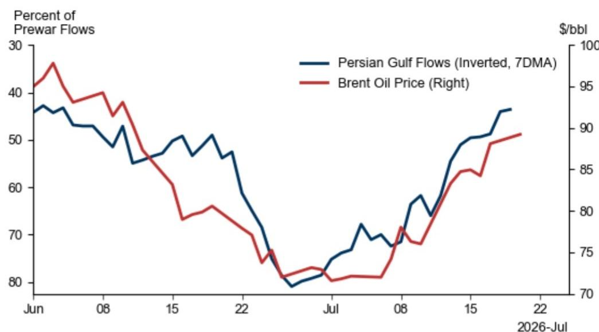
来源：ICE，GS全球研究

图表2：原油价格存在上行可能
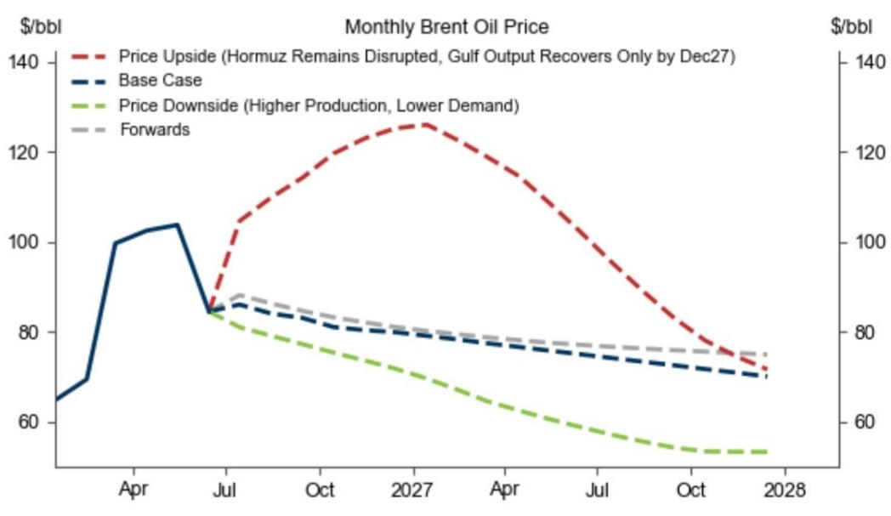
来源：ICE，GS全球研究

图表3：自冲突开始以来，通过延布至红海的管道流量估算增加约500万桶/日，在很大程度上抵消了霍尔木兹海峡流量下降的部分影响
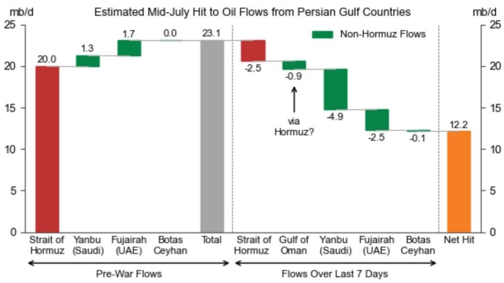
来源：Kpler，GS全球研究

图表4：回顾过去50年最大的供应冲击，我们估算四年后产量平均下降42%
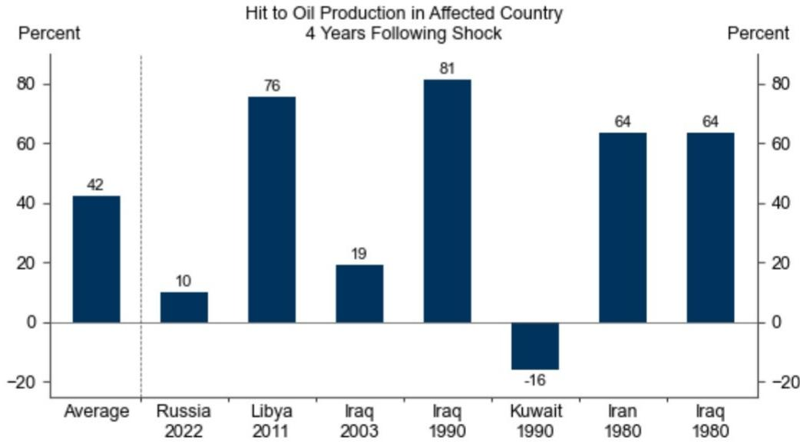
来源：EIA，IEA，GS全球研究

图表5：经合组织柴油和战略储备的可见库存偏低，但中国及海上库存较高
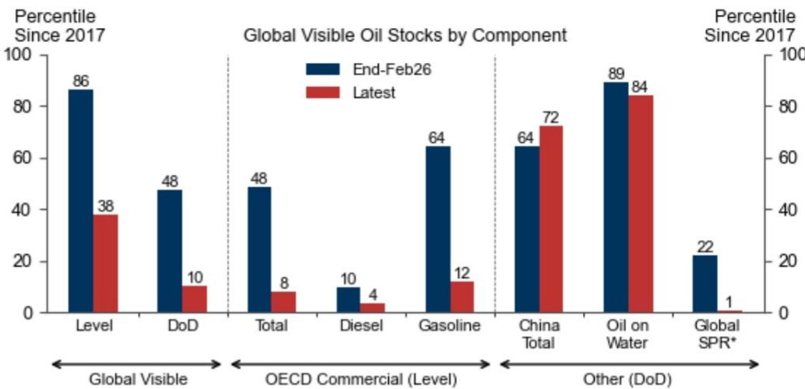
包含原油和成品油（除非另有说明）。DoD表示需求天数；库存的DoD通过除以12个月移动平均需求计算。对于经合组织商业柴油/汽油，显示的百分位是月度数据与2017-2026年季节性平均值的偏差。*全球战略储备不包括中国战略储备。
来源：IEA，Kpler，DOE，Euroilstocks，ARA PJK，PAJ，Haver，GS全球研究

图表6：全球可见原油库存同比仅下降30万桶/日
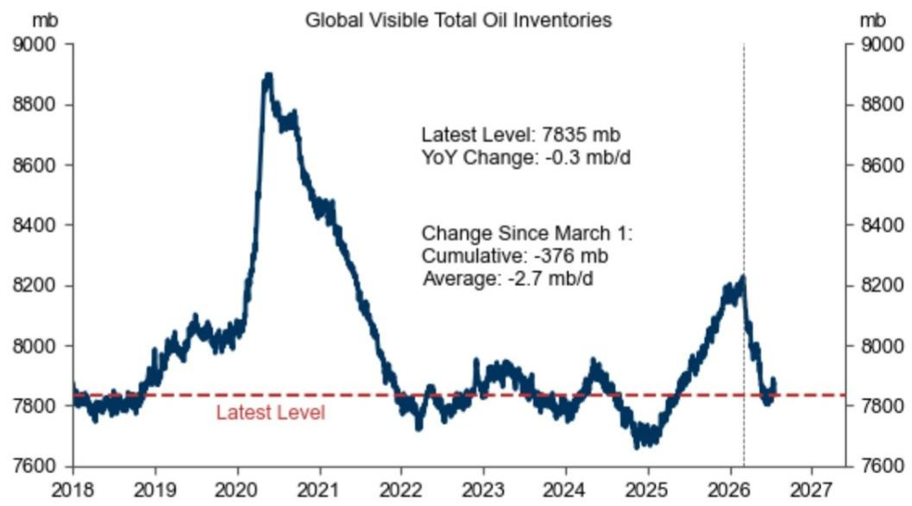
来源：IEA，Kpler，DOE，Euroilstocks，ARA PJK，PAJ，Haver，GS全球研究

## 中国原油市场观察

图表7：中国原油海运净进口量同比下降44%
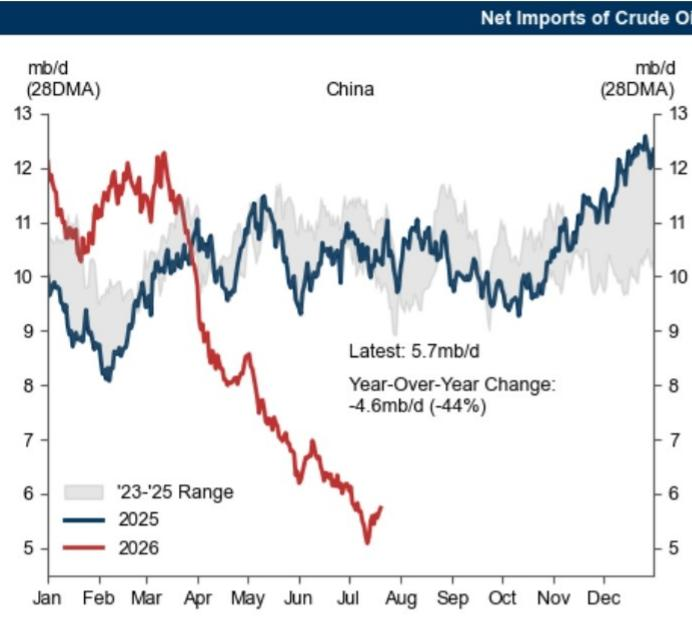
来源：Kpler，GS全球研究

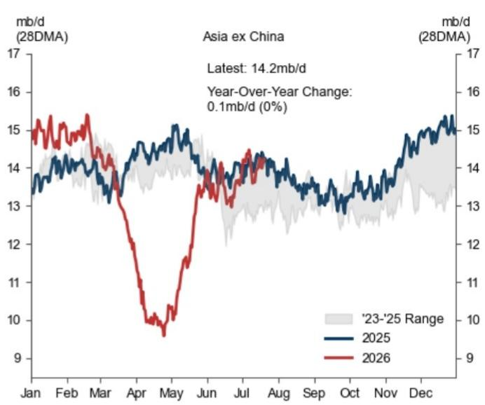

图表8：大量原油库存使中国进口对价格敏感，可在进口报价高时推迟采购
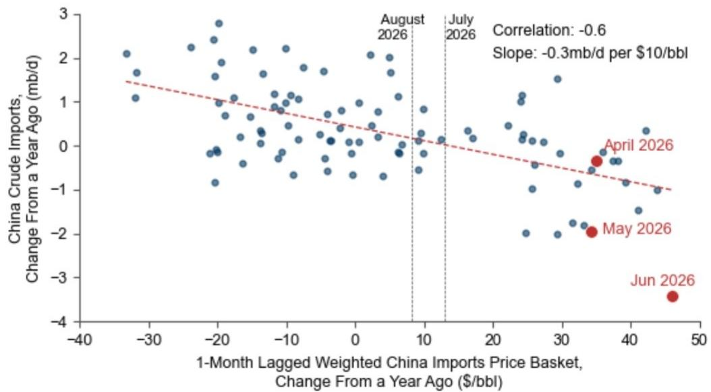
样本期为2017年1月至2026年6月，不包括2020年3月至5月。原油价格包括阿拉伯轻质油（沙特）、伊朗重质油（伊朗）、巴士拉中质油（伊拉克）、穆尔班（阿联酋）、阿曼原油（阿曼）、ESPO科兹米诺（俄罗斯）。
来源：Platts，OPEC，Kpler，GS全球研究

图表9：我们估算中国原油去库存略高于100万桶/日

| 中国原油平衡表：2026年6月（百万桶/日） | 原油 | 成品油 |
|---|---|---|
| 1) 国内产量 | 4.2 | 12.1 |
| 2) 净进口 | 6.9 | 0.0 |
| 3) 需求 | 12.1 | 12.2 |
| 4) 隐含库存变化：(1)+(2)-(3) | -1.1 | -0.1 |
| 5) 可见库存变化 | -1.0 | -0.4 |
| (6) 估算不可见库存变化：(4)-(5) | -0.1 | 0.3 |

我们结合了来自IEA的国内产量估算、来自Kpler和Petrologistics的净进口和可见库存变化、来自国家统计局的原油需求（即炼厂加工量）以及来自S&P Global Market Intelligence的成品油需求。我们假设中国凝析油产量为20万桶/日，并使用Petrologistics估算的管道原油进口量为80万桶/日，铁路成品油进口量低于10万桶/日。
来源：中国国家统计局，Kpler，S&P Global Market Intelligence，隆众资讯，GS全球研究

## 关于柴油价差的研究观察

图表10：我们建议希望对冲中东和俄罗斯地缘风险的市场参与者关注2026年12月至2027年3月欧洲柴油时间价差
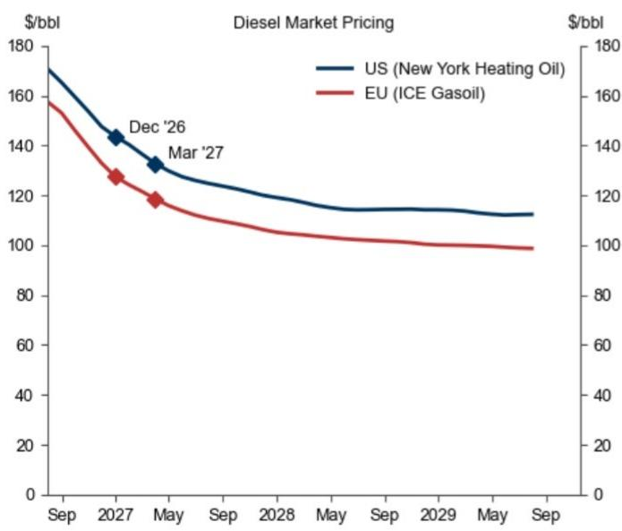
来源：ICE，NYMEX，GS全球研究

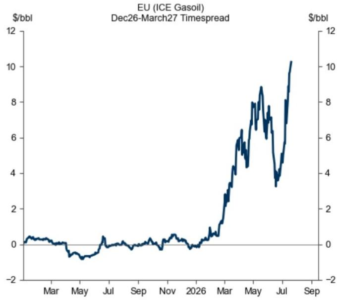

图表11：经合组织商业馏分油库存仍处低位
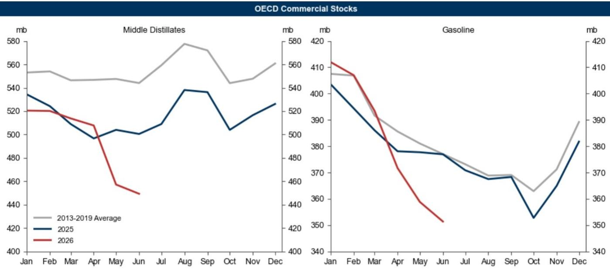
来源：IEA，GS全球研究

图表12：中东尤其是俄罗斯的炼厂停产规模很大

来源：IIR，GS全球研究

图表13：俄罗斯炼厂停产规模大意味着俄罗斯柴油净出口低
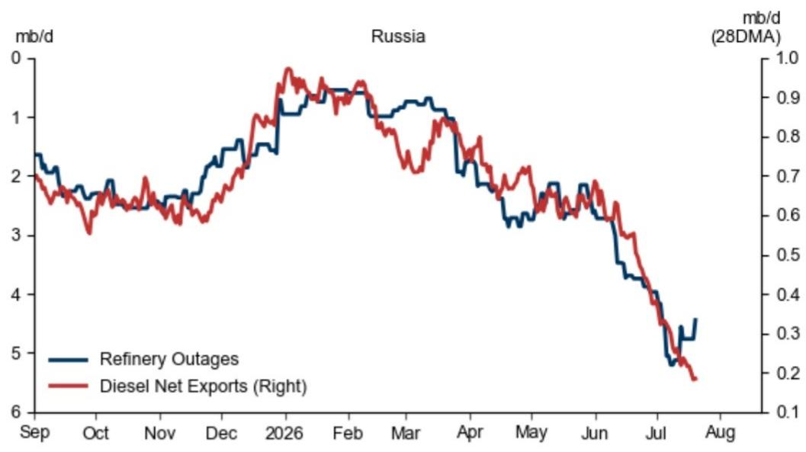
来源：Industrial Info Resources，Kpler，GS全球研究

图表14：美国炼厂进一步提高柴油收率的能力可能有限

来源：EIA，GS全球研究
