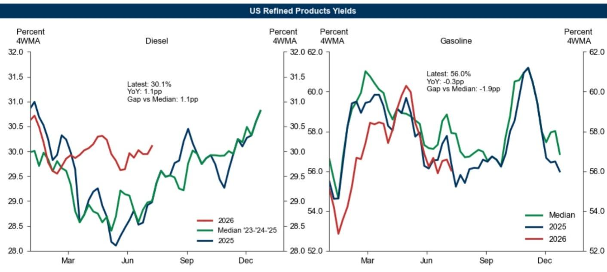
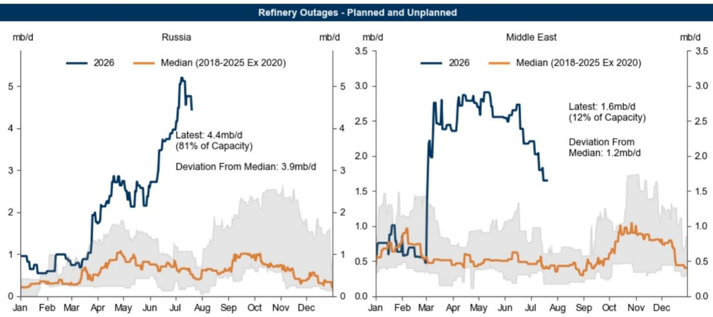

# GS：GS石油观察-用柴油价差应对局势变化

波斯湾原油流量已降至战前水平的45%以下，布伦特期货曲线目前略高于GS对2026年第四季度和2027年的80美元和75美元预测值。这份报告的核心判断是：油价不确定性偏向上行，但市场对极端情景的定价弹性已高于战争初期，读者和消费者若想应对持续的地缘政治冲击，欧洲柴油时间价差比原油或美国柴油更具优势。

报告认为，当前市场比2月份更脆弱，但并非没有缓冲。第二季度库存去化超过每日300万桶，OECD柴油和战略石油储备库存尤其偏低。然而，全球可见石油库存同比仅下降每日30万桶，且模拟的价格上行空间低于战争初期的同类估算。GS的解释是，市场现在假设了更大的需求弹性、更具适应性的中东供应，以及市场对低库存的更高容忍度——在需要激进的需求调整之前。

## 1. 中国原油进口下降但库存缓冲仍在

中国6月原油净海运进口同比下降每日470万桶，降幅达44%。这既反映了炼厂开工率和成品油需求走弱（中国零售汽油销量同比下降21%），也反映了从2025年的补库转向战争开始后的去库——6月原油去库估计略高于每日100万桶。GS认为，中国原油进口无需立即反弹，尤其是如果价格进一步上涨，因为中国估计仍持有约20亿桶原油库存，且有能力用煤炭和电力替代部分石油需求。

> **KC评论：** 中国在原油市场扮演的不是需求拉动者，而是价格敏感型缓冲器。20亿桶库存意味着中国可以在高油价时期推迟采购，这实际上为全球原油价格设置了一个隐形的需求天花板——不是通过减产，而是通过推迟进口。

## 2. 欧洲柴油时间价差具备三重结构性支撑

GS提到关注2026年12月至2027年3月的欧洲柴油时间价差，理由有三层。首先，与原油市场不同，炼油和柴油市场在战争前已经非常紧张——炼厂利用率高、柴油库存低。乌克兰持续扩大分散式无人机生产，俄罗斯炼厂 outages 维持在接近每日500万桶的历史高位，这一趋势很可能持续，从而压制俄罗斯柴油净出口。

其次，柴油优于汽油。俄罗斯炼厂 outages 对柴油价格的推升作用大于汽油；柴油利润率在库存从低位进一步下降时往往不成比例地上升；柴油需求的价格弹性更低，且第四季度才进入季节性峰值；美国炼厂进一步提高柴油收率的能力有限。

第三，欧洲柴油优于美国柴油。美国柴油利润率面临政策变化的节奏变化不确定性，包括出口关税或可再生燃料义务的调整，而欧洲炼油成本面临上行不确定性，包括TTF天然气价格上涨。

## 3. 极端情景下的价格路径与市场弹性

如果霍尔木兹海峡的 disruption 持续到2027年，布伦特原油可能在2026年第四季度突破每桶120美元，2027年平均达到100美元。这一情景假设海湾地区产量要到2027年12月才能完全恢复，并依赖管道扩建来支撑。但报告也指出，模拟的价格上行幅度低于战争初期的同类估算，因为市场现在假设了更大的需求弹性、更具适应性的中东供应，以及市场对低库存的更高容忍度。

GS对历史数据的分析显示，过去50年5次最大的供应冲击中，受影响国家在5年后的产量平均下降42%，这通常反映了基础设施损坏、研究不足或严厉制裁。但当前情景中，伊朗战争尚未对石油生产能力造成持久的重大损害。

> **KC评论：** 报告的核心洞察不在于油价会涨多少，而在于市场结构已经改变——欧洲柴油时间价差成为比原油本身更有效的应对工具。这是因为柴油市场的紧张是结构性的（炼厂 outages、低库存、低弹性），而原油市场的紧张是地缘政治性的（霍尔木兹流量下降），后者可能更快缓解。

这份报告提供了一个可复用的观察框架：在评估地缘政治不确定性应对时，不应只看原油相对价格，而应关注不同成品油市场的库存状态、供给弹性和政策不确定性差异。欧洲柴油时间价差之所以被提到，不是因为油价一定上涨，而是因为它同时暴露于中东和俄罗斯两个地缘政治不确定性源，且其基本面在战前已经偏紧。

For informational purposes only. Portions may be generated,translated,summarized,or edited with AI assistance based on source materials and may contain omissions or errors. Please verify independently. This is not investment,legal,tax,accounting,or other professional advice.

For informational purposes only. Portions may be generated,translated,summarized,or edited with AI assistance based on source materials and may contain omissions or errors. Please verify independently. This is not investment,legal,tax,accounting,or other professional advice.

