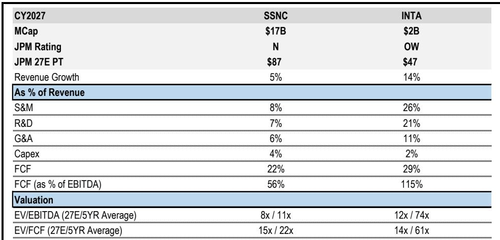
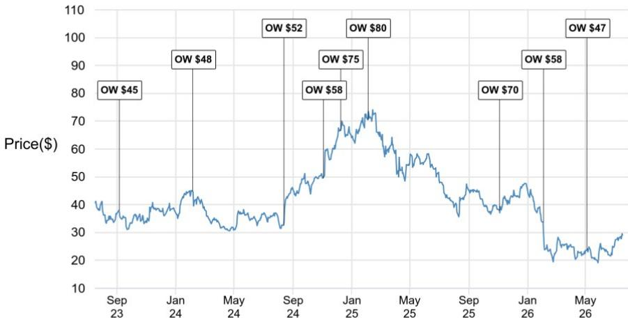
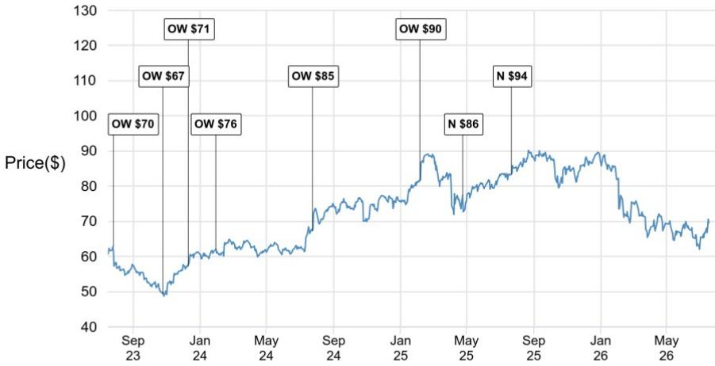

# JPM：资金软件，Intapp与SS&C的代理型AI路径

专业服务软件领域的两家公司——Intapp与SS&C——正在向代理型AI转型，但起点和路径截然不同。JPM一份覆盖这两家垂直SaaS公司的研报指出，两者战略方向一致，但差异化来源不同：Intapp从云原生垂直SaaS出发，将Celeste定位为受治理的代理型平台；SS&C则从大规模智能自动化和业务流程外包运营切入，以WorkHQ作为Blue Prism之上的编排层。

报告认为，两家公司都在试图成为受监管客户部署AI时必须经过的治理层——Intapp通过为专业服务公司设计的信息隔离墙和利益冲突控制，SS&C则通过面向资金和医疗工作流的企业级护栏与合规优先治理。治理不是一项功能，而是采用瓶颈，两家公司都在争夺这一控制点。

## 1. Intapp的AI防御性来自治理与上下文深度融合

Intapp的AI战略围绕受治理、模型无关的代理型工作流展开。其核心产品Celeste是一个平台，能够将AI嵌入业务拓展、交易执行和合规流程，同时保持信息隔离墙和保密性控制始终开启。报告强调，Intapp的差异化在于“上下文+治理+工作流嵌入”的组合：它能够将企业专有的机构记忆（交易、合规和关系历史）与更广泛的数据生态结合，在政策执行层持续运行，并通过日常工作流分发。

在JPM参与的一场产品演示中，Intapp管理层反复强调，Celeste的价值不在于底层模型，而在于模型之上构建的工作流、集成、权限和剧本。客户Hg Capital的数据与AI负责人指出，真正的防御性在于企业自身的结构化机构数据和工作流——筛选和提到基于企业自身的授权、标准和历史经验，而非通用启发式规则。

> **KC评论：** 这意味着Intapp的AI产品不是通用Copilot的垂直封装，而是以治理为架构层、以专有数据为上下文引擎的系统。对于专业服务公司而言，合规是采用AI的前提条件，Intapp试图在架构层面解决这一问题，而非事后添加合规功能。

## 2. SS&C的AI路径依赖内部规模化验证与成本优化

SS&C的AI策略以“客户零号”模式为核心——先在自己内部29,000名员工和23,000个客户的运营中部署数字员工和代理，驱动可量化的成本节约和利润率扩张，再将经过生产验证的模式通过WorkHQ、AI Gateway和垂直产品嵌入商业化。

报告指出，SS&C的优势在于运营规模和核心处理领域的深度系统记录数据。但其AI叙事需要克服组合观察复杂性和外包商认知——客户是否将其视为统一的技术平台而非分散的服务集合，是观察其AI战略能否兑现的关键。JPM对SS&C的公司观点更新，并下调了其中期收入增长和利润率预期，认为近期传统技术预算的弱化对需求构成中期不确定性。

## 3. 治理层成为两家公司共同的货币化控制点

尽管路径不同，Intapp和SS&C在一点上高度一致：都将自己定位为受监管客户在采用AI时必须经过的基础设施。Intapp通过信息隔离墙、利益冲突和未公开重大信息控制为专业服务公司提供治理；SS&C则通过企业级护栏、数据保护、可解释性和人机协同为资金和医疗工作流提供合规保障。

报告认为，治理不是一项可附加的功能，而是采用瓶颈。谁能够在这一控制点上建立可信的架构，谁就能在代理型AI的部署中占据不可替代的位置。对于Intapp，这意味着其AI防御性具有结构性特征——合规要求本身就是护城河；对于SS&C，其AI前景则更依赖执行——能否在组合观察复杂性中呈现统一平台体验，将决定其治理层能否被客户接受。

> **KC评论：** 两家公司都在押注“AI必须经过我才能安全运行”这一命题。但Intapp的治理是产品架构的原生组成部分，SS&C的治理则是从自动化运营中生长出来的能力。两者都能满足合规需求，但可扩展性和客户感知可能存在差异。

## 4. 观察框架：从治理深度、数据上下文和部署模式判断AI防御性

报告提供的分析框架可以提炼为三个维度：治理深度——AI是否在架构层面继承企业的权限和合规规则；数据上下文——AI是否能够调用企业专有的机构记忆而非通用互联网数据；部署模式——AI是作为独立产品出售还是嵌入现有工作流。

Intapp在这三个维度上均表现出结构性优势：治理是产品架构的原生层，数据上下文来自企业自身的交易和关系历史，部署通过Celeste平台嵌入日常工作流。SS&C的优势在于运营规模和系统记录数据的深度，但其治理层需要从自动化运营中抽象为统一平台，数据上下文分散在多个业务线，部署模式仍需克服外包商认知。

这两个案例表明，在受监管行业中，AI的防御性不仅取决于技术能力，更取决于治理架构是否能够成为客户采用AI的前提条件。

For informational purposes only. Portions may be generated,translated,summarized,or edited with AI assistance based on source materials and may contain omissions or errors. Please verify independently. This is not investment,legal,tax,accounting,or other professional advice.

For informational purposes only. Portions may be generated,translated,summarized,or edited with AI assistance based on source materials and may contain omissions or errors. Please verify independently. This is not investment,legal,tax,accounting,or other professional advice.

