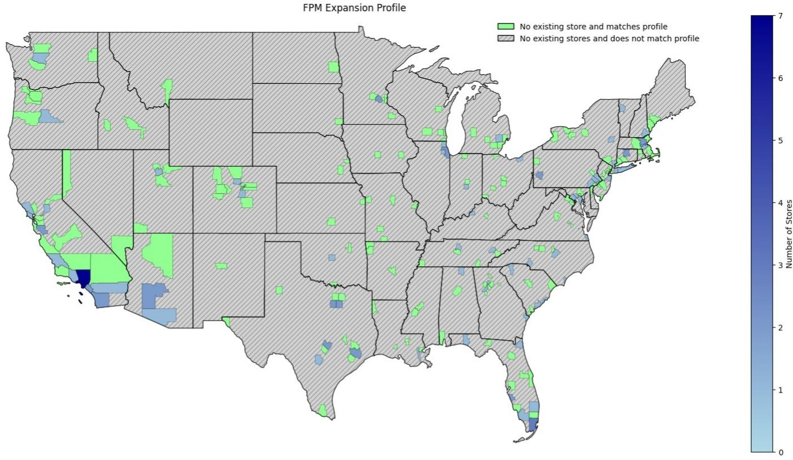
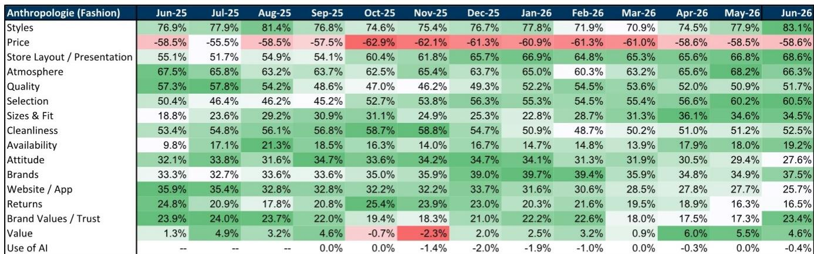
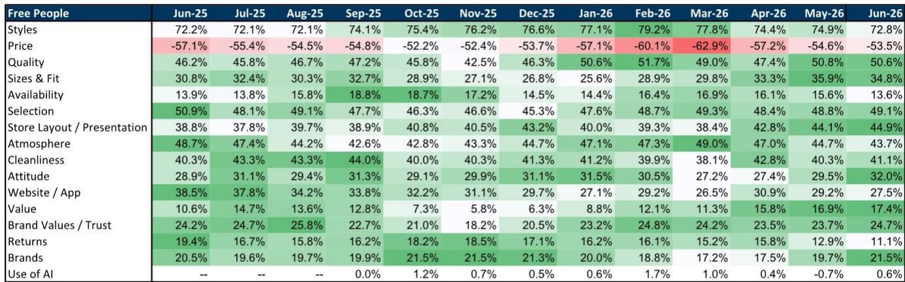

# GS：GS在2026年7月的一份研报中调整了对Urba

GS在2026年7月的一份研报中调整了对Urban Outfitters（URBN）的观察框架。核心判断是：市场对Anthropologie品牌执行不确定性的定价已较为充分，而Urban Outfitters品牌的利润修复和新兴增长引擎的规模化，正在改变公司的整体回报结构。这份报告并非简单看好单一品牌，而是认为组合内各业务的不确定性回报已发生位移。

报告指出，Urban Outfitters品牌在经历了数年仍在调整的同店销售和利润率趋势后，于2026财年出现正向转折。GS的品牌动量追踪数据显示，该品牌的净购买意愿和搜索趋势均在改善。消费者对款式、价格和品质的评价在过去数月持续走高。从财务角度看，若该品牌利润率恢复到历史中个位数水平，到2028财年将带来超出市场一致预期的利润空间。这一修复主要来自降价幅度的收窄和销售杠杆的释放。

> **KC评论：** 市场此前对URBN的关注点集中在Anthropologie的波动上，但UO品牌的利润修复可能成为被低估的变量。报告中的品牌动量数据（净购买意愿、搜索趋势）是判断修复是否持续的实时指标，比财务数据更具前瞻性。

与此同时，Anthropologie品牌仍是组合中最大的执行不确定性。报告承认，该品牌年初至今表现波动，同店销售节奏变化，降价幅度上升，原因是产品组合效率不足。但管理层已采取快速调整措施，使同店销售稳定在低至中个位数区间。GS认为，读者对该品牌的预期已明显降低，这反而创造了更平衡的观察窗口。近期数据也显示，年轻消费者的购买意愿有所回升。

在增长引擎方面，报告强调了两个正在规模化的业务。Nuuly品牌在过去十二个月贡献了超过3个百分点的增量增长，占整体销售增长的30%。Free People Movement仍处于门店扩张早期阶段，同店销售表现强劲。GS认为，这些增长向量为收入增长的持续性提供了更强的可见度。

从估值角度看，报告提供的财务数据显示，公司当前市盈率约为12倍，预计到2029财年将降至9.7倍。自由现金流回报表现从2026财年的5.3%预计升至2029财年的9.5%。净债务与EBITDA比率持续为负，显示公司净现金状况在改善。

报告也列出了几个需要持续观察的不确定性点。Anthropologie品牌仍面临时尚周期红利消退、来自专业竞争对手和折扣零售商的竞争不确定性，以及URBN历史上难以实现所有品牌同时正增长的记录。这些因素都可能影响中期表现。

对于关注美国专业零售领域的观察者而言，这份报告提供了一个可复用的框架：当一个组合内不同品牌的利润周期和预期出现分化时，整体不确定性回报可能被重新定价。关键在于识别哪些品牌的预期已被充分修正，以及哪些品牌的利润修复尚未被市场计入。

For informational purposes only. Portions may be generated,translated,summarized,or edited with AI assistance based on source materials and may contain omissions or errors. Please verify independently. This is not investment,legal,tax,accounting,or other professional advice.

For informational purposes only. Portions may be generated,translated,summarized,or edited with AI assistance based on source materials and may contain omissions or errors. Please verify independently. This is not investment,legal,tax,accounting,or other professional advice.

