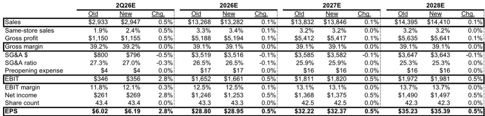
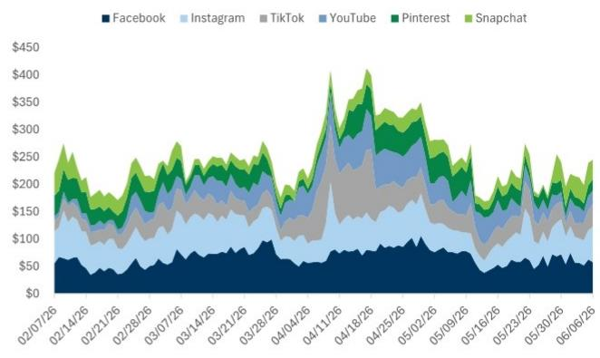
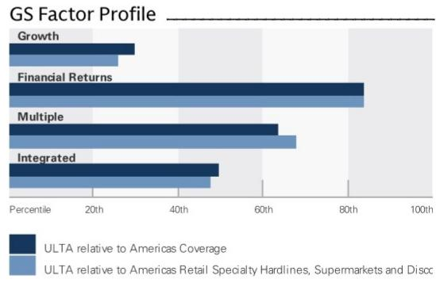

# Ulta's Promotional Engine Is Generating Measurable Traffic Gains That the Market Is Underpricing

Ulta Beauty enters the second half of fiscal 2026 with a valuation that has compressed to 15.8x forward earnings, a steep discount to its one-year historical average of 19.5x and its three-year average of 17.6x. The market is pricing in decelerating comparable-store sales, rising distribution competition in beauty, and skepticism that first-quarter momentum can persist through the year's toughest comparison period. Yet a granular analysis of foot and web traffic around Ulta's four major promotional events tells a different story. Foot traffic accelerated for the Spring Haul and Big Summer Beauty Sale in 2026 relative to prior years, while web traffic registered double-digit percentage growth across all events. These are not random fluctuations. They reflect a deliberate, well-executed marketing strategy that is converting investment into measurable guest engagement and market share gains.

The tension between the bear case and the traffic data is the central strategic question for observers. Bears point to the second-quarter comparison, which is the most difficult of the fiscal year, and to the proliferation of beauty distribution points from mass retailers to social commerce platforms. But the promotional event data suggests that Ulta's marketing investments are not merely defending share—they are actively pulling in traffic at an accelerating rate. The company's second-quarter guidance appears conservative relative to these observed trends, and the current valuation provides an asymmetric risk-reward setup. The question is not whether Ulta faces headwinds. The question is whether the market has correctly calibrated the magnitude of those headwinds against the operational momentum that is visible in real-time location and web analytics.

## Accelerating Foot Traffic at Spring Haul and Big Summer Beauty Sale Signals That Marketing Spend Is Converting to Store Visits

The most actionable signal in the traffic data is the year-over-year acceleration at the two most recent promotional events. Foot traffic during the Spring Haul event increased 2.1% in 2026, while foot traffic during the Big Summer Beauty Sale surged 10.9%. These figures stand in contrast to the two earlier events in the calendar: the Jumbo Love and Love Your Skin event saw a 1.7% decline, and the 21 Days of Beauty event registered a 1.8% decline. The pattern is not random. The two events that accelerated are the ones where management has explicitly called out enhanced marketing strategies—Spring Haul in the first-quarter earnings call and Big Summer Beauty Sale in the prior year's second-quarter call, where management noted a shift in promotional timing to better align with consumer behavior and a more robust media strategy with engaging social content.

The acceleration matters for two reasons. First, it demonstrates that the marketing investments are not a fixed cost with diminishing returns. Management has consistently emphasized marketing as a growth driver, including in-store events, exclusive brand collaborations, digital personalization, and key promotional activations. The traffic data validates that thesis. Second, the acceleration is occurring despite the broader narrative of increased distribution points in beauty. If Ulta were losing relevance to new entrants or to competitors' online offerings, one would expect promotional traffic to flatten or decline, not accelerate. The fact that the two most recent events show positive and, in the case of Big Summer Beauty Sale, double-digit foot traffic gains suggests that Ulta's in-store experience and event-driven marketing remain differentiated.

The web traffic data reinforces this interpretation. Across all four events, web traffic registered double-digit percentage growth year-over-year. This is particularly noteworthy because the data captures the full promotional calendar up to June 2026, meaning it excludes the Big Summer Beauty Sale for web metrics. Even without that event, the digital engagement is broadly strong. The combination of accelerating foot traffic and double-digit web traffic growth is consistent with a strategy that is driving both physical store visits and online engagement, not cannibalizing one channel for the other.

## The Second-Quarter Comparison Is the Market's Central Fear, but the Guidance Appears to Build in a Buffer That the Data Questions

Investor skepticism around second-quarter comparable-store sales is rooted in a legitimate mathematical reality. The second quarter of fiscal 2026 faces the most difficult year-over-year comparison of the fiscal year, and the natural expectation is for deceleration. Management's guidance, which the report characterizes as relatively conservative, reflects this caution. But the traffic data from the Big Summer Beauty Sale, which falls within the second quarter, challenges the assumption that deceleration is inevitable.

The 10.9% foot traffic increase for the Big Summer Beauty Sale is not a marginal improvement. It is a step-change from prior years. If this level of traffic converts to sales at historical rates, the second-quarter comp could exceed both management's guidance and consensus expectations. The report's increase to the second-quarter comp estimate is based on exactly this logic: observed trends from the bigger promotional events suggest better-than-expected performance.

This is not a prediction that the second quarter will be easy. The comparison is genuinely difficult, and there are other factors—such as the timing of new product launches and the broader consumer spending environment—that could influence results. But the market is treating the second quarter as a foregone conclusion of deceleration. The traffic data introduces a credible alternative scenario in which Ulta's marketing investments offset the comparison headwind. The conservative guidance, in this context, becomes an opportunity rather than a warning.

## The Distribution Proliferation Thesis Overlooks Ulta's Ability to Use Exclusivity and TikTok Shop as Offensive Tools

The long-term bear case against Ulta centers on the fragmentation of beauty distribution. Sephora's expansion into Kohl's, the growth of direct-to-consumer channels, and the rise of social commerce platforms have all increased the number of touchpoints where consumers can discover and purchase beauty products. The fear is that Ulta's addressable market is being diluted, and that its historical growth algorithm of new store openings and same-store sales growth is structurally impaired.

The report's discussion of the company's conversation with investor relations points to two strategic responses that are underappreciated. The first is a growing focus on exclusivity. Exclusive collaborations with brand partners are a direct counter to distribution proliferation. If a product is only available at Ulta, the proliferation of other distribution points is irrelevant. The second is the launch of TikTok Shop earlier in 2026. This is not a defensive move. It is an offensive one that positions Ulta to participate in the very channel that the bear case cites as a threat. By establishing a presence on TikTok Shop, Ulta can capture the social commerce wave rather than be disrupted by it.

These two strategies—exclusivity and social commerce integration—are mutually reinforcing. Exclusivity gives consumers a reason to seek out Ulta, whether in-store or on TikTok Shop. TikTok Shop gives Ulta a platform to market those exclusive products to a younger, digitally native audience. The combination is a competitive moat that is not captured in a simple distribution-point count.

## A Decision Framework for Evaluating Ulta's Risk-Reward at 15.8x Earnings

The current valuation creates a framework for decision-making that is grounded in observable data rather than narrative. The framework has three components: the traffic signal, the valuation buffer, and the strategic optionality.

The traffic signal is the most concrete input. Foot traffic acceleration at Spring Haul and Big Summer Beauty Sale, combined with double-digit web traffic growth across all events, provides a real-time indicator that the business is gaining momentum, not losing it. This is not a survey or a management forecast. It is observed behavior. If this signal persists through the remainder of the fiscal year, the second-half comparisons become easier, and the full-year comp trajectory could be higher than current estimates.

The valuation buffer is the second component. At 15.8x forward earnings, Ulta trades below its historical averages and at a discount to many specialty retail peers. This multiple embeds a significant amount of pessimism. If the second quarter meets or exceeds expectations, the multiple has room to expand. If the second quarter disappoints, the downside is partially cushioned by the already-compressed valuation. The asymmetry is favorable.

The strategic optionality is the third component. Exclusivity and TikTok Shop are not fully reflected in current revenue or earnings estimates. They are investments that management is making now for growth in fiscal 2027 and beyond. If these initiatives gain traction, the long-term growth algorithm could be higher than the current consensus of 4-5% annual revenue growth. The market is not pricing this optionality.

This framework does not eliminate risk. The consumer environment could weaken. Competition could intensify. The TikTok Shop integration could encounter challenges. But the framework does provide a structured way to weigh the evidence. The traffic data is real. The valuation is discounted. The strategic initiatives are underway. The combination argues that the market's pessimism is overdone.

## The Big Summer Beauty Sale Data Is the Most Important Leading Indicator for the Second Half

Among all the traffic data points, the Big Summer Beauty Sale foot traffic increase of 10.9% deserves the most weight. It is the most recent data point, it falls within the current quarter that the market is most worried about, and it represents the largest acceleration of any event. The report notes that management enhanced this event in the prior year with a robust media strategy and engaging social content, and that those enhancements are now bearing fruit.

The implication is that Ulta is learning from its own promotional playbook. The company has identified which events respond to increased marketing investment and is allocating resources accordingly. The Big Summer Beauty Sale, which was already a successful event, has been upgraded to a high-impact promotional vehicle. If this pattern holds, the September 21 Days of Beauty event could also show improvement, further supporting third-quarter performance.

The web traffic data for the Big Summer Beauty Sale is not yet available, as the data source only extends through June 2026. But the foot traffic data is sufficient to establish the trend. When the web data becomes available, it will likely confirm that the digital engagement is also strong. The combination of physical and digital acceleration for this event would be a powerful signal that Ulta's go-to-market strategy is working at scale.

*For informational purposes only. Portions may be generated, translated, summarized, or edited with AI assistance based on source materials and may contain omissions or errors. Please verify independently. This is not professional advice.*

For informational purposes only. Portions may be generated, translated, summarized, or edited with AI assistance based on source materials and may contain omissions or errors. Please verify independently. This is not professional advice.

