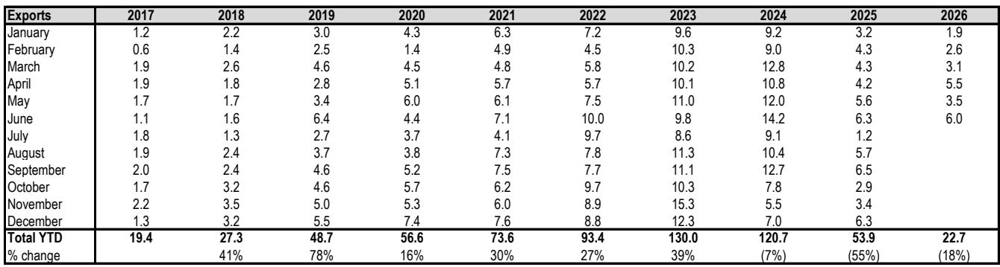
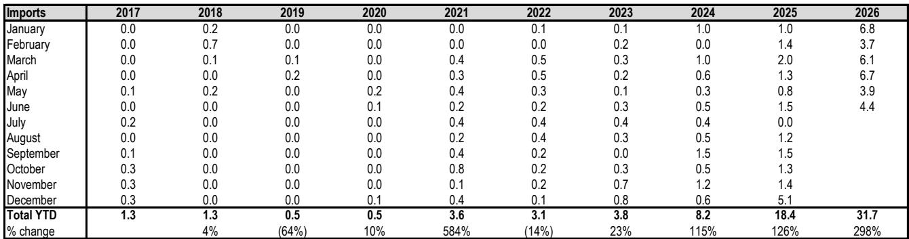
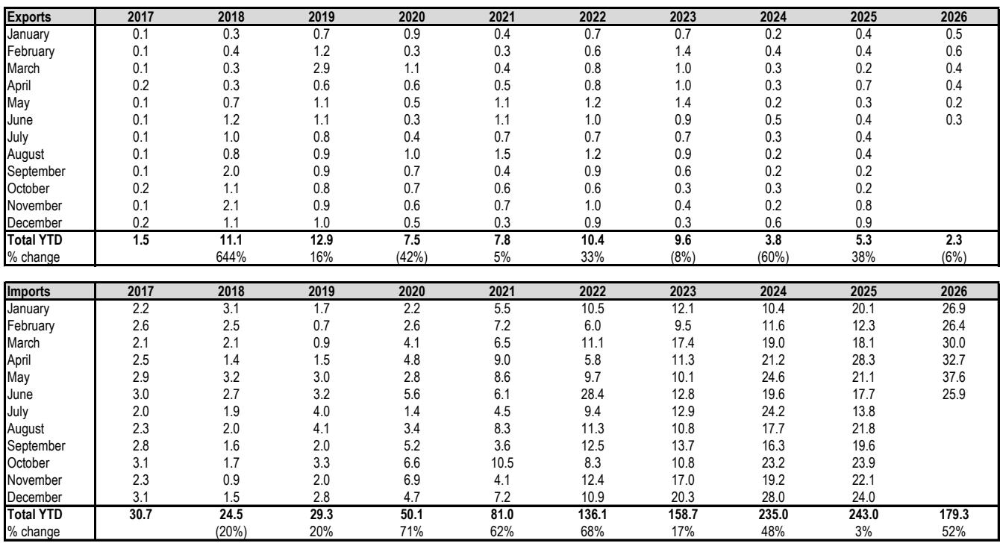

# JPM：跨境贸易数据与主题变化观察

中国锂贸易在2026年6月呈现一个清晰信号：碳酸锂进口量同比大幅增长，同时进口价格连续第二个月走高。JPM最新发布的6月中国进出口数据显示，当月碳酸锂进口量达到25.9千吨，较上年同期的17.7千吨增长46%。价格方面，6月碳酸锂进口均价为每吨19,695美元，环比上升4%，同比则几乎弹性较高——去年同期仅为每吨10,121美元。

这些数字叠加在一起，指向一个正在发生的结构性变化：中国锂资源的外部供应不仅在量上持续扩大，其采购成本也在系统性抬升。对于关注锂行业供需格局的读者而言，这组数据值得放在更长的时间维度里审视。

## 1. 碳酸锂净进口量上半年累计增长超过50%

从累计数据看，2026年前六个月中国碳酸锂净进口量达到177千吨，较2025年同期的115.3千吨增长53.5%。这一增速远超2025年全年2.8%的净进口增幅，也高于2024年55%的增速。JPM报告中的历史数据显示，中国碳酸锂净进口量从2017年的29.2千吨一路攀升至2025年的237.7千吨，十年间扩大超过七倍。2026年上半年延续了这一扩张趋势，且节奏明显加快。

> **KC评论：** 净进口量加速增长，意味着中国下游锂加工产能对海外原料的依赖程度仍在加深。报告没有直接讨论库存变化，但进口量增速如果持续高于下游需求增速，渠道库存的累积不确定性值得关注。

## 2. 氢氧化锂贸易角色发生逆转：中国从净出口转为净进口

一个更值得注意的变化出现在氢氧化锂领域。2026年上半年，中国氢氧化锂净进口量达到8.9千吨，而2025年同期还是净出口35.4千吨。这是自2017年JPM有记录以来，中国首次在氢氧化锂贸易中转为净进口方。

具体看，6月氢氧化锂出口量为6.0千吨，同比下降4%；而进口量则从2025年6月的1.5千吨跃升至4.4千吨，增幅接近两倍。JPM报告中的年度数据表显示，中国氢氧化锂净出口量在2023年达到峰值126.2千吨后，2024年降至112.6千吨，2025年进一步降至35.4千吨。2026年上半年的逆转，意味着这一趋势正在加速。

## 3. 出口价格涨幅超过进口，内外价差结构在变化

价格端的数据提供了另一个观察维度。6月中国氢氧化锂出口均价为每吨21,663美元，环比上涨9%，同比涨幅达到100%。同期碳酸锂进口均价为每吨19,695美元，环比上涨4%，同比上涨95%。出口价格的相对水平和环比涨幅均高于进口。

JPM报告中的历史价格表显示，2025年大部分时间里，中国氢氧化锂出口价格在每吨9,000至15,000美元区间波动，进入2026年后逐月走高，5月和6月连续突破19,000和21,000美元。碳酸锂进口价格则在2026年2月后从每吨10,070美元攀升至6月的19,695美元。两种产品的价格同步上行，但氢氧化锂出口价格的上行斜率更陡。

> **KC评论：** 出口价格涨幅快于进口价格，对国内锂盐加工企业的利润空间可能形成正面支撑。但报告没有拆分出口产品的规格和客户结构，不同品质产品的价差变化仍需进一步验证。

## 4. 贸易数据背后的供需再平衡信号

将量价数据合并来看，中国锂贸易正在经历一个双重调整：进口量持续扩大，同时进口成本显著上升。氢氧化锂贸易角色的逆转，则暗示国内部分高镍正极材料产能可能正在调整原料采购策略——从自产氢氧化锂转向进口，或者海外客户对国产氢氧化锂的需求出现变化。

JPM报告没有对上述数据进行供需预测，但历史数据本身已经提供了足够的信息密度。对于跟踪锂行业周期的研究者而言，2026年上半年的贸易数据是一个值得反复比对的基准点——它既反映了中国在全球锂供应链中的枢纽地位，也暴露了原料对外依存度上升带来的成本传导机制变化。

For informational purposes only. Portions may be generated,translated,summarized,or edited with AI assistance based on source materials and may contain omissions or errors. Please verify independently. This is not investment,legal,tax,accounting,or other professional advice.

For informational purposes only. Portions may be generated,translated,summarized,or edited with AI assistance based on source materials and may contain omissions or errors. Please verify independently. This is not investment,legal,tax,accounting,or other professional advice.

