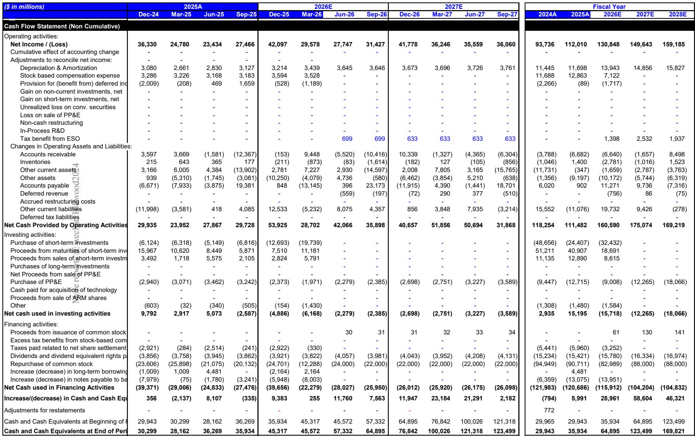
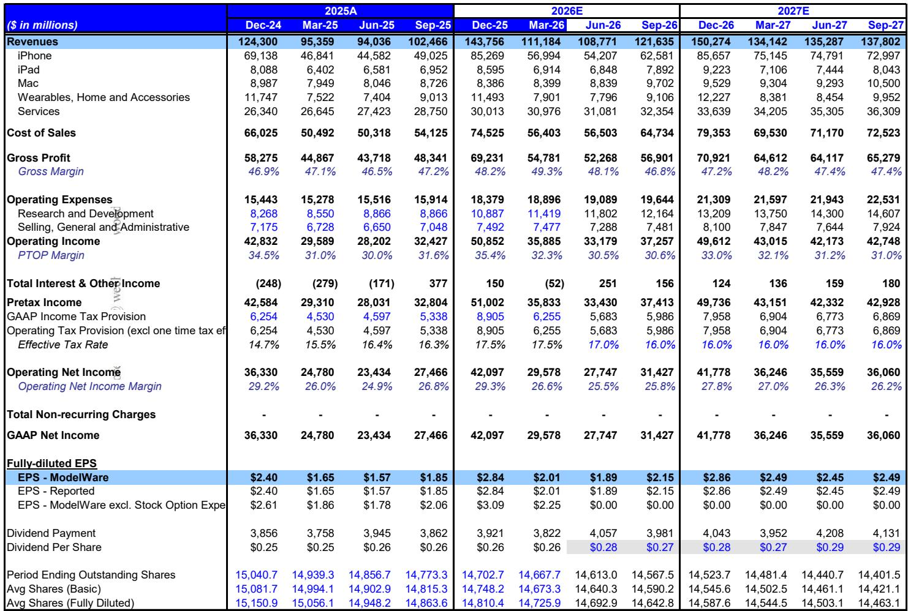
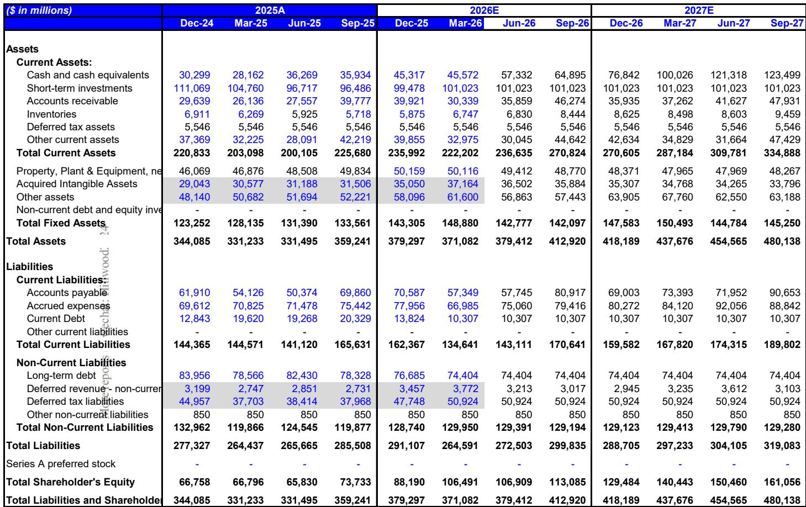

# MS：苹果北美AI服务器芯片性能约束

苹果在AI服务器芯片领域的进展，正成为其Siri AI战略中一个被关注的约束条件。MS近期一份报告指出，苹果自研AI服务器芯片可能面临性能挑战，这将在两个层面产生连锁反应：要么影响Siri AI在复杂查询上的表现，要么促使苹果将更多工作负载迁移至Google Cloud，从而增加成本。

报告的核心判断并非苹果芯片设计能力不足，而是其技术积累与AI推理需求之间存在结构性差异。苹果在A系列和M系列芯片上积累了深厚经验，但这些芯片的设计理念是能效优先，而非相对性能。AI推理，尤其是运行在Private Cloud Compute（PCC）中的复杂Siri任务，需要的是高功耗、高吞吐的芯片——这与苹果过去十五年的设计路径并不完全一致。

## 1. M2 Ultra的定位与“Baltra”ASIC的时间表

报告确认，苹果并未取消M系列芯片的封装产能。供应链信息显示，台积电的SolC（System on Integrated Circuit）封装线仍为苹果保留，但这一产能同时服务于M5 Max和M5 Ultra——这些芯片既用于Mac和工作站，也用于AI服务器。因此，SolC产能本身并不能直接证明苹果在AI服务器芯片上的投入强度。

更关键的是“Baltra”ASIC的进展。MS从供应链了解到，这款与博通合作开发的首款AI专用芯片，始终瞄准2027年上半年小规模量产。作为苹果首款高功耗芯片，其首批产量将非常有限，本质上仍属试验性产品。第二代AI ASIC预计在2028年进入量产，其功耗包络可能接近商用AI GPU（如NVIDIA的产品）。

> **KC评论：** 这里容易被忽略的是时间差。苹果的Siri AI功能预计今年秋季上线，但自研AI服务器芯片要到2027年才能小规模量产，2028年才可能接近商用GPU水平。这意味着在至少未来12-18个月内，苹果的PCC推理能力将高度依赖M系列芯片或外部云服务。

## 2. 性能不足的两个潜在后果

报告将苹果AI服务器芯片的潜在不确定性归结为两个方向。其一，如果M2 Ultra在PCC中的推理性能不足，Siri在处理复杂AI查询时的延迟和准确性将受到影响。这对苹果而言是产品体验问题——Siri AI是iPhone升级周期的重要驱动力，性能折损可能影响用户换机意愿。

其二，苹果可能被迫将更多Siri AI工作负载运行在Google Cloud上，使用NVIDIA的GPU。这不仅是成本问题——报告指出这是一项“昂贵的努力”——还意味着苹果在AI基础设施上对外部供应商的依赖度上升。对于一家以垂直整合为战略核心的公司，这种依赖在长期战略上并不理想。

## 3. 跟踪苹果AI芯片进展的四个信号

报告给出了四个可追踪的指标。第一，台积电的SolC产能预订情况，这既反映M系列芯片的规模，也反映AI ASIC的需求。第二，台积电的CoWoS产能预订——苹果目前并非CoWoS的主要用户，但如果第二代AI ASIC的功耗接近NVIDIA GPU，则必然需要HBM和CoWoS封装，届时苹果在CoWoS上的订单变化将成为关键信号。

第三，第二代AI ASIC的流片进度。如果2028年要实现量产，流片时间点应在2027年。第四，苹果的资本支出轨迹。尽管资本支出已在上升，但第二代AI ASIC的规模量产将推动进一步加速。这四个信号共同构成一个观察框架：从封装技术选择到资本投入节奏，可以判断苹果在AI基础设施上的真实投入力度。

## 4. 芯片战略与iPhone升级周期的关联

报告将AI芯片能力与iPhone升级周期联系起来。苹果目前拥有历史上最长的iPhone换机周期，而AI功能被视为加速换机的关键驱动力。如果AI服务器芯片的性能瓶颈导致Siri体验不及预期，可能影响这一升级逻辑。

从财务模型看，报告预计iPhone收入在FY26和FY27分别增长23.6%和19.1%，这一增速假设本身就包含了对AI功能拉动换机的预期。芯片性能约束如果无法在短期内解决，可能对这一假设构成不确定性。同时，内存成本上升也是报告中提及的短期不确定性——更高的组件成本可能压缩毛利率，而苹果在消费者端的定价能力能否完全对冲，仍需观察。

> **KC评论：** 这份报告的价值不在于判断苹果芯片“行或需要继续观察”，而在于给出了一个可验证的跟踪框架。苹果在AI基础设施上的投入节奏、封装技术选择、资本支出变化，比任何单一新闻都更能说明其AI战略的真实进度。对于关注苹果长期竞争力的读者，这四个信号比季度财报中的iPhone销量数字更具前瞻性。

For informational purposes only. Portions may be generated,translated,summarized,or edited with AI assistance based on source materials and may contain omissions or errors. Please verify independently. This is not investment,legal,tax,accounting,or other professional advice.

For informational purposes only. Portions may be generated,translated,summarized,or edited with AI assistance based on source materials and may contain omissions or errors. Please verify independently. This is not investment,legal,tax,accounting,or other professional advice.

