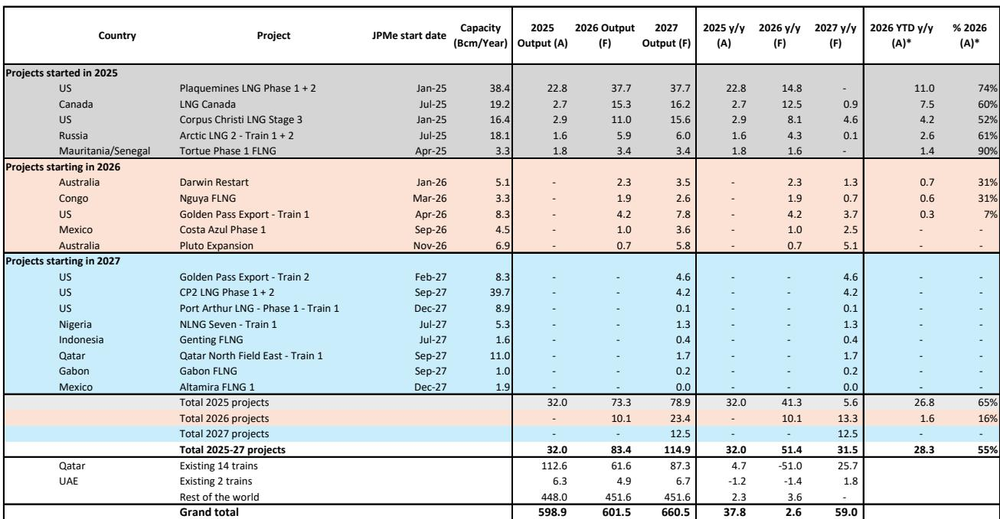
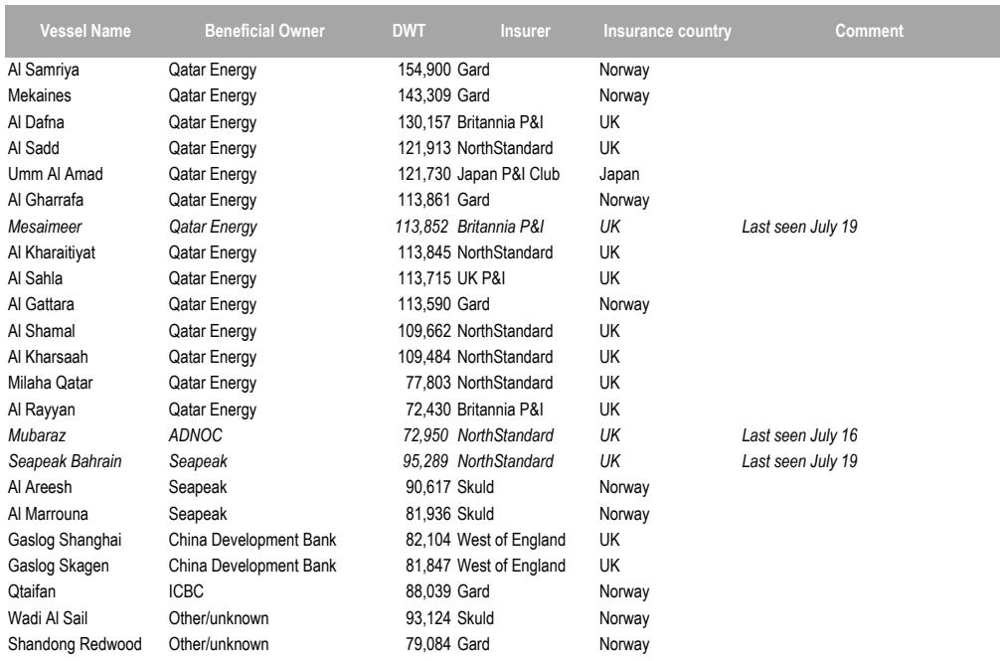
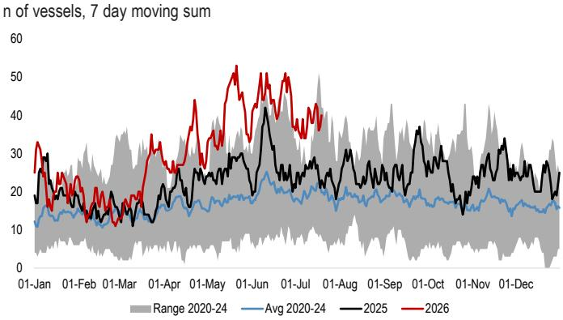

# JPM：全球LNG供应-航运追踪-卡塔尔冬季供应时间窗口

7月12日之后，霍尔木兹海峡的LNG运输几乎完全停止。根据JPM基于彭博船舶追踪数据的观察，最后一艘卡塔尔籍LNG船于当日驶出海峡，此后仅有一次向科威特的交付记录。卡塔尔的液化装置仍在运行，但装载率已从7月初的30%降至22%的7日移动均值。这些已装载的货物大部分实际上成为浮动仓储，因为海峡再次实质性关闭，而波斯湾内部的交付也极为有限。

报告的核心判断是：当前市场对卡塔尔冬季供应的定价可能过于乐观。TTF价格在约60欧元/兆瓦时的水平，隐含的不确定性溢价仍不充分。冲突升级前，市场普遍假设卡塔尔能在冬季前完全恢复生产，且欧洲可以像过去一样从现货市场补充LNG，而非依赖库存。这一假设正在被现实检验。

> **KC评论：** JPM没有直接说价格会涨，而是指出市场定价所依赖的“卡塔尔冬季回归”假设正在松动。如果这一假设被证伪，TTF的定价基础将发生根本变化。

## 1. 卡塔尔的“储罐满溢”时间窗口约2-3周

JPM估算，卡塔尔在满负荷液化条件下约有5天的岸上储存能力。若以当前约20%的利用率运行，这一时间可延长至20-25天，浮动仓储还能提供额外缓冲。但报告同时指出，岸上运营的复杂性——包括富LNG与贫LNG的不同加工和储存要求——构成了额外限制。

目前波斯湾内仍有23艘LNG船，但其中多少已装载、多少可供卡塔尔能源继续装货，尚不明确。JPM认为，卡塔尔可能在2-3周内达到“储罐满溢”状态，届时可能被迫再次停产或大幅减产。从停产到完全重启，可能需要另外2-3个月，届时北半球冬季已经开始。

## 2. 美国LNG仍以亚洲为目的港，欧洲面临冬季供应策略不确定性

报告显示，美国现货LNG的竞争力格局基本未变。大部分货物仍指向亚洲目的地，因为JKM与TTF的净回值在未来一两个月内基本持平。TTF净回值溢价要到11月才会出现，这意味着欧洲冬季对LNG进口的依赖度将显著上升。

JPM认为，这对欧洲而言可能是一个高不确定性策略：库存处于历史低位，卡塔尔供应不确定性上升，且欧洲、美国和亚洲都面临冬季天气不确定性。欧洲当前减少现货采购、依赖冬季溢价窗口的做法，建立在卡塔尔供应能及时恢复的假设之上。

## 3. 全球LNG供应增速节奏变化，中国进口成为主要增量来源

截至7月13-19日当周，全球LNG交付量环比增加2.1 Bcm，同比增长0.8 Bcm。增量主要来自中国（环比+1.5 Bcm，同比+1.0 Bcm），以及日本、韩国、印度和台湾地区。欧洲交付量则环比下降0.6 Bcm，同比下降1.2 Bcm，远低于季节性正常水平和修正库存路径所需的数量。

出口端，全球LNG装载量环比微降0.8 Bcm，同比下降1.2 Bcm。美国及北美其他地区的出口均出现下滑。新项目方面，LNG Canada利用率降至83%，Arctic LNG 2维持在44%的近期峰值水平，Plaquemines和Golden Pass各增加一船装载。

> **KC评论：** 中国成为当前全球LNG需求的主要边际增量来源，而欧洲在减少采购。这种流向分化在卡塔尔供应中断的背景下，可能加剧冬季欧洲市场的供需错配。

## 4. 新项目投产节奏与卡塔尔供应缺口的对冲能力

报告详细列出了2025-2027年新投产项目的供应增量。2025年启动的项目（Plaquemines、LNG Canada、Corpus Christi Stage 3、Arctic LNG 2、Tortue）2026年预计贡献73.3 Bcm，2026年启动的项目（Darwin Restart、Nguya FLNG、Golden Pass Train 1等）预计贡献10.1 Bcm。但这些增量大多指向亚洲市场，且新项目的爬坡速度存在不确定性。

卡塔尔现有14条生产线的年产能约为112.6 Bcm，2026年预计产量仅为61.6 Bcm，同比下降51.0 Bcm。这一缺口远超新项目在2026年能提供的全部增量。报告没有直接计算供需平衡，但数字本身说明：即使所有新项目按计划投产，也无法完全弥补卡塔尔的供应损失。

**对读者的观察框架：** 关注两个时间节点——卡塔尔“储罐满溢”的2-3周窗口，以及从停产到重启的2-3个月周期。这两个时间点将决定冬季前欧洲能否重建足够的库存缓冲。同时，美国LNG流向亚洲与欧洲的净回值差异，是观察冬季供应紧张程度的前瞻指标。

For informational purposes only. Portions may be generated,translated,summarized,or edited with AI assistance based on source materials and may contain omissions or errors. Please verify independently. This is not investment,legal,tax,accounting,or other professional advice.

For informational purposes only. Portions may be generated,translated,summarized,or edited with AI assistance based on source materials and may contain omissions or errors. Please verify independently. This is not investment,legal,tax,accounting,or other professional advice.

