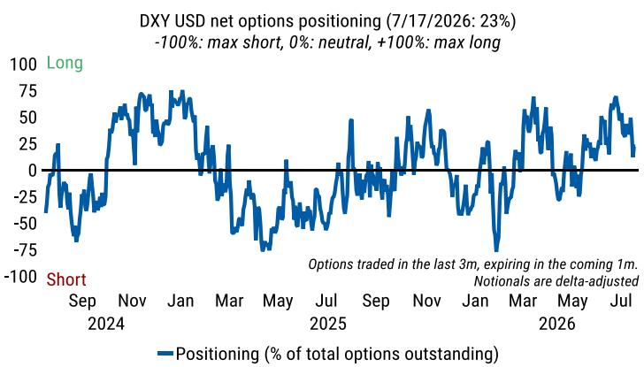
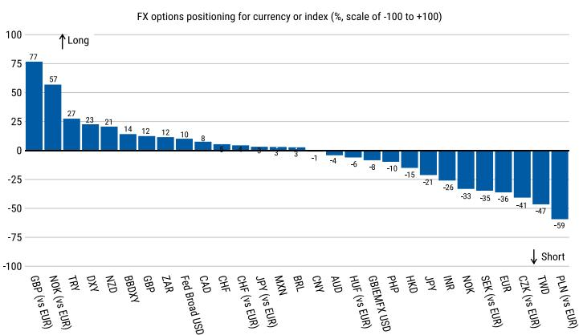

# MS：货币市场与相关指标观察

截至7月17日当周，MS基于期权和期货市场数据发布的G10外汇持仓报告显示，读者在两个市场中的头寸方向出现分化。期权定价数据指向读者增加了挪威克朗兑欧元的净多头，同时增加了美元指数的净空头。而在期货市场，读者增加了英镑多头，同时增加了澳元空头。这份报告的核心价值不在于单一货币的走向，而在于它提供了一个跨市场、跨期限的持仓结构快照，帮助观察者理解当前投机资金在G10货币中的分布状态。

报告使用的数据来源包括DTCC的期权交易记录和CFTC的期货持仓数据，时间窗口覆盖截至7月17日的期权数据和截至7月13日的期货数据。这种时间差本身就是一个信息点：期权市场反映的是更近期的情绪变化，而期货市场则提供了截至上周二的存量结构。

## 1. 期权市场显示挪威克朗与美元头寸出现反向调整

期权定价数据是这份报告的核心分析工具。MS构建的期权持仓评分体系显示，读者在截至7月17日的一周内增加了挪威克朗兑欧元的净多头头寸，同时增加了美元指数的净空头头寸。这两个方向的变化是同步发生的，意味着资金正在从美元和欧元这两个流动性较强的货币中流出，转向北欧小币种。

报告进一步指出，基于期权数据，战术性读者目前整体持有挪威克朗兑欧元的多头，同时持有欧元的空头。这意味着挪威克朗的多头并非孤立存在，而是与欧元空头配对出现。这种配对结构值得关注，因为它暗示读者可能是在交易欧洲内部的相对价值，而非单纯看多挪威克朗的相对走势。

> **KC评论：** 期权市场的持仓数据反映的是过去三个月内交易、未来一个月内到期的合约，因此它捕捉的是短期投机资金的集中方向。挪威克朗兑欧元的多头增加，可能更多反映的是对欧元区宏观环境前景的担忧，而非对挪威基本面的独立看好。

## 2. 期货市场持仓结构与期权市场形成对比

期货市场的数据提供了另一个维度的验证。截至7月13日当周，读者增加了英镑多头头寸，同时增加了澳元空头头寸。这与期权市场呈现的格局不同：期权市场看空欧元，期货市场则看多英镑；期权市场看多挪威克朗，期货市场则看空澳元。

报告还给出了截至7月13日的期货市场整体持仓结构：读者整体持有欧元多头，同时持有新西兰元和加元空头。这一结构与期权市场形成对比——期权市场显示欧元为空头，期货市场则显示欧元为多头。这种跨市场的分歧本身就是一个观察信号，它可能意味着不同读者群体（如对冲产品与资产管理公司）对欧元的看法存在差异。

报告还披露了截至7月7日的细分持仓数据：资产管理公司主要持有欧元多头和英镑空头，而杠杆产品则主要持有澳元多头和新西兰元空头。这两类读者的持仓方向几乎完全相反，说明市场对G10货币的定价并未形成一致预期。

## 3. 美元持仓出现边际松动，加元情绪改善

报告提供了美元指数期货持仓的具体数据。截至7月13日，投机性美元指数期货持仓占未平仓合约的比例从一周前的52.6%降至51.3%。虽然降幅不大，但方向是明确的：美元多头正在边际减少。这与期权市场显示的美元空头增加形成呼应。

另一个值得注意的数据点是加元。报告显示，截至7月17日，加元在G10货币中的情绪改善幅度最大。这意味着在截至当周的数据窗口内，加元是G10中多头情绪上升最快的货币。报告没有展开解释原因，但这一变化可能与加拿大央行的政策预期或原油价格走势有关。

> **KC评论：** 美元持仓从52.6%降至51.3%，虽然只有1.3个百分点的变化，但在投机性持仓高度集中的环境下，这种边际松动往往比大幅波动更具信号意义。它说明推动美元走强的力量正在减弱，但尚未出现方向性逆转。

## 4. 逆向交易策略提示新西兰元兑挪威克朗存在价值空间

报告在其逆向交易策略框架下提出一个具体判断：基于持仓评分百分位数，做空新西兰元兑挪威克朗（即做多NZD/NOK）在当前具有价值。这一判断的逻辑基础是，当某一货币对的持仓达到极端水平时，市场情绪可能已经过度反映，后续存在均值回归的空间。

报告没有给出具体的入场点位或目标区间，而是将这一判断定位为“基于持仓数据的信号参考”。对于关注G10外汇市场的观察者来说，这一信号提供了一个可追踪的观察框架：当挪威克朗多头和新西兰元空头同时达到极端水平时，两者之间的交叉汇率可能成为资金回流的受益者。

这份报告的核心价值不在于预测某一货币的短期走势，而在于它提供了一个系统性的持仓监测框架。期权与期货两个市场的数据对比、资产管理公司与杠杆产品的持仓差异、以及逆向交易信号的计算方法，共同构成了一个可复用的分析工具。对于关注G10外汇市场的读者来说，理解这些数据的结构比追逐单一信号更有意义。

For informational purposes only. Portions may be generated,translated,summarized,or edited with AI assistance based on source materials and may contain omissions or errors. Please verify independently. This is not investment,legal,tax,accounting,or other professional advice.

For informational purposes only. Portions may be generated,translated,summarized,or edited with AI assistance based on source materials and may contain omissions or errors. Please verify independently. This is not investment,legal,tax,accounting,or other professional advice.

